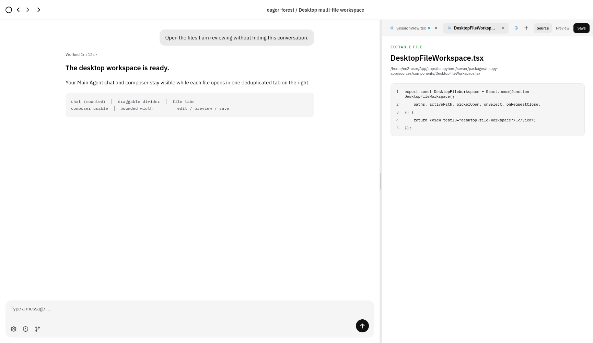
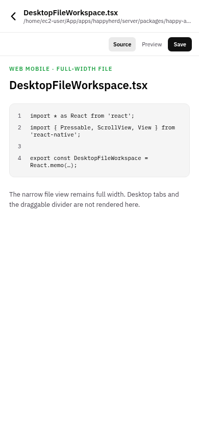

# Evidence: Issue #181 desktop multi-file workspace

Screenshots were captured with Playwright against an `APP_ENV=production` Expo Web export of the exact issue #181 workspace implementation. A temporary deterministic component-only evidence seam was removed before commit. All three captures completed with zero browser console errors and zero page errors.

Deterministic tests separately cover open, deduplication, switching, closing, dirty guards, state retention, divider bounds, and left-navigation independence.

## Standard desktop — 1280×800

- Shows the expanded left navigation and its dedicated collapse chevron.
- Keeps the Main Agent chat and composer visible beside the tabs, close and plus controls, file controls, and right workspace.
- The divider was dragged before capture.

## Wide desktop — 1728×1000

- Shows the independently collapsed left navigation.
- Keeps the Main Agent chat and composer visible beside the wider right workspace.
- The divider was dragged before capture.

## Web Mobile — 390×844

- Shows the existing full-width file presentation.
- No desktop tab strip or divider is rendered.
