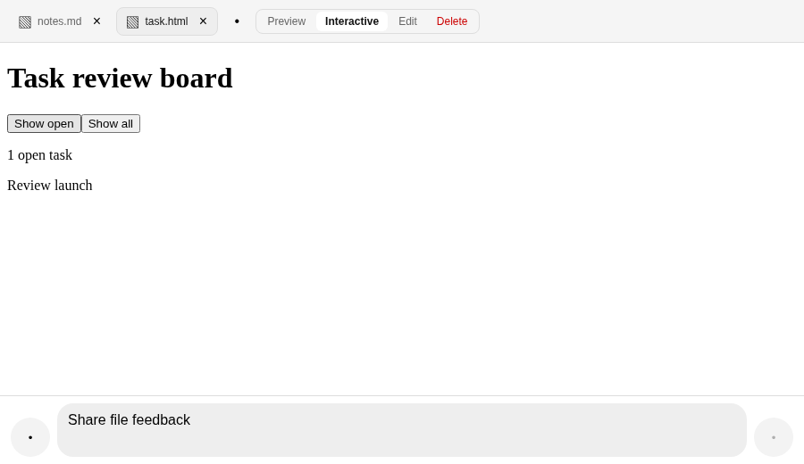
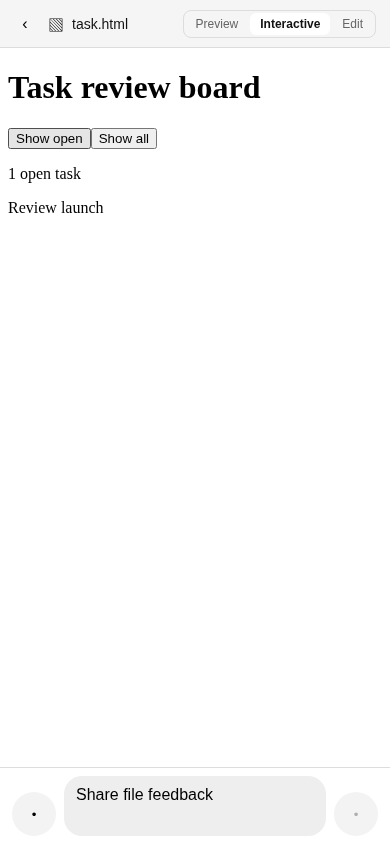

# Interactive HTML preview evidence

## Workspace overview

```text
┌─────────────────────────────────────────────────────────────┐
│ Workspace                                                   │
├───────────────────────────┬─────────────────────────────────┤
│ Files                     │ [task.html]                     │
│  ├─ notes.md              ├─────────────────────────────────┤
│  └─ [task.html]           │ [Preview] *[Interactive]* [Edit]│
│                           ├─────────────────────────────────┤
│                           │ ┌─────────────────────────────┐ │
│                           │ │ iframe                      │ │
│                           │ │ sandbox="allow-scripts"     │ │
│                           │ │ srcdoc="..."                │ │
│                           │ └─────────────────────────────┘ │
└───────────────────────────┴─────────────────────────────────┘
```

## Human journey

1. Opening `task.html` defaults to Preview, which remains scriptless.
2. Clicking Interactive remounts a fresh opaque iframe and enables inline
   JavaScript.
3. In the interactive view, Show all renders two cards and Show open filters
   the view to one card.
4. On Web Desktop, switching from `task.html` to `notes.md` and back retains the
   selected mode and iframe DOM. On Web Mobile, resizing to 430 × 844 and back
   to 390 × 844 retains the same state.
5. Native is unchanged. No approval prompt, trust store, allowlist, new route,
   or second viewer was added.

## Acceptance matrix

| Environment | Resolution | Observed behavior | Status |
|---|---:|---|---|
| Web Desktop | 1440 × 900 | Preview was scriptless. Interactive ran inline JavaScript, rendered and filtered cards, and retained state across a mounted tab switch. | Passed |
| Web Mobile | 390 × 844 | The same explicit Interactive journey ran in the compact Workspace and retained state across a resize to 430 × 844 and back. | Passed |

## Security boundary

- Preview does not run scripts.
- Interactive uses only the `allow-scripts` iframe sandbox token. It omits
  `allow-same-origin`, `allow-forms`, `allow-popups`, `allow-modals`,
  `allow-pointer-lock`, `allow-downloads`, and `allow-top-navigation`.
- The injected Content Security Policy blocks remote subresources.
- Default-mode sandbox enforcement messages before activation are expected.
  After activation, browser proof recorded zero page or console errors.

## Automated evidence

- Focused Vitest: 3 files and 19 tests passed.
- Production-component `desktopWorkspace` browser suite: 8 tests passed.
- Full `happy-app` suite: 197 files and 1,858 tests passed.
- `happy-app` TypeScript typecheck: passed.
- Localization guard: validated 1,370 English, Chinese, and German keys;
  verified 36 routes, 251 surfaces, and 72 smoke cases; and found zero
  production hardcoded-copy exceptions across 251 UI owners.
- Source lint: passed.
- Production Expo Web export: passed, with `HappyHerd` in the index title.

### Web Desktop



### Web Mobile



## Honest remaining proof

- Deployed-domain proof was not run.
- No native surface was targeted.
- No merge, deployment, or TickTick closure is claimed.
