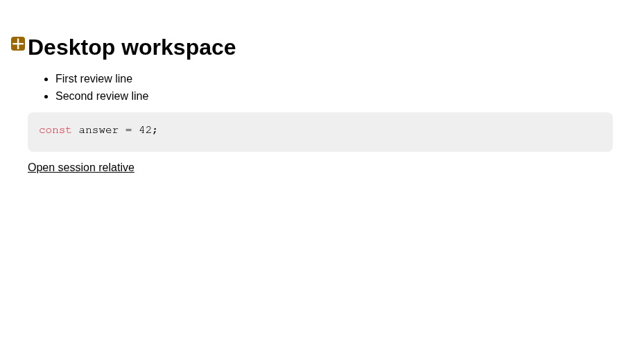
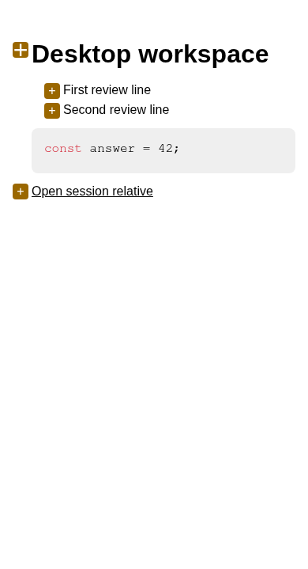

# Markdown comment affordance evidence

## Root cause

The Markdown `+` comment button was positioned `left: -24px` without an owned gutter, so the production Workspace scroll host clipped it.

## Repair

Only commentable Markdown reserves a 24px in-bounds gutter. The exact-line button remains attached to its original rendered block and now matches the actual Pierre source affordance in computed 20×20 dimensions, 4px radius, zero border, flex centering, theme-specific modified color, and contrasting foreground.

Desktop opacity is `0` before hover and `1` after hover; in the true-touch 390×844 viewport it is `1` before interaction.

## Acceptance evidence

- **Focused suite:** 5 files and 34 tests passed.
- **Coupled `sideChatHeader` browser suite:** 18 tests passed.
- **Full `happy-app` suite:** 205 files and 1,892 tests passed.
- **Typecheck:** Passed.
- **Source lint:** Passed.
- **i18n validation:** Validated 1,382 keys for en/cn/de, 36 routes, 255 UI owners, 72 smoke cases, and zero hardcoded-copy exceptions.
- **Production Expo Web export:** Passed with `HappyHerd` in the index title.
- **Production Web smoke:** Passed.
- **Builds:** `happy-agent`, the `happyherd` CLI, and `happy-server` passed.

## Before/after proof

- The new geometry test failed before the repair with `fullyVisible: false`, then passed.
- Existing tests verify that exact lines 3 and 4 pin, one `workspaceFeedback` batch sends, table comments and horizontal reachability remain, rendered Markdown line reveal remains, and raw Pierre source behavior remains.

## Screenshots

### Web Desktop

1440×900 browser viewport; 900×515 Workspace panel crop.

### Web Mobile

390×844 true-touch browser viewport; 390×719 Workspace panel crop.

## Remaining effects

No native change, merge, deployment, installation, or TickTick completion is claimed. The repository contract suite and PR checks are not claimed in this pre-PR evidence note.
