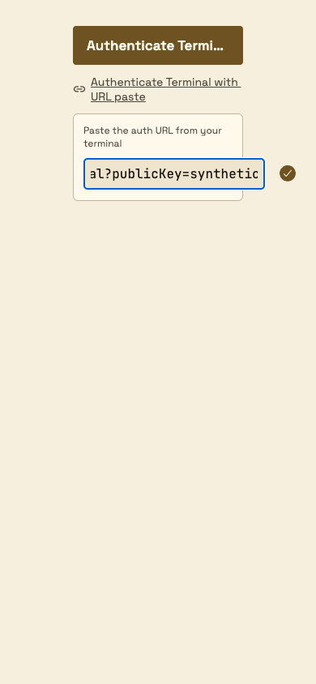

# Terminal pairing input: screenshot review regression

Per-panel review of `ConnectButton.tsx` at `eafe5510` exposed the URL field and confirmation action extending outside the fixed 210px card. The KILV font/size change increased the browser input's intrinsic minimum width. Commit `a38fae51` adds `minWidth: 0` to let the flex item shrink while retaining 16px JetBrains Mono text.

These are **component-fixture** images with synthetic terminal URLs, not authenticated terminal pairing or native-device proof. The final capture runner checks the input and confirmation action against the card bounds at 1440/390 widths in both themes, checks the retained 16px font, and preserves the typed draft.

| Before: `eafe5510` | After: `a38fae51` |
|---|---|
|  |  |

[After measurements](after-measurements.json) · [Final four theme/viewport screenshots](../panels/workspace/README.md#panel-connect-terminal)

## Bounded historical comparison

The same synthetic service adapters, 210px component container and light palette were used at 390px and 1440px. Only `ConnectButton.tsx`, `RoundButton.tsx` and `Typography.ts` were replaced with `189c504b` versions, loading their actual retained IBM Plex font files. This isolates component/font behavior; it is not a full historical app export. Additional single-variable input font/size comparisons retained the current components.

| Variant | Input width | Input right beyond card | Confirmation right beyond card |
|---|---:|---:|---:|
| Historical components and fonts | 150px | -48px | 0px |
| Before repair: 16px JetBrains Mono | 224px | +27px | +75px |
| Current components, 12px sans input | 150px | -47px | +1px |
| Current components, 16px sans input | 193px | -4px | +44px |
| Current components, 12px mono input | 167px | -30px | +18px |

The measurements agree at both widths. [Historical component screenshot](baseline-light-390.png) · [Raw comparison measurements](baseline-measurements.json).

The action label's ellipsis is pre-existing: its natural/available width was 216.70/176px with IBM Plex Sans 21px and 181.20/176px with Space Grotesk 17px. It remains visible in the final evidence and is not claimed as a fully displayed label. The input regression is separately repaired and checked.
