# Chat panel screenshots

Production source revision: `a38fae51c2f99d34bc4d81b24ccfd4c7aa611b05`. These are after-change screenshots for [PR #289](https://github.com/NickGuAI/HappyHerd/pull/289).

**Evidence boundary:** production-export means the actual exported Web UI on an isolated local host with its backend offline. Component-fixture means real production components with synthetic service/state boundaries and documented Web platform adapters. Neither proves authenticated live journeys, physical iPhone behavior, or installed native clients.

Overview sheets: [contact-01](contact-01.jpg), [contact-02](contact-02.jpg), [contact-03](contact-03.jpg), [contact-04](contact-04.jpg), [contact-05](contact-05.jpg). Original full-resolution screenshots remain linked per panel below.

## Conversation transcript

**Changed presentation:** Transcript text and work summaries use the shared font and theme hierarchy.

**Evidence:** `component-fixture`. States: synthetic-review.

**Production owners:** `components/ChatList.tsx`, `components/MessageView.tsx`.

- Synthetic service/state boundaries; React Native Web adapter; not authenticated live or installed native evidence.
- RPC, storage, authentication, navigation, native glass, keyboard, gestures and animation clocks use deterministic fixture boundaries. Actual target components, theme, Typography, catalogs and font assets are imported. No account data is used. Session online status uses the actual production useSessionStatus export; other session identity/resume helpers retain fixture boundaries.

Fixture environment: [source graph and adapters](environment-chat.json).

| State | Theme | Viewport | Screenshot |
|---|---|---|---|
| synthetic-review | light | 1440×900 | [Open full screenshot](chat-list-synthetic-review-light-1440.png) |
| synthetic-review | light | 390×844 | [Open full screenshot](chat-list-synthetic-review-light-390.png) |
| synthetic-review | dark | 1440×900 | [Open full screenshot](chat-list-synthetic-review-dark-1440.png) |
| synthetic-review | dark | 390×844 | [Open full screenshot](chat-list-synthetic-review-dark-390.png) |

Show every screenshot for this panel

**synthetic-review · light · 1440×900**

<a href="chat-list-synthetic-review-light-1440.png">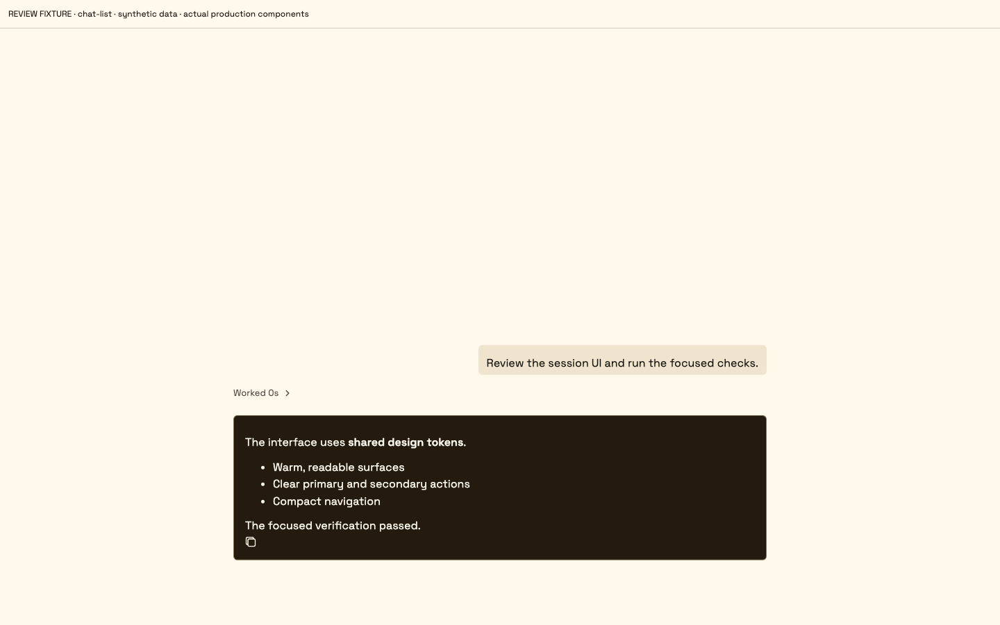</a>

**synthetic-review · light · 390×844**

<a href="chat-list-synthetic-review-light-390.png">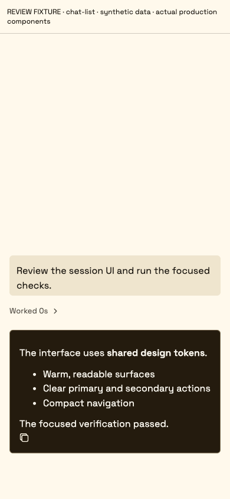</a>

**synthetic-review · dark · 1440×900**

<a href="chat-list-synthetic-review-dark-1440.png">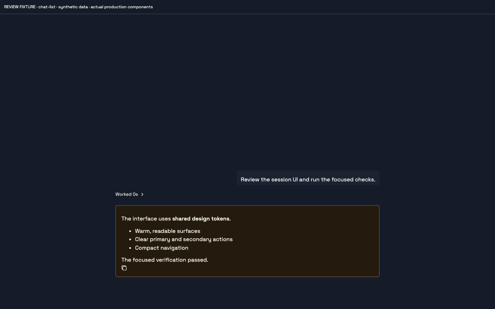</a>

**synthetic-review · dark · 390×844**

<a href="chat-list-synthetic-review-dark-390.png">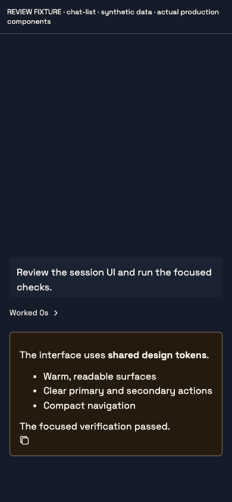</a>

## Human and agent messages

**Changed presentation:** Human text and formatted agent replies use themed surfaces and shared typography.

**Evidence:** `component-fixture`. States: synthetic-review.

**Production owners:** `components/MessageView.tsx`.

- Synthetic service/state boundaries; React Native Web adapter; not authenticated live or installed native evidence.
- RPC, storage, authentication, navigation, native glass, keyboard, gestures and animation clocks use deterministic fixture boundaries. Actual target components, theme, Typography, catalogs and font assets are imported. No account data is used. Session online status uses the actual production useSessionStatus export; other session identity/resume helpers retain fixture boundaries.

Fixture environment: [source graph and adapters](environment-chat.json).

| State | Theme | Viewport | Screenshot |
|---|---|---|---|
| synthetic-review | light | 1440×900 | [Open full screenshot](messages-synthetic-review-light-1440.png) |
| synthetic-review | light | 390×844 | [Open full screenshot](messages-synthetic-review-light-390.png) |
| synthetic-review | dark | 1440×900 | [Open full screenshot](messages-synthetic-review-dark-1440.png) |
| synthetic-review | dark | 390×844 | [Open full screenshot](messages-synthetic-review-dark-390.png) |

Show every screenshot for this panel

**synthetic-review · light · 1440×900**

<a href="messages-synthetic-review-light-1440.png">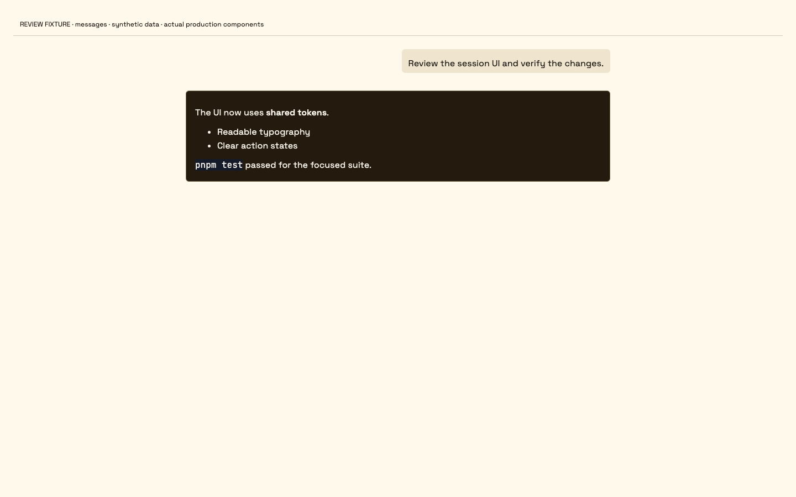</a>

**synthetic-review · light · 390×844**

<a href="messages-synthetic-review-light-390.png">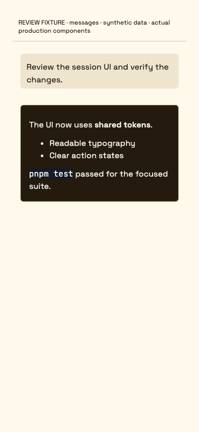</a>

**synthetic-review · dark · 1440×900**

<a href="messages-synthetic-review-dark-1440.png">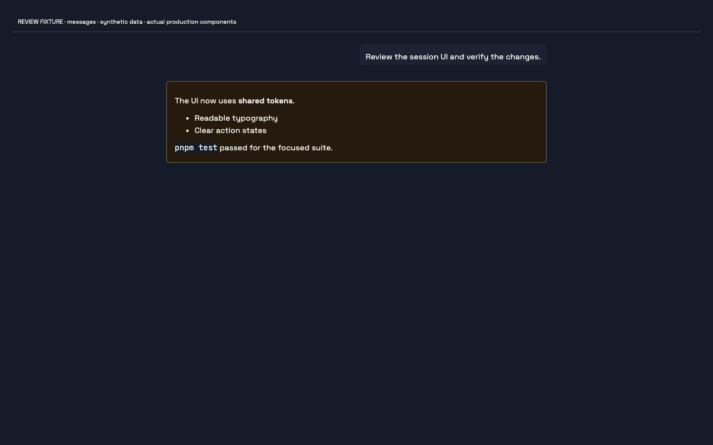</a>

**synthetic-review · dark · 390×844**

<a href="messages-synthetic-review-dark-390.png">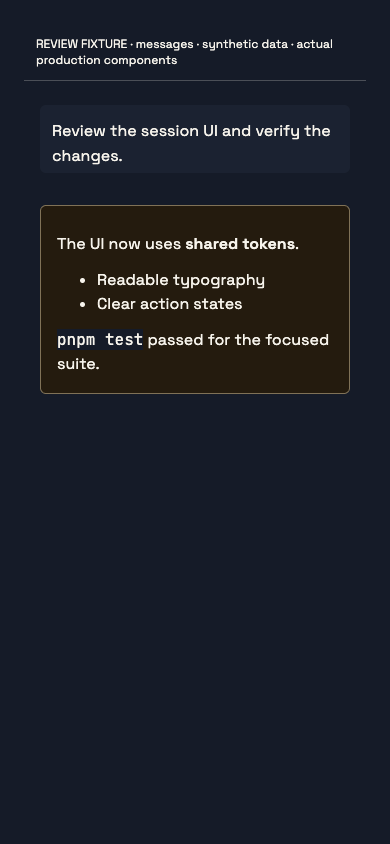</a>

## Goal, completed work and message queue

**Changed presentation:** Goal and queue text adopt the shared type hierarchy and theme colors.

**Evidence:** `component-fixture`. States: synthetic-review.

**Production owners:** `components/AgentGoalBar.tsx`, `components/AgentWorkGroupHeader.tsx`, `components/QueuedMessagesPanel.tsx`.

- Synthetic service/state boundaries; React Native Web adapter; not authenticated live or installed native evidence.
- RPC, storage, authentication, navigation, native glass, keyboard, gestures and animation clocks use deterministic fixture boundaries. Actual target components, theme, Typography, catalogs and font assets are imported. No account data is used. Session online status uses the actual production useSessionStatus export; other session identity/resume helpers retain fixture boundaries.

Fixture environment: [source graph and adapters](environment-chat.json).

| State | Theme | Viewport | Screenshot |
|---|---|---|---|
| synthetic-review | light | 1440×900 | [Open full screenshot](goal-work-queue-synthetic-review-light-1440.png) |
| synthetic-review | light | 390×844 | [Open full screenshot](goal-work-queue-synthetic-review-light-390.png) |
| synthetic-review | dark | 1440×900 | [Open full screenshot](goal-work-queue-synthetic-review-dark-1440.png) |
| synthetic-review | dark | 390×844 | [Open full screenshot](goal-work-queue-synthetic-review-dark-390.png) |

Show every screenshot for this panel

**synthetic-review · light · 1440×900**

<a href="goal-work-queue-synthetic-review-light-1440.png">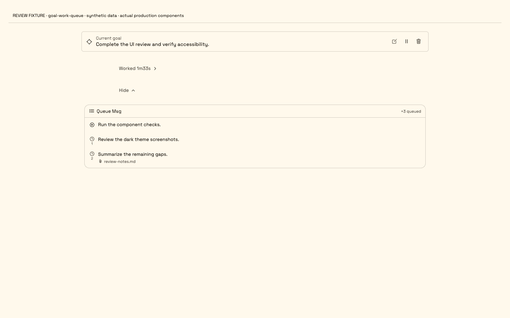</a>

**synthetic-review · light · 390×844**

<a href="goal-work-queue-synthetic-review-light-390.png">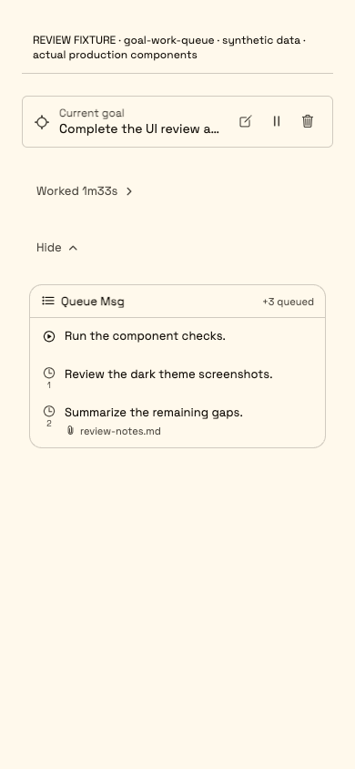</a>

**synthetic-review · dark · 1440×900**

<a href="goal-work-queue-synthetic-review-dark-1440.png">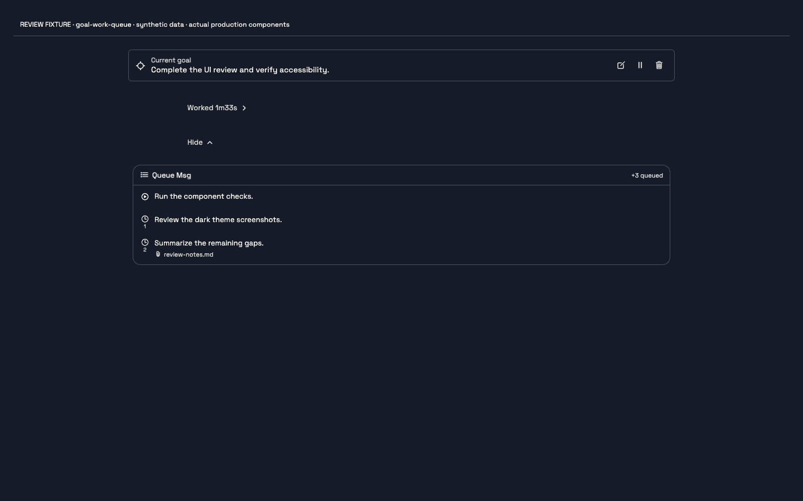</a>

**synthetic-review · dark · 390×844**

<a href="goal-work-queue-synthetic-review-dark-390.png">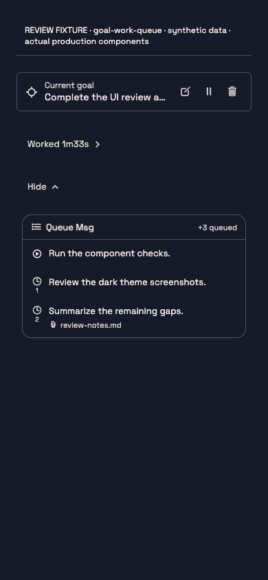</a>

## Empty conversation

**Changed presentation:** Host, path and empty-message copy use the shared display and monospaced fonts.

**Evidence:** `component-fixture`. States: synthetic-review.

**Production owners:** `components/EmptyMessages.tsx`.

- Synthetic service/state boundaries; React Native Web adapter; not authenticated live or installed native evidence.
- RPC, storage, authentication, navigation, native glass, keyboard, gestures and animation clocks use deterministic fixture boundaries. Actual target components, theme, Typography, catalogs and font assets are imported. No account data is used. Session online status uses the actual production useSessionStatus export; other session identity/resume helpers retain fixture boundaries.

Fixture environment: [source graph and adapters](environment-chat.json).

| State | Theme | Viewport | Screenshot |
|---|---|---|---|
| synthetic-review | light | 1440×900 | [Open full screenshot](empty-synthetic-review-light-1440.png) |
| synthetic-review | light | 390×844 | [Open full screenshot](empty-synthetic-review-light-390.png) |
| synthetic-review | dark | 1440×900 | [Open full screenshot](empty-synthetic-review-dark-1440.png) |
| synthetic-review | dark | 390×844 | [Open full screenshot](empty-synthetic-review-dark-390.png) |

Show every screenshot for this panel

**synthetic-review · light · 1440×900**

<a href="empty-synthetic-review-light-1440.png">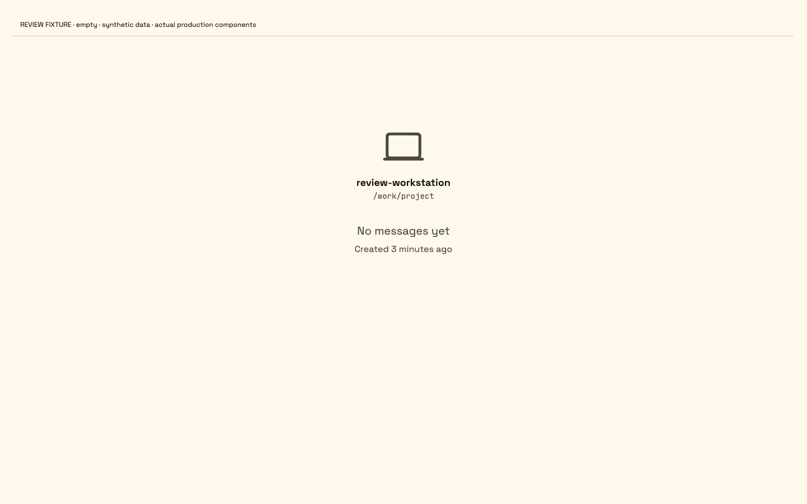</a>

**synthetic-review · light · 390×844**

<a href="empty-synthetic-review-light-390.png">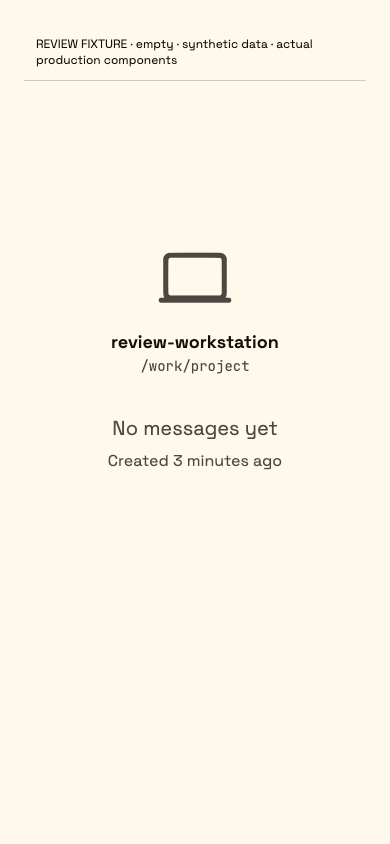</a>

**synthetic-review · dark · 1440×900**

<a href="empty-synthetic-review-dark-1440.png">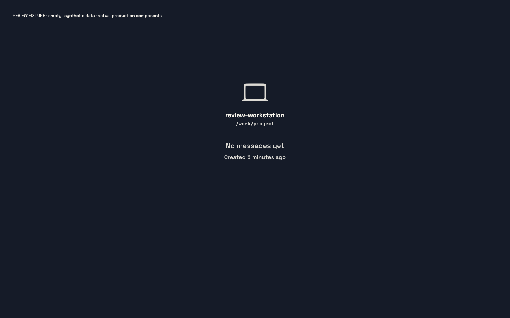</a>

**synthetic-review · dark · 390×844**

<a href="empty-synthetic-review-dark-390.png">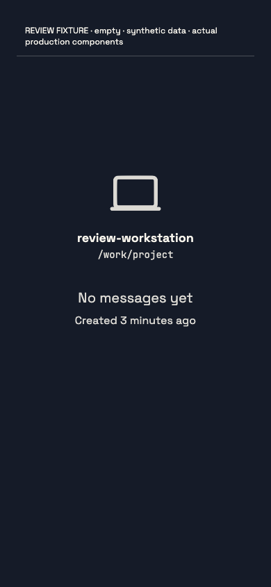</a>

## Session status and connected voice

**Changed presentation:** Model/context status and voice controls use themed colors and shared fonts.

**Evidence:** `component-fixture`. States: synthetic-review.

**Production owners:** `components/SessionStatusBar.tsx`, `components/VoiceAssistantStatusBar.tsx`, `components/ShimmerView.tsx`.

- Synthetic service/state boundaries; React Native Web adapter; not authenticated live or installed native evidence.
- RPC, storage, authentication, navigation, native glass, keyboard, gestures and animation clocks use deterministic fixture boundaries. Actual target components, theme, Typography, catalogs and font assets are imported. No account data is used. Session online status uses the actual production useSessionStatus export; other session identity/resume helpers retain fixture boundaries.
- Native renderer hosted in DOM only. Installed iOS/Android text metrics, alpha masks, shimmer motion, keyboard and platform glass remain unverified. Shimmer alpha mask is replaced by its mask element for the still.

Fixture environment: [source graph and adapters](environment-chat.json).

| State | Theme | Viewport | Screenshot |
|---|---|---|---|
| synthetic-review | light | 1440×900 | [Open full screenshot](status-synthetic-review-light-1440.png) |
| synthetic-review | light | 390×844 | [Open full screenshot](status-synthetic-review-light-390.png) |
| synthetic-review | dark | 1440×900 | [Open full screenshot](status-synthetic-review-dark-1440.png) |
| synthetic-review | dark | 390×844 | [Open full screenshot](status-synthetic-review-dark-390.png) |

Show every screenshot for this panel

**synthetic-review · light · 1440×900**

<a href="status-synthetic-review-light-1440.png">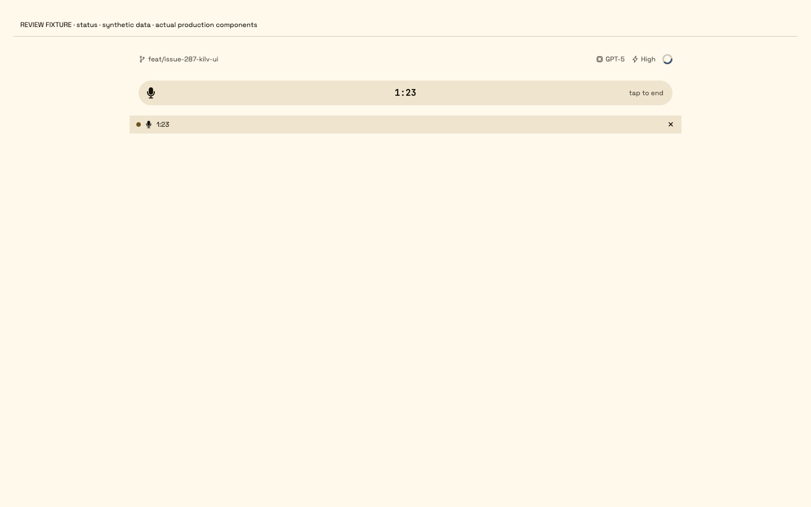</a>

**synthetic-review · light · 390×844**

<a href="status-synthetic-review-light-390.png">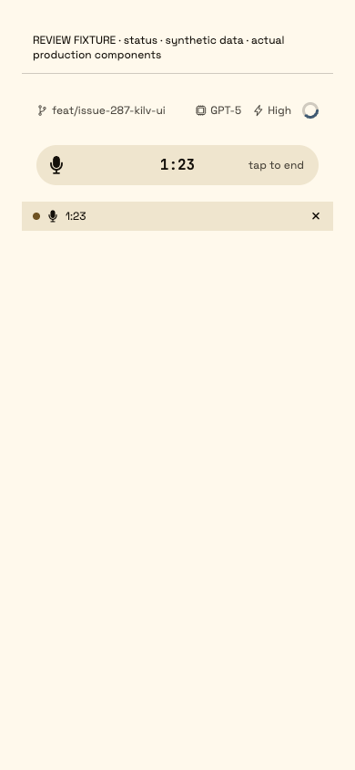</a>

**synthetic-review · dark · 1440×900**

<a href="status-synthetic-review-dark-1440.png">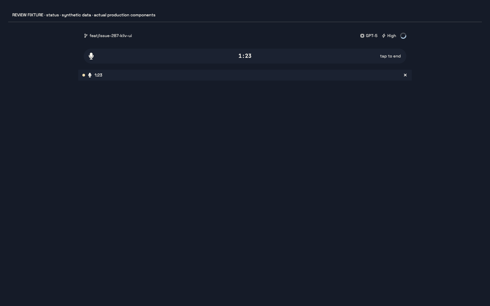</a>

**synthetic-review · dark · 390×844**

<a href="status-synthetic-review-dark-390.png">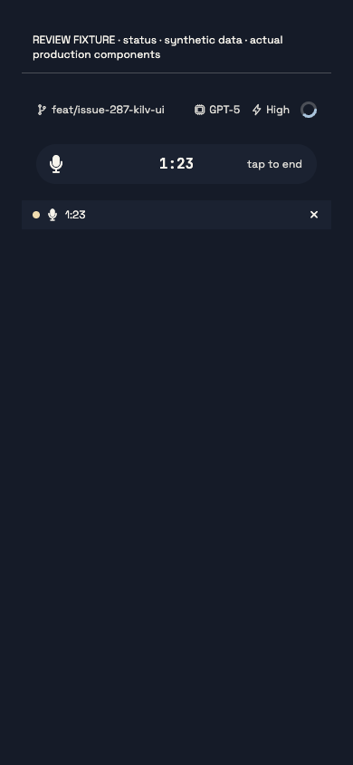</a>

## Attachment source menu

**Changed presentation:** Device-file and photo actions adopt the shared menu border, radius, palette and typography.

**Evidence:** `component-fixture`. States: synthetic-review.

**Production owners:** `components/AttachmentInputMenu.tsx`.

- Synthetic service/state boundaries; React Native Web adapter; not authenticated live or installed native evidence.
- RPC, storage, authentication, navigation, native glass, keyboard, gestures and animation clocks use deterministic fixture boundaries. Actual target components, theme, Typography, catalogs and font assets are imported. No account data is used. Session online status uses the actual production useSessionStatus export; other session identity/resume helpers retain fixture boundaries.

Fixture environment: [source graph and adapters](environment-chat.json).

| State | Theme | Viewport | Screenshot |
|---|---|---|---|
| synthetic-review | light | 1440×900 | [Open full screenshot](attachment-menu-synthetic-review-light-1440.png) |
| synthetic-review | light | 390×844 | [Open full screenshot](attachment-menu-synthetic-review-light-390.png) |
| synthetic-review | dark | 1440×900 | [Open full screenshot](attachment-menu-synthetic-review-dark-1440.png) |
| synthetic-review | dark | 390×844 | [Open full screenshot](attachment-menu-synthetic-review-dark-390.png) |

Show every screenshot for this panel

**synthetic-review · light · 1440×900**

<a href="attachment-menu-synthetic-review-light-1440.png">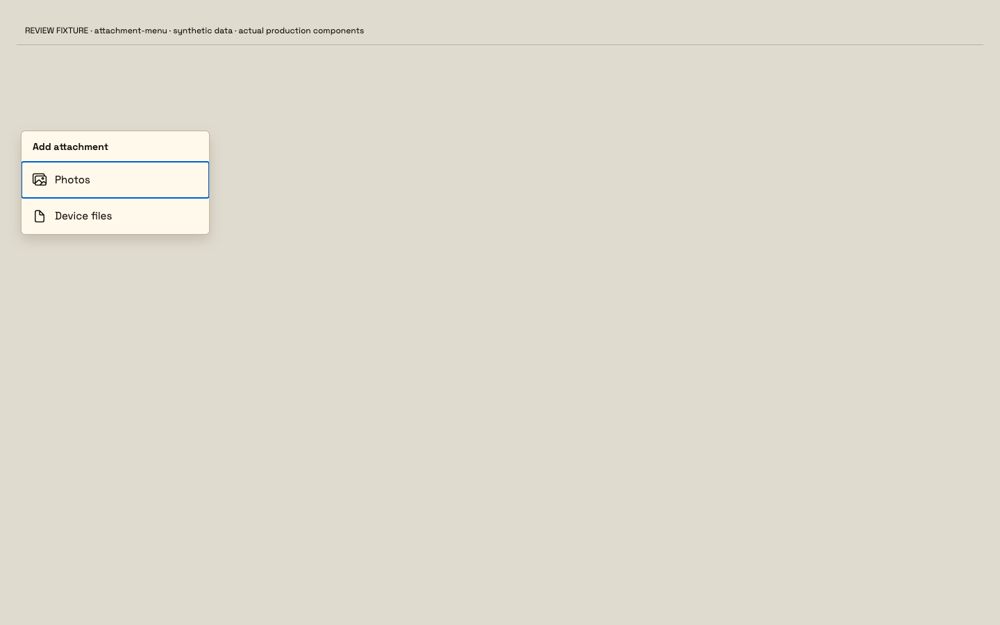</a>

**synthetic-review · light · 390×844**

<a href="attachment-menu-synthetic-review-light-390.png">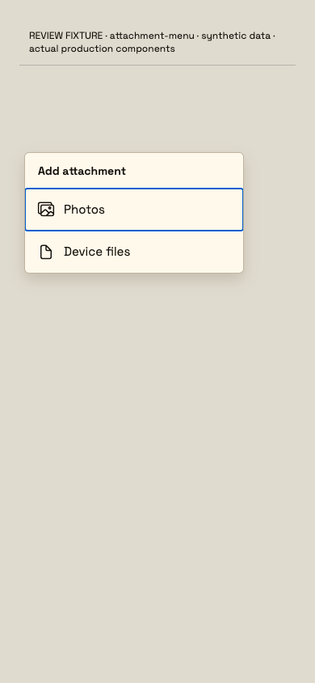</a>

**synthetic-review · dark · 1440×900**

<a href="attachment-menu-synthetic-review-dark-1440.png">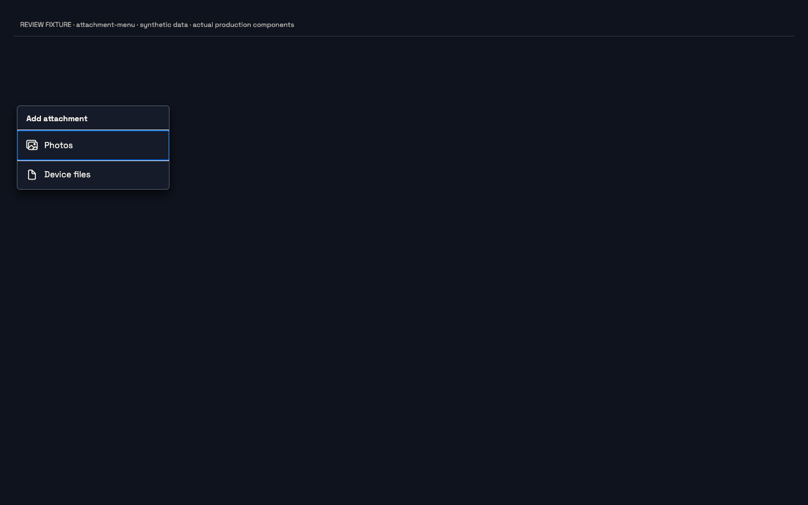</a>

**synthetic-review · dark · 390×844**

<a href="attachment-menu-synthetic-review-dark-390.png">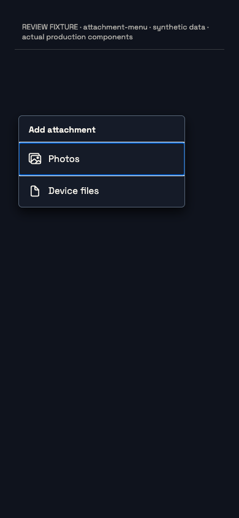</a>

## Agent question modal

**Changed presentation:** Question headings, options, selected controls and submit action use the shared KILV palette and fonts.

**Evidence:** `component-fixture`. States: selected-answer, synthetic-review.

**Production owners:** `components/AgentQuestionModal.tsx`.

- Synthetic service/state boundaries; React Native Web adapter; not authenticated live or installed native evidence.
- RPC, storage, authentication, navigation, native glass, keyboard, gestures and animation clocks use deterministic fixture boundaries. Actual target components, theme, Typography, catalogs and font assets are imported. No account data is used. Session online status uses the actual production useSessionStatus export; other session identity/resume helpers retain fixture boundaries.

Fixture environment: [source graph and adapters](environment-chat.json).

| State | Theme | Viewport | Screenshot |
|---|---|---|---|
| synthetic-review | light | 1440×900 | [Open full screenshot](question-synthetic-review-light-1440.png) |
| selected-answer | light | 1440×900 | [Open full screenshot](question-selected-answer-light-1440.png) |
| synthetic-review | light | 390×844 | [Open full screenshot](question-synthetic-review-light-390.png) |
| selected-answer | light | 390×844 | [Open full screenshot](question-selected-answer-light-390.png) |
| synthetic-review | dark | 1440×900 | [Open full screenshot](question-synthetic-review-dark-1440.png) |
| selected-answer | dark | 1440×900 | [Open full screenshot](question-selected-answer-dark-1440.png) |
| synthetic-review | dark | 390×844 | [Open full screenshot](question-synthetic-review-dark-390.png) |
| selected-answer | dark | 390×844 | [Open full screenshot](question-selected-answer-dark-390.png) |

Show every screenshot for this panel

**synthetic-review · light · 1440×900**

<a href="question-synthetic-review-light-1440.png">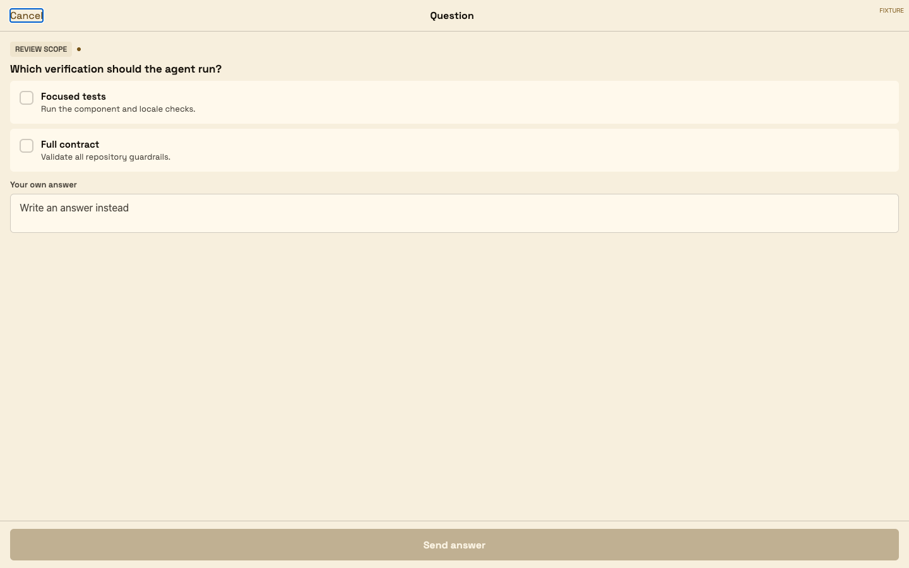</a>

**selected-answer · light · 1440×900**

<a href="question-selected-answer-light-1440.png">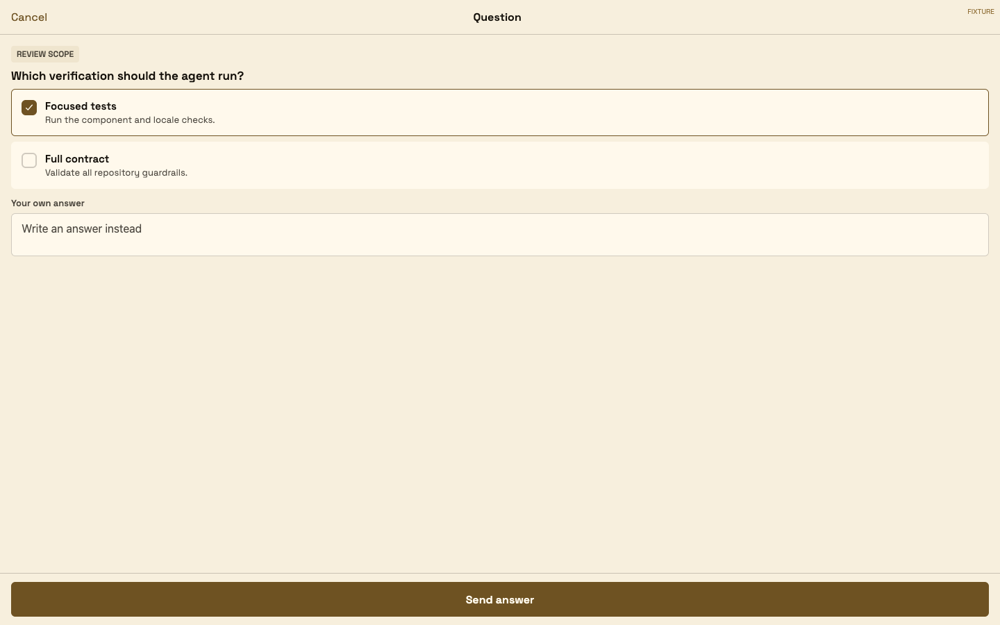</a>

**synthetic-review · light · 390×844**

<a href="question-synthetic-review-light-390.png">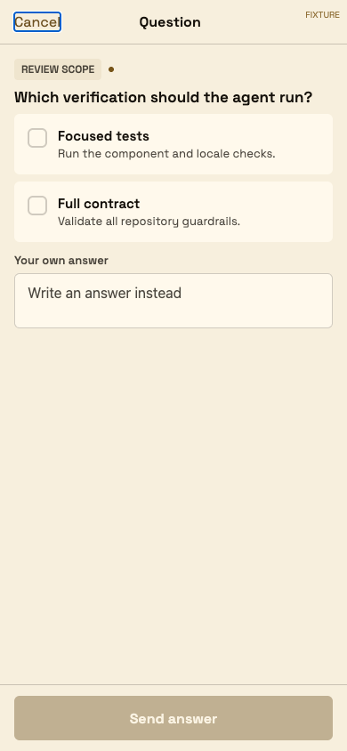</a>

**selected-answer · light · 390×844**

<a href="question-selected-answer-light-390.png">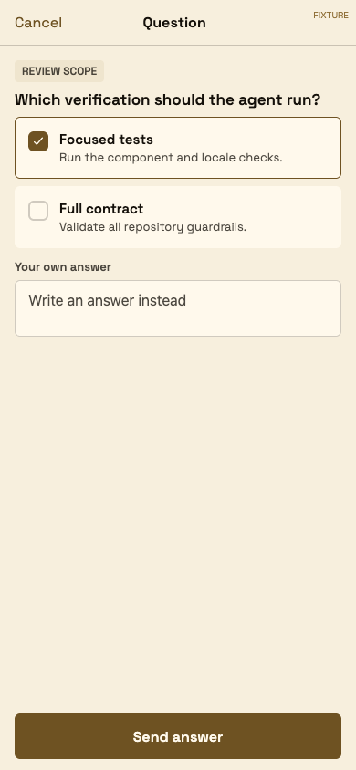</a>

**synthetic-review · dark · 1440×900**

<a href="question-synthetic-review-dark-1440.png">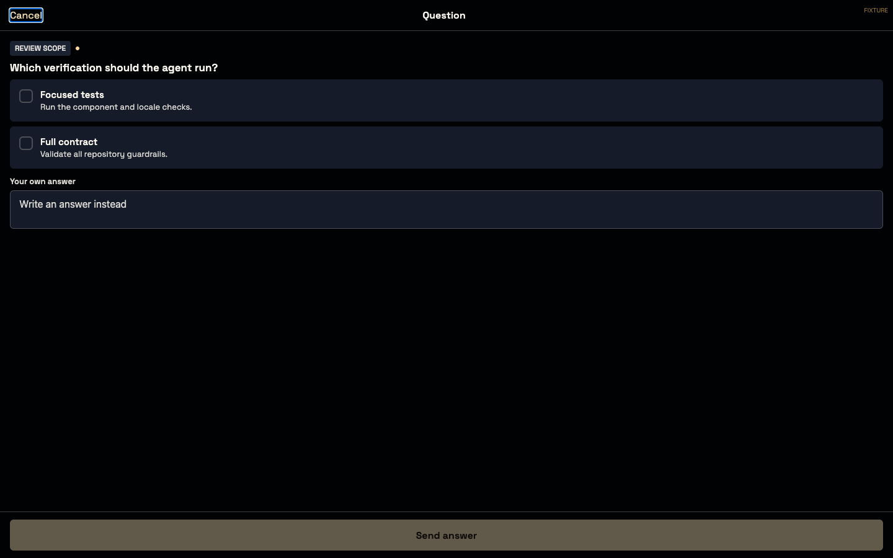</a>

**selected-answer · dark · 1440×900**

<a href="question-selected-answer-dark-1440.png">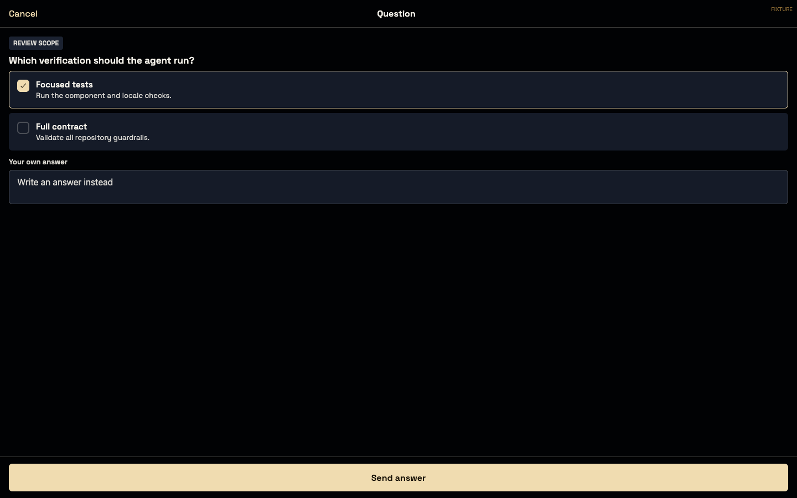</a>

**synthetic-review · dark · 390×844**

<a href="question-synthetic-review-dark-390.png">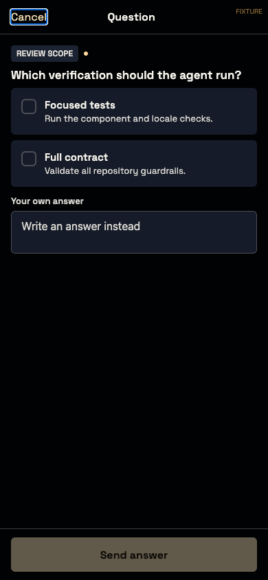</a>

**selected-answer · dark · 390×844**

<a href="question-selected-answer-dark-390.png">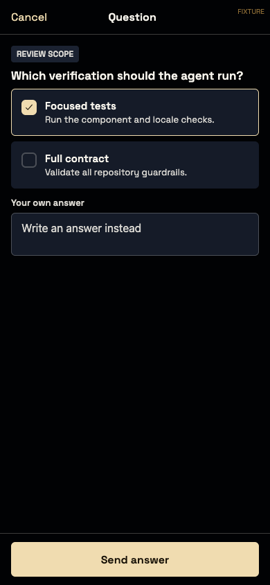</a>

## Provider continuation links and sheet

**Changed presentation:** Continuation text, provider choices and links adopt shared typography and themed surfaces.

**Evidence:** `component-fixture`. States: synthetic-review.

**Production owners:** `components/ProviderContinuationLinks.tsx`, `components/ProviderContinuationSheet.tsx`.

- Synthetic service/state boundaries; React Native Web adapter; not authenticated live or installed native evidence.
- RPC, storage, authentication, navigation, native glass, keyboard, gestures and animation clocks use deterministic fixture boundaries. Actual target components, theme, Typography, catalogs and font assets are imported. No account data is used. Session online status uses the actual production useSessionStatus export; other session identity/resume helpers retain fixture boundaries.

Fixture environment: [source graph and adapters](environment-chat.json).

| State | Theme | Viewport | Screenshot |
|---|---|---|---|
| synthetic-review | light | 1440×900 | [Open full screenshot](continuation-synthetic-review-light-1440.png) |
| synthetic-review | light | 390×844 | [Open full screenshot](continuation-synthetic-review-light-390.png) |
| synthetic-review | dark | 1440×900 | [Open full screenshot](continuation-synthetic-review-dark-1440.png) |
| synthetic-review | dark | 390×844 | [Open full screenshot](continuation-synthetic-review-dark-390.png) |

Show every screenshot for this panel

**synthetic-review · light · 1440×900**

<a href="continuation-synthetic-review-light-1440.png">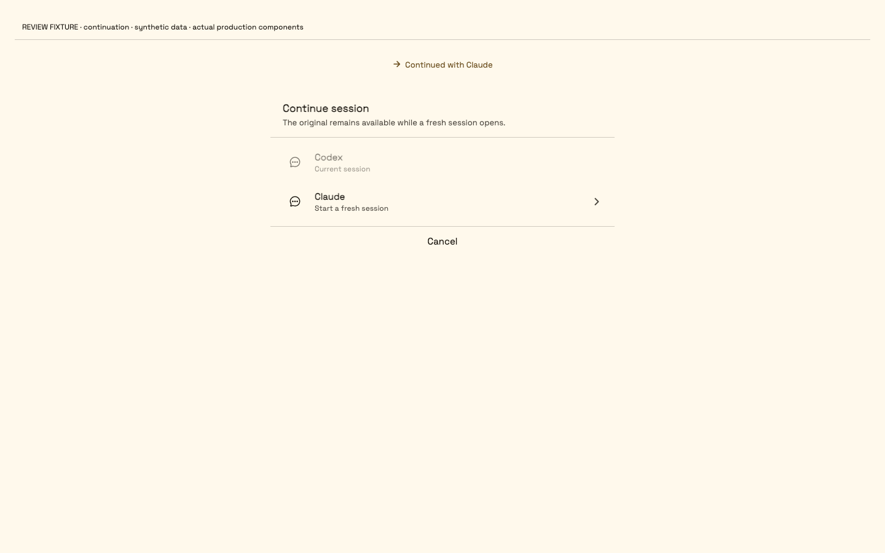</a>

**synthetic-review · light · 390×844**

<a href="continuation-synthetic-review-light-390.png">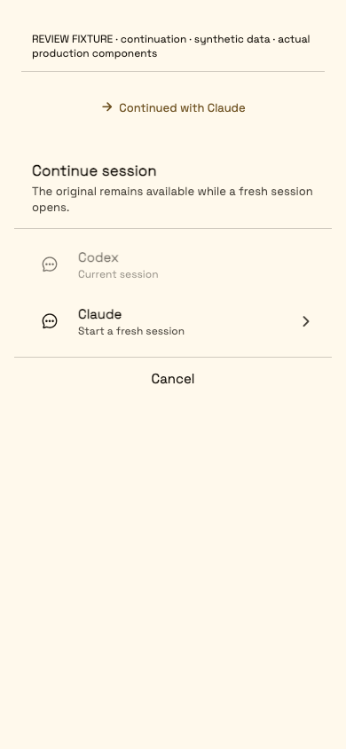</a>

**synthetic-review · dark · 1440×900**

<a href="continuation-synthetic-review-dark-1440.png">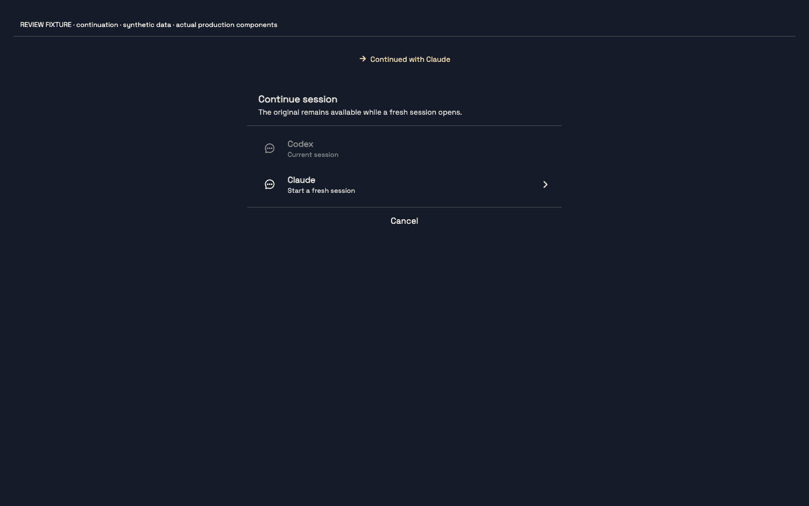</a>

**synthetic-review · dark · 390×844**

<a href="continuation-synthetic-review-dark-390.png">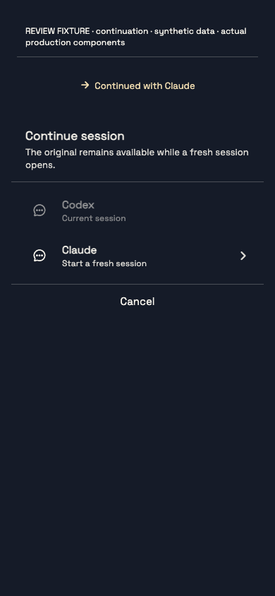</a>

## Session actions popover

**Changed presentation:** Action rows and destructive state use themed colors and shared type.

**Evidence:** `component-fixture`. States: synthetic-review.

**Production owners:** `components/SessionActionsPopover.tsx`.

- Synthetic service/state boundaries; React Native Web adapter; not authenticated live or installed native evidence.
- RPC, storage, authentication, navigation, native glass, keyboard, gestures and animation clocks use deterministic fixture boundaries. Actual target components, theme, Typography, catalogs and font assets are imported. No account data is used. Session online status uses the actual production useSessionStatus export; other session identity/resume helpers retain fixture boundaries.

Fixture environment: [source graph and adapters](environment-chat.json).

| State | Theme | Viewport | Screenshot |
|---|---|---|---|
| synthetic-review | light | 1440×900 | [Open full screenshot](session-actions-synthetic-review-light-1440.png) |
| synthetic-review | light | 390×844 | [Open full screenshot](session-actions-synthetic-review-light-390.png) |
| synthetic-review | dark | 1440×900 | [Open full screenshot](session-actions-synthetic-review-dark-1440.png) |
| synthetic-review | dark | 390×844 | [Open full screenshot](session-actions-synthetic-review-dark-390.png) |

Show every screenshot for this panel

**synthetic-review · light · 1440×900**

<a href="session-actions-synthetic-review-light-1440.png">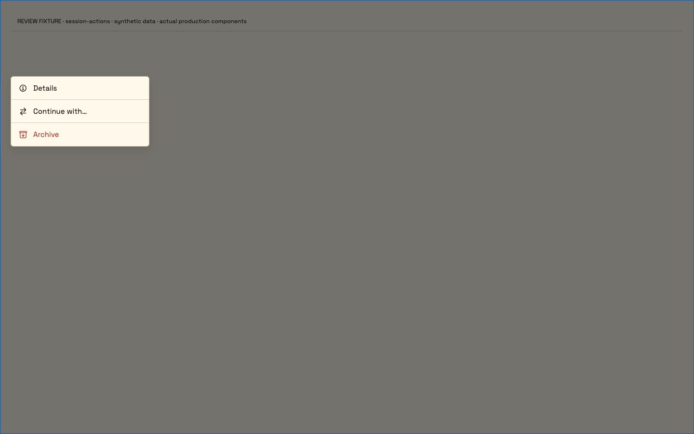</a>

**synthetic-review · light · 390×844**

<a href="session-actions-synthetic-review-light-390.png">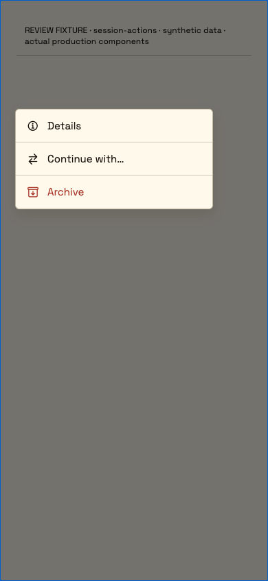</a>

**synthetic-review · dark · 1440×900**

<a href="session-actions-synthetic-review-dark-1440.png">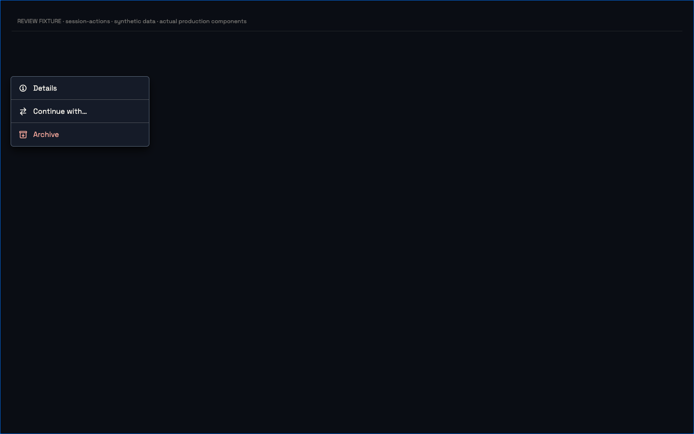</a>

**synthetic-review · dark · 390×844**

<a href="session-actions-synthetic-review-dark-390.png">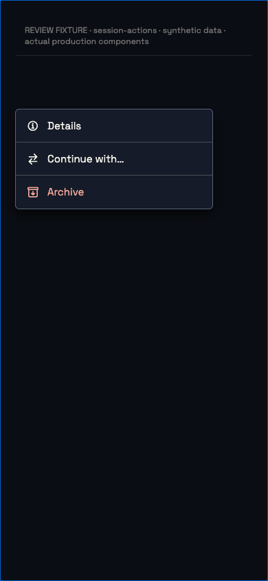</a>

## Native code editor

**Changed presentation:** The native multiline editor now derives its monospaced face from Typography.mono().

**Evidence:** `component-fixture`. States: synthetic-review.

**Production owners:** `components/CodeEditor.tsx`.

- Synthetic service/state boundaries; React Native Web adapter; not authenticated live or installed native evidence.
- RPC, storage, authentication, navigation, native glass, keyboard, gestures and animation clocks use deterministic fixture boundaries. Actual target components, theme, Typography, catalogs and font assets are imported. No account data is used. Session online status uses the actual production useSessionStatus export; other session identity/resume helpers retain fixture boundaries.
- Native renderer hosted in DOM only. Installed iOS/Android text metrics, alpha masks, shimmer motion, keyboard and platform glass remain unverified. Shimmer alpha mask is replaced by its mask element for the still.

Fixture environment: [source graph and adapters](environment-chat.json).

| State | Theme | Viewport | Screenshot |
|---|---|---|---|
| synthetic-review | light | 1440×900 | [Open full screenshot](native-editor-synthetic-review-light-1440.png) |
| synthetic-review | light | 390×844 | [Open full screenshot](native-editor-synthetic-review-light-390.png) |
| synthetic-review | dark | 1440×900 | [Open full screenshot](native-editor-synthetic-review-dark-1440.png) |
| synthetic-review | dark | 390×844 | [Open full screenshot](native-editor-synthetic-review-dark-390.png) |

Show every screenshot for this panel

**synthetic-review · light · 1440×900**

<a href="native-editor-synthetic-review-light-1440.png">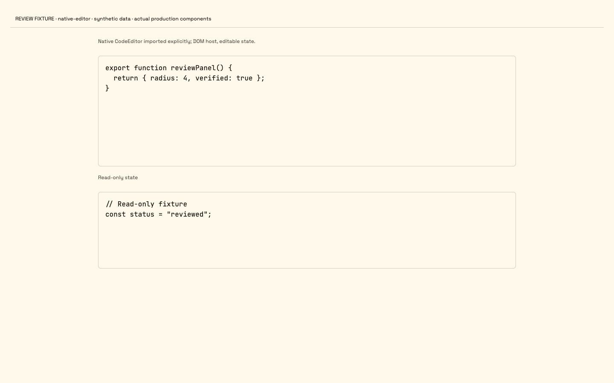</a>

**synthetic-review · light · 390×844**

<a href="native-editor-synthetic-review-light-390.png">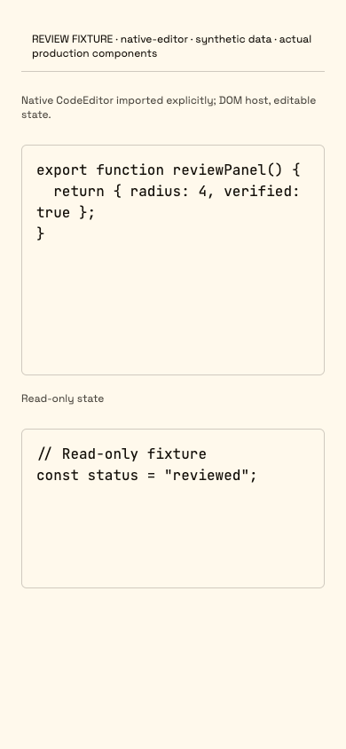</a>

**synthetic-review · dark · 1440×900**

<a href="native-editor-synthetic-review-dark-1440.png">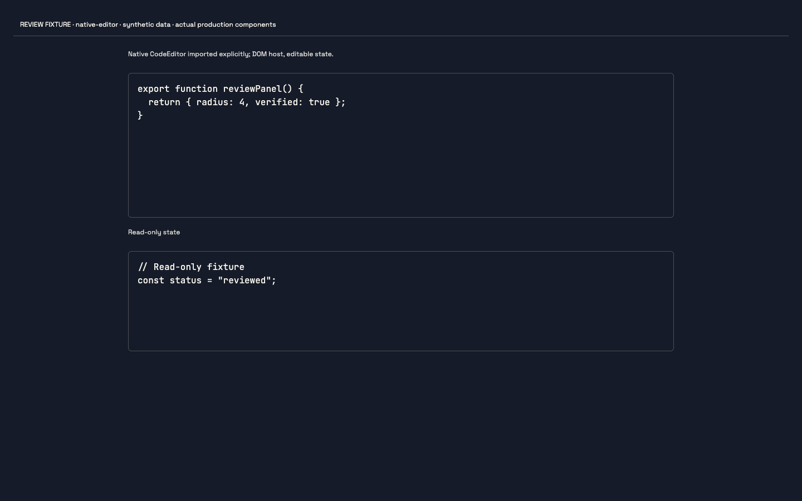</a>

**synthetic-review · dark · 390×844**

<a href="native-editor-synthetic-review-dark-390.png">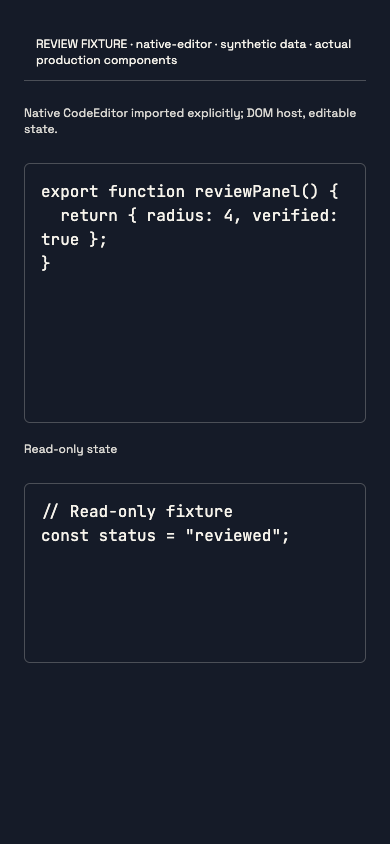</a>

## Compact tool and provider command results

**Changed presentation:** Tool labels and Codex/Gemini command renderers adopt shared type and KILV command colors.

**Evidence:** `component-fixture`. States: synthetic-review.

**Production owners:** `components/tools/ToolView.tsx`, `components/tools/views/CodexBashView.tsx`, `components/tools/views/GeminiExecuteView.tsx`.

- Synthetic service/state boundaries; React Native Web adapter; not authenticated live or installed native evidence.
- RPC, storage, authentication, navigation, native glass, keyboard, gestures and animation clocks use deterministic fixture boundaries. Actual target components, theme, Typography, catalogs and font assets are imported. No account data is used. Session online status uses the actual production useSessionStatus export; other session identity/resume helpers retain fixture boundaries.

Fixture environment: [source graph and adapters](environment-chat.json).

| State | Theme | Viewport | Screenshot |
|---|---|---|---|
| synthetic-review | light | 1440×900 | [Open full screenshot](tool-shells-synthetic-review-light-1440.png) |
| synthetic-review | light | 390×844 | [Open full screenshot](tool-shells-synthetic-review-light-390.png) |
| synthetic-review | dark | 1440×900 | [Open full screenshot](tool-shells-synthetic-review-dark-1440.png) |
| synthetic-review | dark | 390×844 | [Open full screenshot](tool-shells-synthetic-review-dark-390.png) |

Show every screenshot for this panel

**synthetic-review · light · 1440×900**

<a href="tool-shells-synthetic-review-light-1440.png">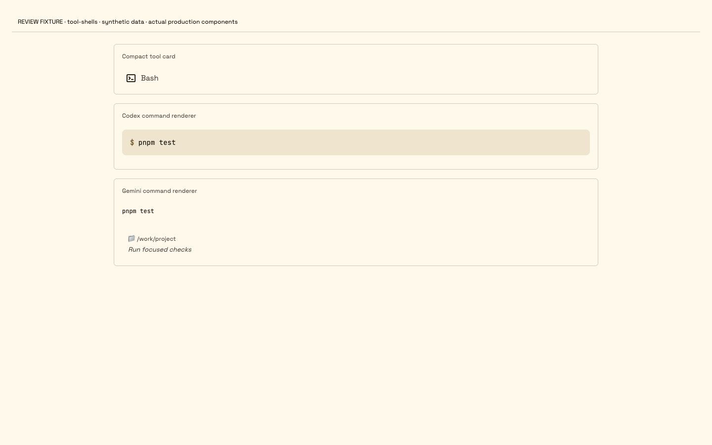</a>

**synthetic-review · light · 390×844**

<a href="tool-shells-synthetic-review-light-390.png">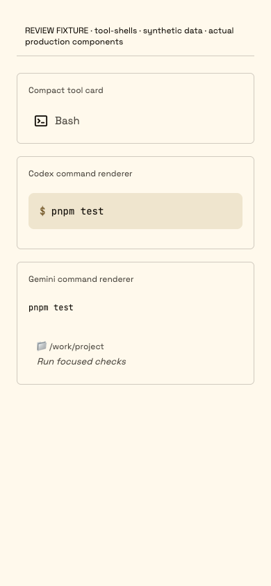</a>

**synthetic-review · dark · 1440×900**

<a href="tool-shells-synthetic-review-dark-1440.png">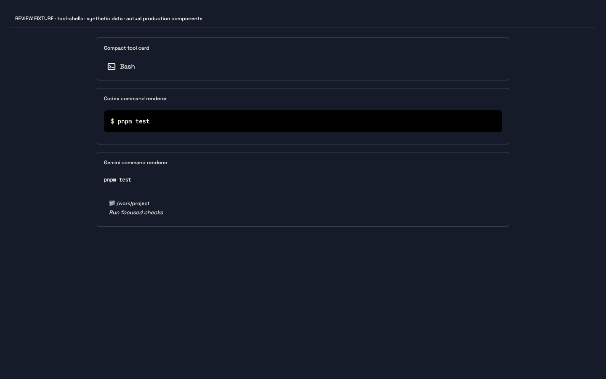</a>

**synthetic-review · dark · 390×844**

<a href="tool-shells-synthetic-review-dark-390.png">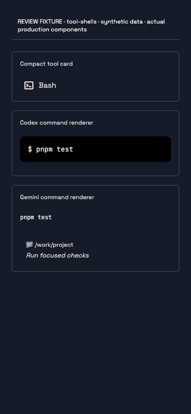</a>

## Tool detail and error result

**Changed presentation:** Tool detail sections use themed headings, code surfaces and error styling.

**Evidence:** `component-fixture`. States: synthetic-review.

**Production owners:** `components/tools/ToolFullView.tsx`.

- Synthetic service/state boundaries; React Native Web adapter; not authenticated live or installed native evidence.
- RPC, storage, authentication, navigation, native glass, keyboard, gestures and animation clocks use deterministic fixture boundaries. Actual target components, theme, Typography, catalogs and font assets are imported. No account data is used. Session online status uses the actual production useSessionStatus export; other session identity/resume helpers retain fixture boundaries.

Fixture environment: [source graph and adapters](environment-chat.json).

| State | Theme | Viewport | Screenshot |
|---|---|---|---|
| synthetic-review | light | 1440×900 | [Open full screenshot](tool-full-synthetic-review-light-1440.png) |
| synthetic-review | light | 390×844 | [Open full screenshot](tool-full-synthetic-review-light-390.png) |
| synthetic-review | dark | 1440×900 | [Open full screenshot](tool-full-synthetic-review-dark-1440.png) |
| synthetic-review | dark | 390×844 | [Open full screenshot](tool-full-synthetic-review-dark-390.png) |

Show every screenshot for this panel

**synthetic-review · light · 1440×900**

<a href="tool-full-synthetic-review-light-1440.png">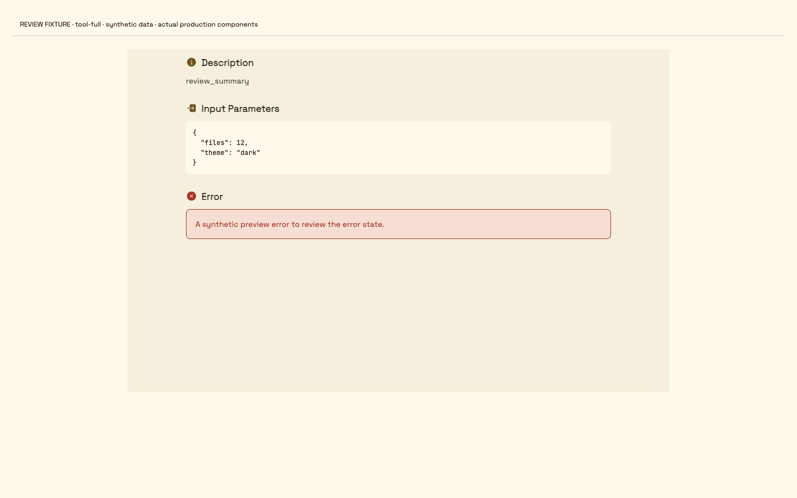</a>

**synthetic-review · light · 390×844**

<a href="tool-full-synthetic-review-light-390.png">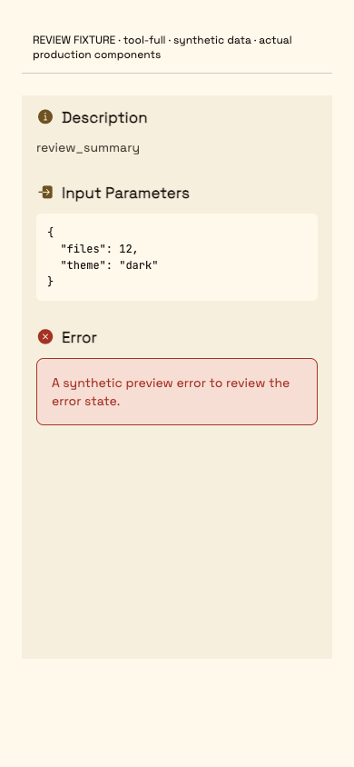</a>

**synthetic-review · dark · 1440×900**

<a href="tool-full-synthetic-review-dark-1440.png">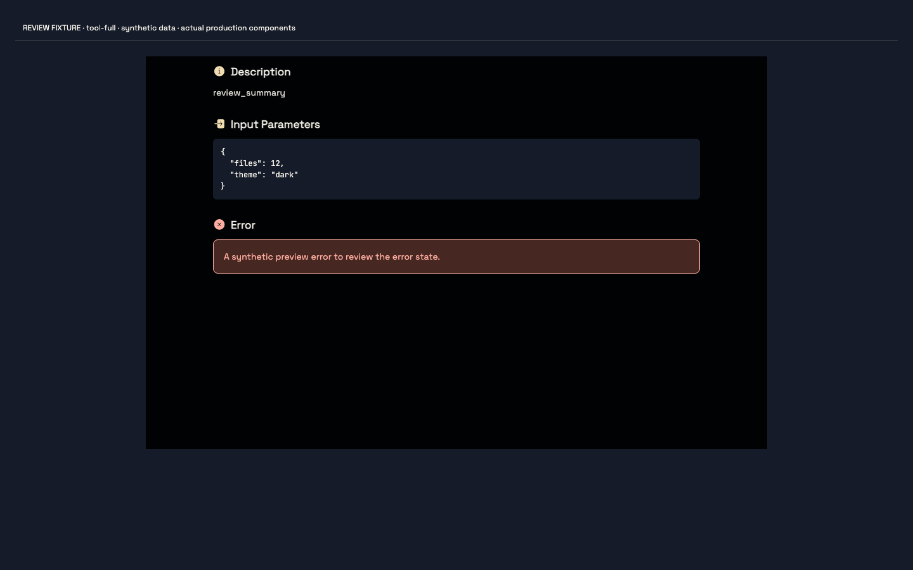</a>

**synthetic-review · dark · 390×844**

<a href="tool-full-synthetic-review-dark-390.png">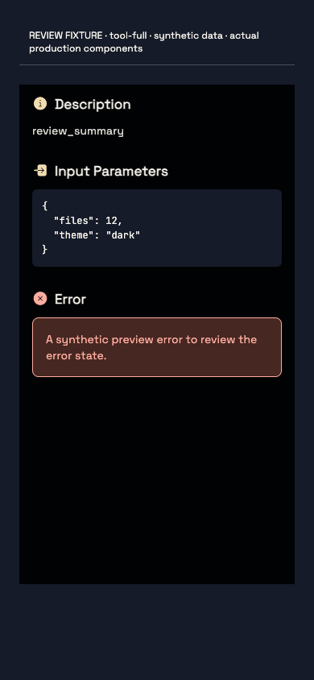</a>

## Tool execution and permission states

**Changed presentation:** Running/completed/error indicators and permission actions use semantic theme colors.

**Evidence:** `component-fixture`. States: synthetic-review.

**Production owners:** `components/tools/ToolSectionView.tsx`, `components/tools/ToolError.tsx`, `components/tools/ToolStatusIndicator.tsx`, `components/tools/PermissionFooter.tsx`.

- Synthetic service/state boundaries; React Native Web adapter; not authenticated live or installed native evidence.
- RPC, storage, authentication, navigation, native glass, keyboard, gestures and animation clocks use deterministic fixture boundaries. Actual target components, theme, Typography, catalogs and font assets are imported. No account data is used. Session online status uses the actual production useSessionStatus export; other session identity/resume helpers retain fixture boundaries.

Fixture environment: [source graph and adapters](environment-chat.json).

| State | Theme | Viewport | Screenshot |
|---|---|---|---|
| synthetic-review | light | 1440×900 | [Open full screenshot](tool-states-synthetic-review-light-1440.png) |
| synthetic-review | light | 390×844 | [Open full screenshot](tool-states-synthetic-review-light-390.png) |
| synthetic-review | dark | 1440×900 | [Open full screenshot](tool-states-synthetic-review-dark-1440.png) |
| synthetic-review | dark | 390×844 | [Open full screenshot](tool-states-synthetic-review-dark-390.png) |

Show every screenshot for this panel

**synthetic-review · light · 1440×900**

<a href="tool-states-synthetic-review-light-1440.png">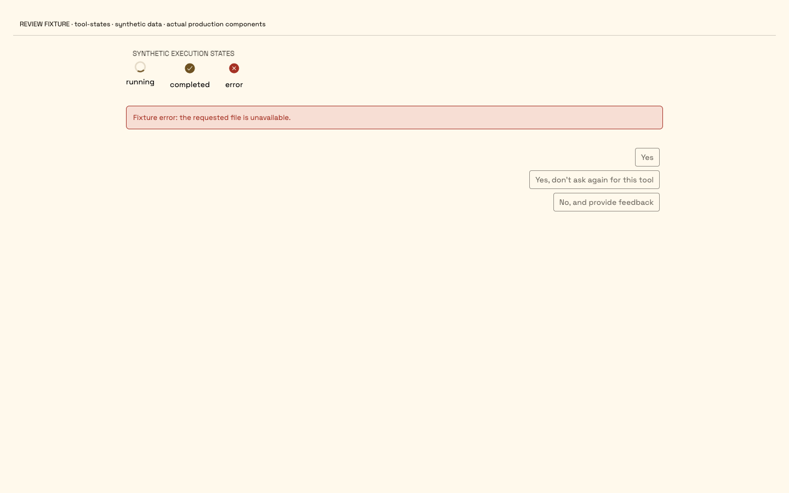</a>

**synthetic-review · light · 390×844**

<a href="tool-states-synthetic-review-light-390.png">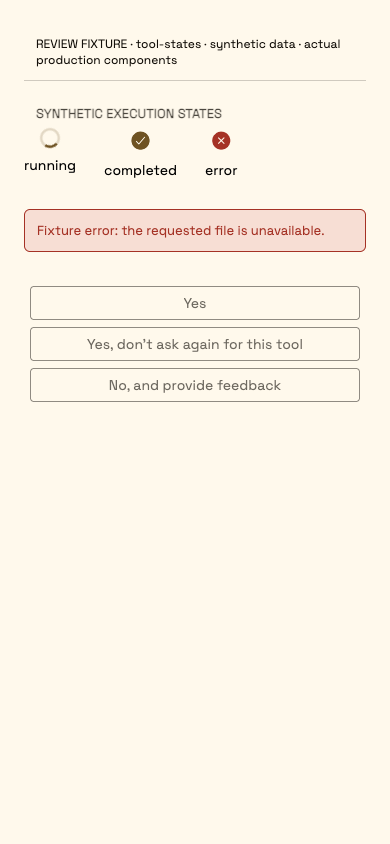</a>

**synthetic-review · dark · 1440×900**

<a href="tool-states-synthetic-review-dark-1440.png">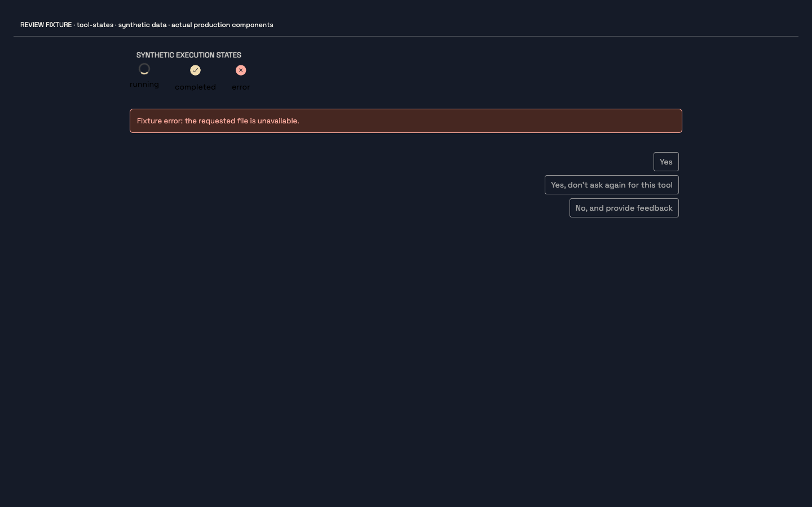</a>

**synthetic-review · dark · 390×844**

<a href="tool-states-synthetic-review-dark-390.png">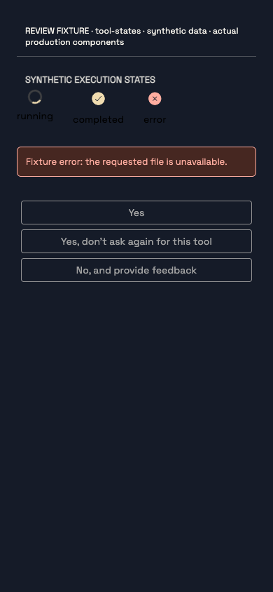</a>

## Compact patch, expanded patch and multiple edits

**Changed presentation:** Patch labels and edit summaries adopt the shared typography and themed action colors.

**Evidence:** `component-fixture`. States: synthetic-review.

**Production owners:** `components/tools/views/CodexPatchView.tsx`, `components/tools/views/MultiEditViewFull.tsx`.

- Synthetic service/state boundaries; React Native Web adapter; not authenticated live or installed native evidence.
- RPC, storage, authentication, navigation, native glass, keyboard, gestures and animation clocks use deterministic fixture boundaries. Actual target components, theme, Typography, catalogs and font assets are imported. No account data is used. Session online status uses the actual production useSessionStatus export; other session identity/resume helpers retain fixture boundaries.

Fixture environment: [source graph and adapters](environment-chat.json).

| State | Theme | Viewport | Screenshot |
|---|---|---|---|
| synthetic-review | light | 1440×900 | [Open full screenshot](tool-patch-synthetic-review-light-1440.png) |
| synthetic-review | light | 390×844 | [Open full screenshot](tool-patch-synthetic-review-light-390.png) |
| synthetic-review | dark | 1440×900 | [Open full screenshot](tool-patch-synthetic-review-dark-1440.png) |
| synthetic-review | dark | 390×844 | [Open full screenshot](tool-patch-synthetic-review-dark-390.png) |

Show every screenshot for this panel

**synthetic-review · light · 1440×900**

<a href="tool-patch-synthetic-review-light-1440.png">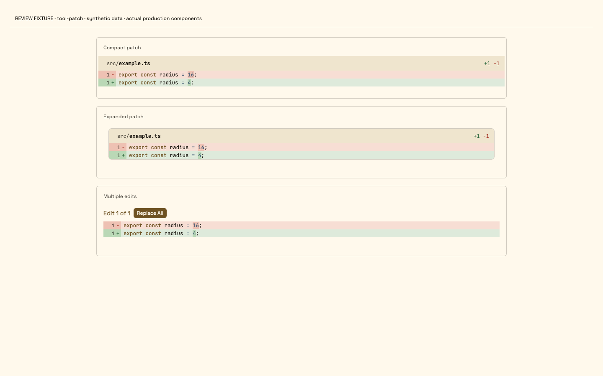</a>

**synthetic-review · light · 390×844**

<a href="tool-patch-synthetic-review-light-390.png">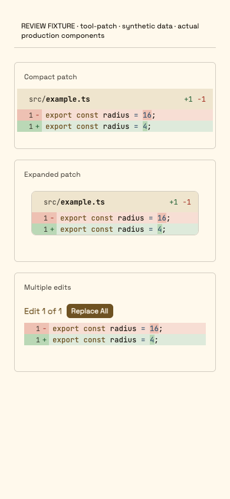</a>

**synthetic-review · dark · 1440×900**

<a href="tool-patch-synthetic-review-dark-1440.png">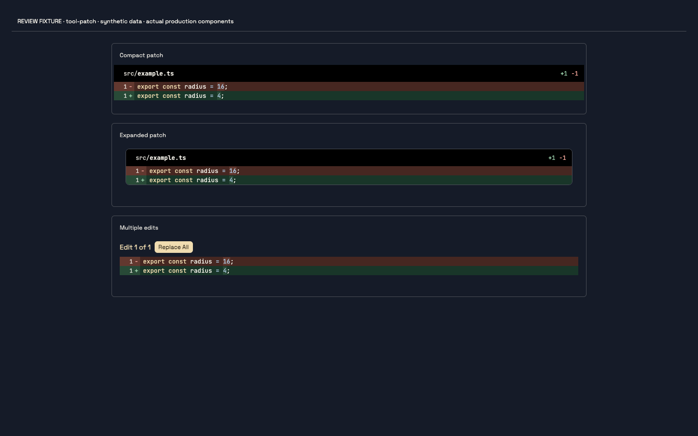</a>

**synthetic-review · dark · 390×844**

<a href="tool-patch-synthetic-review-dark-390.png">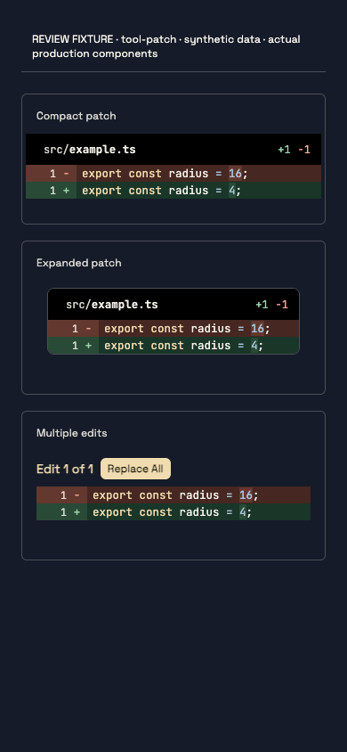</a>

## Image attachment result

**Changed presentation:** Attachment filename uses the shared typography alongside the themed image boundary.

**Evidence:** `component-fixture`. States: synthetic-review.

**Production owners:** `components/tools/views/FileView.tsx`.

- Synthetic service/state boundaries; React Native Web adapter; not authenticated live or installed native evidence.
- RPC, storage, authentication, navigation, native glass, keyboard, gestures and animation clocks use deterministic fixture boundaries. Actual target components, theme, Typography, catalogs and font assets are imported. No account data is used. Session online status uses the actual production useSessionStatus export; other session identity/resume helpers retain fixture boundaries.
- Attachment download/decryption hook returns repository KILV artwork as a synthetic image. No backend transfer verified.

Fixture environment: [source graph and adapters](environment-chat.json).

| State | Theme | Viewport | Screenshot |
|---|---|---|---|
| synthetic-review | light | 1440×900 | [Open full screenshot](tool-file-synthetic-review-light-1440.png) |
| synthetic-review | light | 390×844 | [Open full screenshot](tool-file-synthetic-review-light-390.png) |
| synthetic-review | dark | 1440×900 | [Open full screenshot](tool-file-synthetic-review-dark-1440.png) |
| synthetic-review | dark | 390×844 | [Open full screenshot](tool-file-synthetic-review-dark-390.png) |

Show every screenshot for this panel

**synthetic-review · light · 1440×900**

<a href="tool-file-synthetic-review-light-1440.png">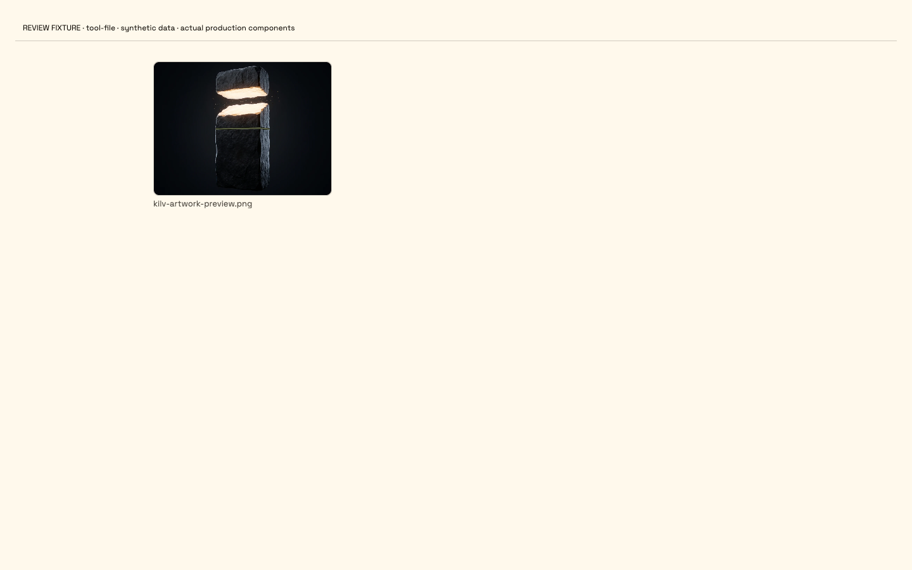</a>

**synthetic-review · light · 390×844**

<a href="tool-file-synthetic-review-light-390.png">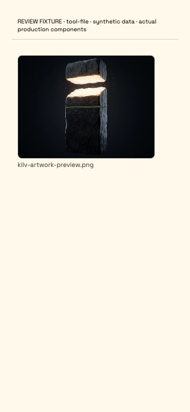</a>

**synthetic-review · dark · 1440×900**

<a href="tool-file-synthetic-review-dark-1440.png">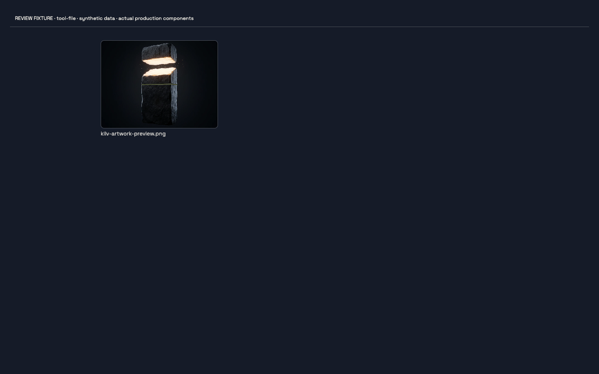</a>

**synthetic-review · dark · 390×844**

<a href="tool-file-synthetic-review-dark-390.png">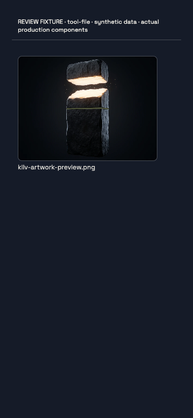</a>

## Inline question form

**Changed presentation:** Question labels, options and submit/cancel actions adopt the shared theme and type.

**Evidence:** `component-fixture`. States: selected-answer, synthetic-review.

**Production owners:** `components/tools/views/InlineQuestionForm.tsx`.

- Synthetic service/state boundaries; React Native Web adapter; not authenticated live or installed native evidence.
- RPC, storage, authentication, navigation, native glass, keyboard, gestures and animation clocks use deterministic fixture boundaries. Actual target components, theme, Typography, catalogs and font assets are imported. No account data is used. Session online status uses the actual production useSessionStatus export; other session identity/resume helpers retain fixture boundaries.

Fixture environment: [source graph and adapters](environment-chat.json).

| State | Theme | Viewport | Screenshot |
|---|---|---|---|
| synthetic-review | light | 1440×900 | [Open full screenshot](tool-question-synthetic-review-light-1440.png) |
| selected-answer | light | 1440×900 | [Open full screenshot](tool-question-selected-answer-light-1440.png) |
| synthetic-review | light | 390×844 | [Open full screenshot](tool-question-synthetic-review-light-390.png) |
| selected-answer | light | 390×844 | [Open full screenshot](tool-question-selected-answer-light-390.png) |
| synthetic-review | dark | 1440×900 | [Open full screenshot](tool-question-synthetic-review-dark-1440.png) |
| selected-answer | dark | 1440×900 | [Open full screenshot](tool-question-selected-answer-dark-1440.png) |
| synthetic-review | dark | 390×844 | [Open full screenshot](tool-question-synthetic-review-dark-390.png) |
| selected-answer | dark | 390×844 | [Open full screenshot](tool-question-selected-answer-dark-390.png) |

Show every screenshot for this panel

**synthetic-review · light · 1440×900**

<a href="tool-question-synthetic-review-light-1440.png">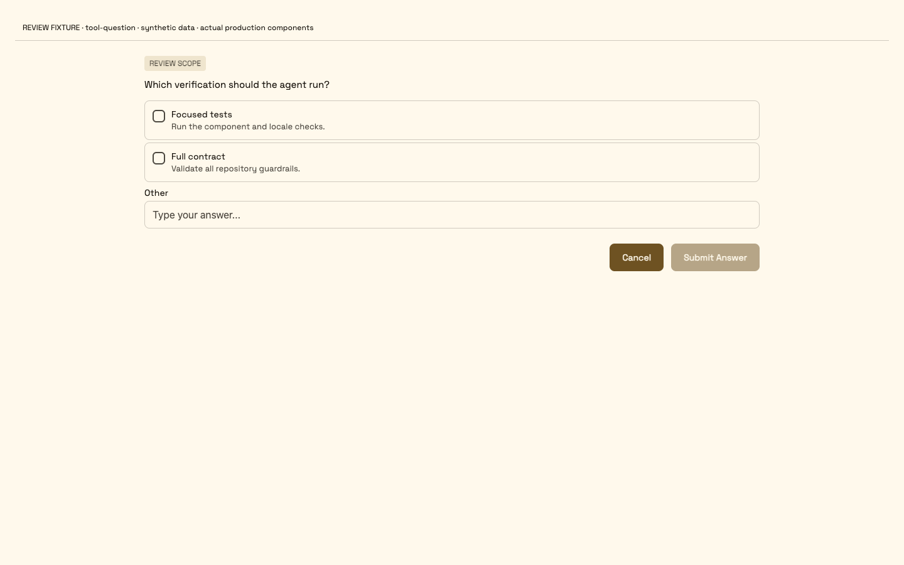</a>

**selected-answer · light · 1440×900**

<a href="tool-question-selected-answer-light-1440.png">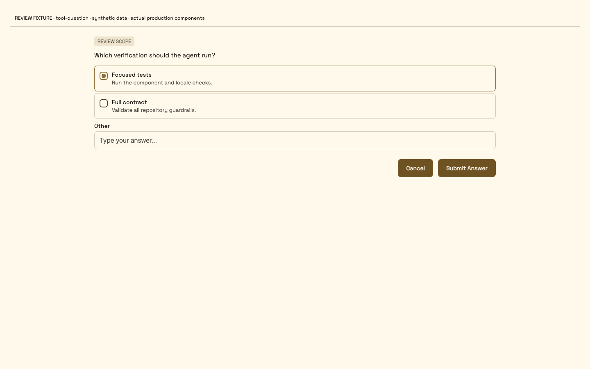</a>

**synthetic-review · light · 390×844**

<a href="tool-question-synthetic-review-light-390.png">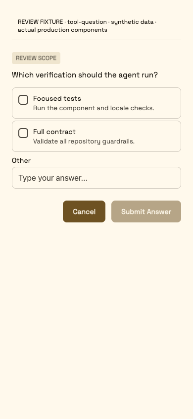</a>

**selected-answer · light · 390×844**

<a href="tool-question-selected-answer-light-390.png">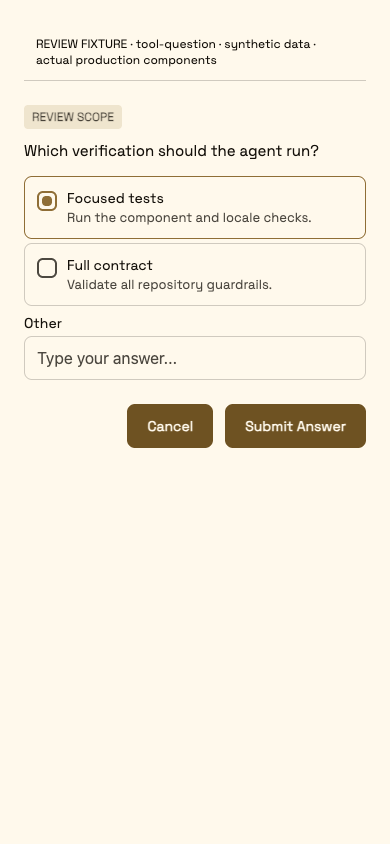</a>

**synthetic-review · dark · 1440×900**

<a href="tool-question-synthetic-review-dark-1440.png">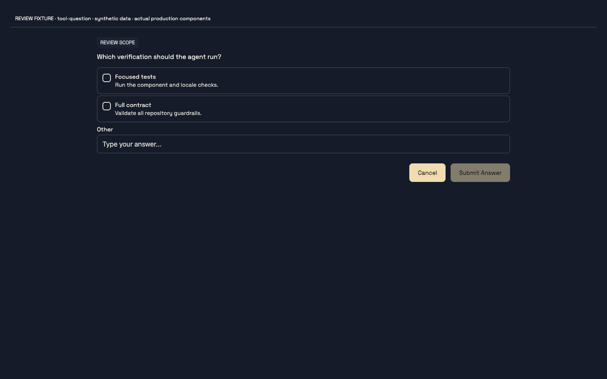</a>

**selected-answer · dark · 1440×900**

<a href="tool-question-selected-answer-dark-1440.png">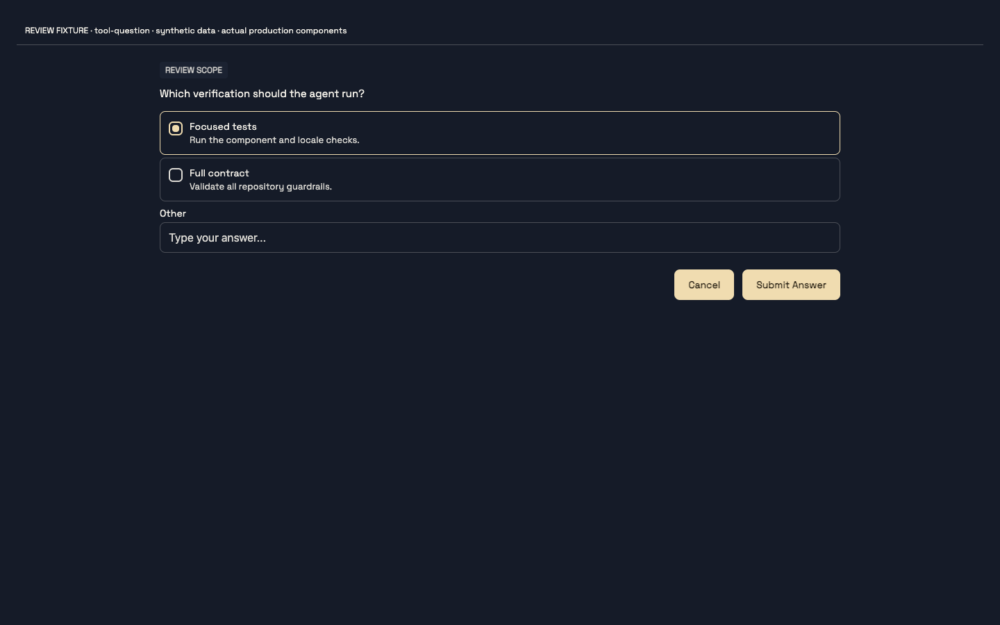</a>

**synthetic-review · dark · 390×844**

<a href="tool-question-synthetic-review-dark-390.png">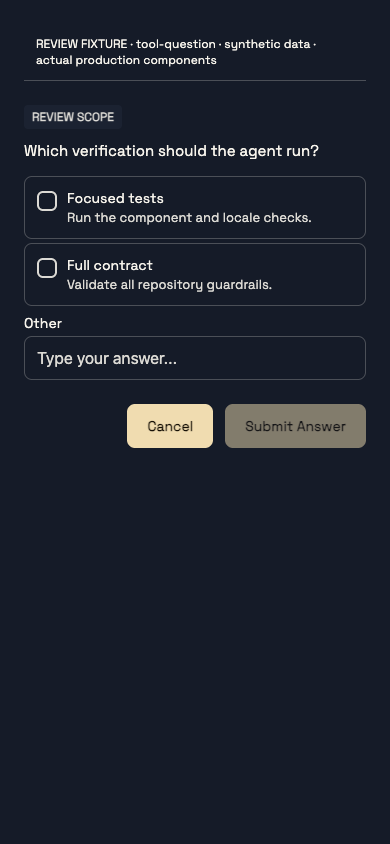</a>

**selected-answer · dark · 390×844**

<a href="tool-question-selected-answer-dark-390.png">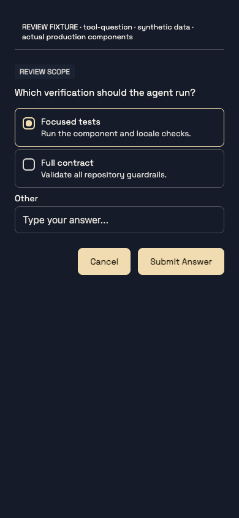</a>

## Subagent trace, task activity and checklist

**Changed presentation:** Agent outcomes, nested activity and task checklist text adopt shared fonts and semantic status colors.

**Evidence:** `component-fixture`. States: synthetic-review.

**Production owners:** `components/tools/views/SubagentView.tsx`, `components/tools/views/TaskView.tsx`, `components/tools/views/TodoView.tsx`.

- Synthetic service/state boundaries; React Native Web adapter; not authenticated live or installed native evidence.
- RPC, storage, authentication, navigation, native glass, keyboard, gestures and animation clocks use deterministic fixture boundaries. Actual target components, theme, Typography, catalogs and font assets are imported. No account data is used. Session online status uses the actual production useSessionStatus export; other session identity/resume helpers retain fixture boundaries.

Fixture environment: [source graph and adapters](environment-chat.json).

| State | Theme | Viewport | Screenshot |
|---|---|---|---|
| synthetic-review | light | 1440×900 | [Open full screenshot](tool-agents-synthetic-review-light-1440.png) |
| synthetic-review | light | 390×844 | [Open full screenshot](tool-agents-synthetic-review-light-390.png) |
| synthetic-review | dark | 1440×900 | [Open full screenshot](tool-agents-synthetic-review-dark-1440.png) |
| synthetic-review | dark | 390×844 | [Open full screenshot](tool-agents-synthetic-review-dark-390.png) |

Show every screenshot for this panel

**synthetic-review · light · 1440×900**

<a href="tool-agents-synthetic-review-light-1440.png">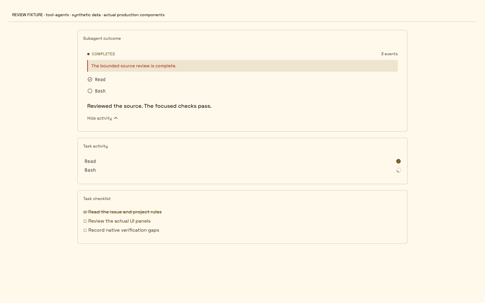</a>

**synthetic-review · light · 390×844**

<a href="tool-agents-synthetic-review-light-390.png">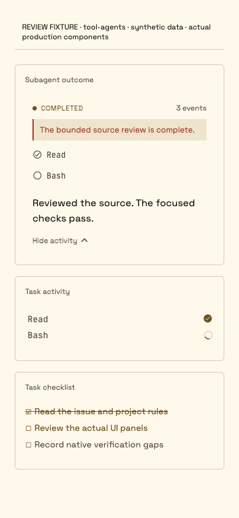</a>

**synthetic-review · dark · 1440×900**

<a href="tool-agents-synthetic-review-dark-1440.png">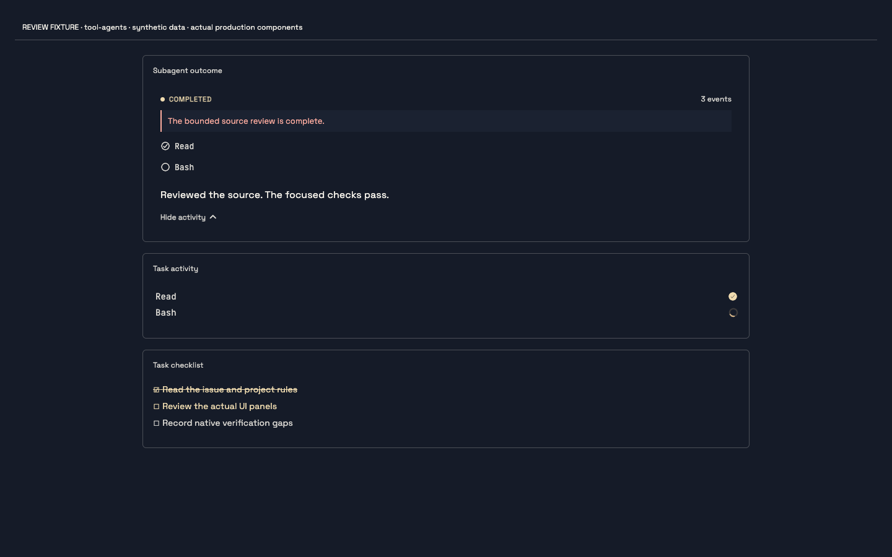</a>

**synthetic-review · dark · 390×844**

<a href="tool-agents-synthetic-review-dark-390.png">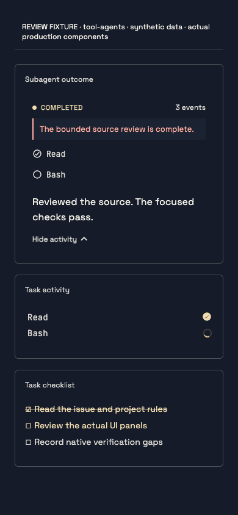</a>

## Searchable path selector

**Changed presentation:** Search and selected/favorite rows use the shared palette, borders, radii and fonts.

**Evidence:** `component-fixture`. States: synthetic-review.

**Production owners:** `components/SearchableListSelector.tsx`.

- Synthetic service/state boundaries; React Native Web adapter; not authenticated live or installed native evidence.
- RPC, storage, authentication, navigation, native glass, keyboard, gestures and animation clocks use deterministic fixture boundaries. Actual target components, theme, Typography, catalogs and font assets are imported. No account data is used. Session online status uses the actual production useSessionStatus export; other session identity/resume helpers retain fixture boundaries.

Fixture environment: [source graph and adapters](environment-chat.json).

| State | Theme | Viewport | Screenshot |
|---|---|---|---|
| synthetic-review | light | 1440×900 | [Open full screenshot](selector-synthetic-review-light-1440.png) |
| synthetic-review | light | 390×844 | [Open full screenshot](selector-synthetic-review-light-390.png) |
| synthetic-review | dark | 1440×900 | [Open full screenshot](selector-synthetic-review-dark-1440.png) |
| synthetic-review | dark | 390×844 | [Open full screenshot](selector-synthetic-review-dark-390.png) |

Show every screenshot for this panel

**synthetic-review · light · 1440×900**

<a href="selector-synthetic-review-light-1440.png">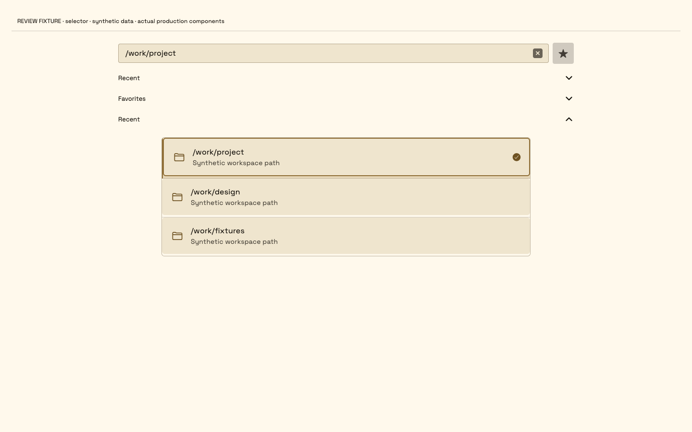</a>

**synthetic-review · light · 390×844**

<a href="selector-synthetic-review-light-390.png">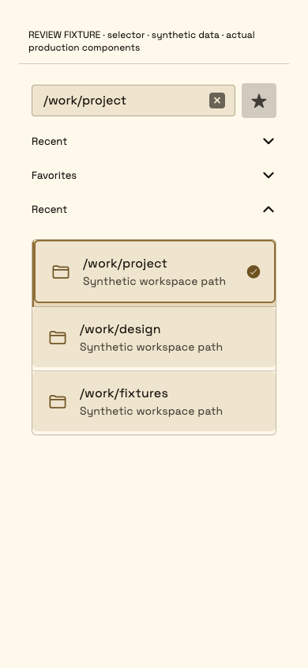</a>

**synthetic-review · dark · 1440×900**

<a href="selector-synthetic-review-dark-1440.png">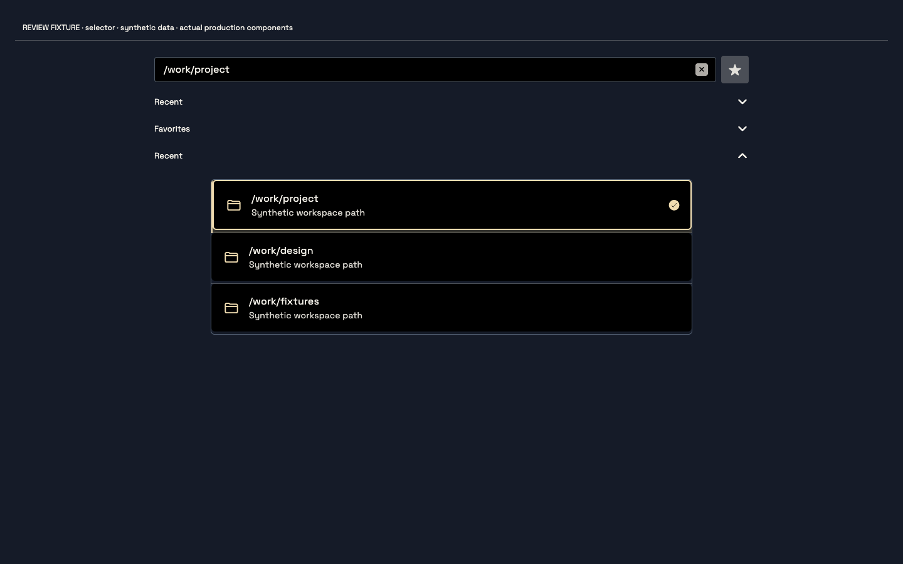</a>

**synthetic-review · dark · 390×844**

<a href="selector-synthetic-review-dark-390.png">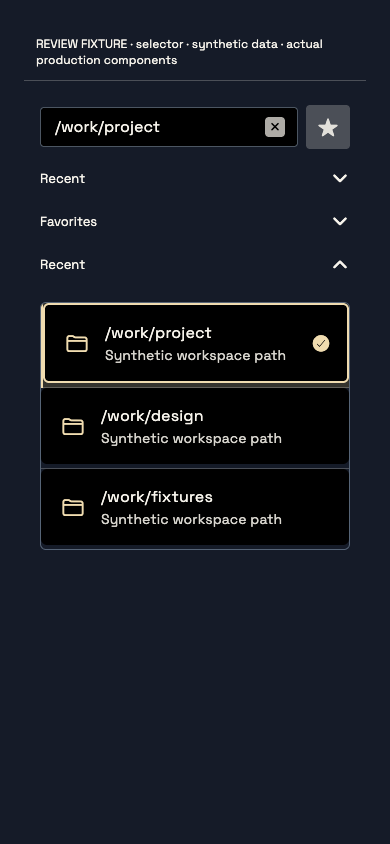</a>

## Destructive confirmation modal

**Changed presentation:** Alert content uses the dark lifted surface and themed destructive action.

**Evidence:** `component-fixture`. States: synthetic-review.

**Production owners:** `modal/components/BaseModal.tsx`, `modal/components/WebAlertModal.tsx`.

- Synthetic service/state boundaries; React Native Web adapter; not authenticated live or installed native evidence.
- RPC, storage, authentication, navigation, native glass, keyboard, gestures and animation clocks use deterministic fixture boundaries. Actual target components, theme, Typography, catalogs and font assets are imported. No account data is used. Session online status uses the actual production useSessionStatus export; other session identity/resume helpers retain fixture boundaries.

Fixture environment: [source graph and adapters](environment-chat.json).

| State | Theme | Viewport | Screenshot |
|---|---|---|---|
| synthetic-review | light | 1440×900 | [Open full screenshot](alert-synthetic-review-light-1440.png) |
| synthetic-review | light | 390×844 | [Open full screenshot](alert-synthetic-review-light-390.png) |
| synthetic-review | dark | 1440×900 | [Open full screenshot](alert-synthetic-review-dark-1440.png) |
| synthetic-review | dark | 390×844 | [Open full screenshot](alert-synthetic-review-dark-390.png) |

Show every screenshot for this panel

**synthetic-review · light · 1440×900**

<a href="alert-synthetic-review-light-1440.png">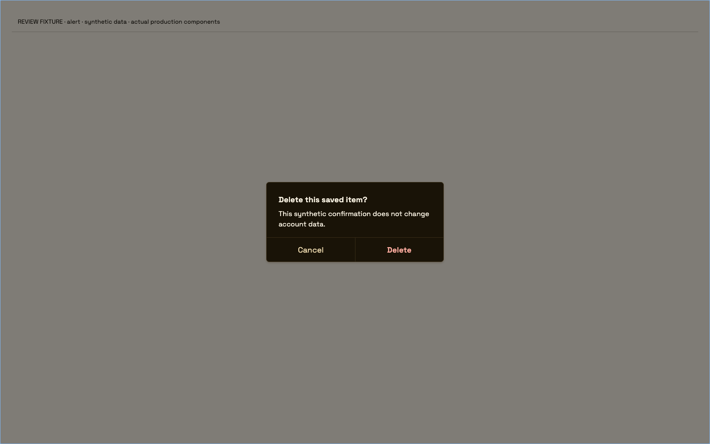</a>

**synthetic-review · light · 390×844**

<a href="alert-synthetic-review-light-390.png">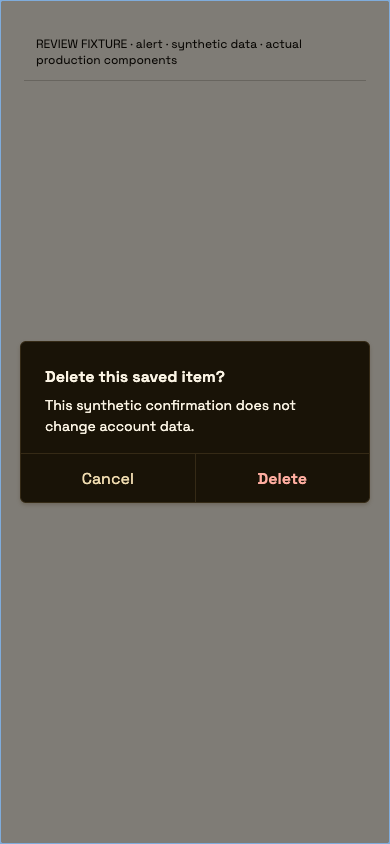</a>

**synthetic-review · dark · 1440×900**

<a href="alert-synthetic-review-dark-1440.png">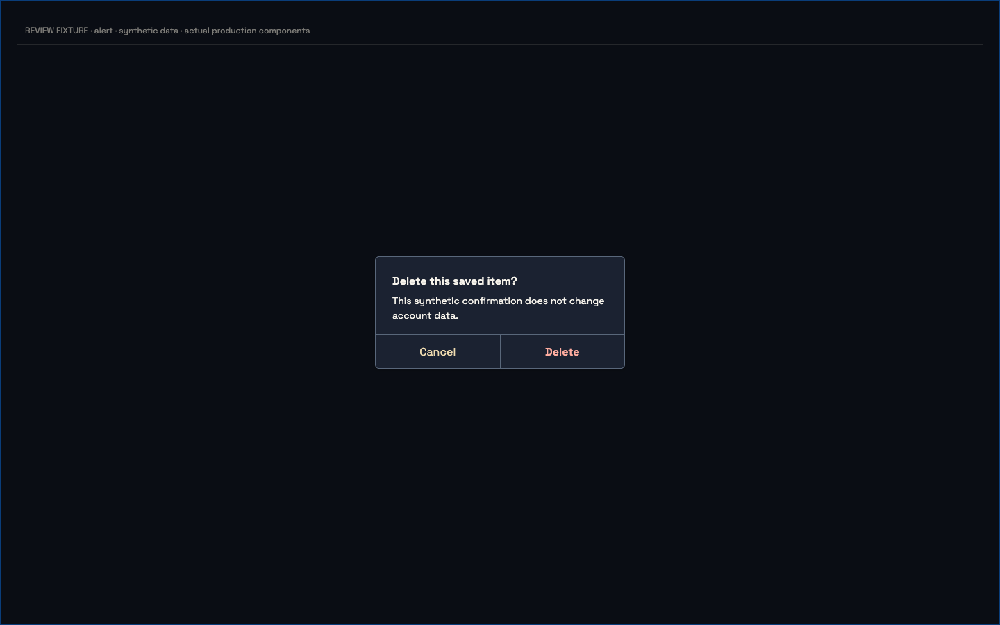</a>

**synthetic-review · dark · 390×844**

<a href="alert-synthetic-review-dark-390.png">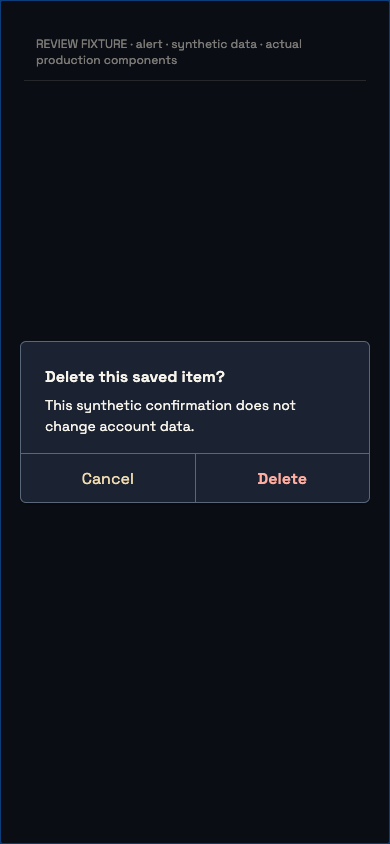</a>

## Session conversation and composer

**Changed presentation:** Session surfaces, reply island and composer adopt the shared KILV palette and typography.

**Evidence:** `component-fixture`. States: synthetic-review.

**Production owners:** `-session/SessionView.tsx`, `components/AgentInput.tsx`, `components/ChatList.tsx`, `components/MessageView.tsx`.

- Synthetic service/state boundaries; React Native Web adapter; not authenticated live or installed native evidence.
- RPC, storage, authentication, navigation, native glass, keyboard, gestures and animation clocks use deterministic fixture boundaries. Actual target components, theme, Typography, catalogs and font assets are imported. No account data is used. Session online status uses the actual production useSessionStatus export; other session identity/resume helpers retain fixture boundaries.

Fixture environment: [source graph and adapters](environment-chat.json).

| State | Theme | Viewport | Screenshot |
|---|---|---|---|
| synthetic-review | light | 1440×900 | [Open full screenshot](session-synthetic-review-light-1440.png) |
| synthetic-review | light | 390×844 | [Open full screenshot](session-synthetic-review-light-390.png) |
| synthetic-review | dark | 1440×900 | [Open full screenshot](session-synthetic-review-dark-1440.png) |
| synthetic-review | dark | 390×844 | [Open full screenshot](session-synthetic-review-dark-390.png) |

Show every screenshot for this panel

**synthetic-review · light · 1440×900**

<a href="session-synthetic-review-light-1440.png">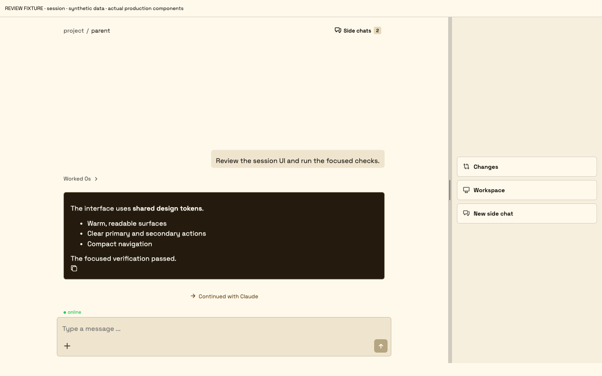</a>

**synthetic-review · light · 390×844**

<a href="session-synthetic-review-light-390.png">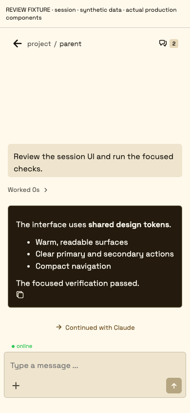</a>

**synthetic-review · dark · 1440×900**

<a href="session-synthetic-review-dark-1440.png">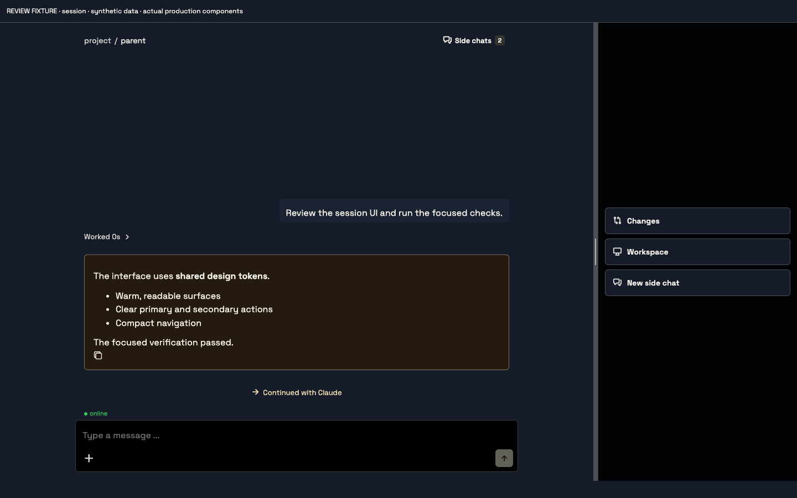</a>

**synthetic-review · dark · 390×844**

<a href="session-synthetic-review-dark-390.png">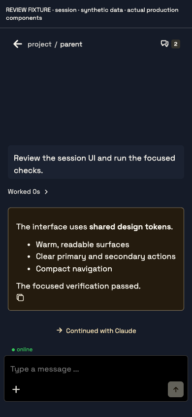</a>

## Message composer with draft

**Changed presentation:** Composer border, input text and send/attachment controls use KILV tokens.

**Evidence:** `component-fixture`. States: synthetic-review.

**Production owners:** `components/AgentInput.tsx`.

- Synthetic service/state boundaries; React Native Web adapter; not authenticated live or installed native evidence.
- RPC, storage, authentication, navigation, native glass, keyboard, gestures and animation clocks use deterministic fixture boundaries. Actual target components, theme, Typography, catalogs and font assets are imported. No account data is used. Session online status uses the actual production useSessionStatus export; other session identity/resume helpers retain fixture boundaries.

Fixture environment: [source graph and adapters](environment-chat.json).

| State | Theme | Viewport | Screenshot |
|---|---|---|---|
| synthetic-review | light | 1440×900 | [Open full screenshot](composer-synthetic-review-light-1440.png) |
| synthetic-review | light | 390×844 | [Open full screenshot](composer-synthetic-review-light-390.png) |
| synthetic-review | dark | 1440×900 | [Open full screenshot](composer-synthetic-review-dark-1440.png) |
| synthetic-review | dark | 390×844 | [Open full screenshot](composer-synthetic-review-dark-390.png) |

Show every screenshot for this panel

**synthetic-review · light · 1440×900**

<a href="composer-synthetic-review-light-1440.png">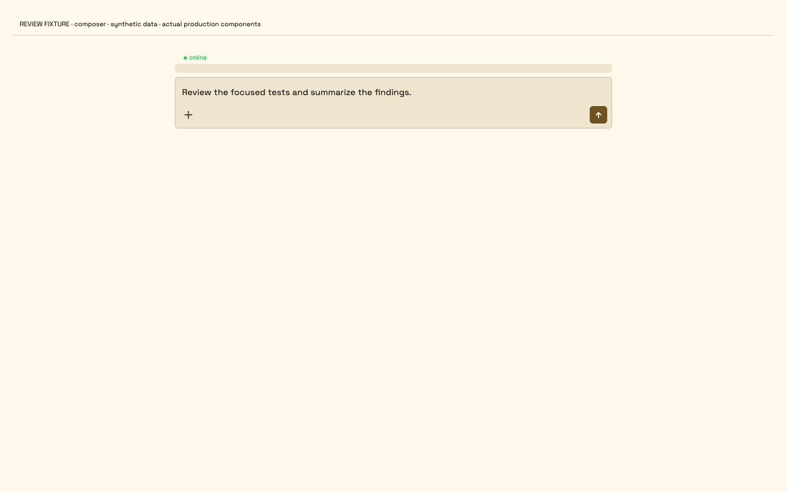</a>

**synthetic-review · light · 390×844**

<a href="composer-synthetic-review-light-390.png">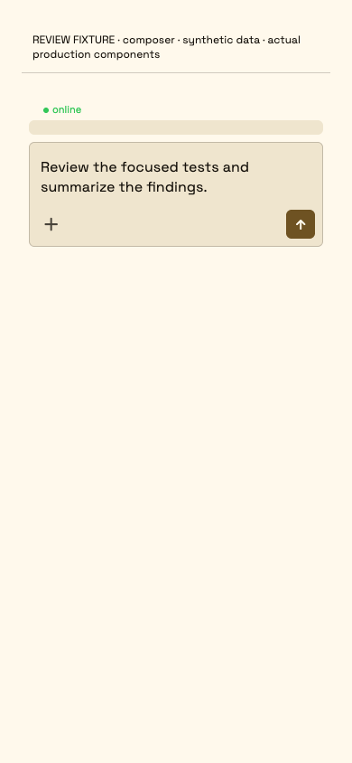</a>

**synthetic-review · dark · 1440×900**

<a href="composer-synthetic-review-dark-1440.png">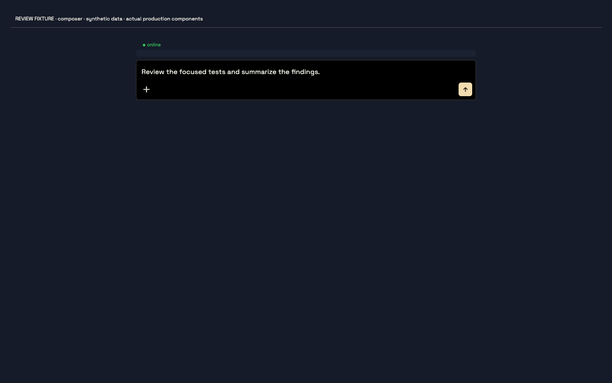</a>

**synthetic-review · dark · 390×844**

<a href="composer-synthetic-review-dark-390.png">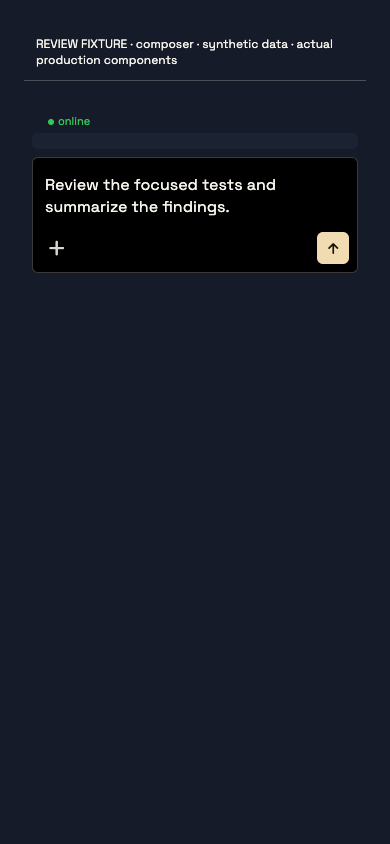</a>

## Native Markdown, code and terminal renderers

**Changed presentation:** Native text renderers use Space Grotesk and JetBrains Mono with themed code and terminal surfaces.

**Evidence:** `component-fixture`. States: synthetic-review.

**Production owners:** `components/markdown/MarkdownView.tsx`, `components/CodeView.tsx`, `components/CommandView.tsx`.

- Synthetic service/state boundaries; React Native Web adapter; not authenticated live or installed native evidence.
- RPC, storage, authentication, navigation, native glass, keyboard, gestures and animation clocks use deterministic fixture boundaries. Actual target components, theme, Typography, catalogs and font assets are imported. No account data is used. Session online status uses the actual production useSessionStatus export; other session identity/resume helpers retain fixture boundaries.
- Native renderer hosted in DOM only. Installed iOS/Android text metrics, alpha masks, shimmer motion, keyboard and platform glass remain unverified. Shimmer alpha mask is replaced by its mask element for the still.

Fixture environment: [source graph and adapters](environment-chat.json).

| State | Theme | Viewport | Screenshot |
|---|---|---|---|
| synthetic-review | light | 1440×900 | [Open full screenshot](native-text-synthetic-review-light-1440.png) |
| synthetic-review | light | 390×844 | [Open full screenshot](native-text-synthetic-review-light-390.png) |
| synthetic-review | dark | 1440×900 | [Open full screenshot](native-text-synthetic-review-dark-1440.png) |
| synthetic-review | dark | 390×844 | [Open full screenshot](native-text-synthetic-review-dark-390.png) |

Show every screenshot for this panel

**synthetic-review · light · 1440×900**

<a href="native-text-synthetic-review-light-1440.png">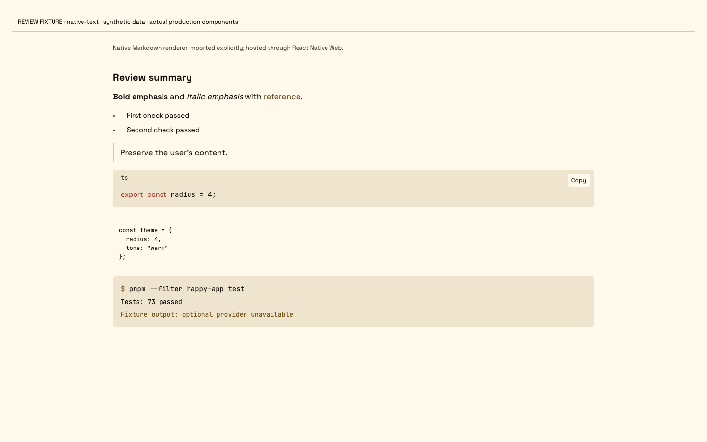</a>

**synthetic-review · light · 390×844**

<a href="native-text-synthetic-review-light-390.png">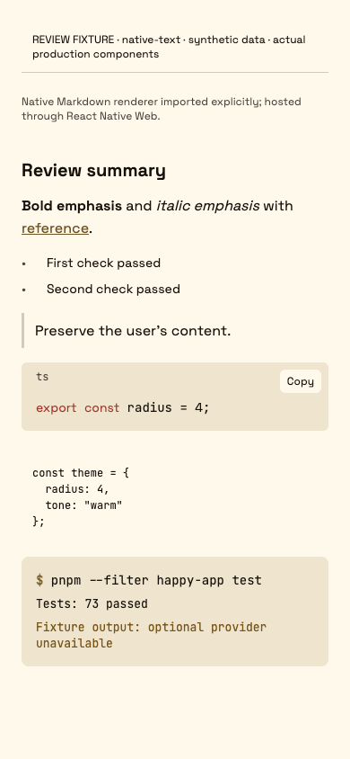</a>

**synthetic-review · dark · 1440×900**

<a href="native-text-synthetic-review-dark-1440.png">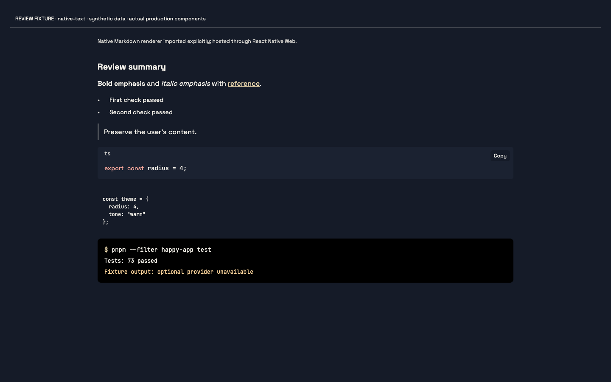</a>

**synthetic-review · dark · 390×844**

<a href="native-text-synthetic-review-dark-390.png">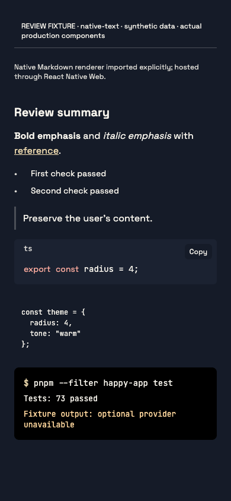</a>

## Shared button and item states

**Changed presentation:** Buttons and item groups use KILV borders, radii, colors and typography across action states.

**Evidence:** `component-fixture`. States: synthetic-review.

**Production owners:** `components/RoundButton.tsx`, `components/Item.tsx`, `components/ItemGroup.tsx`.

- Synthetic service/state boundaries; React Native Web adapter; not authenticated live or installed native evidence.
- RPC, storage, authentication, navigation, native glass, keyboard, gestures and animation clocks use deterministic fixture boundaries. Actual target components, theme, Typography, catalogs and font assets are imported. No account data is used. Session online status uses the actual production useSessionStatus export; other session identity/resume helpers retain fixture boundaries.

Fixture environment: [source graph and adapters](environment-chat.json).

| State | Theme | Viewport | Screenshot |
|---|---|---|---|
| synthetic-review | light | 1440×900 | [Open full screenshot](controls-synthetic-review-light-1440.png) |
| synthetic-review | light | 390×844 | [Open full screenshot](controls-synthetic-review-light-390.png) |
| synthetic-review | dark | 1440×900 | [Open full screenshot](controls-synthetic-review-dark-1440.png) |
| synthetic-review | dark | 390×844 | [Open full screenshot](controls-synthetic-review-dark-390.png) |

Show every screenshot for this panel

**synthetic-review · light · 1440×900**

<a href="controls-synthetic-review-light-1440.png">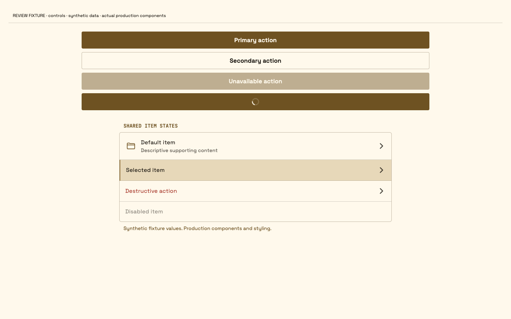</a>

**synthetic-review · light · 390×844**

<a href="controls-synthetic-review-light-390.png">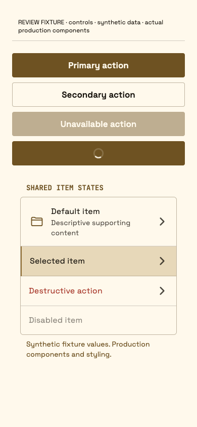</a>

**synthetic-review · dark · 1440×900**

<a href="controls-synthetic-review-dark-1440.png">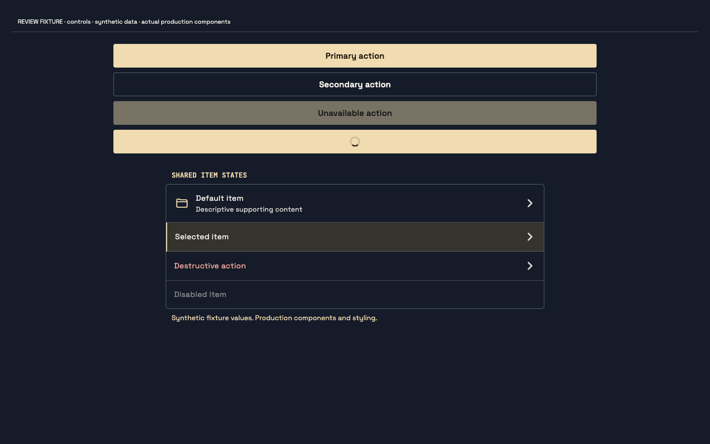</a>

**synthetic-review · dark · 390×844**

<a href="controls-synthetic-review-dark-390.png">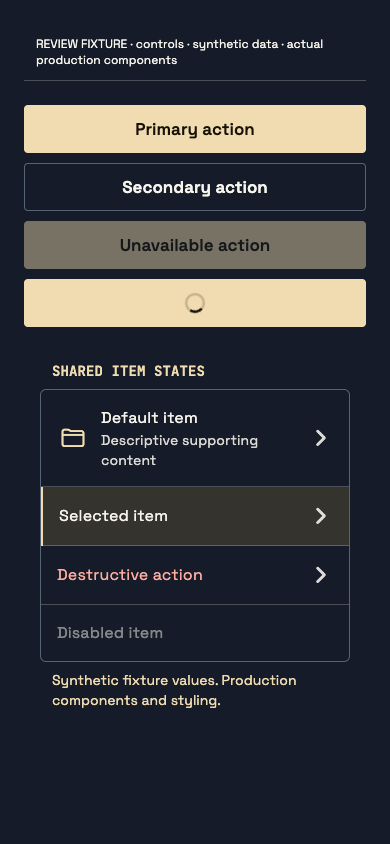</a>

## Text entry modal

**Changed presentation:** Prompt content and input use shared typography, themed surfaces and focus styling.

**Evidence:** `component-fixture`. States: synthetic-review.

**Production owners:** `modal/components/BaseModal.tsx`, `modal/components/WebPromptModal.tsx`.

- Synthetic service/state boundaries; React Native Web adapter; not authenticated live or installed native evidence.
- RPC, storage, authentication, navigation, native glass, keyboard, gestures and animation clocks use deterministic fixture boundaries. Actual target components, theme, Typography, catalogs and font assets are imported. No account data is used. Session online status uses the actual production useSessionStatus export; other session identity/resume helpers retain fixture boundaries.

Fixture environment: [source graph and adapters](environment-chat.json).

| State | Theme | Viewport | Screenshot |
|---|---|---|---|
| synthetic-review | light | 1440×900 | [Open full screenshot](prompt-synthetic-review-light-1440.png) |
| synthetic-review | light | 390×844 | [Open full screenshot](prompt-synthetic-review-light-390.png) |
| synthetic-review | dark | 1440×900 | [Open full screenshot](prompt-synthetic-review-dark-1440.png) |
| synthetic-review | dark | 390×844 | [Open full screenshot](prompt-synthetic-review-dark-390.png) |

Show every screenshot for this panel

**synthetic-review · light · 1440×900**

<a href="prompt-synthetic-review-light-1440.png">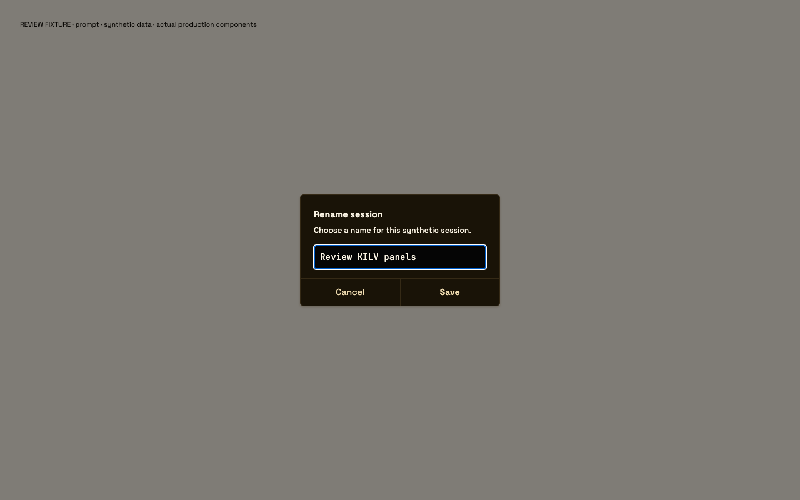</a>

**synthetic-review · light · 390×844**

<a href="prompt-synthetic-review-light-390.png">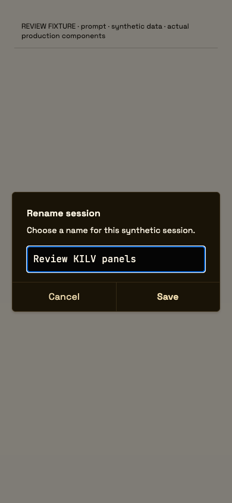</a>

**synthetic-review · dark · 1440×900**

<a href="prompt-synthetic-review-dark-1440.png">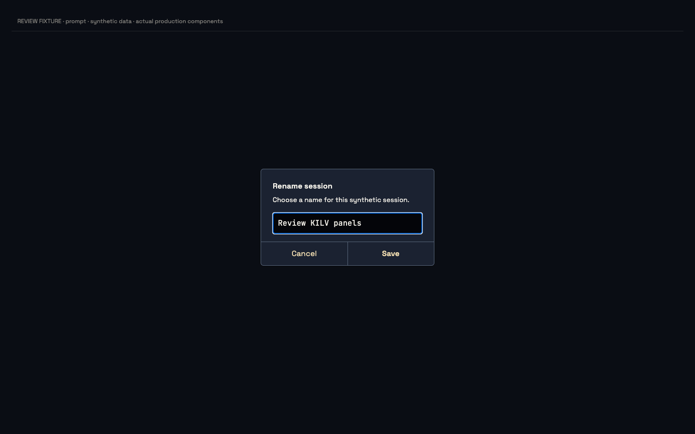</a>

**synthetic-review · dark · 390×844**

<a href="prompt-synthetic-review-dark-390.png">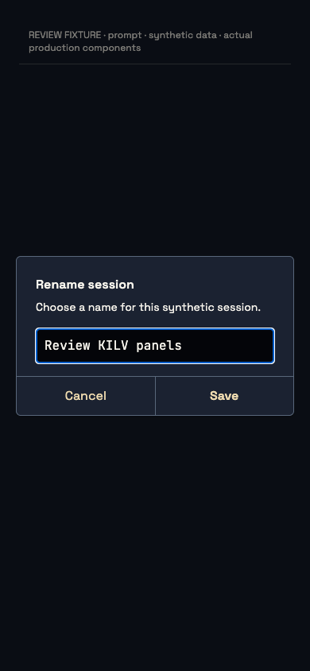</a>

