# Production panel screenshots

Production source revision: `a38fae51c2f99d34bc4d81b24ccfd4c7aa611b05`. These are after-change screenshots for [PR #289](https://github.com/NickGuAI/HappyHerd/pull/289).

**Evidence boundary:** production-export means the actual exported Web UI on an isolated local host with its backend offline. Component-fixture means real production components with synthetic service/state boundaries and documented Web platform adapters. Neither proves authenticated live journeys, physical iPhone behavior, or installed native clients.

## Signed-out landing

**Changed presentation:** KILV welcome artwork, warm light/dark backgrounds, Space Grotesk headings and shared primary actions.

**Evidence:** `production-export`. States: default.

**Production owners:** `app/(app)/index.tsx`, `app/(app)/_layout.tsx`, `app/_layout.tsx`, `app/+html.tsx`, `components/navigation/Header.tsx`, `components/RoundButton.tsx`.

- Unmodified exported production UI on an isolated loopback static host; backend offline; not deployed/authenticated evidence.

| State | Theme | Viewport | Screenshot |
|---|---|---|---|
| default | light | 1440×900 | [Open full screenshot](landing-default-light-1440.png) |
| default | light | 390×844 | [Open full screenshot](landing-default-light-390.png) |
| default | dark | 1440×900 | [Open full screenshot](landing-default-dark-1440.png) |
| default | dark | 390×844 | [Open full screenshot](landing-default-dark-390.png) |

Show every screenshot for this panel

**default · light · 1440×900**

<a href="landing-default-light-1440.png">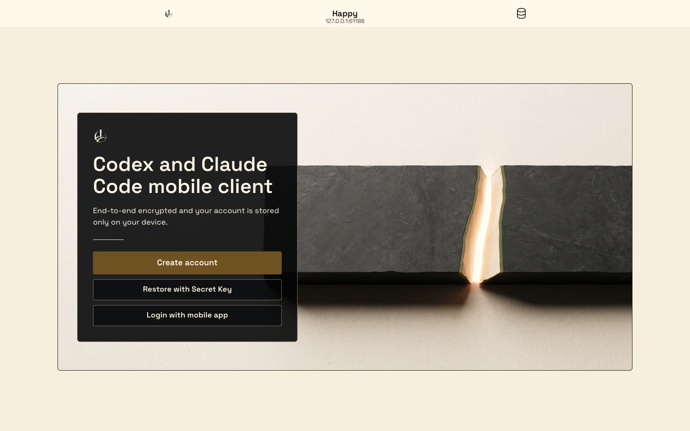</a>

**default · light · 390×844**

<a href="landing-default-light-390.png">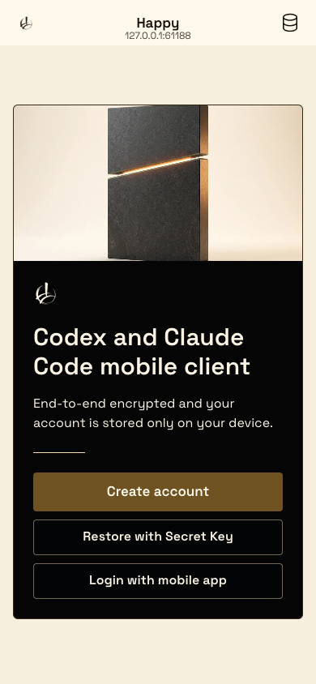</a>

**default · dark · 1440×900**

<a href="landing-default-dark-1440.png">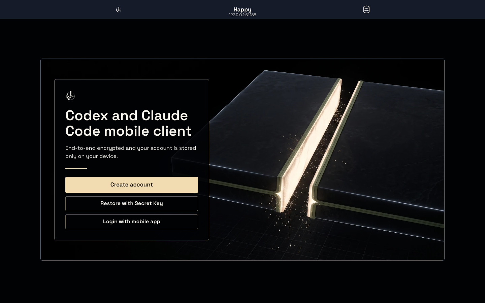</a>

**default · dark · 390×844**

<a href="landing-default-dark-390.png">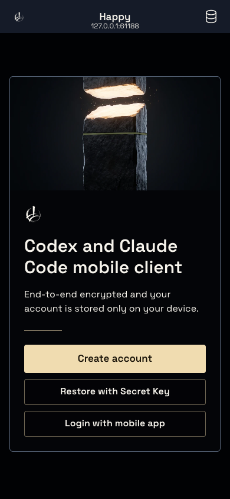</a>

## Restore with Secret Key

**Changed presentation:** Themed secret-key form, readable mobile input and KILV restore action.

**Evidence:** `production-export`. States: draft.

**Production owners:** `app/(app)/restore/manual.tsx`.

- Unmodified exported production UI on an isolated loopback static host; backend offline; not deployed/authenticated evidence.

| State | Theme | Viewport | Screenshot |
|---|---|---|---|
| draft | light | 1440×900 | [Open full screenshot](restore-key-draft-light-1440.png) |
| draft | light | 390×844 | [Open full screenshot](restore-key-draft-light-390.png) |
| draft | dark | 1440×900 | [Open full screenshot](restore-key-draft-dark-1440.png) |
| draft | dark | 390×844 | [Open full screenshot](restore-key-draft-dark-390.png) |

Show every screenshot for this panel

**draft · light · 1440×900**

<a href="restore-key-draft-light-1440.png">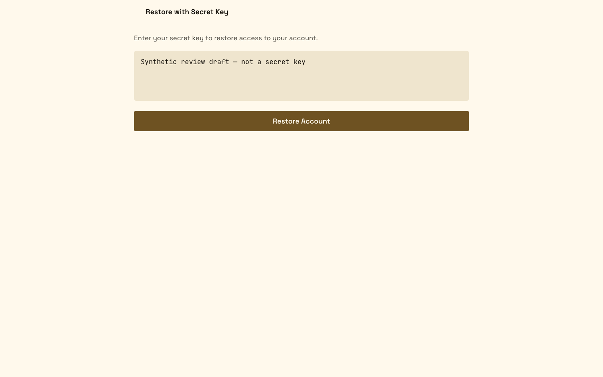</a>

**draft · light · 390×844**

<a href="restore-key-draft-light-390.png">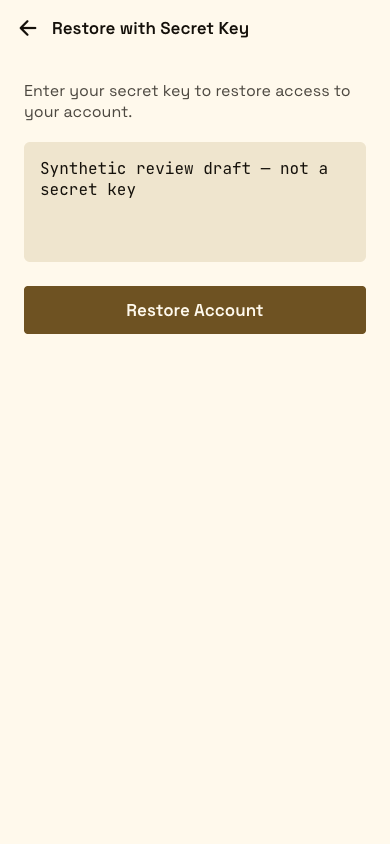</a>

**draft · dark · 1440×900**

<a href="restore-key-draft-dark-1440.png">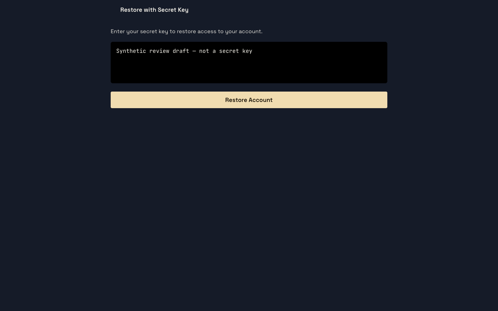</a>

**draft · dark · 390×844**

<a href="restore-key-draft-dark-390.png">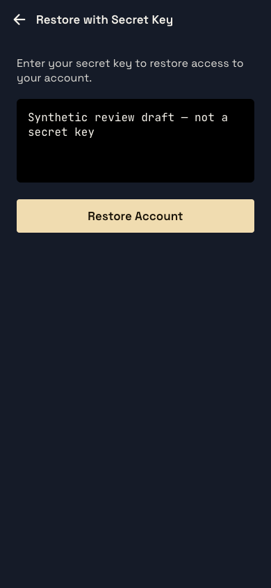</a>

## Link a mobile device

**Changed presentation:** KILV pairing instructions and alternate restore action; offline pairing state is shown.

**Evidence:** `production-export`. States: offline.

**Production owners:** `app/(app)/restore/index.tsx`.

- Unmodified exported production UI on an isolated loopback static host; backend offline; not deployed/authenticated evidence.
- The offline endpoint cannot issue/complete a QR pairing request; no ready/authenticated QR state is claimed.

| State | Theme | Viewport | Screenshot |
|---|---|---|---|
| offline | light | 1440×900 | [Open full screenshot](restore-device-offline-light-1440.png) |
| offline | light | 390×844 | [Open full screenshot](restore-device-offline-light-390.png) |
| offline | dark | 1440×900 | [Open full screenshot](restore-device-offline-dark-1440.png) |
| offline | dark | 390×844 | [Open full screenshot](restore-device-offline-dark-390.png) |

Show every screenshot for this panel

**offline · light · 1440×900**

<a href="restore-device-offline-light-1440.png">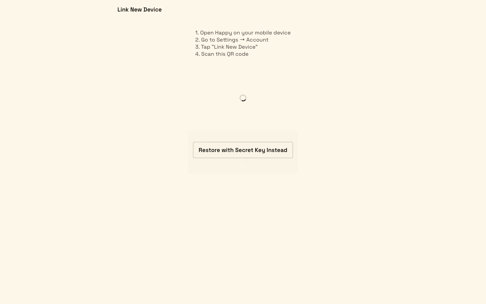</a>

**offline · light · 390×844**

<a href="restore-device-offline-light-390.png">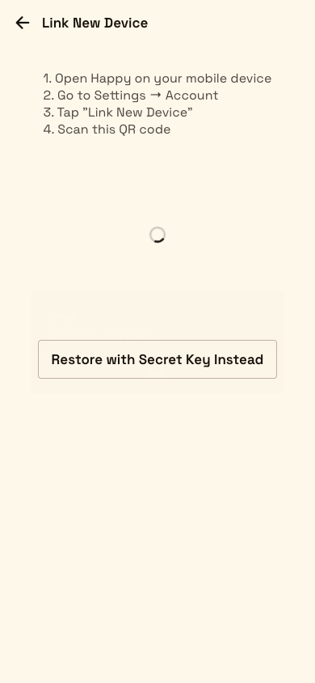</a>

**offline · dark · 1440×900**

<a href="restore-device-offline-dark-1440.png">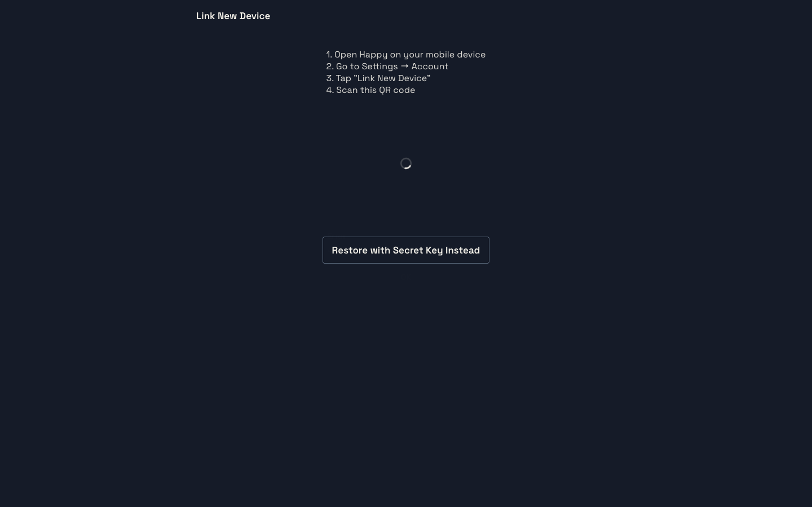</a>

**offline · dark · 390×844**

<a href="restore-device-offline-dark-390.png">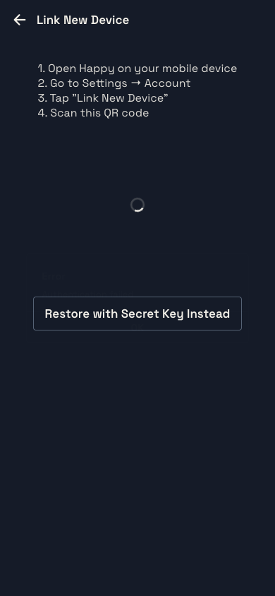</a>

## Server configuration

**Changed presentation:** KILV grouped server form, URL input and readable settings actions.

**Evidence:** `production-export`. States: draft.

**Production owners:** `app/(app)/server.tsx`, `components/ItemGroup.tsx`.

- Unmodified exported production UI on an isolated loopback static host; backend offline; not deployed/authenticated evidence.
- Server change was not submitted.

| State | Theme | Viewport | Screenshot |
|---|---|---|---|
| draft | light | 1440×900 | [Open full screenshot](server-config-draft-light-1440.png) |
| draft | light | 390×844 | [Open full screenshot](server-config-draft-light-390.png) |
| draft | dark | 1440×900 | [Open full screenshot](server-config-draft-dark-1440.png) |
| draft | dark | 390×844 | [Open full screenshot](server-config-draft-dark-390.png) |

Show every screenshot for this panel

**draft · light · 1440×900**

<a href="server-config-draft-light-1440.png">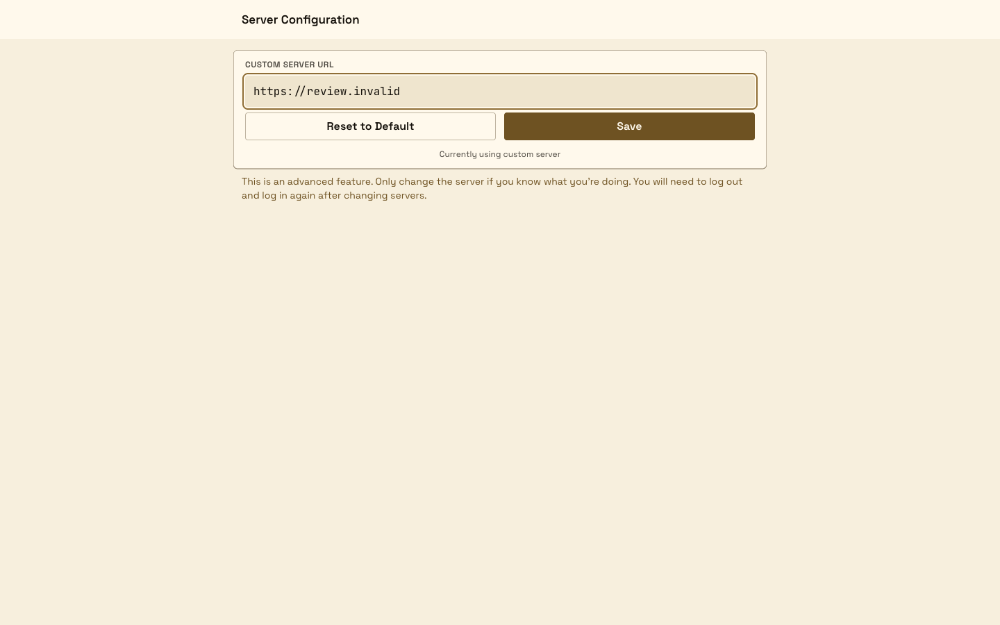</a>

**draft · light · 390×844**

<a href="server-config-draft-light-390.png">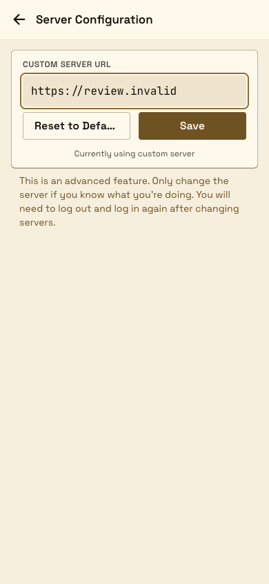</a>

**draft · dark · 1440×900**

<a href="server-config-draft-dark-1440.png">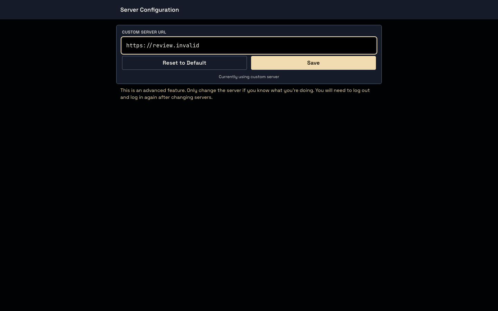</a>

**draft · dark · 390×844**

<a href="server-config-draft-dark-390.png">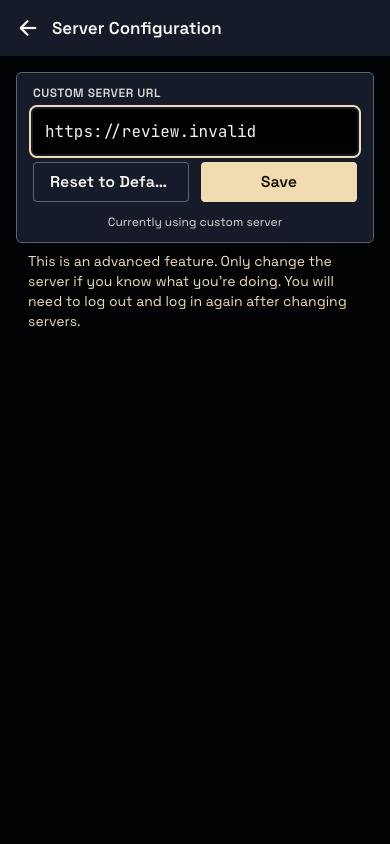</a>

## Changelog with KILV release entry

**Changed presentation:** KILV release-note typography and grouped Markdown surfaces, including the terminal input layout fix.

**Evidence:** `production-export`. States: latest-entries.

**Production owners:** `app/(app)/changelog.tsx`, `changelog/changelog.json`, `components/markdown/MarkdownView.web.tsx`.

- Unmodified exported production UI on an isolated loopback static host; backend offline; not deployed/authenticated evidence.

| State | Theme | Viewport | Screenshot |
|---|---|---|---|
| latest-entries | light | 1440×900 | [Open full screenshot](changelog-latest-entries-light-1440.png) |
| latest-entries | light | 390×844 | [Open full screenshot](changelog-latest-entries-light-390.png) |
| latest-entries | dark | 1440×900 | [Open full screenshot](changelog-latest-entries-dark-1440.png) |
| latest-entries | dark | 390×844 | [Open full screenshot](changelog-latest-entries-dark-390.png) |

Show every screenshot for this panel

**latest-entries · light · 1440×900**

<a href="changelog-latest-entries-light-1440.png">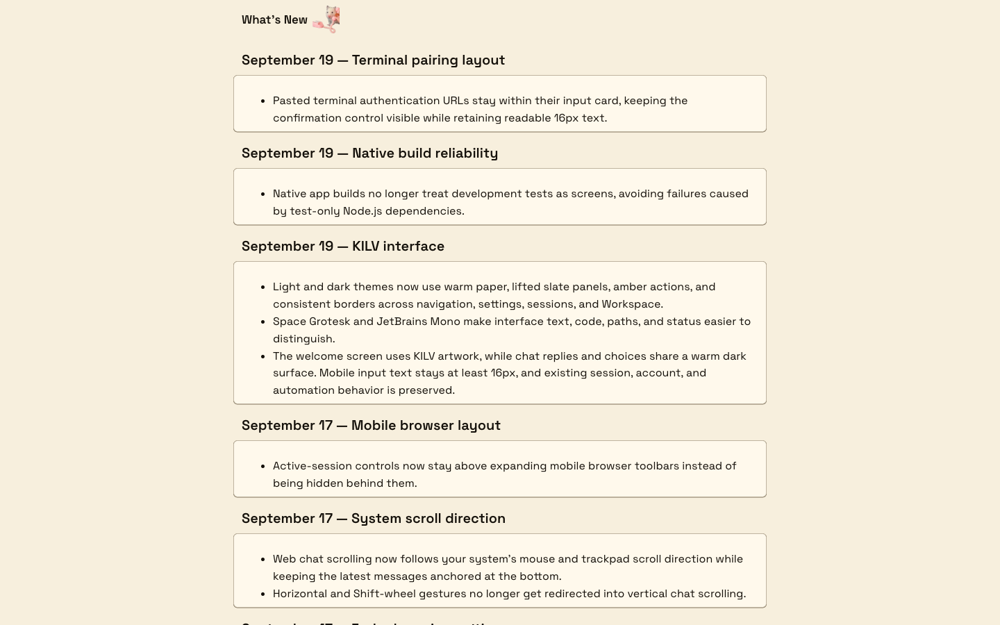</a>

**latest-entries · light · 390×844**

<a href="changelog-latest-entries-light-390.png">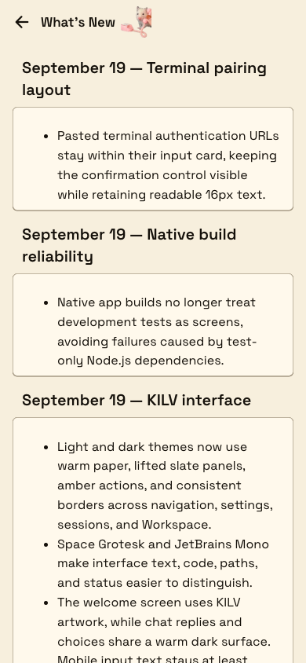</a>

**latest-entries · dark · 1440×900**

<a href="changelog-latest-entries-dark-1440.png">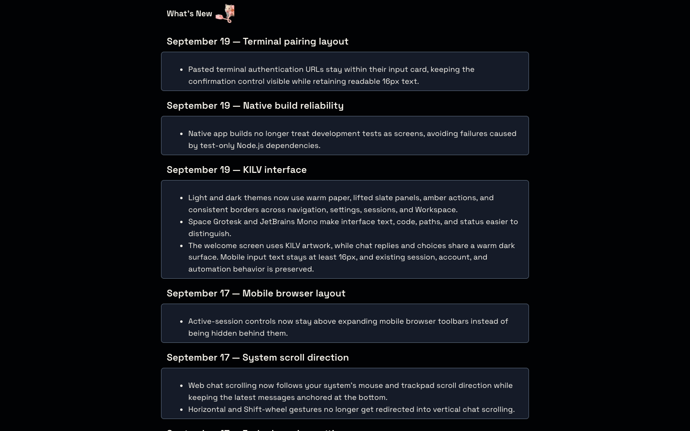</a>

**latest-entries · dark · 390×844**

<a href="changelog-latest-entries-dark-390.png">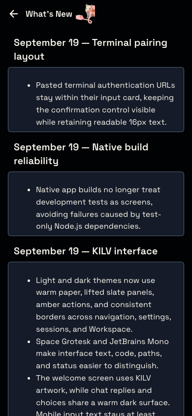</a>

