# Routes panel screenshots

Production source revision: `a38fae51c2f99d34bc4d81b24ccfd4c7aa611b05`. These are after-change screenshots for [PR #289](https://github.com/NickGuAI/HappyHerd/pull/289).

**Evidence boundary:** production-export means the actual exported Web UI on an isolated local host with its backend offline. Component-fixture means real production components with synthetic service/state boundaries and documented Web platform adapters. Neither proves authenticated live journeys, physical iPhone behavior, or installed native clients.

## Artifacts

**Changed presentation:** Space Grotesk artifact-list copy and KILV list/empty-state presentation.

**Evidence:** `component-fixture`. States: populated.

**Production owners:** `app/(app)/artifacts/index.tsx`.

- Synthetic service/state boundaries; React Native Web adapter; not authenticated live or installed native evidence.
- Expo Router Stack.Screen options are registered but its native navigation header is outside this component fixture.

Fixture environment: [source graph and adapters](environment-routes.json).

| State | Theme | Viewport | Screenshot |
|---|---|---|---|
| populated | light | 1440×1000 | [Open full screenshot](artifacts-populated-light-1440.png) |
| populated | light | 390×844 | [Open full screenshot](artifacts-populated-light-390.png) |
| populated | dark | 1440×1000 | [Open full screenshot](artifacts-populated-dark-1440.png) |
| populated | dark | 390×844 | [Open full screenshot](artifacts-populated-dark-390.png) |

Show every screenshot for this panel

**populated · light · 1440×1000**

<a href="artifacts-populated-light-1440.png">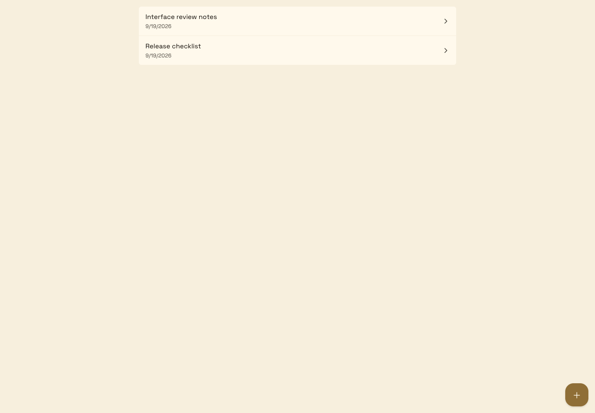</a>

**populated · light · 390×844**

<a href="artifacts-populated-light-390.png">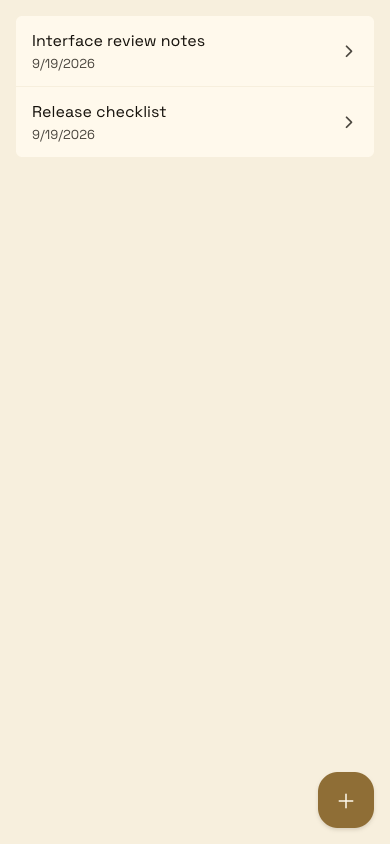</a>

**populated · dark · 1440×1000**

<a href="artifacts-populated-dark-1440.png">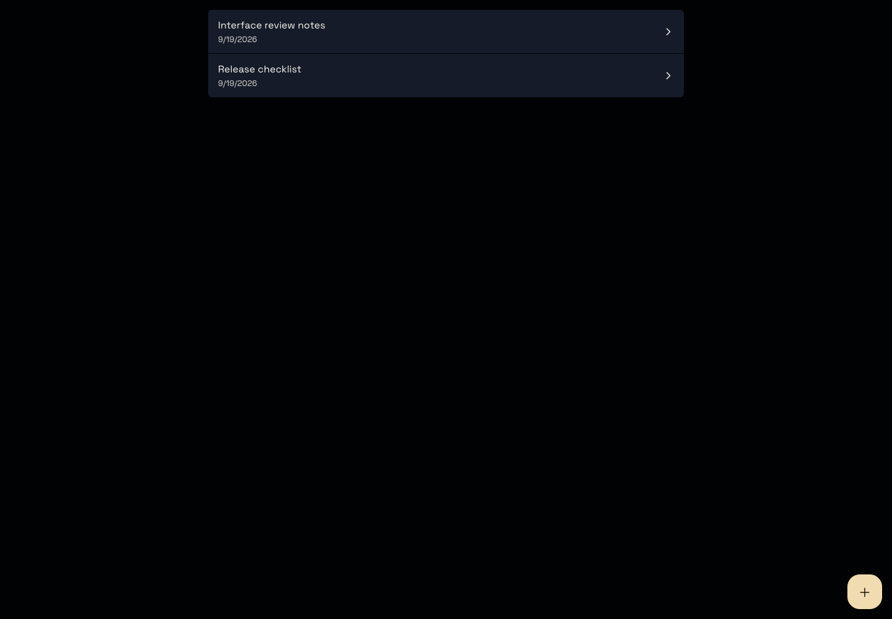</a>

**populated · dark · 390×844**

<a href="artifacts-populated-dark-390.png">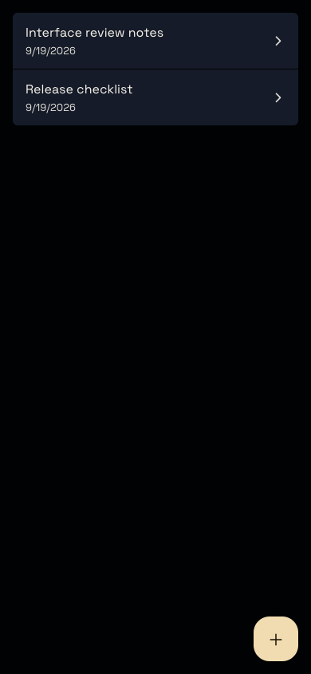</a>

## Artifact details

**Changed presentation:** KILV artifact title, metadata and rendered content presentation.

**Evidence:** `component-fixture`. States: populated.

**Production owners:** `app/(app)/artifacts/[id].tsx`.

- Synthetic service/state boundaries; React Native Web adapter; not authenticated live or installed native evidence.
- Expo Router Stack.Screen options are registered but its native navigation header is outside this component fixture.

Fixture environment: [source graph and adapters](environment-routes.json).

| State | Theme | Viewport | Screenshot |
|---|---|---|---|
| populated | light | 1440×1000 | [Open full screenshot](artifact-populated-light-1440.png) |
| populated | light | 390×844 | [Open full screenshot](artifact-populated-light-390.png) |
| populated | dark | 1440×1000 | [Open full screenshot](artifact-populated-dark-1440.png) |
| populated | dark | 390×844 | [Open full screenshot](artifact-populated-dark-390.png) |

Show every screenshot for this panel

**populated · light · 1440×1000**

<a href="artifact-populated-light-1440.png">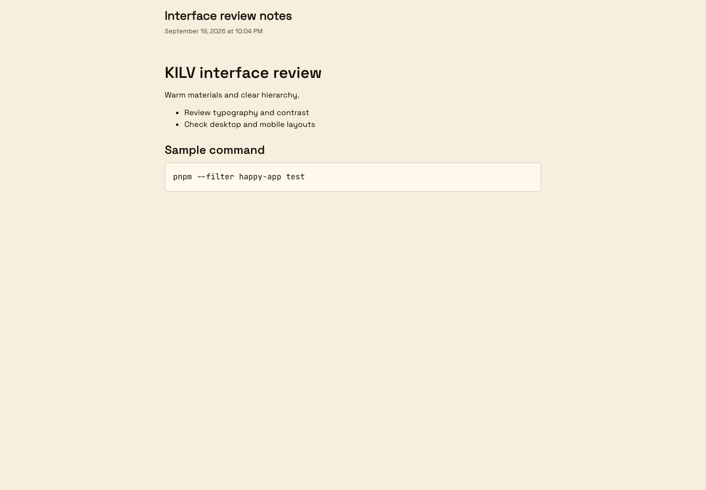</a>

**populated · light · 390×844**

<a href="artifact-populated-light-390.png">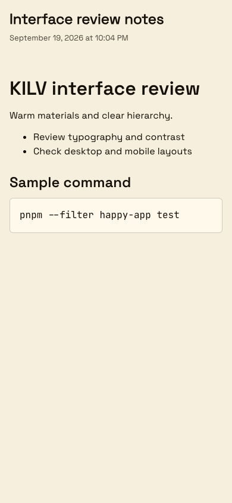</a>

**populated · dark · 1440×1000**

<a href="artifact-populated-dark-1440.png">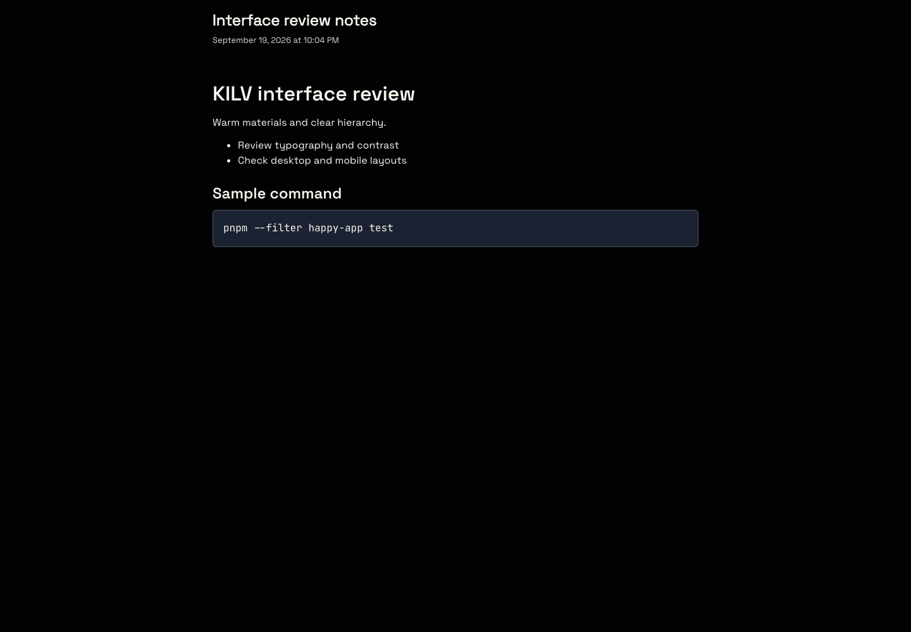</a>

**populated · dark · 390×844**

<a href="artifact-populated-dark-390.png">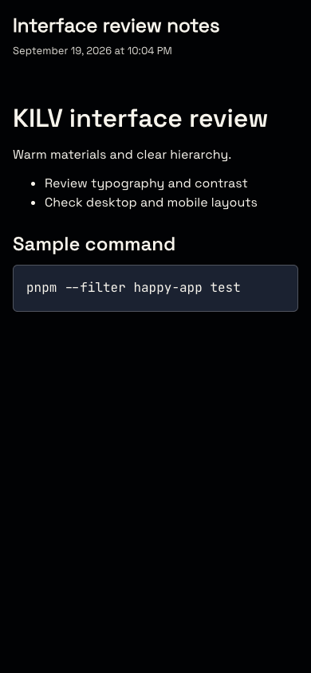</a>

## New artifact editor

**Changed presentation:** KILV typography and themed input/editor presentation for a new artifact.

**Evidence:** `component-fixture`. States: populated.

**Production owners:** `app/(app)/artifacts/new.tsx`.

- Synthetic service/state boundaries; React Native Web adapter; not authenticated live or installed native evidence.
- Expo Router Stack.Screen options are registered but its native navigation header is outside this component fixture.

Fixture environment: [source graph and adapters](environment-routes.json).

| State | Theme | Viewport | Screenshot |
|---|---|---|---|
| populated | light | 1440×1000 | [Open full screenshot](artifact-new-populated-light-1440.png) |
| populated | light | 390×844 | [Open full screenshot](artifact-new-populated-light-390.png) |
| populated | dark | 1440×1000 | [Open full screenshot](artifact-new-populated-dark-1440.png) |
| populated | dark | 390×844 | [Open full screenshot](artifact-new-populated-dark-390.png) |

Show every screenshot for this panel

**populated · light · 1440×1000**

<a href="artifact-new-populated-light-1440.png">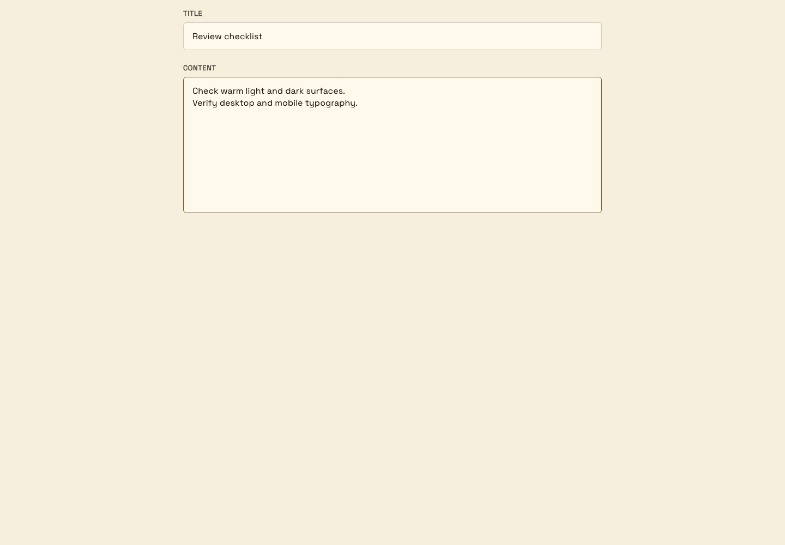</a>

**populated · light · 390×844**

<a href="artifact-new-populated-light-390.png">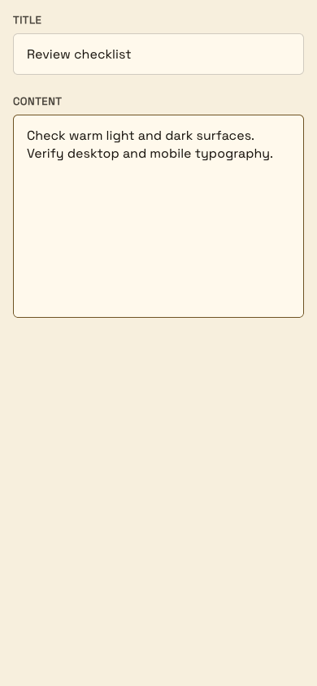</a>

**populated · dark · 1440×1000**

<a href="artifact-new-populated-dark-1440.png">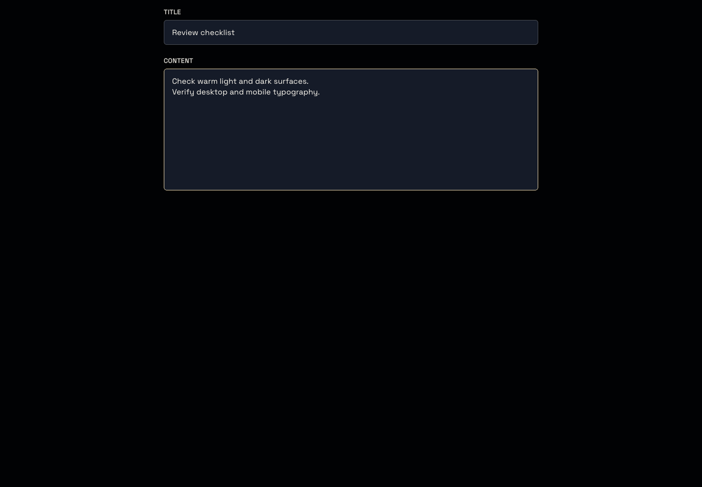</a>

**populated · dark · 390×844**

<a href="artifact-new-populated-dark-390.png">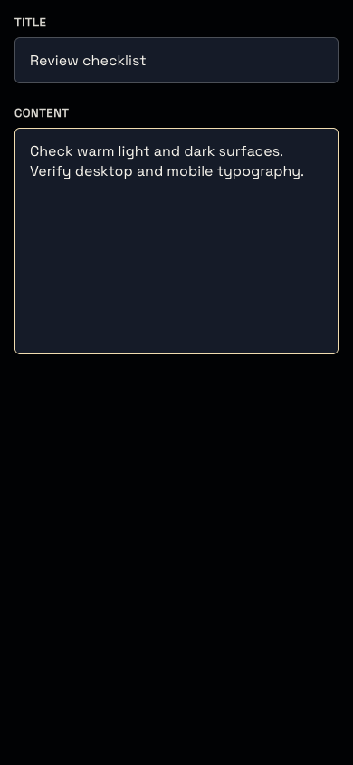</a>

## Edit artifact

**Changed presentation:** KILV typography and themed input/editor presentation for an existing artifact.

**Evidence:** `component-fixture`. States: populated.

**Production owners:** `app/(app)/artifacts/edit/[id].tsx`.

- Synthetic service/state boundaries; React Native Web adapter; not authenticated live or installed native evidence.
- Expo Router Stack.Screen options are registered but its native navigation header is outside this component fixture.

Fixture environment: [source graph and adapters](environment-routes.json).

| State | Theme | Viewport | Screenshot |
|---|---|---|---|
| populated | light | 1440×1000 | [Open full screenshot](artifact-edit-populated-light-1440.png) |
| populated | light | 390×844 | [Open full screenshot](artifact-edit-populated-light-390.png) |
| populated | dark | 1440×1000 | [Open full screenshot](artifact-edit-populated-dark-1440.png) |
| populated | dark | 390×844 | [Open full screenshot](artifact-edit-populated-dark-390.png) |

Show every screenshot for this panel

**populated · light · 1440×1000**

<a href="artifact-edit-populated-light-1440.png">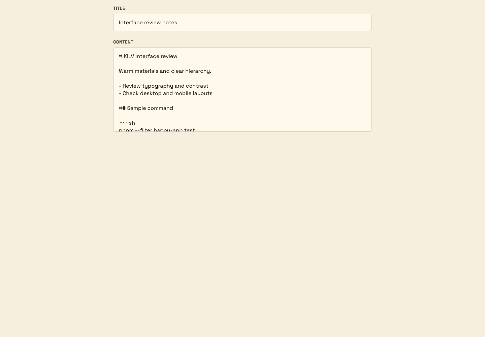</a>

**populated · light · 390×844**

<a href="artifact-edit-populated-light-390.png">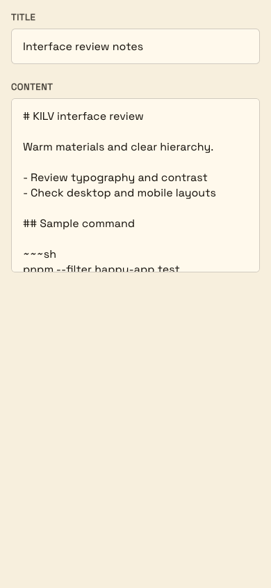</a>

**populated · dark · 1440×1000**

<a href="artifact-edit-populated-dark-1440.png">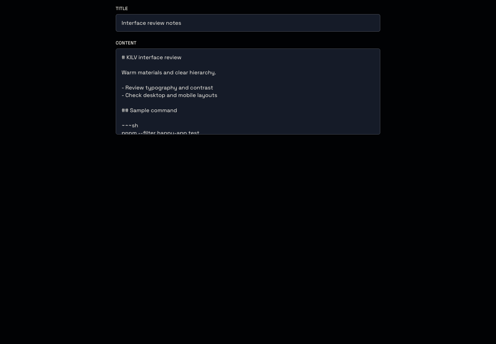</a>

**populated · dark · 390×844**

<a href="artifact-edit-populated-dark-390.png">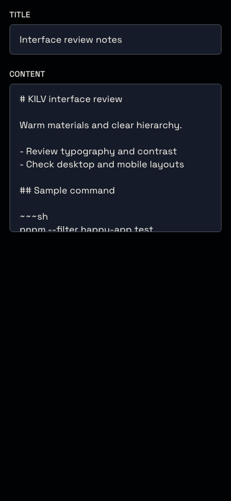</a>

## Friends

**Changed presentation:** KILV friend-list typography and grouped row presentation.

**Evidence:** `component-fixture`. States: populated.

**Production owners:** `app/(app)/friends/index.tsx`.

- Synthetic service/state boundaries; React Native Web adapter; not authenticated live or installed native evidence.
- Expo Router Stack.Screen options are registered but its native navigation header is outside this component fixture.

Fixture environment: [source graph and adapters](environment-routes.json).

| State | Theme | Viewport | Screenshot |
|---|---|---|---|
| populated | light | 1440×1000 | [Open full screenshot](friends-populated-light-1440.png) |
| populated | light | 390×844 | [Open full screenshot](friends-populated-light-390.png) |
| populated | dark | 1440×1000 | [Open full screenshot](friends-populated-dark-1440.png) |
| populated | dark | 390×844 | [Open full screenshot](friends-populated-dark-390.png) |

Show every screenshot for this panel

**populated · light · 1440×1000**

<a href="friends-populated-light-1440.png">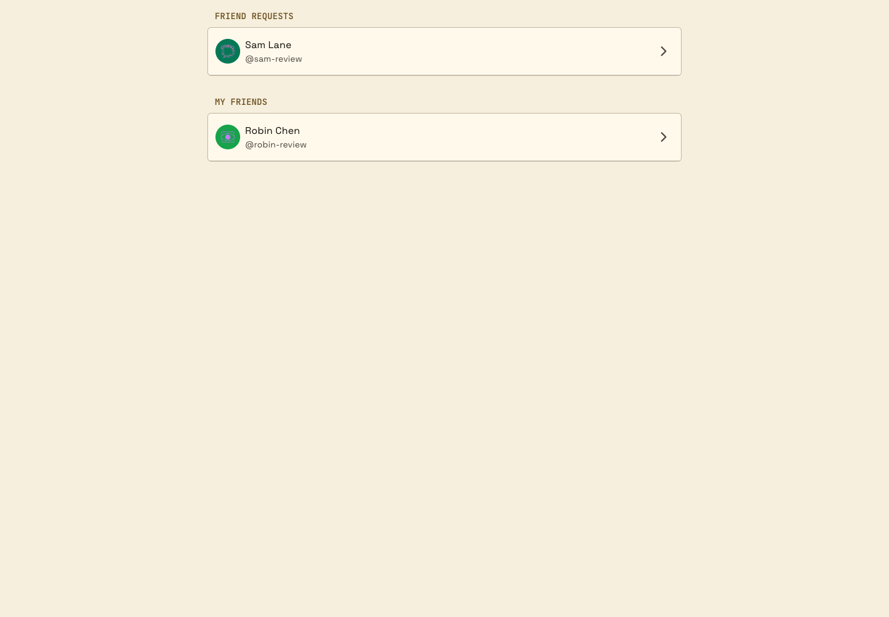</a>

**populated · light · 390×844**

<a href="friends-populated-light-390.png">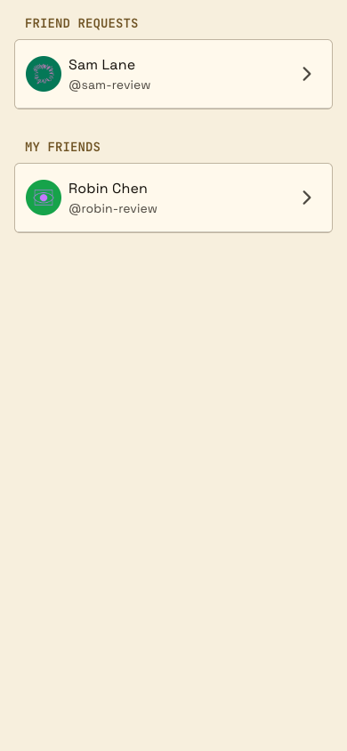</a>

**populated · dark · 1440×1000**

<a href="friends-populated-dark-1440.png">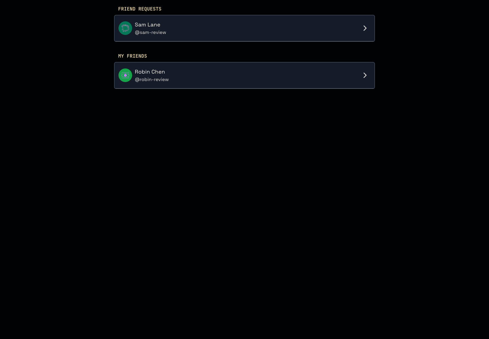</a>

**populated · dark · 390×844**

<a href="friends-populated-dark-390.png">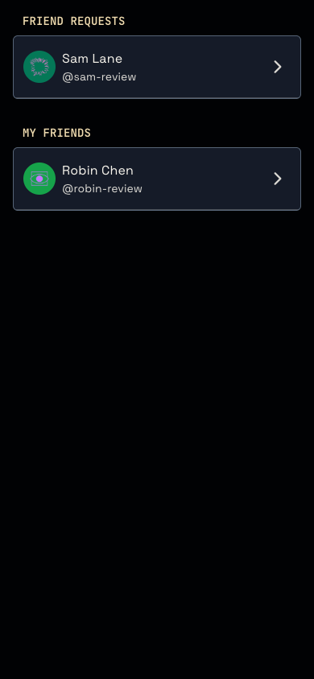</a>

## Find friends

**Changed presentation:** KILV search field, result rows and friend actions.

**Evidence:** `component-fixture`. States: populated.

**Production owners:** `app/(app)/friends/search.tsx`, `components/UserSearchResult.tsx`.

- Synthetic service/state boundaries; React Native Web adapter; not authenticated live or installed native evidence.
- Expo Router Stack.Screen options are registered but its native navigation header is outside this component fixture.

Fixture environment: [source graph and adapters](environment-routes.json).

| State | Theme | Viewport | Screenshot |
|---|---|---|---|
| populated | light | 1440×1000 | [Open full screenshot](friend-search-populated-light-1440.png) |
| populated | light | 390×844 | [Open full screenshot](friend-search-populated-light-390.png) |
| populated | dark | 1440×1000 | [Open full screenshot](friend-search-populated-dark-1440.png) |
| populated | dark | 390×844 | [Open full screenshot](friend-search-populated-dark-390.png) |

Show every screenshot for this panel

**populated · light · 1440×1000**

<a href="friend-search-populated-light-1440.png">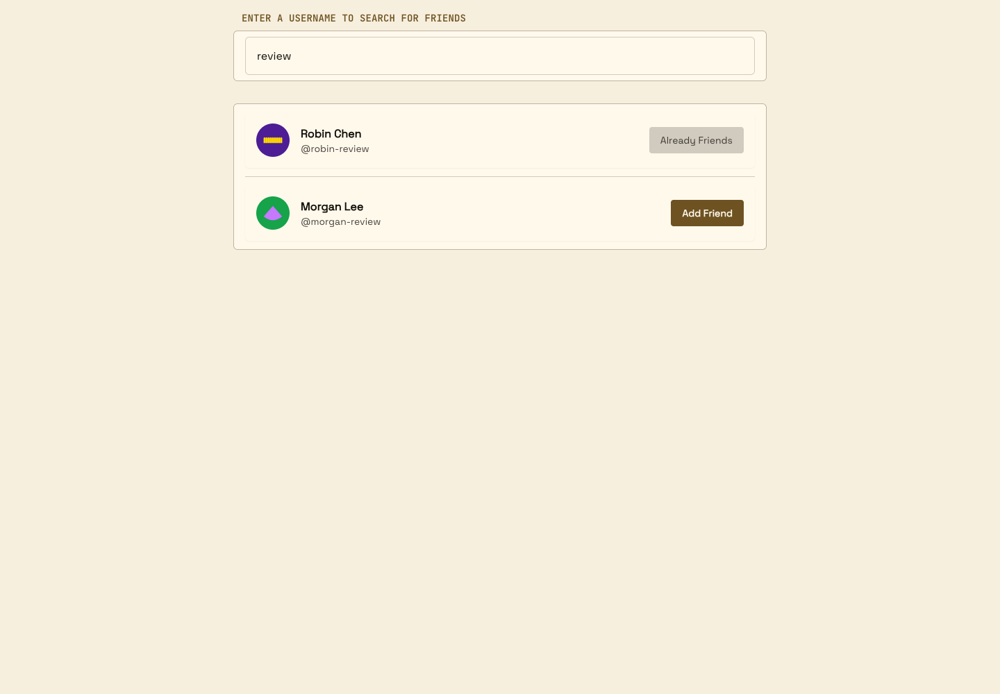</a>

**populated · light · 390×844**

<a href="friend-search-populated-light-390.png">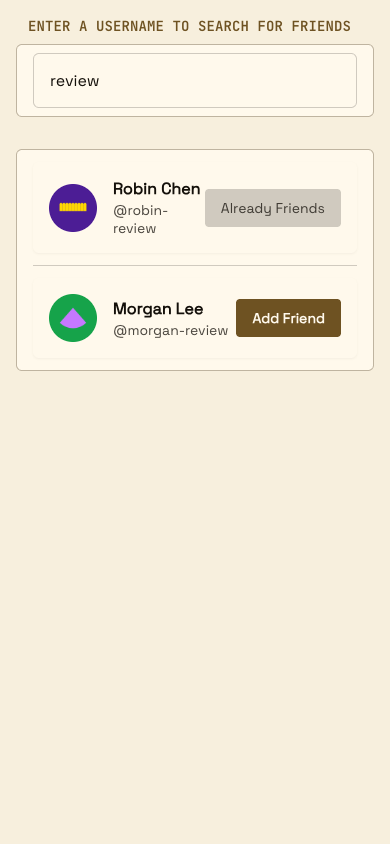</a>

**populated · dark · 1440×1000**

<a href="friend-search-populated-dark-1440.png">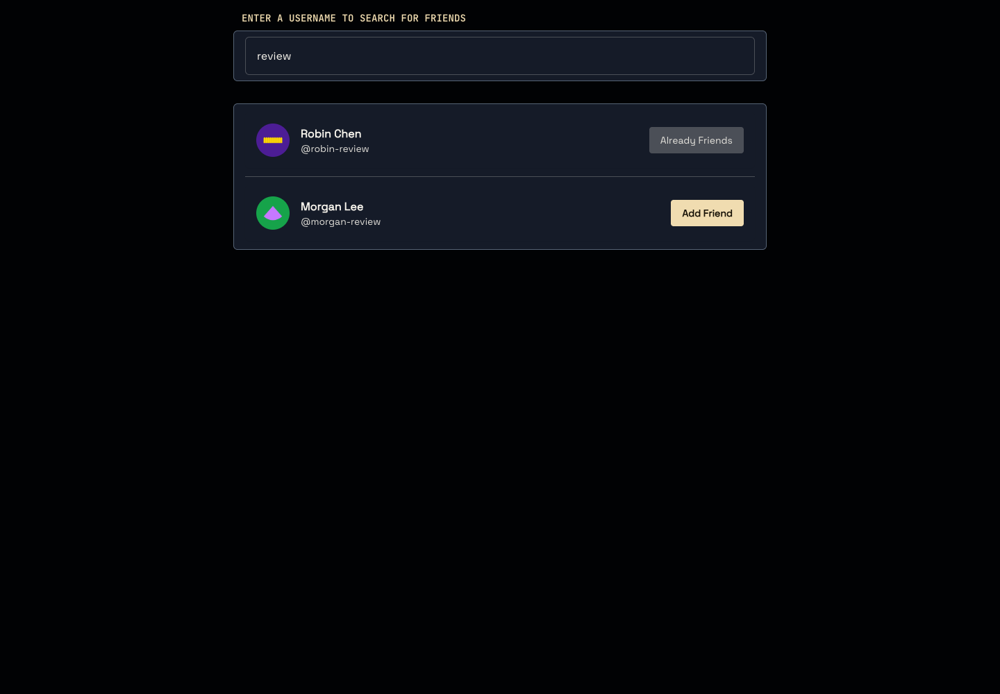</a>

**populated · dark · 390×844**

<a href="friend-search-populated-dark-390.png">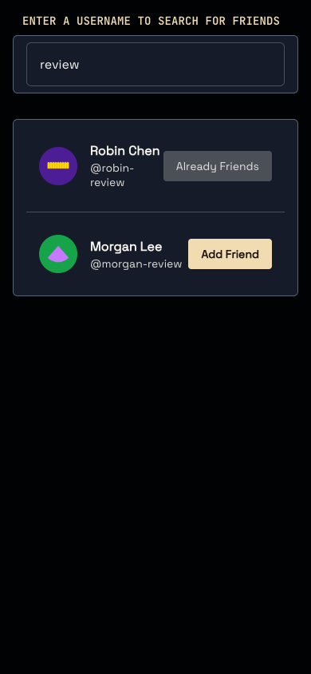</a>

## Inbox

**Changed presentation:** KILV inbox headings, activity rows and secondary text hierarchy.

**Evidence:** `component-fixture`. States: populated.

**Production owners:** `app/(app)/inbox/index.tsx`.

- Synthetic service/state boundaries; React Native Web adapter; not authenticated live or installed native evidence.
- Expo Router Stack.Screen options are registered but its native navigation header is outside this component fixture.

Fixture environment: [source graph and adapters](environment-routes.json).

| State | Theme | Viewport | Screenshot |
|---|---|---|---|
| populated | light | 1440×1000 | [Open full screenshot](inbox-populated-light-1440.png) |
| populated | light | 390×844 | [Open full screenshot](inbox-populated-light-390.png) |
| populated | dark | 1440×1000 | [Open full screenshot](inbox-populated-dark-1440.png) |
| populated | dark | 390×844 | [Open full screenshot](inbox-populated-dark-390.png) |

Show every screenshot for this panel

**populated · light · 1440×1000**

<a href="inbox-populated-light-1440.png">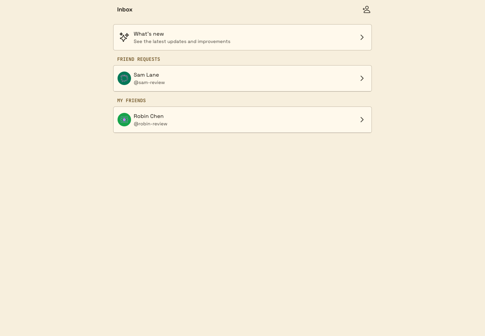</a>

**populated · light · 390×844**

<a href="inbox-populated-light-390.png">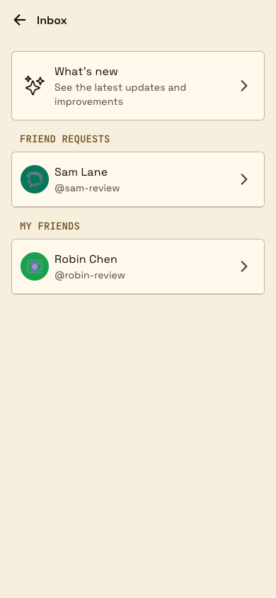</a>

**populated · dark · 1440×1000**

<a href="inbox-populated-dark-1440.png">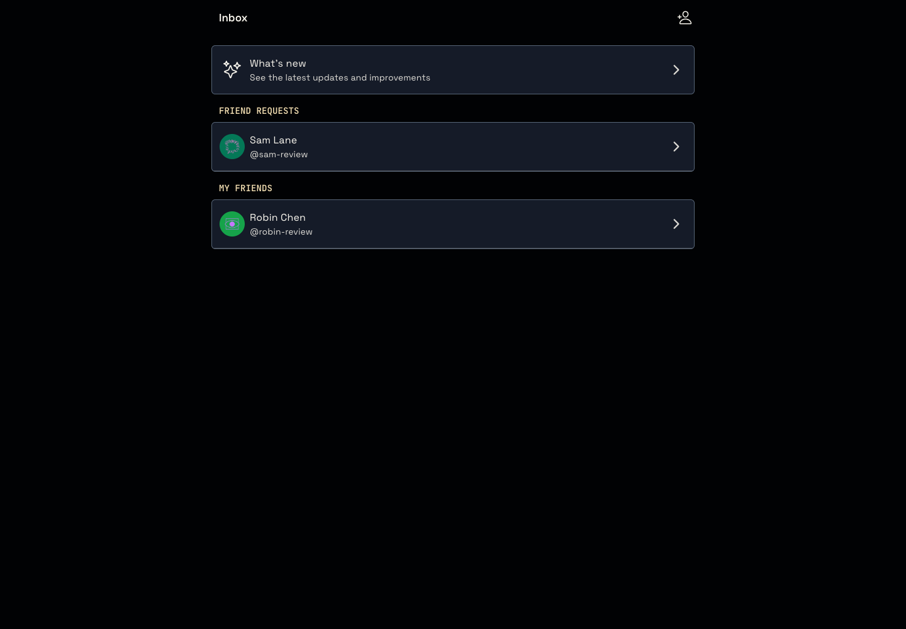</a>

**populated · dark · 390×844**

<a href="inbox-populated-dark-390.png">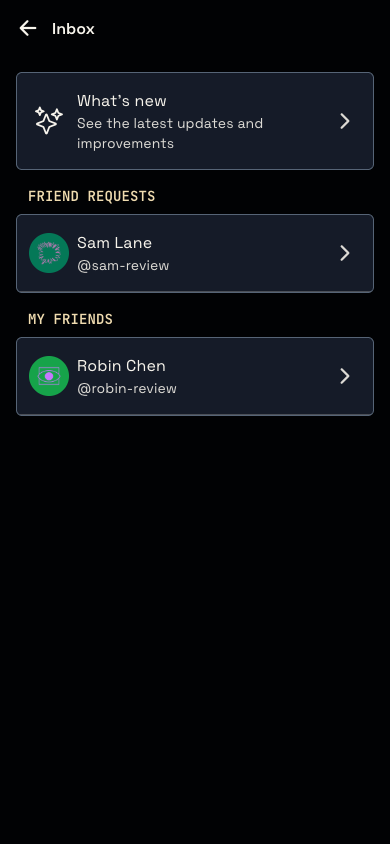</a>

## Machine details

**Changed presentation:** KILV machine settings groups, readable paths and machine action presentation.

**Evidence:** `component-fixture`. States: populated, scrolled-bottom.

**Production owners:** `app/(app)/machine/[id].tsx`.

- Synthetic service/state boundaries; React Native Web adapter; not authenticated live or installed native evidence.
- Expo Router Stack.Screen options are registered but its native navigation header is outside this component fixture.
- Scrolled to the bottom using the existing production overflow container.
- Synthetic service data; native navigation header is outside this fixture.

Fixture environment: [source graph and adapters](environment-routes.json).

| State | Theme | Viewport | Screenshot |
|---|---|---|---|
| populated | light | 1440×1000 | [Open full screenshot](machine-populated-light-1440.png) |
| scrolled-bottom | light | 1440×1000 | [Open full screenshot](machine-scrolled-bottom-light-1440.png) |
| populated | light | 390×844 | [Open full screenshot](machine-populated-light-390.png) |
| scrolled-bottom | light | 390×844 | [Open full screenshot](machine-scrolled-bottom-light-390.png) |
| populated | dark | 1440×1000 | [Open full screenshot](machine-populated-dark-1440.png) |
| scrolled-bottom | dark | 1440×1000 | [Open full screenshot](machine-scrolled-bottom-dark-1440.png) |
| populated | dark | 390×844 | [Open full screenshot](machine-populated-dark-390.png) |
| scrolled-bottom | dark | 390×844 | [Open full screenshot](machine-scrolled-bottom-dark-390.png) |

Show every screenshot for this panel

**populated · light · 1440×1000**

<a href="machine-populated-light-1440.png">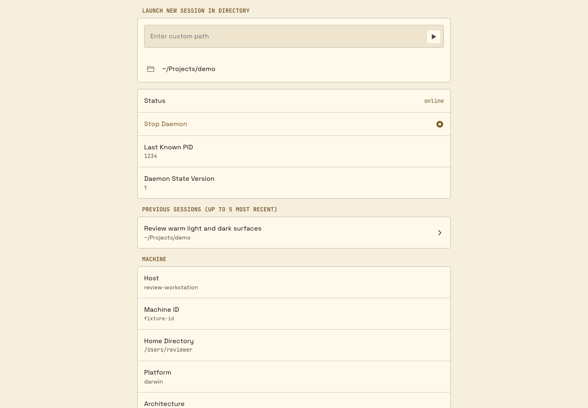</a>

**scrolled-bottom · light · 1440×1000**

<a href="machine-scrolled-bottom-light-1440.png">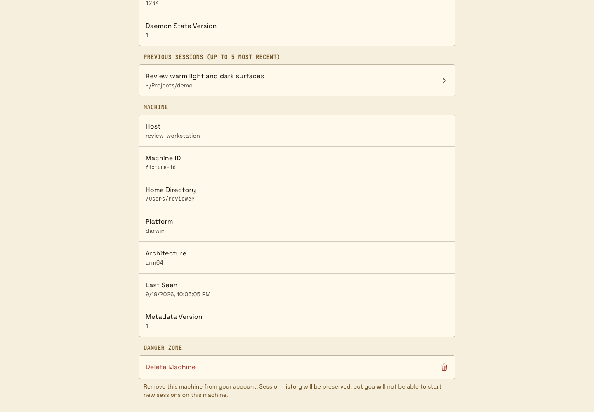</a>

**populated · light · 390×844**

<a href="machine-populated-light-390.png">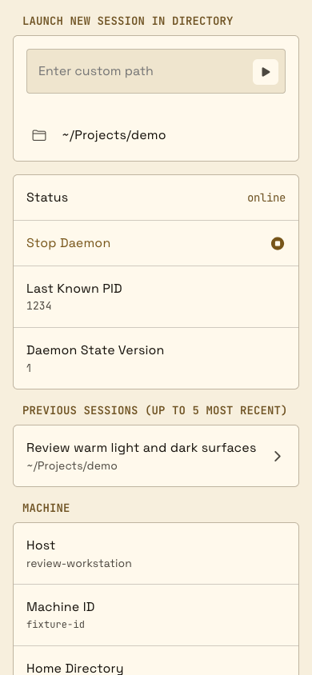</a>

**scrolled-bottom · light · 390×844**

<a href="machine-scrolled-bottom-light-390.png">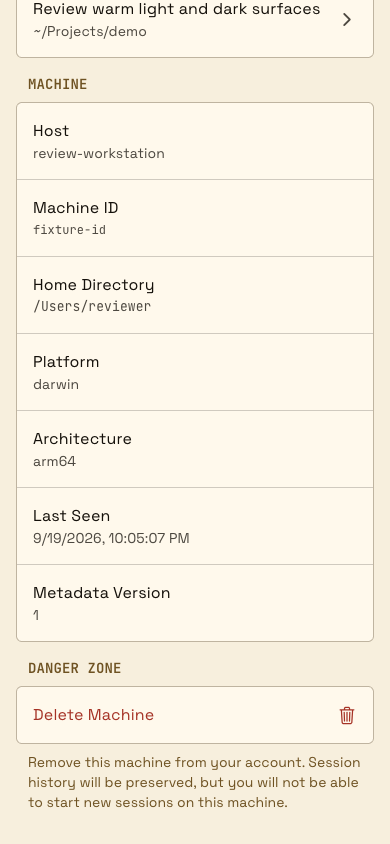</a>

**populated · dark · 1440×1000**

<a href="machine-populated-dark-1440.png">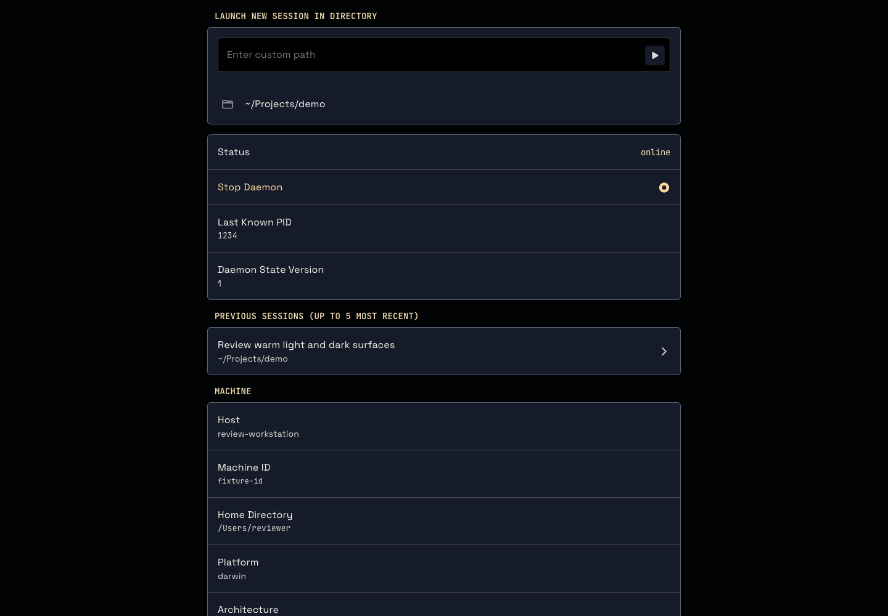</a>

**scrolled-bottom · dark · 1440×1000**

<a href="machine-scrolled-bottom-dark-1440.png">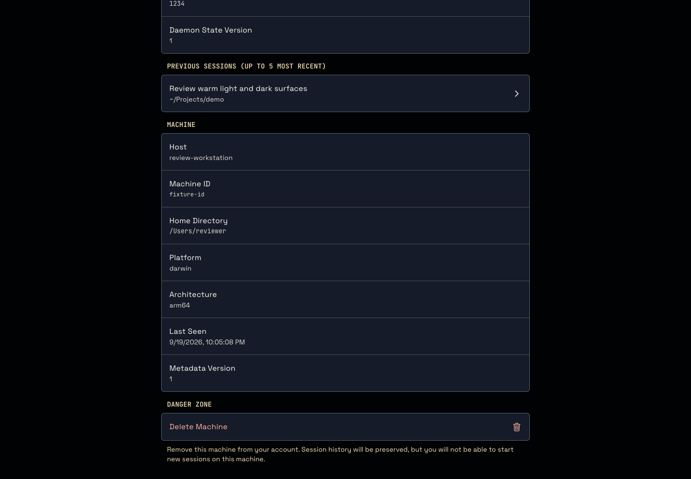</a>

**populated · dark · 390×844**

<a href="machine-populated-dark-390.png">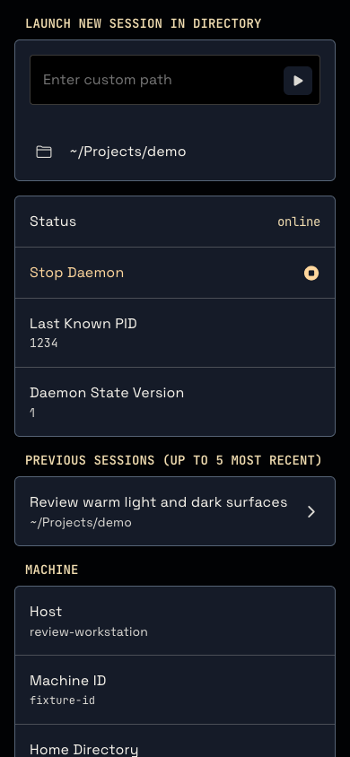</a>

**scrolled-bottom · dark · 390×844**

<a href="machine-scrolled-bottom-dark-390.png">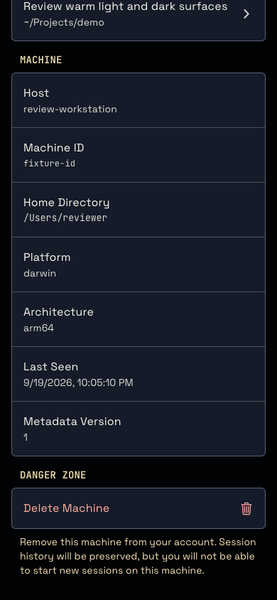</a>

## Session details

**Changed presentation:** KILV navigation/row surfaces, shared typography, compact controls and semantic status treatment.

**Evidence:** `component-fixture`. States: populated, scrolled-bottom.

**Production owners:** `app/(app)/session/[id]/info.tsx`.

- Synthetic service/state boundaries; React Native Web adapter; not authenticated live or installed native evidence.
- Expo Router Stack.Screen options are registered but its native navigation header is outside this component fixture.
- Scrolled to the bottom using the existing production overflow container.
- Synthetic service data; native navigation header is outside this fixture.

Fixture environment: [source graph and adapters](environment-routes.json).

| State | Theme | Viewport | Screenshot |
|---|---|---|---|
| populated | light | 1440×1000 | [Open full screenshot](session-info-populated-light-1440.png) |
| scrolled-bottom | light | 1440×1000 | [Open full screenshot](session-info-scrolled-bottom-light-1440.png) |
| populated | light | 390×844 | [Open full screenshot](session-info-populated-light-390.png) |
| scrolled-bottom | light | 390×844 | [Open full screenshot](session-info-scrolled-bottom-light-390.png) |
| populated | dark | 1440×1000 | [Open full screenshot](session-info-populated-dark-1440.png) |
| scrolled-bottom | dark | 1440×1000 | [Open full screenshot](session-info-scrolled-bottom-dark-1440.png) |
| populated | dark | 390×844 | [Open full screenshot](session-info-populated-dark-390.png) |
| scrolled-bottom | dark | 390×844 | [Open full screenshot](session-info-scrolled-bottom-dark-390.png) |

Show every screenshot for this panel

**populated · light · 1440×1000**

<a href="session-info-populated-light-1440.png">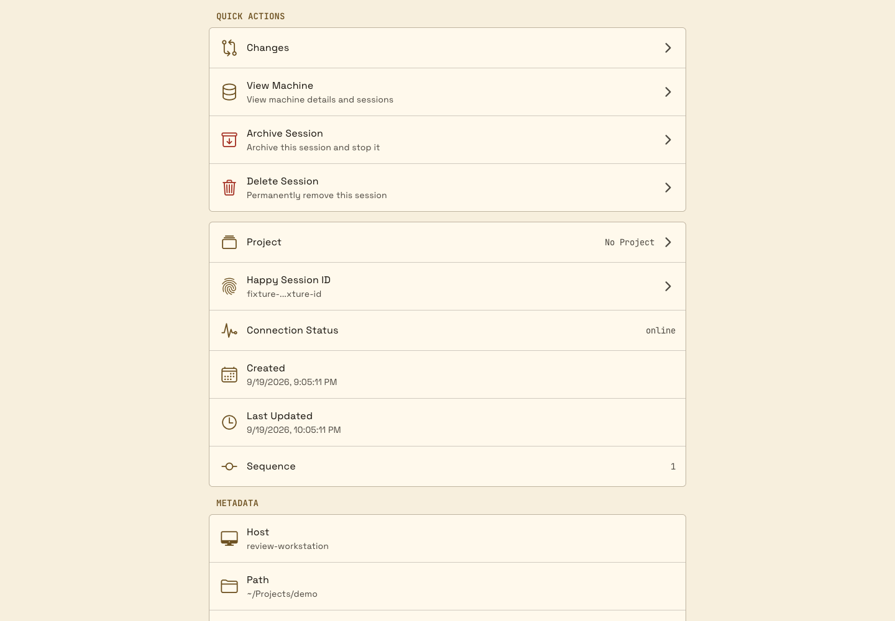</a>

**scrolled-bottom · light · 1440×1000**

<a href="session-info-scrolled-bottom-light-1440.png">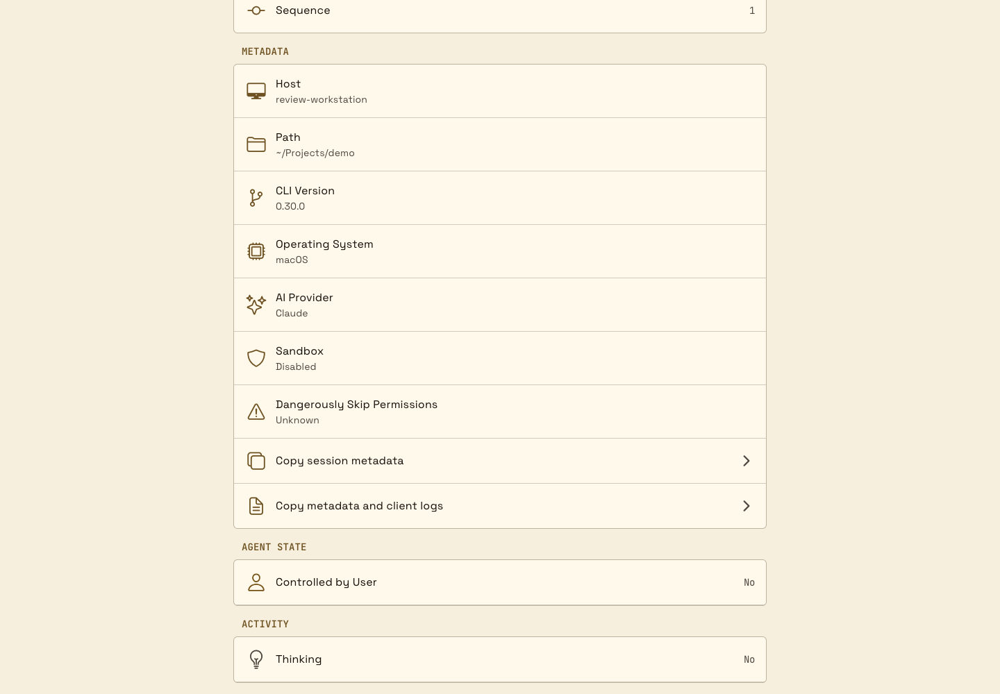</a>

**populated · light · 390×844**

<a href="session-info-populated-light-390.png">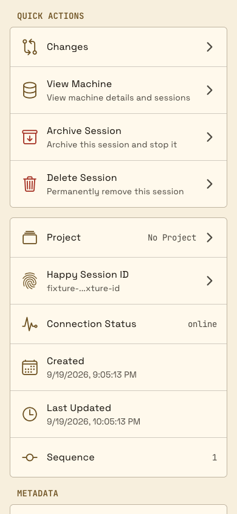</a>

**scrolled-bottom · light · 390×844**

<a href="session-info-scrolled-bottom-light-390.png">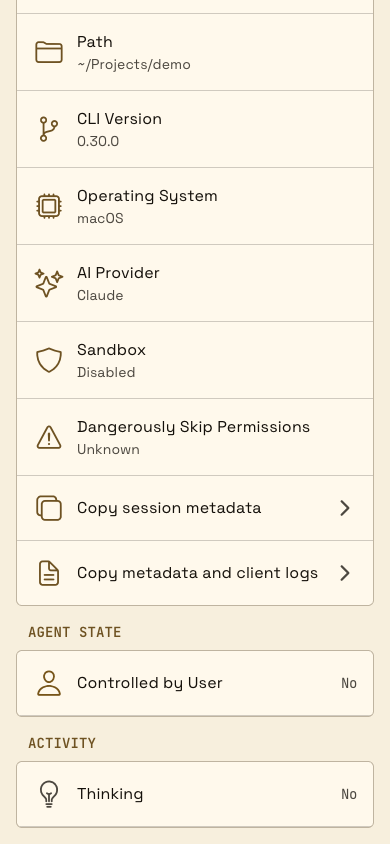</a>

**populated · dark · 1440×1000**

<a href="session-info-populated-dark-1440.png">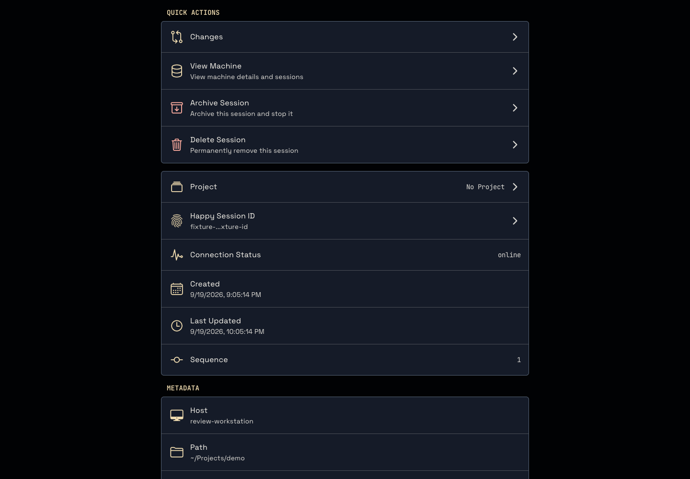</a>

**scrolled-bottom · dark · 1440×1000**

<a href="session-info-scrolled-bottom-dark-1440.png">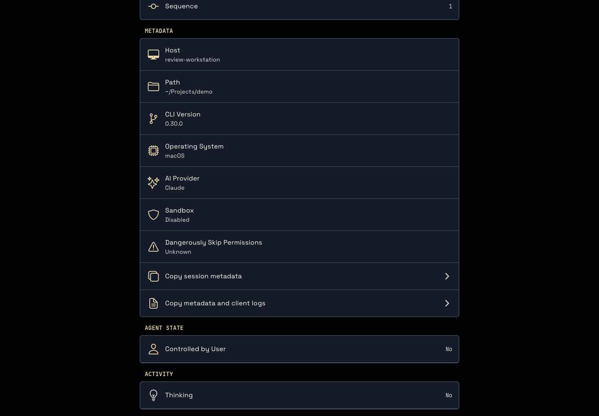</a>

**populated · dark · 390×844**

<a href="session-info-populated-dark-390.png">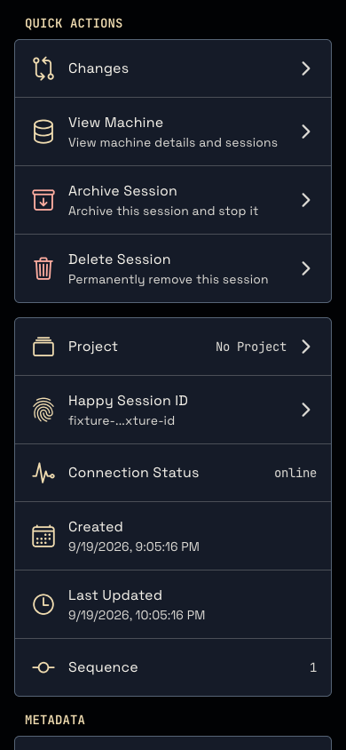</a>

**scrolled-bottom · dark · 390×844**

<a href="session-info-scrolled-bottom-dark-390.png">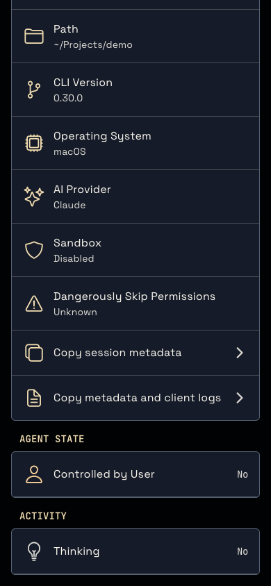</a>

## Recent sessions

**Changed presentation:** KILV navigation/row surfaces, shared typography, compact controls and semantic status treatment.

**Evidence:** `component-fixture`. States: populated.

**Production owners:** `app/(app)/session/recent.tsx`.

- Synthetic service/state boundaries; React Native Web adapter; not authenticated live or installed native evidence.
- Expo Router Stack.Screen options are registered but its native navigation header is outside this component fixture.

Fixture environment: [source graph and adapters](environment-routes.json).

| State | Theme | Viewport | Screenshot |
|---|---|---|---|
| populated | light | 1440×1000 | [Open full screenshot](recent-populated-light-1440.png) |
| populated | light | 390×844 | [Open full screenshot](recent-populated-light-390.png) |
| populated | dark | 1440×1000 | [Open full screenshot](recent-populated-dark-1440.png) |
| populated | dark | 390×844 | [Open full screenshot](recent-populated-dark-390.png) |

Show every screenshot for this panel

**populated · light · 1440×1000**

<a href="recent-populated-light-1440.png">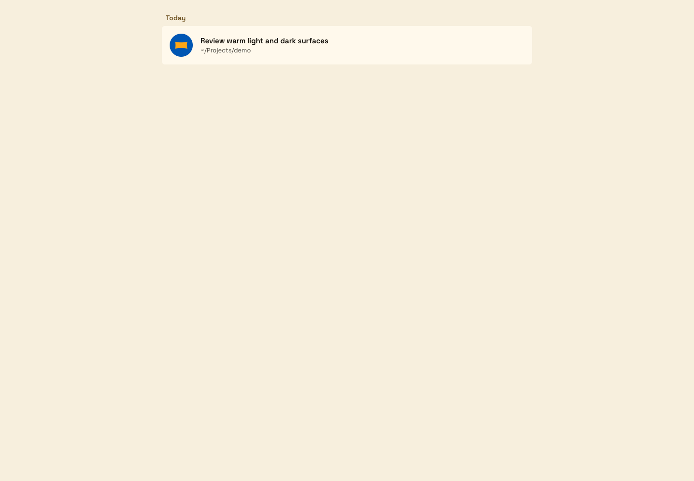</a>

**populated · light · 390×844**

<a href="recent-populated-light-390.png">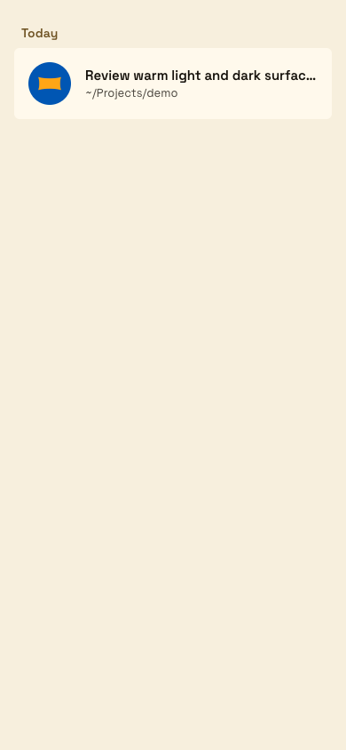</a>

**populated · dark · 1440×1000**

<a href="recent-populated-dark-1440.png">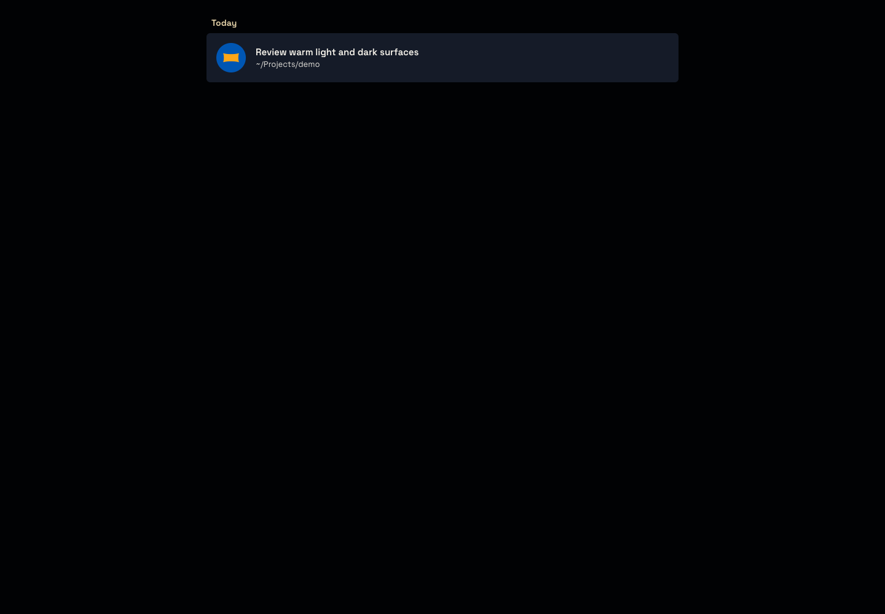</a>

**populated · dark · 390×844**

<a href="recent-populated-dark-390.png">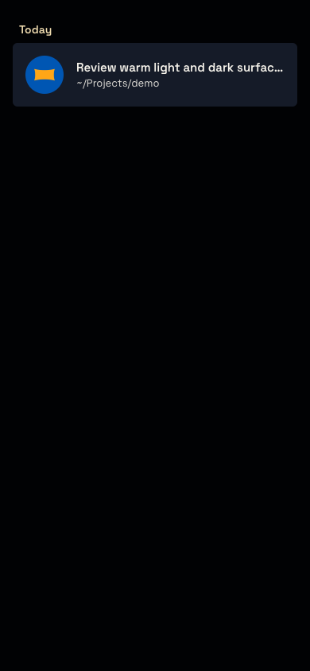</a>

## Account settings

**Changed presentation:** KILV form surfaces, readable primary/secondary actions, Space Grotesk labels and 16px inputs.

**Evidence:** `component-fixture`. States: populated, scrolled-bottom.

**Production owners:** `app/(app)/settings/account.tsx`.

- Synthetic service/state boundaries; React Native Web adapter; not authenticated live or installed native evidence.
- Expo Router Stack.Screen options are registered but its native navigation header is outside this component fixture.
- The displayed all-zero key is synthetic and has no account access.
- Scrolled to the bottom using the existing production overflow container.
- Synthetic service data; native navigation header is outside this fixture.

Fixture environment: [source graph and adapters](environment-routes.json).

| State | Theme | Viewport | Screenshot |
|---|---|---|---|
| populated | light | 1440×1000 | [Open full screenshot](account-populated-light-1440.png) |
| scrolled-bottom | light | 1440×1000 | [Open full screenshot](account-scrolled-bottom-light-1440.png) |
| populated | light | 390×844 | [Open full screenshot](account-populated-light-390.png) |
| scrolled-bottom | light | 390×844 | [Open full screenshot](account-scrolled-bottom-light-390.png) |
| populated | dark | 1440×1000 | [Open full screenshot](account-populated-dark-1440.png) |
| scrolled-bottom | dark | 1440×1000 | [Open full screenshot](account-scrolled-bottom-dark-1440.png) |
| populated | dark | 390×844 | [Open full screenshot](account-populated-dark-390.png) |
| scrolled-bottom | dark | 390×844 | [Open full screenshot](account-scrolled-bottom-dark-390.png) |

Show every screenshot for this panel

**populated · light · 1440×1000**

<a href="account-populated-light-1440.png">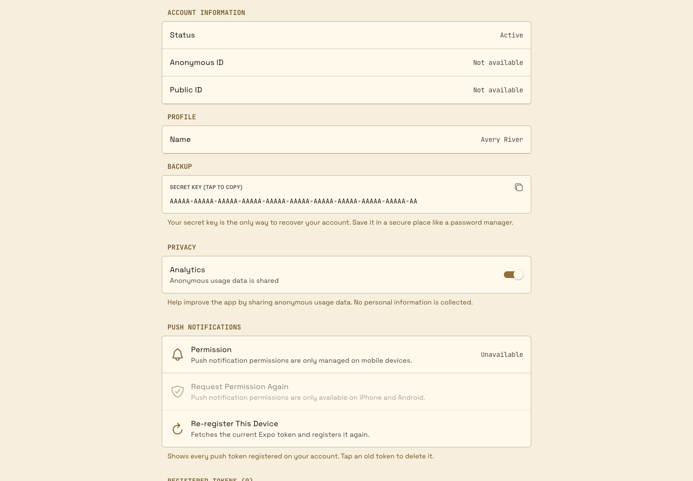</a>

**scrolled-bottom · light · 1440×1000**

<a href="account-scrolled-bottom-light-1440.png">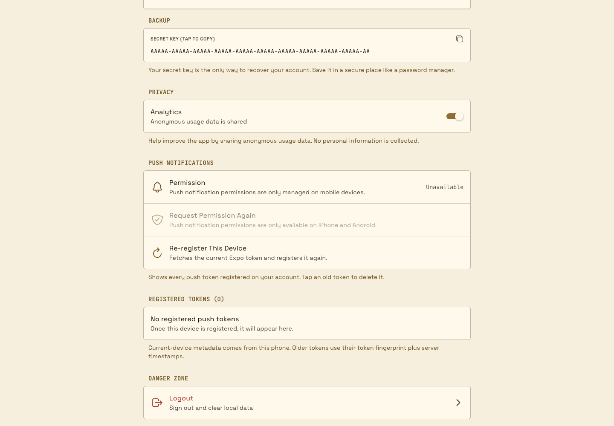</a>

**populated · light · 390×844**

<a href="account-populated-light-390.png">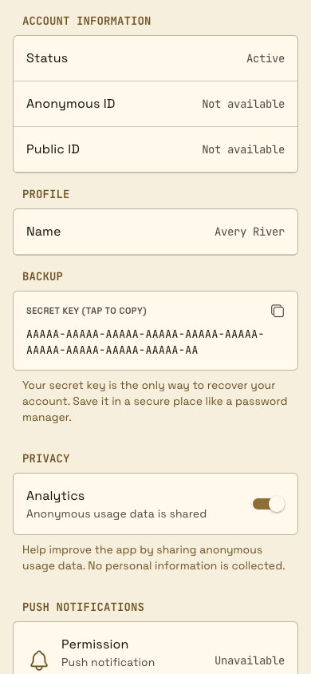</a>

**scrolled-bottom · light · 390×844**

<a href="account-scrolled-bottom-light-390.png">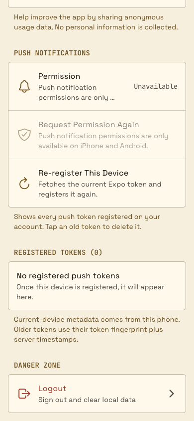</a>

**populated · dark · 1440×1000**

<a href="account-populated-dark-1440.png">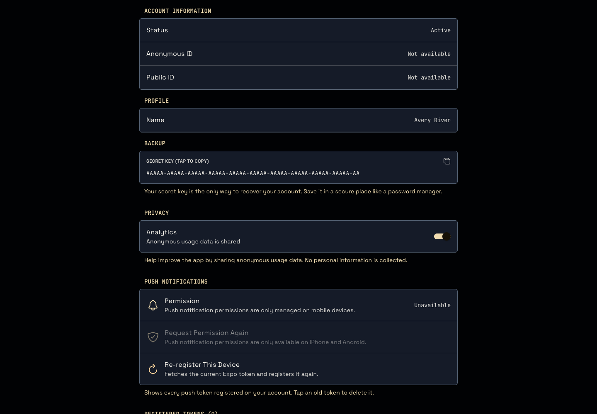</a>

**scrolled-bottom · dark · 1440×1000**

<a href="account-scrolled-bottom-dark-1440.png">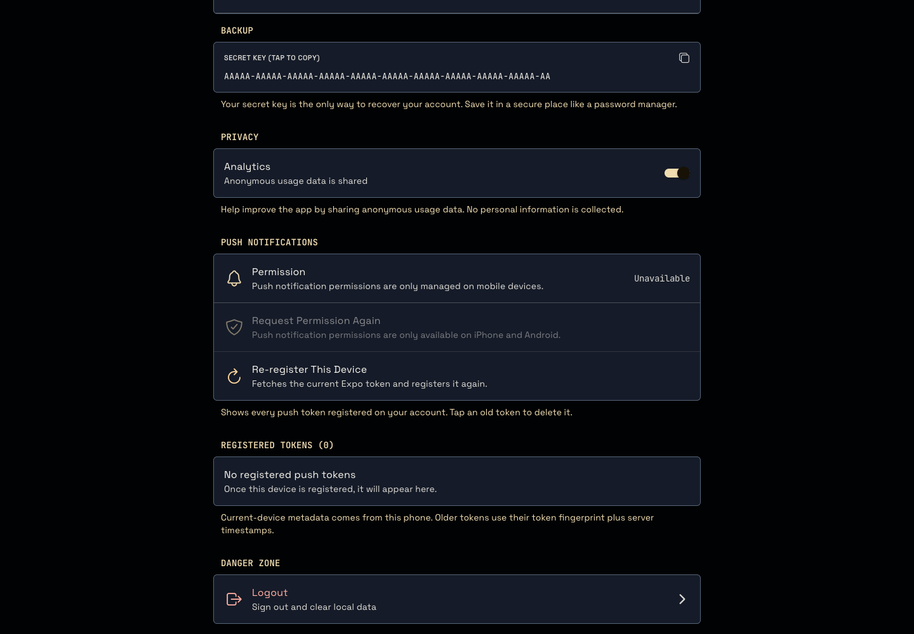</a>

**populated · dark · 390×844**

<a href="account-populated-dark-390.png">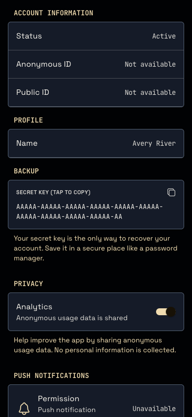</a>

**scrolled-bottom · dark · 390×844**

<a href="account-scrolled-bottom-dark-390.png">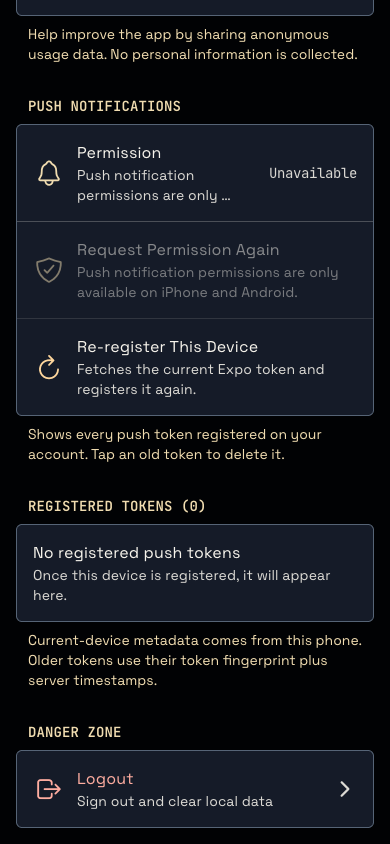</a>

## Synthetic account key

**Changed presentation:** KILV form surfaces, readable primary/secondary actions, Space Grotesk labels and 16px inputs.

**Evidence:** `component-fixture`. States: populated.

**Production owners:** `components/AccountKeyPanel.tsx`.

- Synthetic service/state boundaries; React Native Web adapter; not authenticated live or installed native evidence.
- Expo Router Stack.Screen options are registered but its native navigation header is outside this component fixture.
- The displayed all-zero key is synthetic and has no account access.

Fixture environment: [source graph and adapters](environment-routes.json).

| State | Theme | Viewport | Screenshot |
|---|---|---|---|
| populated | light | 1440×1000 | [Open full screenshot](account-key-populated-light-1440.png) |
| populated | light | 390×844 | [Open full screenshot](account-key-populated-light-390.png) |
| populated | dark | 1440×1000 | [Open full screenshot](account-key-populated-dark-1440.png) |
| populated | dark | 390×844 | [Open full screenshot](account-key-populated-dark-390.png) |

Show every screenshot for this panel

**populated · light · 1440×1000**

<a href="account-key-populated-light-1440.png">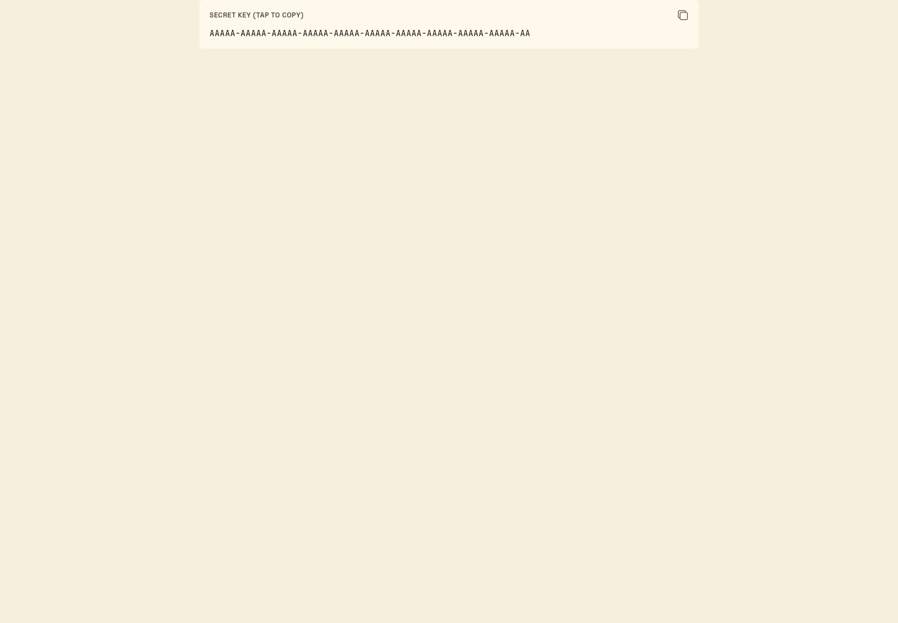</a>

**populated · light · 390×844**

<a href="account-key-populated-light-390.png">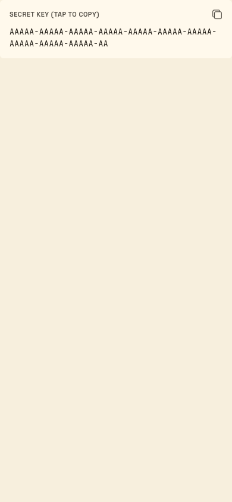</a>

**populated · dark · 1440×1000**

<a href="account-key-populated-dark-1440.png">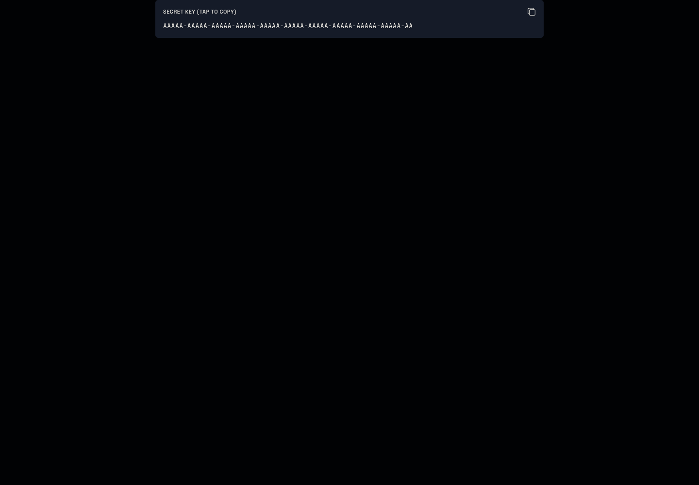</a>

**populated · dark · 390×844**

<a href="account-key-populated-dark-390.png">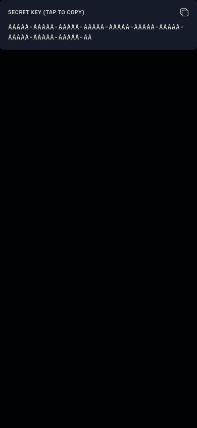</a>

## Agent defaults

**Changed presentation:** KILV settings rows and grouped panels, Space Grotesk labels, JetBrains Mono data and themed controls.

**Evidence:** `component-fixture`. States: populated, scrolled-bottom.

**Production owners:** `app/(app)/settings/agents.tsx`.

- Synthetic service/state boundaries; React Native Web adapter; not authenticated live or installed native evidence.
- Expo Router Stack.Screen options are registered but its native navigation header is outside this component fixture.
- Scrolled to the bottom using the existing production overflow container.
- Synthetic service data; native navigation header is outside this fixture.

Fixture environment: [source graph and adapters](environment-routes.json).

| State | Theme | Viewport | Screenshot |
|---|---|---|---|
| populated | light | 1440×1000 | [Open full screenshot](agents-populated-light-1440.png) |
| scrolled-bottom | light | 1440×1000 | [Open full screenshot](agents-scrolled-bottom-light-1440.png) |
| populated | light | 390×844 | [Open full screenshot](agents-populated-light-390.png) |
| scrolled-bottom | light | 390×844 | [Open full screenshot](agents-scrolled-bottom-light-390.png) |
| populated | dark | 1440×1000 | [Open full screenshot](agents-populated-dark-1440.png) |
| scrolled-bottom | dark | 1440×1000 | [Open full screenshot](agents-scrolled-bottom-dark-1440.png) |
| populated | dark | 390×844 | [Open full screenshot](agents-populated-dark-390.png) |
| scrolled-bottom | dark | 390×844 | [Open full screenshot](agents-scrolled-bottom-dark-390.png) |

Show every screenshot for this panel

**populated · light · 1440×1000**

<a href="agents-populated-light-1440.png">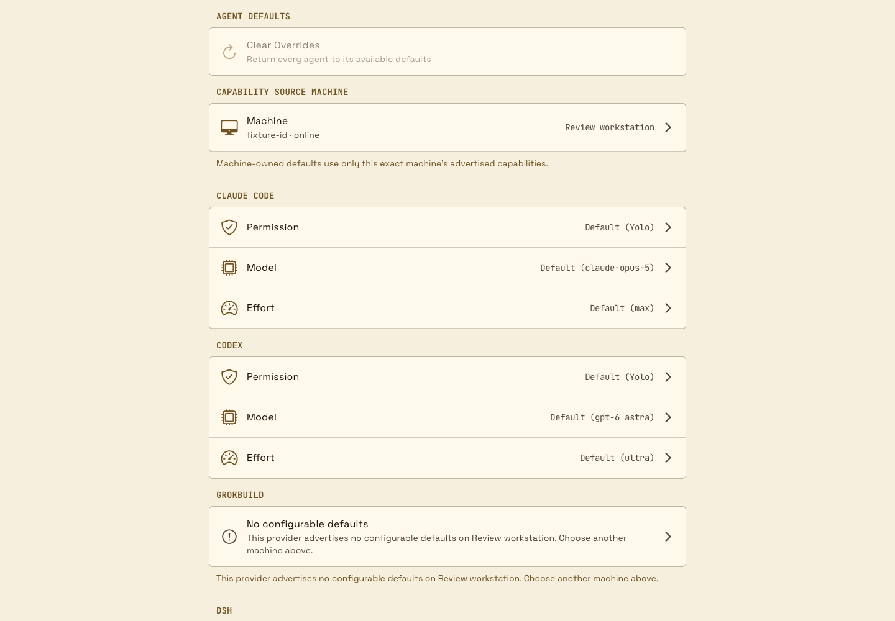</a>

**scrolled-bottom · light · 1440×1000**

<a href="agents-scrolled-bottom-light-1440.png">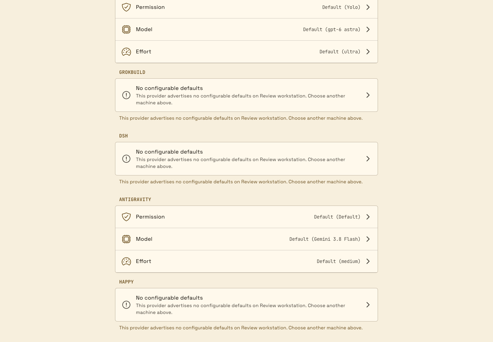</a>

**populated · light · 390×844**

<a href="agents-populated-light-390.png">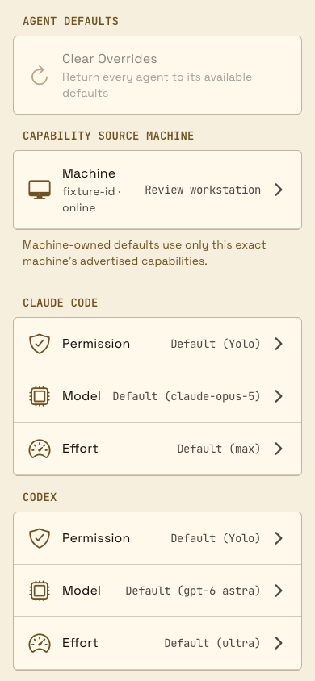</a>

**scrolled-bottom · light · 390×844**

<a href="agents-scrolled-bottom-light-390.png">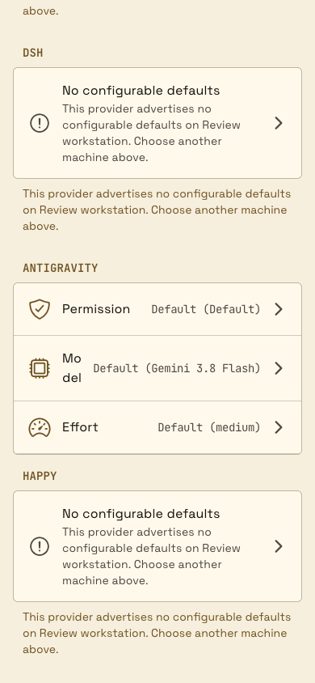</a>

**populated · dark · 1440×1000**

<a href="agents-populated-dark-1440.png">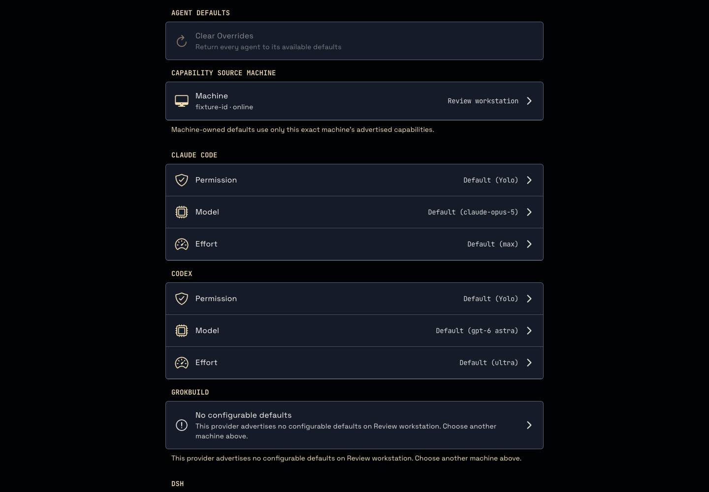</a>

**scrolled-bottom · dark · 1440×1000**

<a href="agents-scrolled-bottom-dark-1440.png">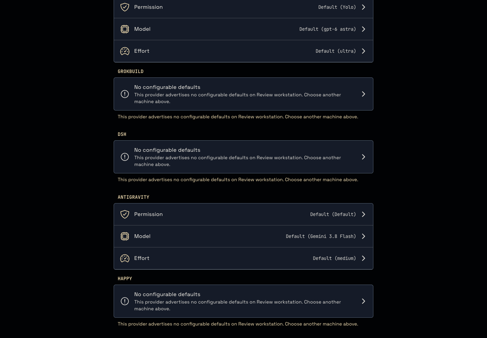</a>

**populated · dark · 390×844**

<a href="agents-populated-dark-390.png">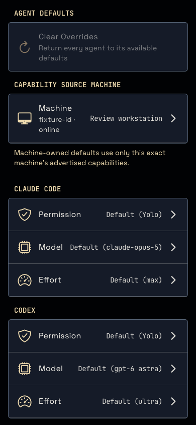</a>

**scrolled-bottom · dark · 390×844**

<a href="agents-scrolled-bottom-dark-390.png">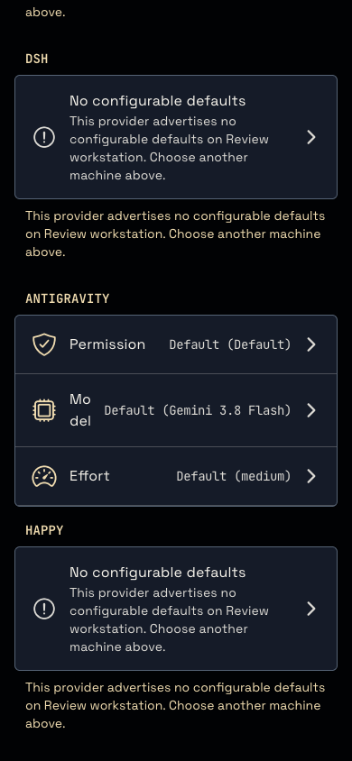</a>

## Appearance

**Changed presentation:** KILV settings rows and grouped panels, Space Grotesk labels, JetBrains Mono data and themed controls.

**Evidence:** `component-fixture`. States: populated, scrolled-bottom.

**Production owners:** `app/(app)/settings/appearance.tsx`.

- Synthetic service/state boundaries; React Native Web adapter; not authenticated live or installed native evidence.
- Expo Router Stack.Screen options are registered but its native navigation header is outside this component fixture.
- Scrolled to the bottom using the existing production overflow container.
- Synthetic service data; native navigation header is outside this fixture.

Fixture environment: [source graph and adapters](environment-routes.json).

| State | Theme | Viewport | Screenshot |
|---|---|---|---|
| populated | light | 1440×1000 | [Open full screenshot](appearance-populated-light-1440.png) |
| scrolled-bottom | light | 1440×1000 | [Open full screenshot](appearance-scrolled-bottom-light-1440.png) |
| populated | light | 390×844 | [Open full screenshot](appearance-populated-light-390.png) |
| scrolled-bottom | light | 390×844 | [Open full screenshot](appearance-scrolled-bottom-light-390.png) |
| populated | dark | 1440×1000 | [Open full screenshot](appearance-populated-dark-1440.png) |
| scrolled-bottom | dark | 1440×1000 | [Open full screenshot](appearance-scrolled-bottom-dark-1440.png) |
| populated | dark | 390×844 | [Open full screenshot](appearance-populated-dark-390.png) |
| scrolled-bottom | dark | 390×844 | [Open full screenshot](appearance-scrolled-bottom-dark-390.png) |

Show every screenshot for this panel

**populated · light · 1440×1000**

<a href="appearance-populated-light-1440.png">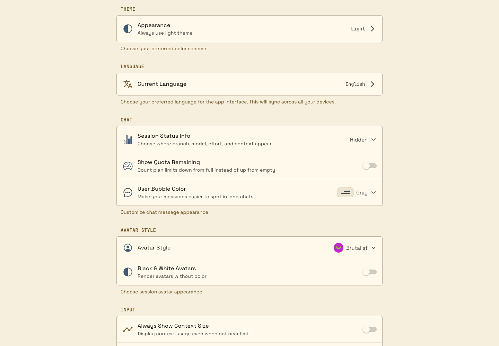</a>

**scrolled-bottom · light · 1440×1000**

<a href="appearance-scrolled-bottom-light-1440.png">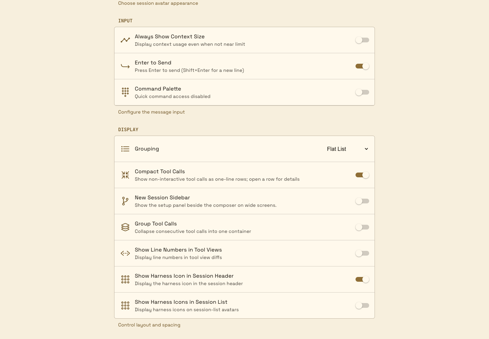</a>

**populated · light · 390×844**

<a href="appearance-populated-light-390.png">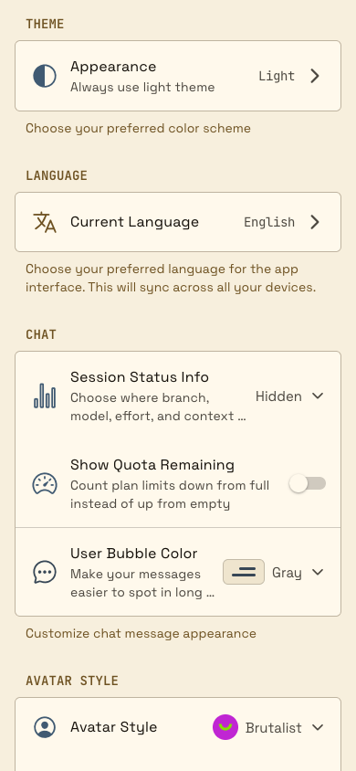</a>

**scrolled-bottom · light · 390×844**

<a href="appearance-scrolled-bottom-light-390.png">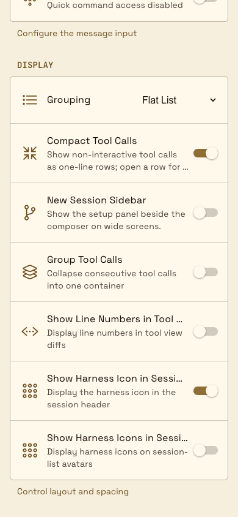</a>

**populated · dark · 1440×1000**

<a href="appearance-populated-dark-1440.png">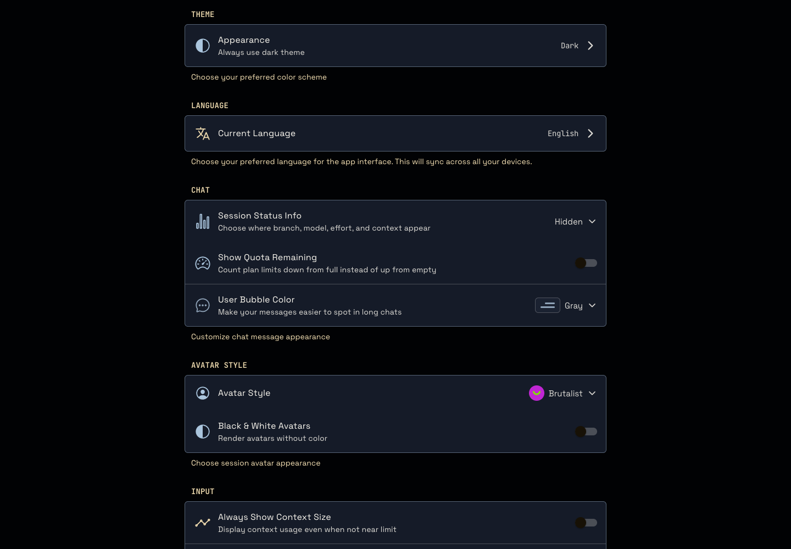</a>

**scrolled-bottom · dark · 1440×1000**

<a href="appearance-scrolled-bottom-dark-1440.png">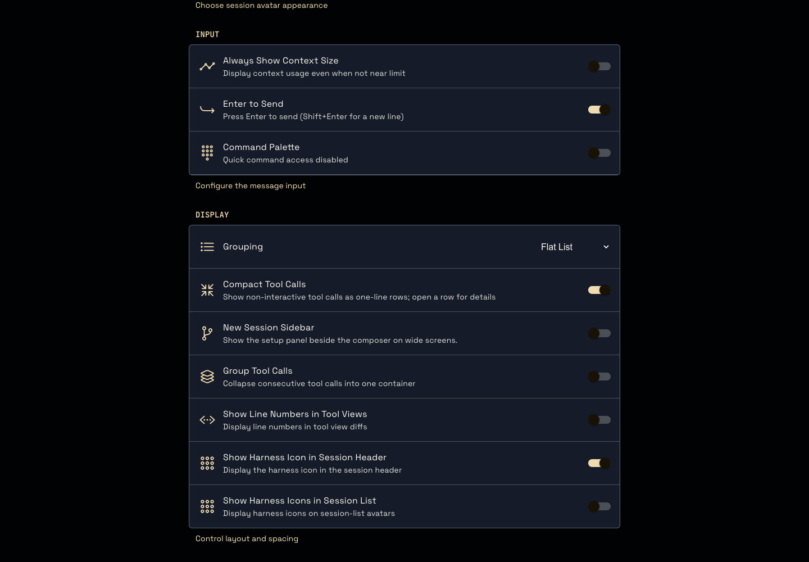</a>

**populated · dark · 390×844**

<a href="appearance-populated-dark-390.png">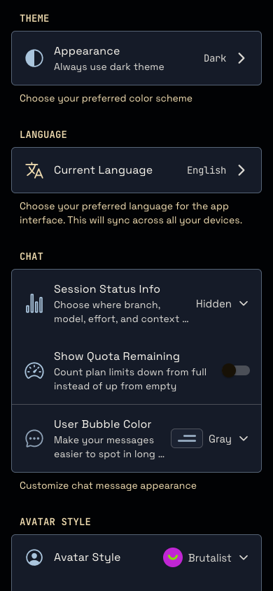</a>

**scrolled-bottom · dark · 390×844**

<a href="appearance-scrolled-bottom-dark-390.png">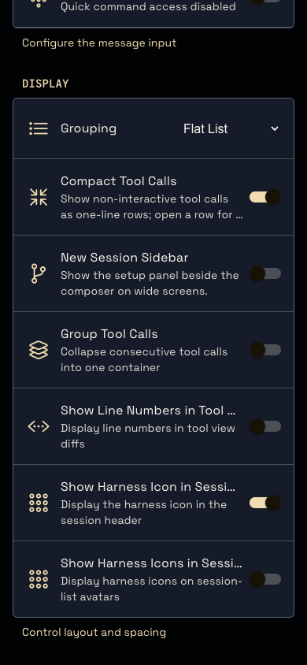</a>

## Features

**Changed presentation:** KILV settings rows and grouped panels, Space Grotesk labels, JetBrains Mono data and themed controls.

**Evidence:** `component-fixture`. States: populated, scrolled-bottom.

**Production owners:** `app/(app)/settings/features.tsx`.

- Synthetic service/state boundaries; React Native Web adapter; not authenticated live or installed native evidence.
- Expo Router Stack.Screen options are registered but its native navigation header is outside this component fixture.
- Scrolled to the bottom using the existing production overflow container.
- Synthetic service data; native navigation header is outside this fixture.

Fixture environment: [source graph and adapters](environment-routes.json).

| State | Theme | Viewport | Screenshot |
|---|---|---|---|
| populated | light | 1440×1000 | [Open full screenshot](features-populated-light-1440.png) |
| populated | light | 390×844 | [Open full screenshot](features-populated-light-390.png) |
| scrolled-bottom | light | 390×844 | [Open full screenshot](features-scrolled-bottom-light-390.png) |
| populated | dark | 1440×1000 | [Open full screenshot](features-populated-dark-1440.png) |
| populated | dark | 390×844 | [Open full screenshot](features-populated-dark-390.png) |
| scrolled-bottom | dark | 390×844 | [Open full screenshot](features-scrolled-bottom-dark-390.png) |

Show every screenshot for this panel

**populated · light · 1440×1000**

<a href="features-populated-light-1440.png">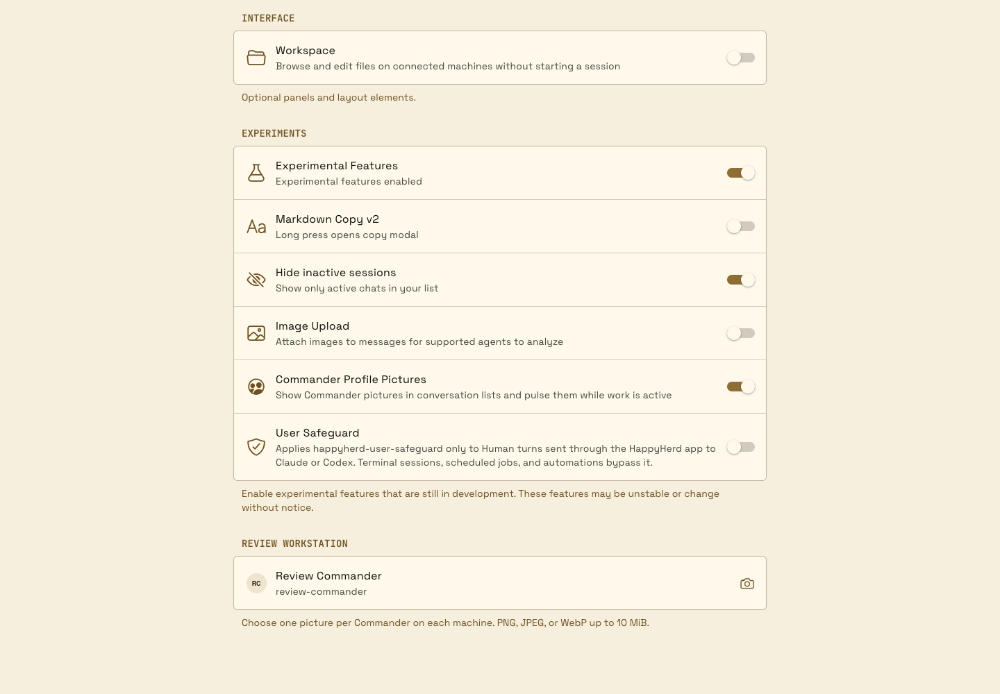</a>

**populated · light · 390×844**

<a href="features-populated-light-390.png">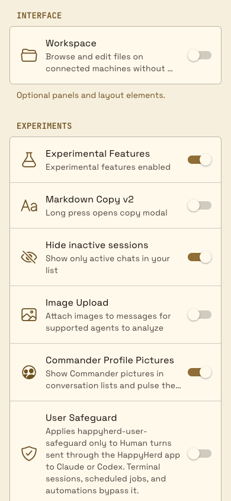</a>

**scrolled-bottom · light · 390×844**

<a href="features-scrolled-bottom-light-390.png">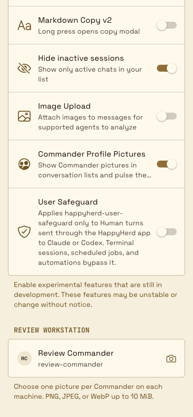</a>

**populated · dark · 1440×1000**

<a href="features-populated-dark-1440.png">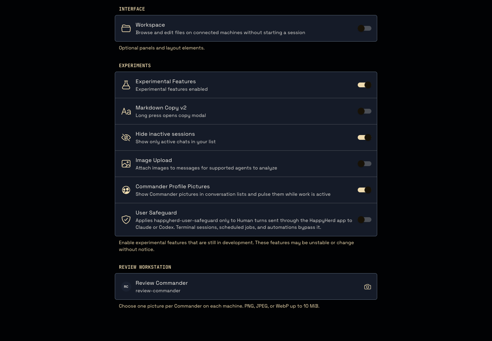</a>

**populated · dark · 390×844**

<a href="features-populated-dark-390.png">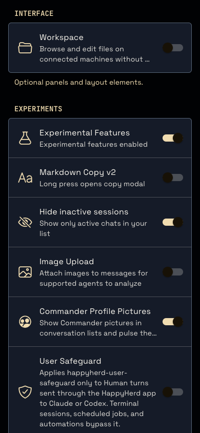</a>

**scrolled-bottom · dark · 390×844**

<a href="features-scrolled-bottom-dark-390.png">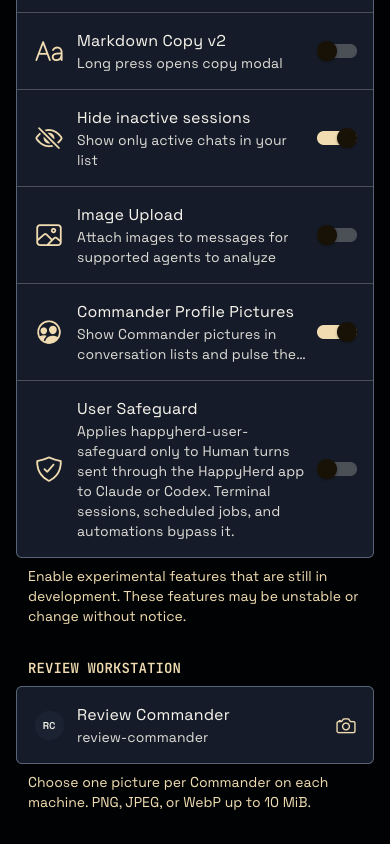</a>

## Commander profile pictures

**Changed presentation:** KILV settings rows and grouped panels, Space Grotesk labels, JetBrains Mono data and themed controls.

**Evidence:** `component-fixture`. States: populated.

**Production owners:** `components/CommanderAvatarSettings.tsx`.

- Synthetic service/state boundaries; React Native Web adapter; not authenticated live or installed native evidence.
- Expo Router Stack.Screen options are registered but its native navigation header is outside this component fixture.

Fixture environment: [source graph and adapters](environment-routes.json).

| State | Theme | Viewport | Screenshot |
|---|---|---|---|
| populated | light | 1440×1000 | [Open full screenshot](commanders-populated-light-1440.png) |
| populated | light | 390×844 | [Open full screenshot](commanders-populated-light-390.png) |
| populated | dark | 1440×1000 | [Open full screenshot](commanders-populated-dark-1440.png) |
| populated | dark | 390×844 | [Open full screenshot](commanders-populated-dark-390.png) |

Show every screenshot for this panel

**populated · light · 1440×1000**

<a href="commanders-populated-light-1440.png">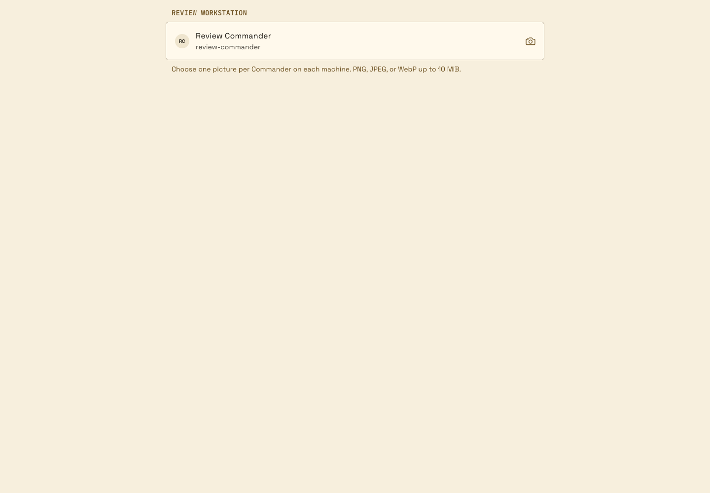</a>

**populated · light · 390×844**

<a href="commanders-populated-light-390.png">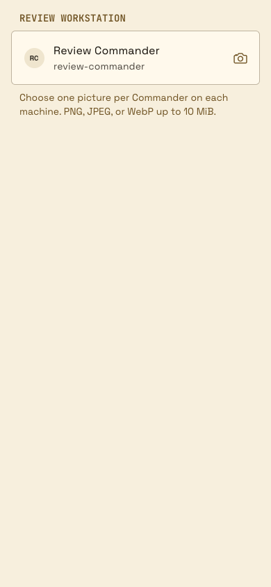</a>

**populated · dark · 1440×1000**

<a href="commanders-populated-dark-1440.png">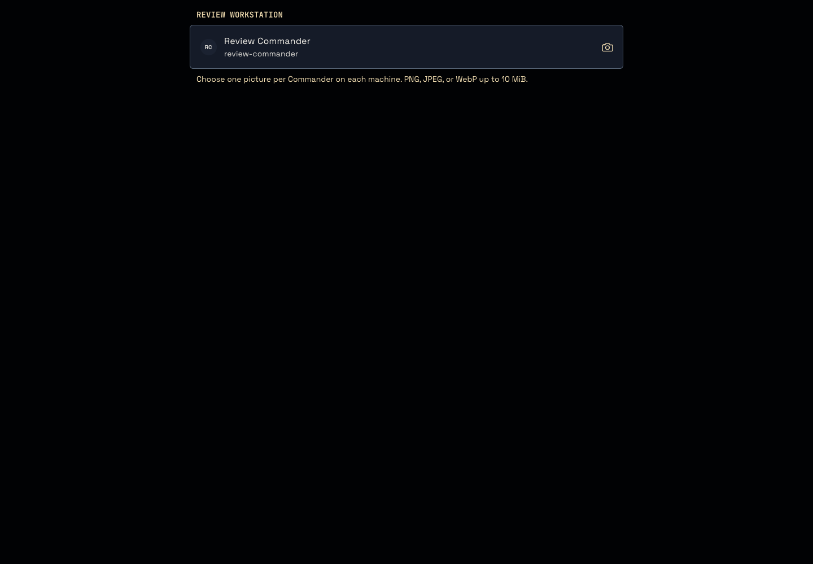</a>

**populated · dark · 390×844**

<a href="commanders-populated-dark-390.png">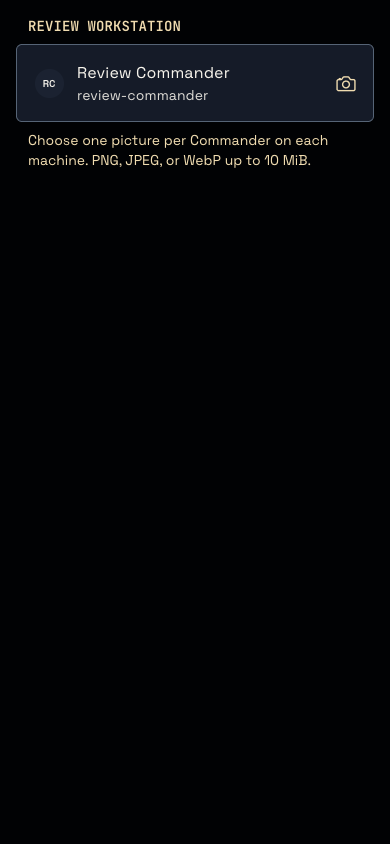</a>

## Interface language

**Changed presentation:** KILV settings rows and grouped panels, Space Grotesk labels, JetBrains Mono data and themed controls.

**Evidence:** `component-fixture`. States: populated.

**Production owners:** `app/(app)/settings/language.tsx`.

- Synthetic service/state boundaries; React Native Web adapter; not authenticated live or installed native evidence.
- Expo Router Stack.Screen options are registered but its native navigation header is outside this component fixture.

Fixture environment: [source graph and adapters](environment-routes.json).

| State | Theme | Viewport | Screenshot |
|---|---|---|---|
| populated | light | 1440×1000 | [Open full screenshot](language-populated-light-1440.png) |
| populated | light | 390×844 | [Open full screenshot](language-populated-light-390.png) |
| populated | dark | 1440×1000 | [Open full screenshot](language-populated-dark-1440.png) |
| populated | dark | 390×844 | [Open full screenshot](language-populated-dark-390.png) |

Show every screenshot for this panel

**populated · light · 1440×1000**

<a href="language-populated-light-1440.png">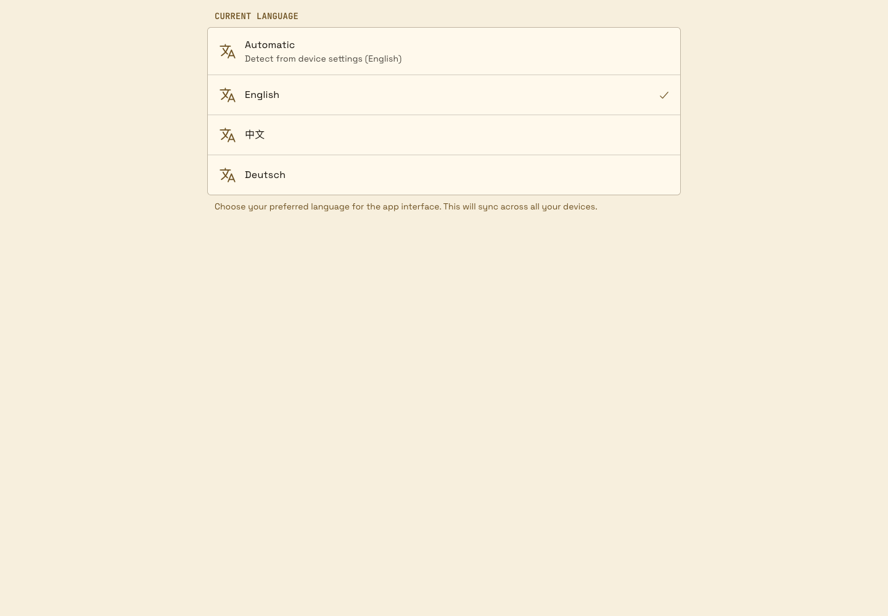</a>

**populated · light · 390×844**

<a href="language-populated-light-390.png">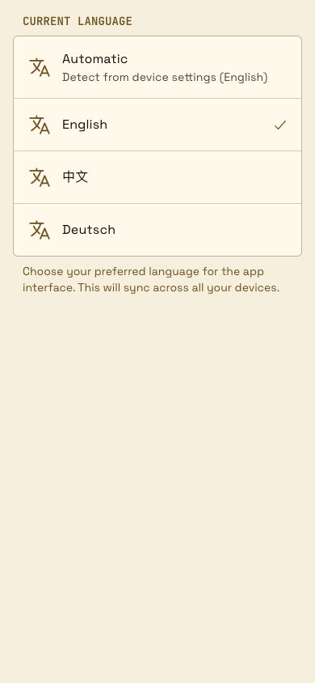</a>

**populated · dark · 1440×1000**

<a href="language-populated-dark-1440.png">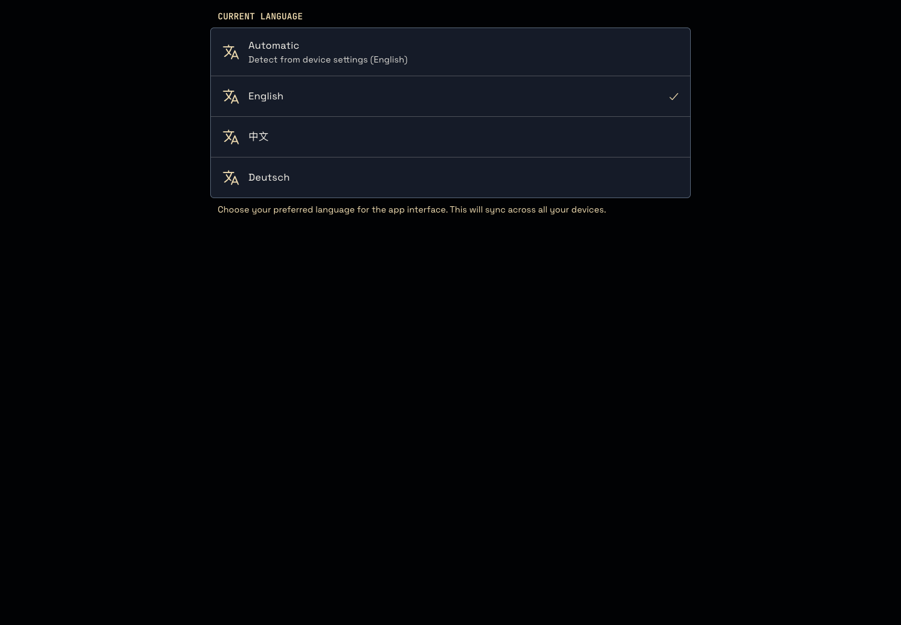</a>

**populated · dark · 390×844**

<a href="language-populated-dark-390.png">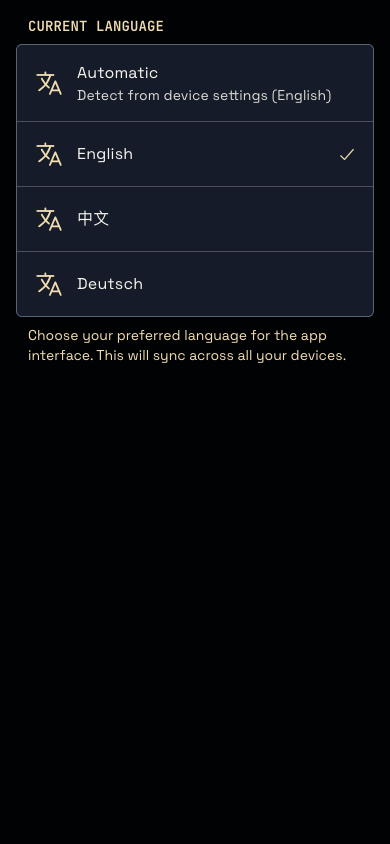</a>

## Voice settings

**Changed presentation:** KILV settings rows and grouped panels, Space Grotesk labels, JetBrains Mono data and themed controls.

**Evidence:** `component-fixture`. States: populated, scrolled-bottom.

**Production owners:** `app/(app)/settings/voice.tsx`, `components/usage/UsageBar.tsx`.

- Synthetic service/state boundaries; React Native Web adapter; not authenticated live or installed native evidence.
- Expo Router Stack.Screen options are registered but its native navigation header is outside this component fixture.
- Scrolled to the bottom using the existing production overflow container.
- Synthetic service data; native navigation header is outside this fixture.

Fixture environment: [source graph and adapters](environment-routes.json).

| State | Theme | Viewport | Screenshot |
|---|---|---|---|
| populated | light | 1440×1000 | [Open full screenshot](voice-populated-light-1440.png) |
| scrolled-bottom | light | 1440×1000 | [Open full screenshot](voice-scrolled-bottom-light-1440.png) |
| populated | light | 390×844 | [Open full screenshot](voice-populated-light-390.png) |
| scrolled-bottom | light | 390×844 | [Open full screenshot](voice-scrolled-bottom-light-390.png) |
| populated | dark | 1440×1000 | [Open full screenshot](voice-populated-dark-1440.png) |
| scrolled-bottom | dark | 1440×1000 | [Open full screenshot](voice-scrolled-bottom-dark-1440.png) |
| populated | dark | 390×844 | [Open full screenshot](voice-populated-dark-390.png) |
| scrolled-bottom | dark | 390×844 | [Open full screenshot](voice-scrolled-bottom-dark-390.png) |

Show every screenshot for this panel

**populated · light · 1440×1000**

<a href="voice-populated-light-1440.png">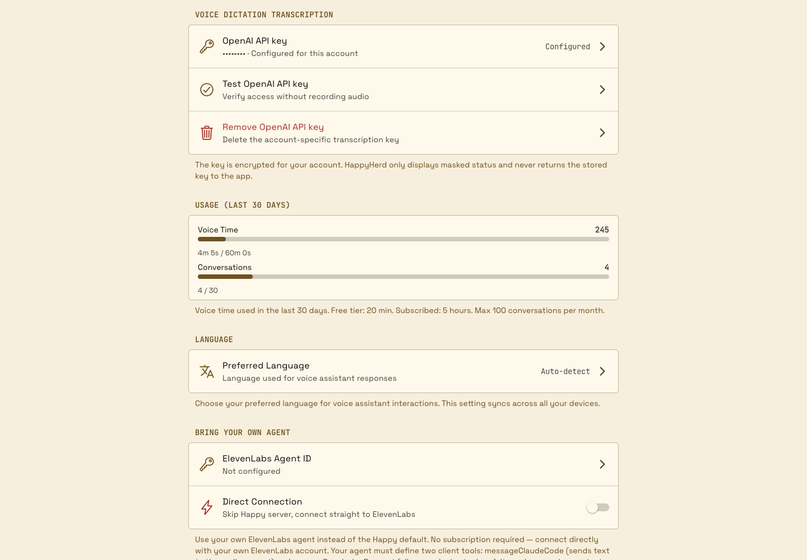</a>

**scrolled-bottom · light · 1440×1000**

<a href="voice-scrolled-bottom-light-1440.png">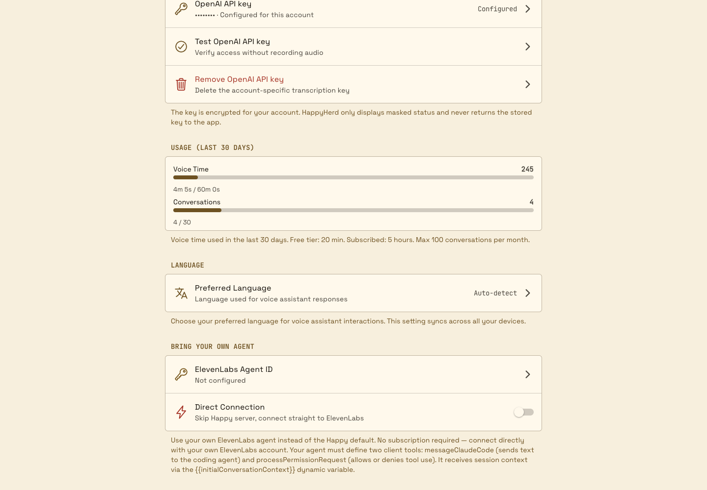</a>

**populated · light · 390×844**

<a href="voice-populated-light-390.png">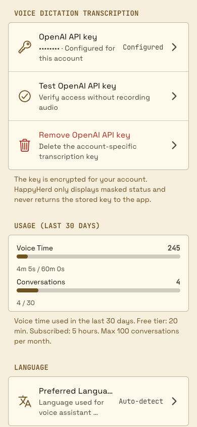</a>

**scrolled-bottom · light · 390×844**

<a href="voice-scrolled-bottom-light-390.png">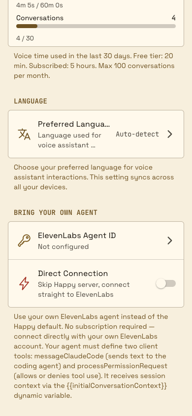</a>

**populated · dark · 1440×1000**

<a href="voice-populated-dark-1440.png">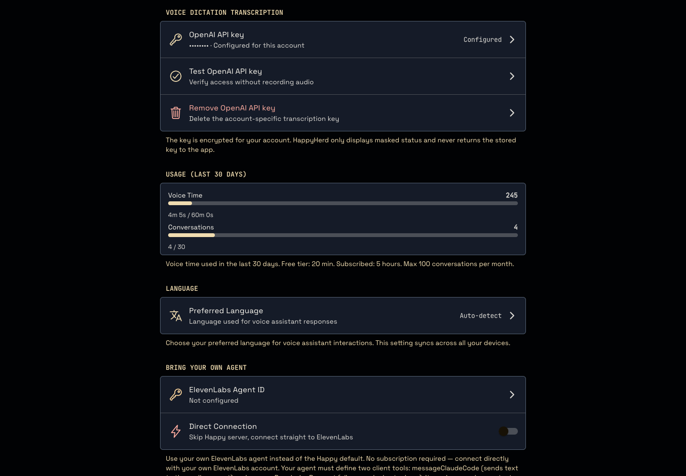</a>

**scrolled-bottom · dark · 1440×1000**

<a href="voice-scrolled-bottom-dark-1440.png">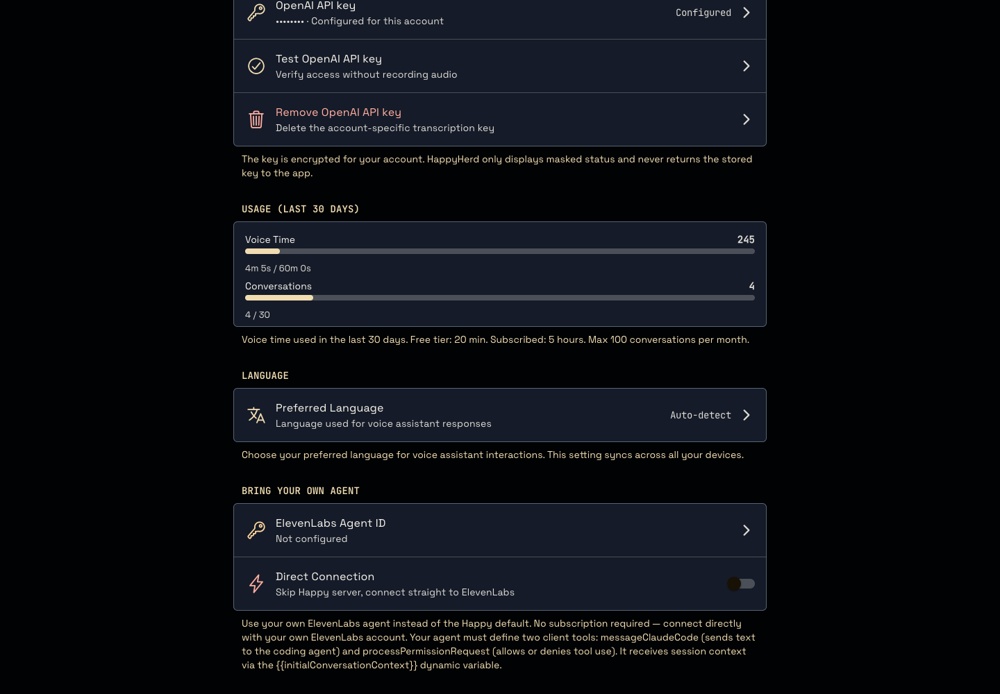</a>

**populated · dark · 390×844**

<a href="voice-populated-dark-390.png">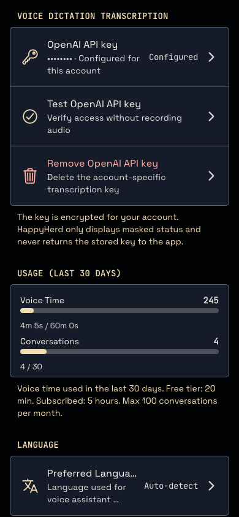</a>

**scrolled-bottom · dark · 390×844**

<a href="voice-scrolled-bottom-dark-390.png">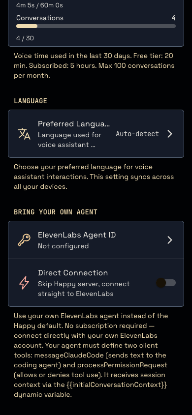</a>

## Voice language

**Changed presentation:** KILV settings rows and grouped panels, Space Grotesk labels, JetBrains Mono data and themed controls.

**Evidence:** `component-fixture`. States: populated.

**Production owners:** `app/(app)/settings/voice/language.tsx`.

- Synthetic service/state boundaries; React Native Web adapter; not authenticated live or installed native evidence.
- Expo Router Stack.Screen options are registered but its native navigation header is outside this component fixture.

Fixture environment: [source graph and adapters](environment-routes.json).

| State | Theme | Viewport | Screenshot |
|---|---|---|---|
| populated | light | 1440×1000 | [Open full screenshot](voice-language-populated-light-1440.png) |
| populated | light | 390×844 | [Open full screenshot](voice-language-populated-light-390.png) |
| populated | dark | 1440×1000 | [Open full screenshot](voice-language-populated-dark-1440.png) |
| populated | dark | 390×844 | [Open full screenshot](voice-language-populated-dark-390.png) |

Show every screenshot for this panel

**populated · light · 1440×1000**

<a href="voice-language-populated-light-1440.png">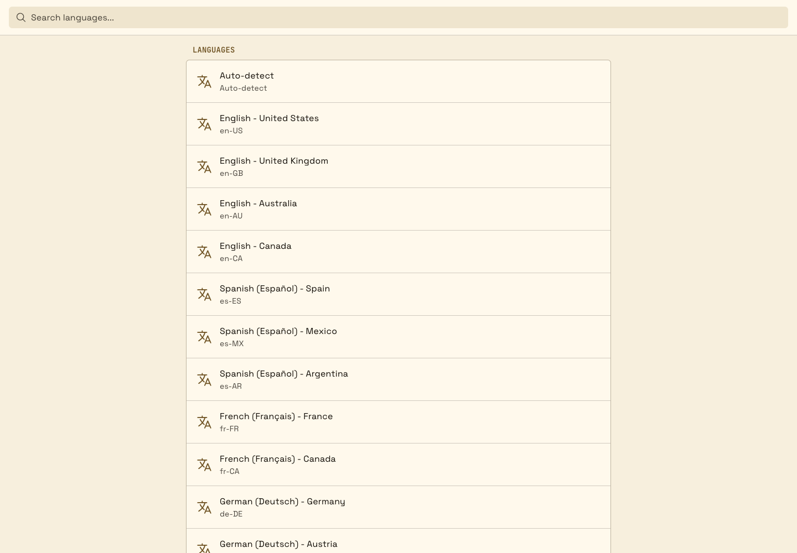</a>

**populated · light · 390×844**

<a href="voice-language-populated-light-390.png">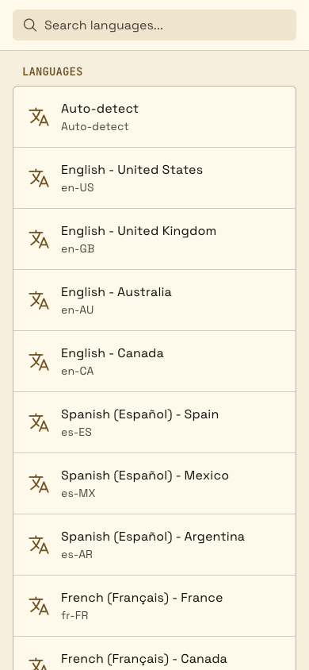</a>

**populated · dark · 1440×1000**

<a href="voice-language-populated-dark-1440.png">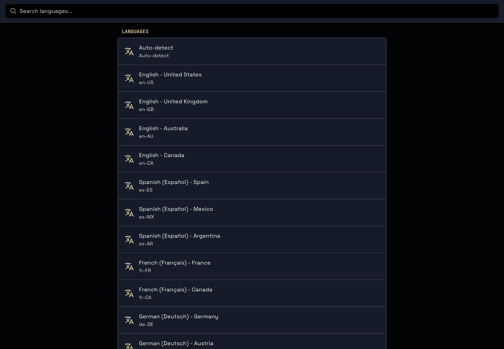</a>

**populated · dark · 390×844**

<a href="voice-language-populated-dark-390.png">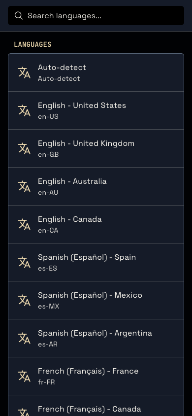</a>

## Connect Claude

**Changed presentation:** KILV settings rows and grouped panels, Space Grotesk labels, JetBrains Mono data and themed controls.

**Evidence:** `component-fixture`. States: populated.

**Production owners:** `app/(app)/settings/connect/claude.tsx`.

- Synthetic service/state boundaries; React Native Web adapter; not authenticated live or installed native evidence.
- Expo Router Stack.Screen options are registered but its native navigation header is outside this component fixture.
- Web manual OAuth setup only; native OAuthView WebView is not mounted on Web.

Fixture environment: [source graph and adapters](environment-routes.json).

| State | Theme | Viewport | Screenshot |
|---|---|---|---|
| populated | light | 1440×1000 | [Open full screenshot](claude-populated-light-1440.png) |
| populated | light | 390×844 | [Open full screenshot](claude-populated-light-390.png) |
| populated | dark | 1440×1000 | [Open full screenshot](claude-populated-dark-1440.png) |
| populated | dark | 390×844 | [Open full screenshot](claude-populated-dark-390.png) |

Show every screenshot for this panel

**populated · light · 1440×1000**

<a href="claude-populated-light-1440.png">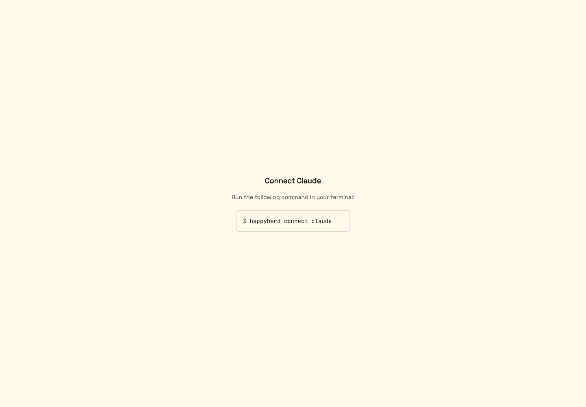</a>

**populated · light · 390×844**

<a href="claude-populated-light-390.png">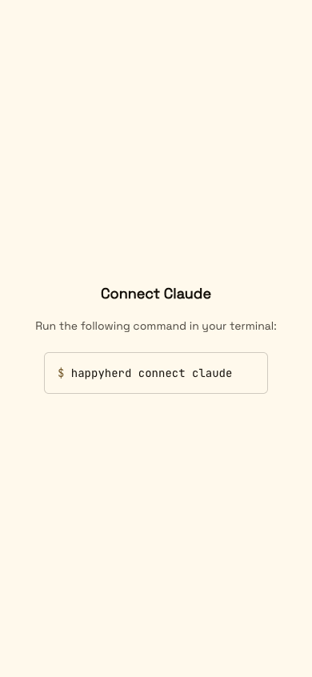</a>

**populated · dark · 1440×1000**

<a href="claude-populated-dark-1440.png">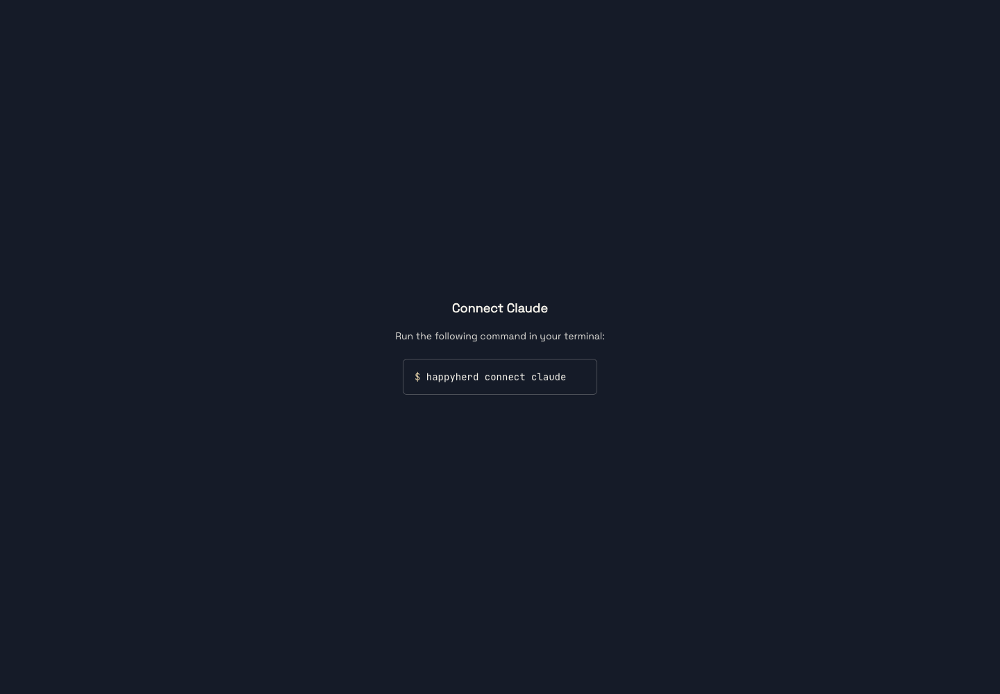</a>

**populated · dark · 390×844**

<a href="claude-populated-dark-390.png">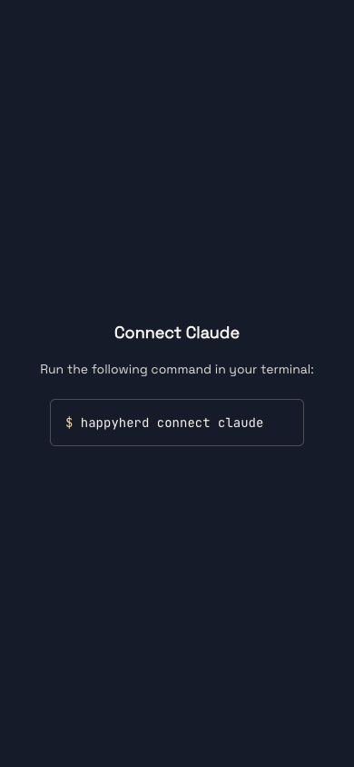</a>

## Connect terminal

**Changed presentation:** Shared KILV palette, typography, border geometry and interactive control styling.

**Evidence:** `component-fixture`. States: populated.

**Production owners:** `app/(app)/terminal/connect.tsx`.

- Synthetic service/state boundaries; React Native Web adapter; not authenticated live or installed native evidence.
- Expo Router Stack.Screen options are registered but its native navigation header is outside this component fixture.

Fixture environment: [source graph and adapters](environment-routes.json).

| State | Theme | Viewport | Screenshot |
|---|---|---|---|
| populated | light | 1440×1000 | [Open full screenshot](terminal-populated-light-1440.png) |
| populated | light | 390×844 | [Open full screenshot](terminal-populated-light-390.png) |
| populated | dark | 1440×1000 | [Open full screenshot](terminal-populated-dark-1440.png) |
| populated | dark | 390×844 | [Open full screenshot](terminal-populated-dark-390.png) |

Show every screenshot for this panel

**populated · light · 1440×1000**

**populated · light · 390×844**

<a href="terminal-populated-light-390.png">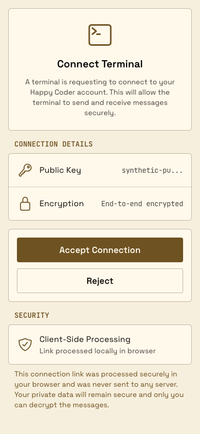</a>

**populated · dark · 1440×1000**

<a href="terminal-populated-dark-1440.png">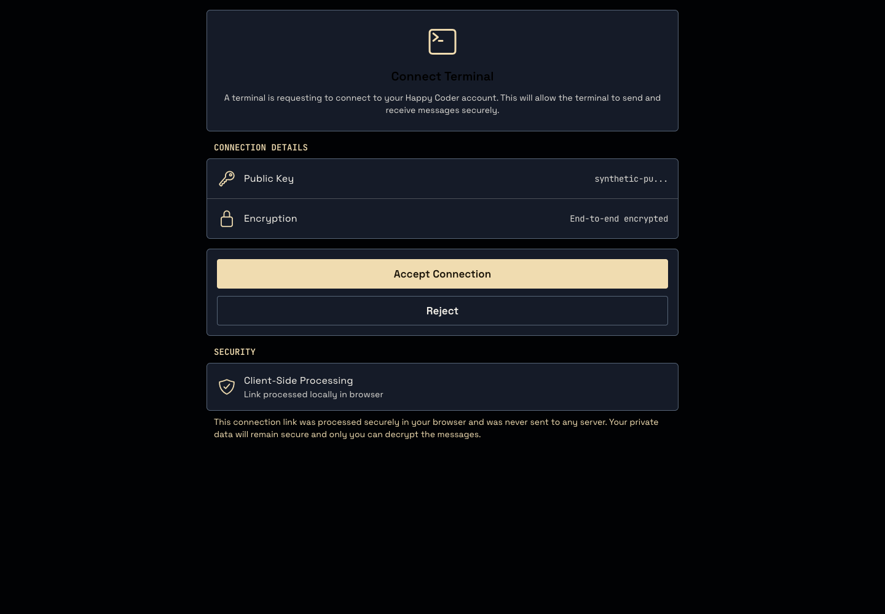</a>

**populated · dark · 390×844**

<a href="terminal-populated-dark-390.png">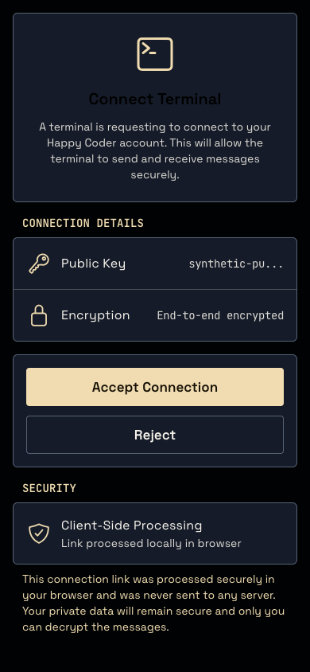</a>

## Select text

**Changed presentation:** Shared KILV palette, typography, border geometry and interactive control styling.

**Evidence:** `component-fixture`. States: populated.

**Production owners:** `app/(app)/text-selection.tsx`.

- Synthetic service/state boundaries; React Native Web adapter; not authenticated live or installed native evidence.
- Expo Router Stack.Screen options are registered but its native navigation header is outside this component fixture.

Fixture environment: [source graph and adapters](environment-routes.json).

| State | Theme | Viewport | Screenshot |
|---|---|---|---|
| populated | light | 1440×1000 | [Open full screenshot](text-selection-populated-light-1440.png) |
| populated | light | 390×844 | [Open full screenshot](text-selection-populated-light-390.png) |
| populated | dark | 1440×1000 | [Open full screenshot](text-selection-populated-dark-1440.png) |
| populated | dark | 390×844 | [Open full screenshot](text-selection-populated-dark-390.png) |

Show every screenshot for this panel

**populated · light · 1440×1000**

<a href="text-selection-populated-light-1440.png">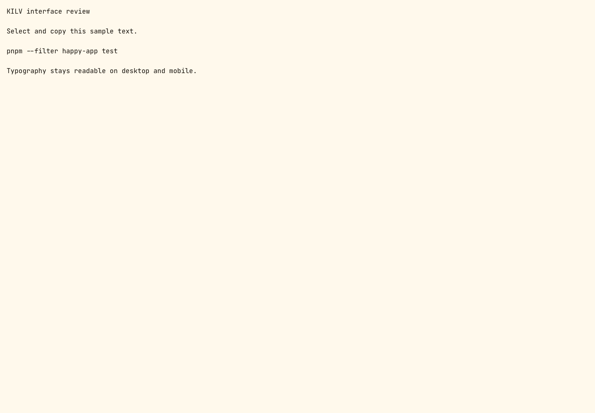</a>

**populated · light · 390×844**

<a href="text-selection-populated-light-390.png">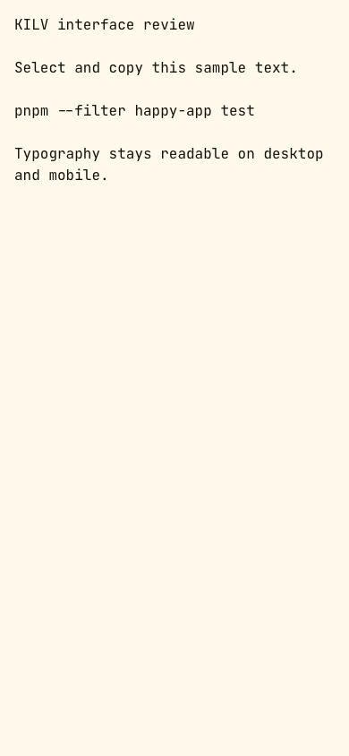</a>

**populated · dark · 1440×1000**

<a href="text-selection-populated-dark-1440.png">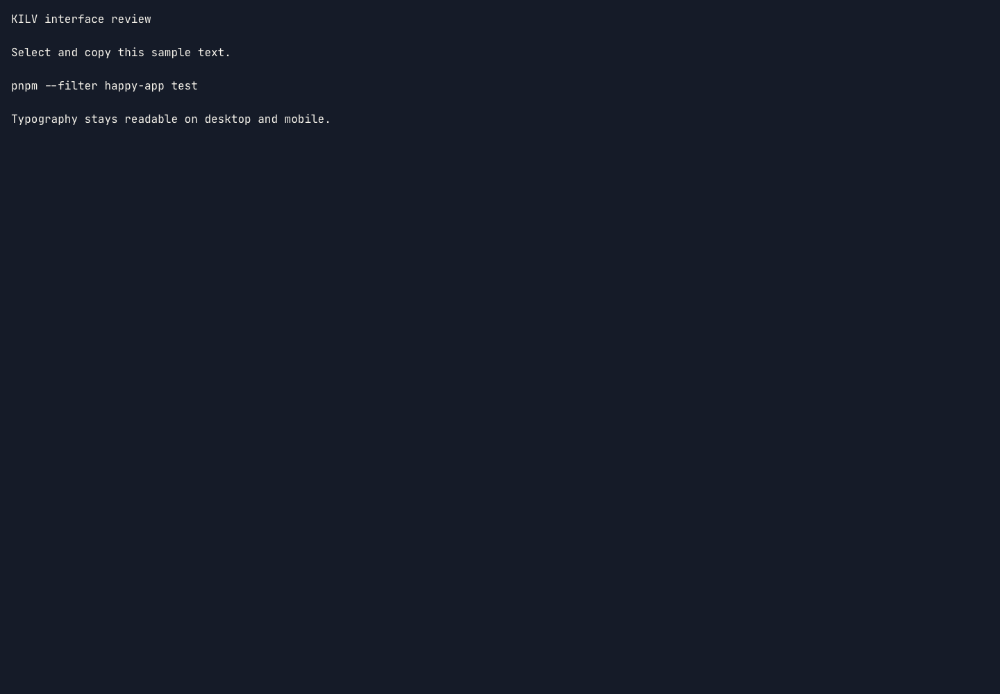</a>

**populated · dark · 390×844**

<a href="text-selection-populated-dark-390.png">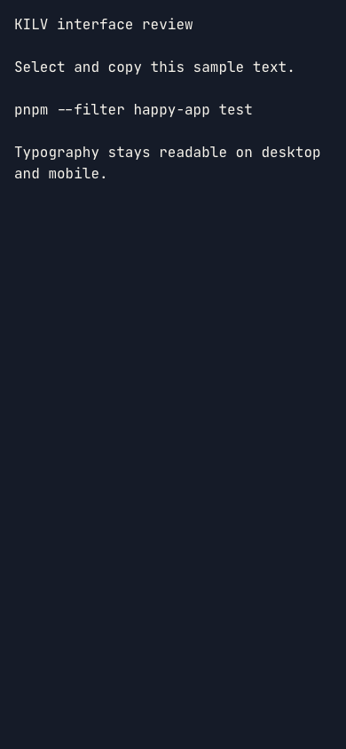</a>

## Terminal connection request

**Changed presentation:** Shared KILV palette, typography, border geometry and interactive control styling.

**Evidence:** `component-fixture`. States: confirmation.

**Production owners:** `app/(app)/terminal/index.tsx`.

- Synthetic service/state boundaries; React Native Web adapter; not authenticated live or installed native evidence.
- Expo Router Stack.Screen options are registered but its native navigation header is outside this component fixture.

Fixture environment: [source graph and adapters](environment-routes.json).

| State | Theme | Viewport | Screenshot |
|---|---|---|---|
| confirmation | light | 1440×1000 | [Open full screenshot](terminal-confirm-confirmation-light-1440.png) |
| confirmation | light | 390×844 | [Open full screenshot](terminal-confirm-confirmation-light-390.png) |
| confirmation | dark | 1440×1000 | [Open full screenshot](terminal-confirm-confirmation-dark-1440.png) |
| confirmation | dark | 390×844 | [Open full screenshot](terminal-confirm-confirmation-dark-390.png) |

Show every screenshot for this panel

**confirmation · light · 1440×1000**

<a href="terminal-confirm-confirmation-light-1440.png">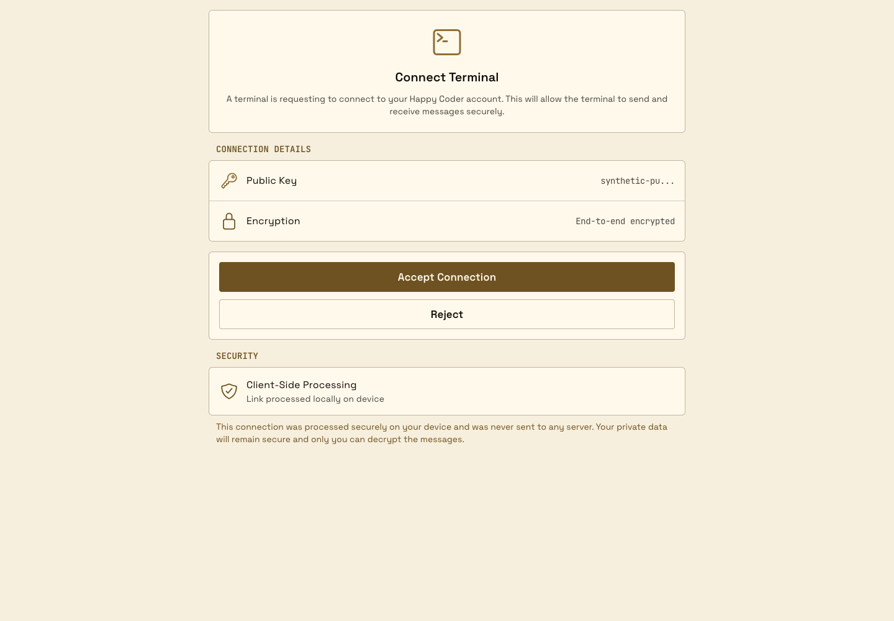</a>

**confirmation · light · 390×844**

<a href="terminal-confirm-confirmation-light-390.png">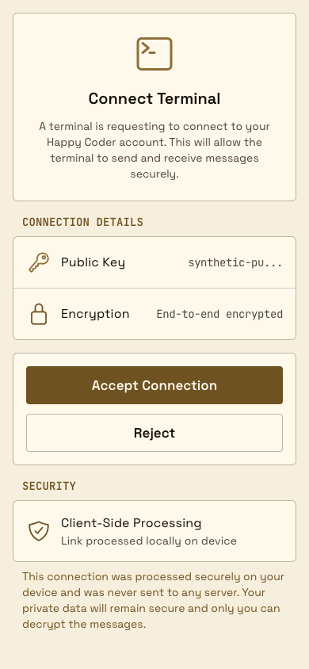</a>

**confirmation · dark · 1440×1000**

<a href="terminal-confirm-confirmation-dark-1440.png">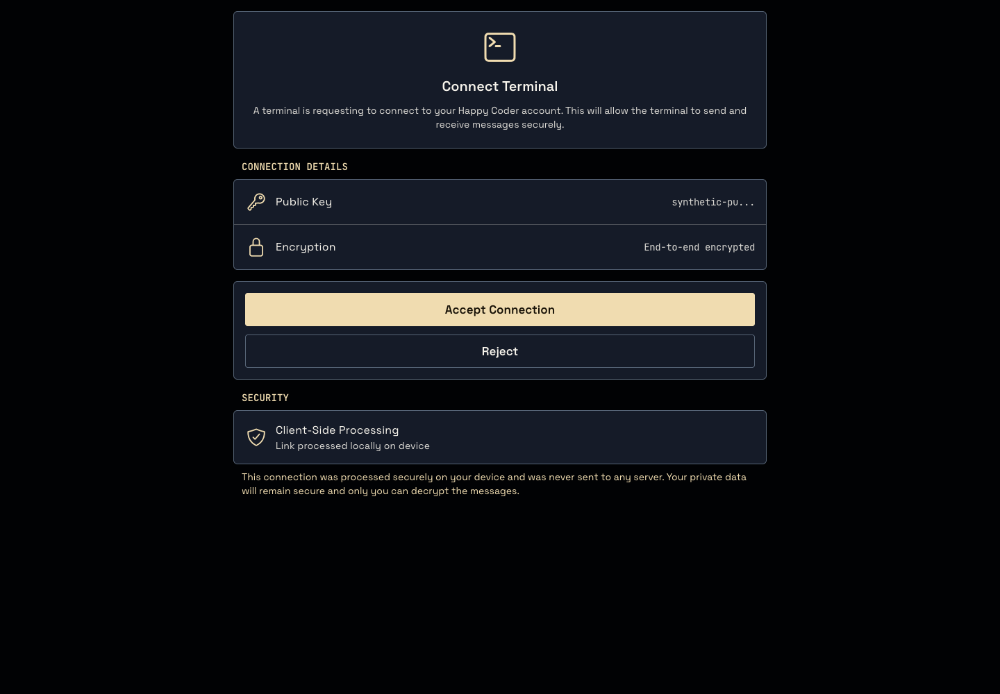</a>

**confirmation · dark · 390×844**

<a href="terminal-confirm-confirmation-dark-390.png">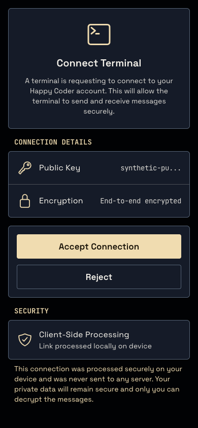</a>

## Invalid terminal link

**Changed presentation:** Shared KILV palette, typography, border geometry and interactive control styling.

**Evidence:** `component-fixture`. States: invalid-link.

**Production owners:** `app/(app)/terminal/index.tsx`.

- Synthetic service/state boundaries; React Native Web adapter; not authenticated live or installed native evidence.
- Expo Router Stack.Screen options are registered but its native navigation header is outside this component fixture.

Fixture environment: [source graph and adapters](environment-routes.json).

| State | Theme | Viewport | Screenshot |
|---|---|---|---|
| invalid-link | light | 1440×1000 | [Open full screenshot](terminal-invalid-invalid-link-light-1440.png) |
| invalid-link | light | 390×844 | [Open full screenshot](terminal-invalid-invalid-link-light-390.png) |
| invalid-link | dark | 1440×1000 | [Open full screenshot](terminal-invalid-invalid-link-dark-1440.png) |
| invalid-link | dark | 390×844 | [Open full screenshot](terminal-invalid-invalid-link-dark-390.png) |

Show every screenshot for this panel

**invalid-link · light · 1440×1000**

<a href="terminal-invalid-invalid-link-light-1440.png">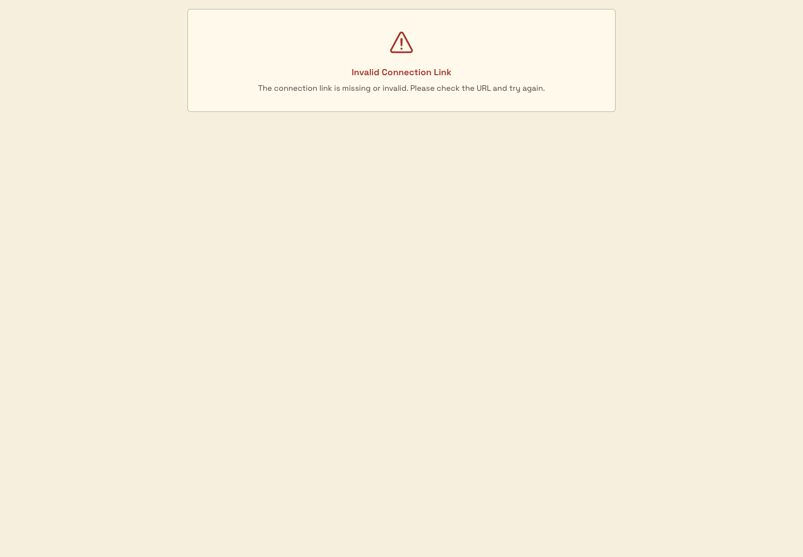</a>

**invalid-link · light · 390×844**

<a href="terminal-invalid-invalid-link-light-390.png">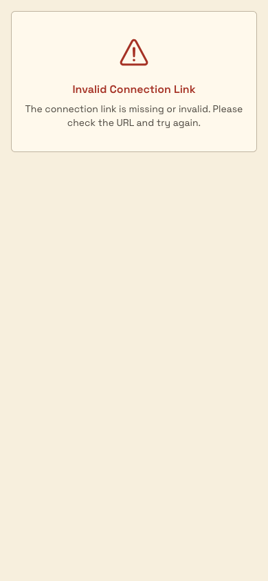</a>

**invalid-link · dark · 1440×1000**

<a href="terminal-invalid-invalid-link-dark-1440.png">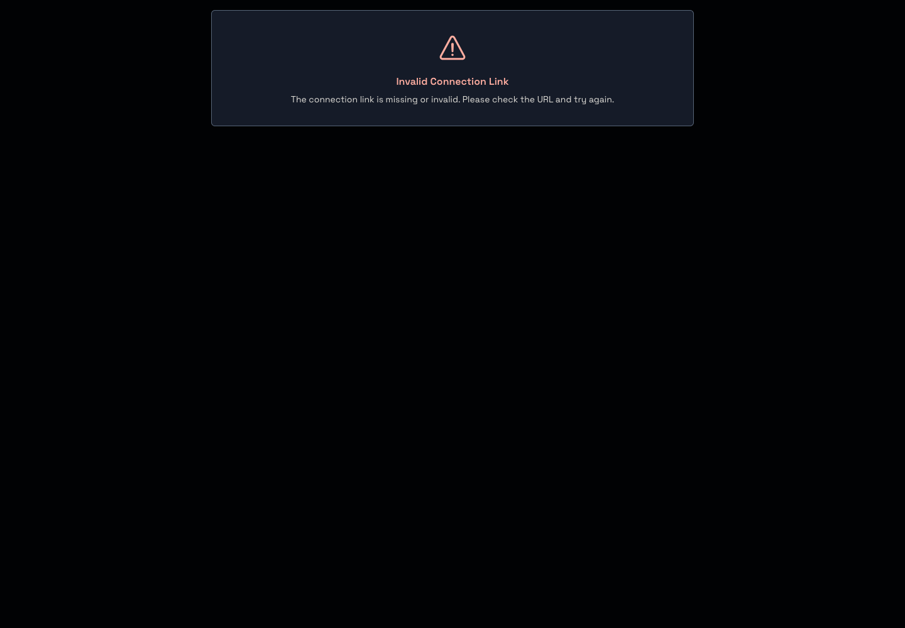</a>

**invalid-link · dark · 390×844**

<a href="terminal-invalid-invalid-link-dark-390.png">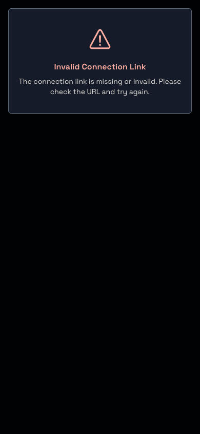</a>

## User profile

**Changed presentation:** Shared KILV palette, typography, border geometry and interactive control styling.

**Evidence:** `component-fixture`. States: populated.

**Production owners:** `app/(app)/user/[id].tsx`.

- Synthetic service/state boundaries; React Native Web adapter; not authenticated live or installed native evidence.
- Expo Router Stack.Screen options are registered but its native navigation header is outside this component fixture.

Fixture environment: [source graph and adapters](environment-routes.json).

| State | Theme | Viewport | Screenshot |
|---|---|---|---|
| populated | light | 1440×1000 | [Open full screenshot](user-populated-light-1440.png) |
| populated | light | 390×844 | [Open full screenshot](user-populated-light-390.png) |
| populated | dark | 1440×1000 | [Open full screenshot](user-populated-dark-1440.png) |
| populated | dark | 390×844 | [Open full screenshot](user-populated-dark-390.png) |

Show every screenshot for this panel

**populated · light · 1440×1000**

<a href="user-populated-light-1440.png">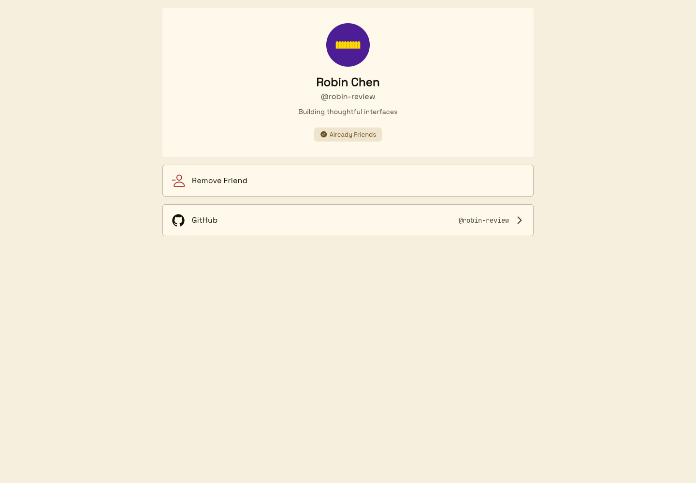</a>

**populated · light · 390×844**

<a href="user-populated-light-390.png">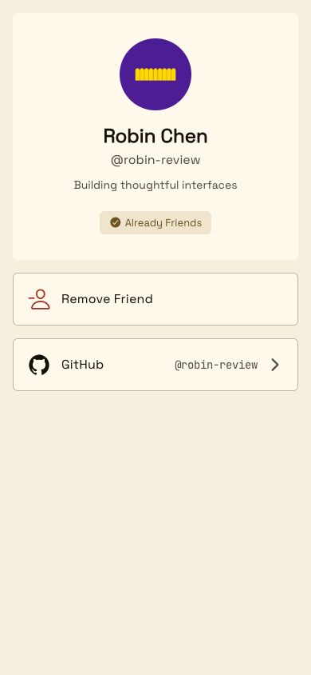</a>

**populated · dark · 1440×1000**

<a href="user-populated-dark-1440.png">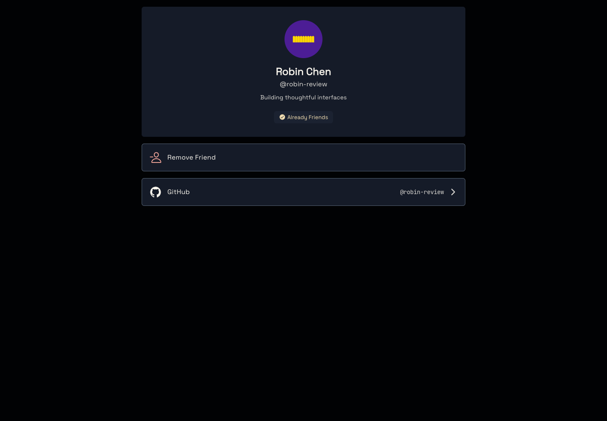</a>

**populated · dark · 390×844**

<a href="user-populated-dark-390.png">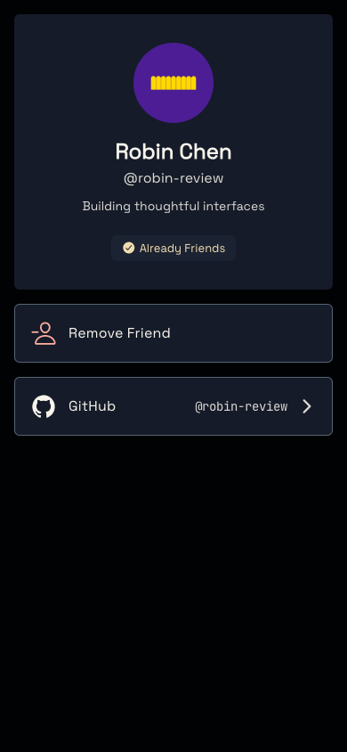</a>

## Settings

**Changed presentation:** KILV settings rows and grouped panels, Space Grotesk labels, JetBrains Mono data and themed controls.

**Evidence:** `component-fixture`. States: populated, scrolled-bottom.

**Production owners:** `components/SettingsView.tsx`.

- Synthetic service/state boundaries; React Native Web adapter; not authenticated live or installed native evidence.
- Expo Router Stack.Screen options are registered but its native navigation header is outside this component fixture.
- Scrolled to the bottom using the existing production overflow container.
- Synthetic service data; native navigation header is outside this fixture.

Fixture environment: [source graph and adapters](environment-routes.json).

| State | Theme | Viewport | Screenshot |
|---|---|---|---|
| populated | light | 1440×1000 | [Open full screenshot](settings-populated-light-1440.png) |
| scrolled-bottom | light | 1440×1000 | [Open full screenshot](settings-scrolled-bottom-light-1440.png) |
| populated | light | 390×844 | [Open full screenshot](settings-populated-light-390.png) |
| scrolled-bottom | light | 390×844 | [Open full screenshot](settings-scrolled-bottom-light-390.png) |
| populated | dark | 1440×1000 | [Open full screenshot](settings-populated-dark-1440.png) |
| scrolled-bottom | dark | 1440×1000 | [Open full screenshot](settings-scrolled-bottom-dark-1440.png) |
| populated | dark | 390×844 | [Open full screenshot](settings-populated-dark-390.png) |
| scrolled-bottom | dark | 390×844 | [Open full screenshot](settings-scrolled-bottom-dark-390.png) |

Show every screenshot for this panel

**populated · light · 1440×1000**

<a href="settings-populated-light-1440.png">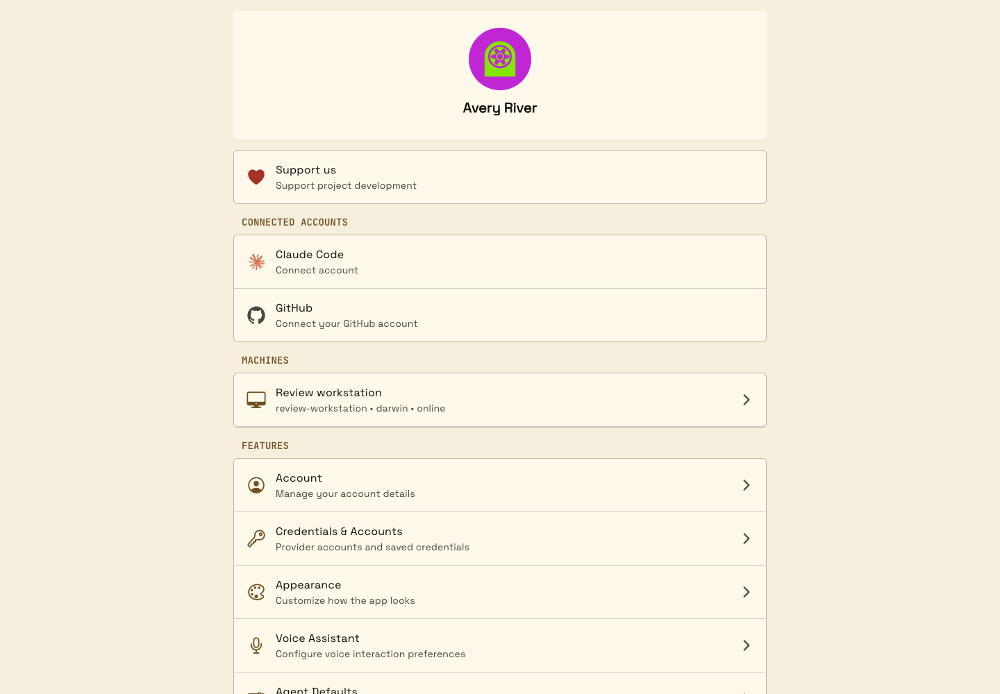</a>

**scrolled-bottom · light · 1440×1000**

<a href="settings-scrolled-bottom-light-1440.png">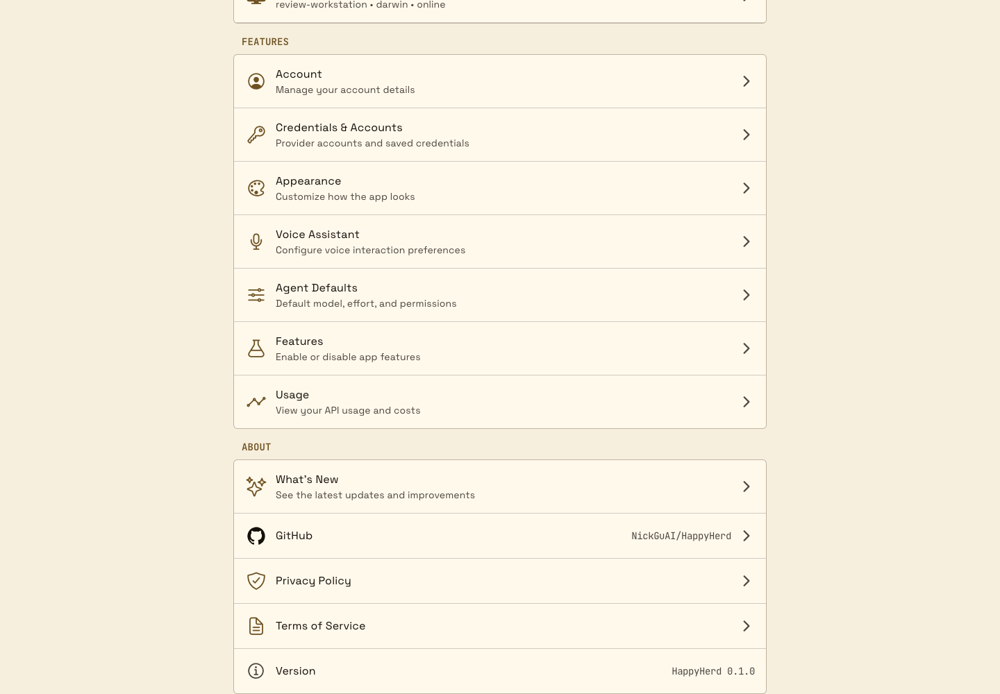</a>

**populated · light · 390×844**

<a href="settings-populated-light-390.png">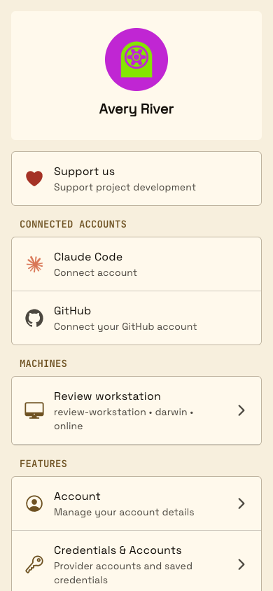</a>

**scrolled-bottom · light · 390×844**

<a href="settings-scrolled-bottom-light-390.png">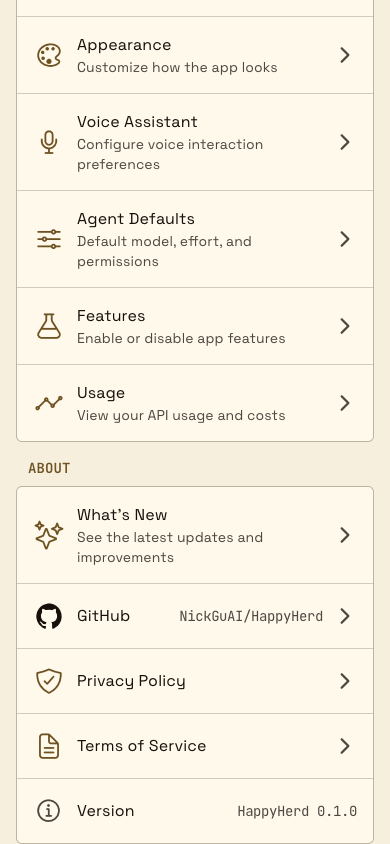</a>

**populated · dark · 1440×1000**

<a href="settings-populated-dark-1440.png">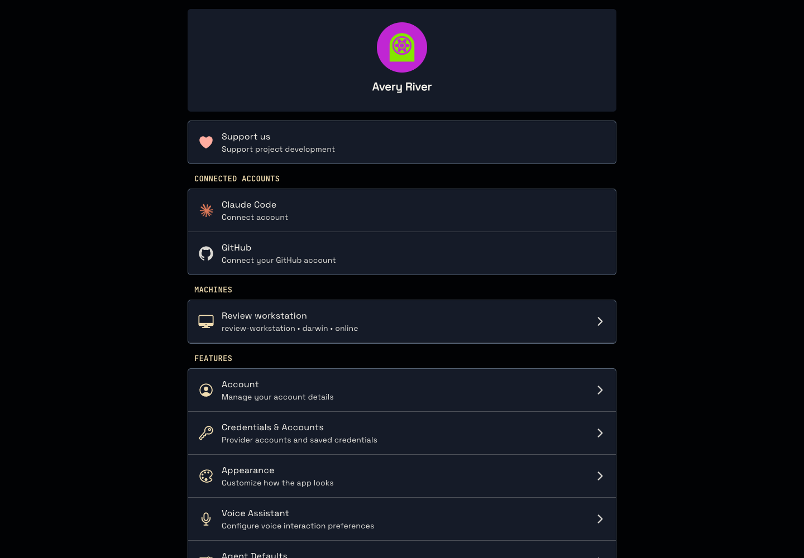</a>

**scrolled-bottom · dark · 1440×1000**

<a href="settings-scrolled-bottom-dark-1440.png">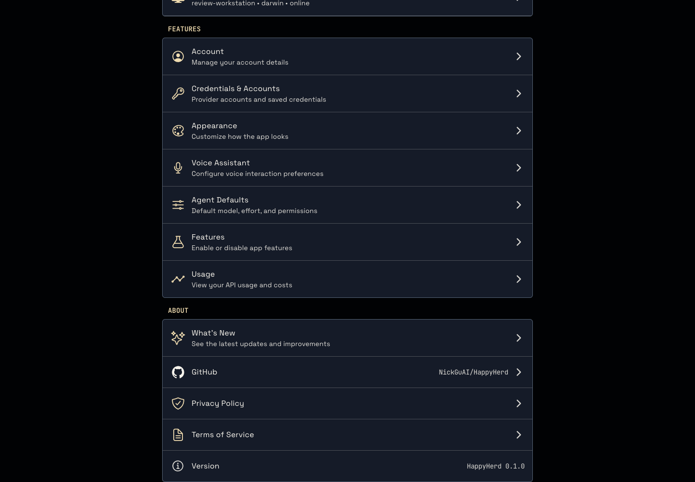</a>

**populated · dark · 390×844**

<a href="settings-populated-dark-390.png">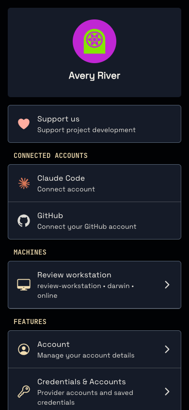</a>

**scrolled-bottom · dark · 390×844**

<a href="settings-scrolled-bottom-dark-390.png">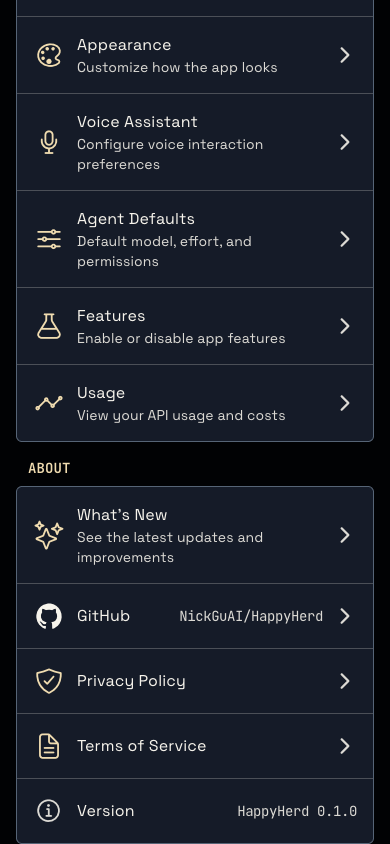</a>

## Saved credentials

**Changed presentation:** KILV form surfaces, readable primary/secondary actions, Space Grotesk labels and 16px inputs.

**Evidence:** `component-fixture`. States: populated, scrolled-bottom.

**Production owners:** `components/CredentialsSettingsView.tsx`.

- Synthetic service/state boundaries; React Native Web adapter; not authenticated live or installed native evidence.
- Expo Router Stack.Screen options are registered but its native navigation header is outside this component fixture.
- Scrolled to the bottom using the existing production overflow container.
- Synthetic service data; native navigation header is outside this fixture.

Fixture environment: [source graph and adapters](environment-routes.json).

| State | Theme | Viewport | Screenshot |
|---|---|---|---|
| populated | light | 1440×1000 | [Open full screenshot](credentials-populated-light-1440.png) |
| populated | light | 390×844 | [Open full screenshot](credentials-populated-light-390.png) |
| scrolled-bottom | light | 390×844 | [Open full screenshot](credentials-scrolled-bottom-light-390.png) |
| populated | dark | 1440×1000 | [Open full screenshot](credentials-populated-dark-1440.png) |
| populated | dark | 390×844 | [Open full screenshot](credentials-populated-dark-390.png) |
| scrolled-bottom | dark | 390×844 | [Open full screenshot](credentials-scrolled-bottom-dark-390.png) |

Show every screenshot for this panel

**populated · light · 1440×1000**

<a href="credentials-populated-light-1440.png">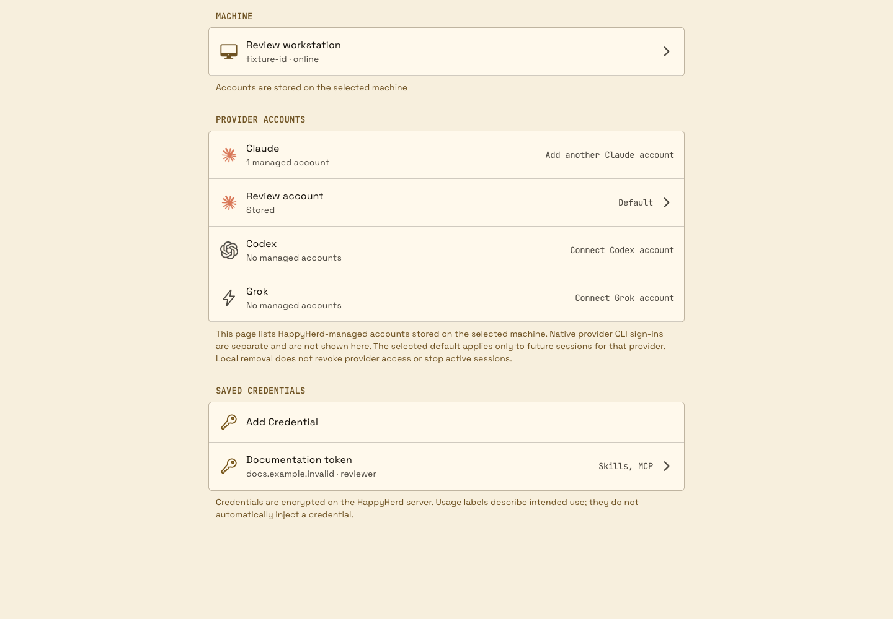</a>

**populated · light · 390×844**

<a href="credentials-populated-light-390.png">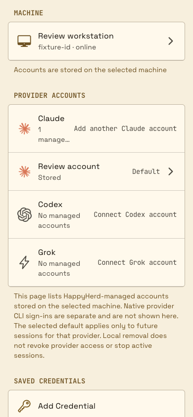</a>

**scrolled-bottom · light · 390×844**

<a href="credentials-scrolled-bottom-light-390.png">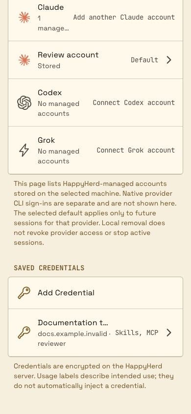</a>

**populated · dark · 1440×1000**

<a href="credentials-populated-dark-1440.png">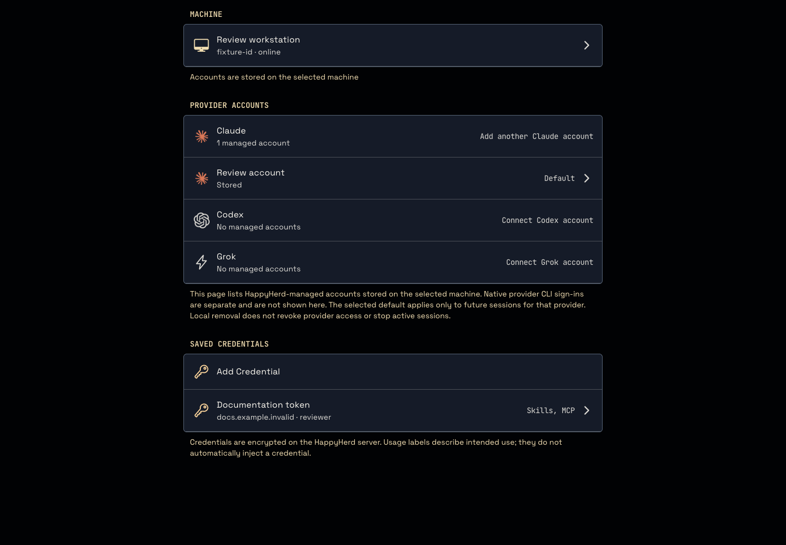</a>

**populated · dark · 390×844**

<a href="credentials-populated-dark-390.png">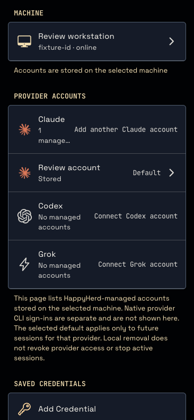</a>

**scrolled-bottom · dark · 390×844**

<a href="credentials-scrolled-bottom-dark-390.png">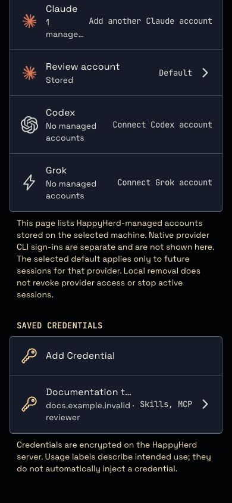</a>

## Provider usage

**Changed presentation:** KILV settings rows and grouped panels, Space Grotesk labels, JetBrains Mono data and themed controls.

**Evidence:** `component-fixture`. States: populated.

**Production owners:** `components/usage/UsagePanel.tsx`, `components/usage/UsageChart.tsx`, `components/usage/UsageBar.tsx`.

- Synthetic service/state boundaries; React Native Web adapter; not authenticated live or installed native evidence.
- Known pre-existing chart clipping: upper bars and value labels are clipped by the horizontal ScrollView. Chart height, padding, and bar-scaling geometry are unchanged from baseline 189c504b; KILV changes only typography and semantic colors. The screenshot preserves this defect.
- Expo Router Stack.Screen options are registered but its native navigation header is outside this component fixture.

Fixture environment: [source graph and adapters](environment-routes.json).

| State | Theme | Viewport | Screenshot |
|---|---|---|---|
| populated | light | 1440×1000 | [Open full screenshot](usage-populated-light-1440.png) |
| populated | light | 390×844 | [Open full screenshot](usage-populated-light-390.png) |
| populated | dark | 1440×1000 | [Open full screenshot](usage-populated-dark-1440.png) |
| populated | dark | 390×844 | [Open full screenshot](usage-populated-dark-390.png) |

Show every screenshot for this panel

**populated · light · 1440×1000**

<a href="usage-populated-light-1440.png">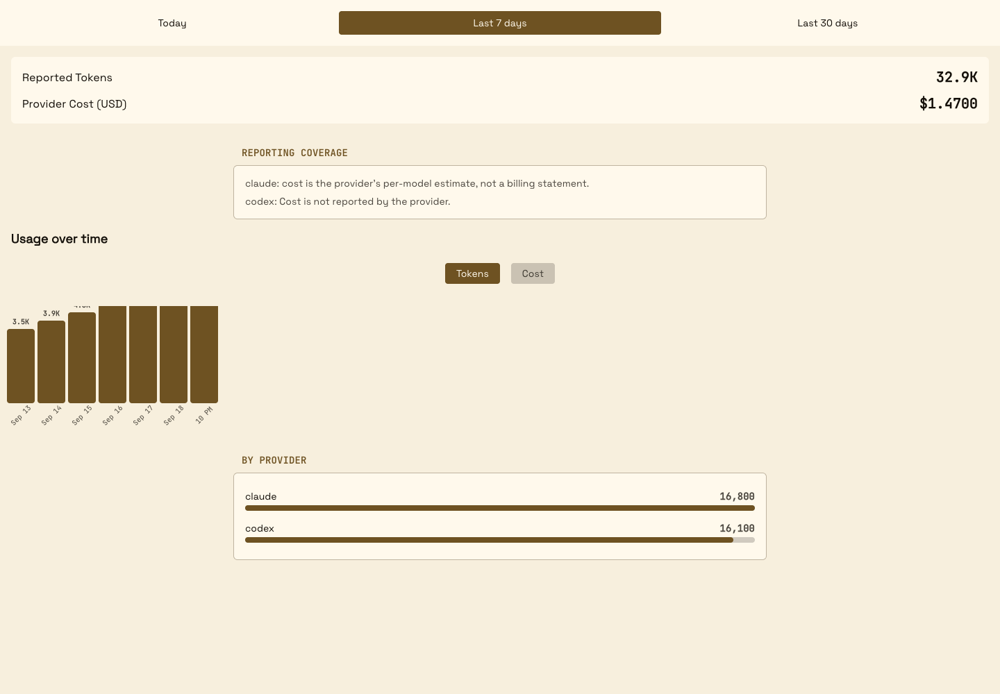</a>

**populated · light · 390×844**

<a href="usage-populated-light-390.png">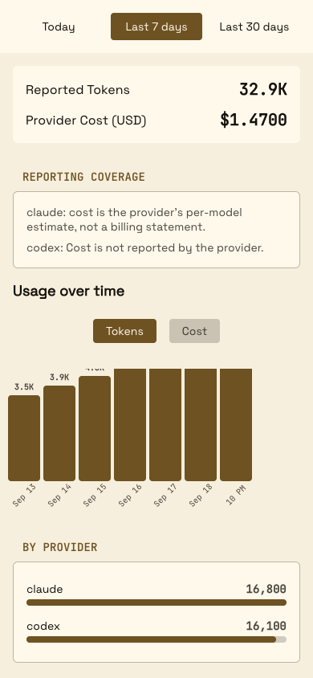</a>

**populated · dark · 1440×1000**

<a href="usage-populated-dark-1440.png">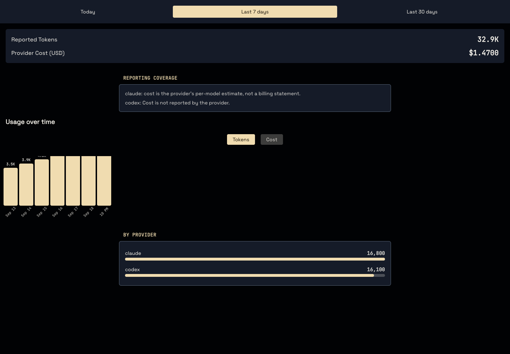</a>

**populated · dark · 390×844**

<a href="usage-populated-dark-390.png">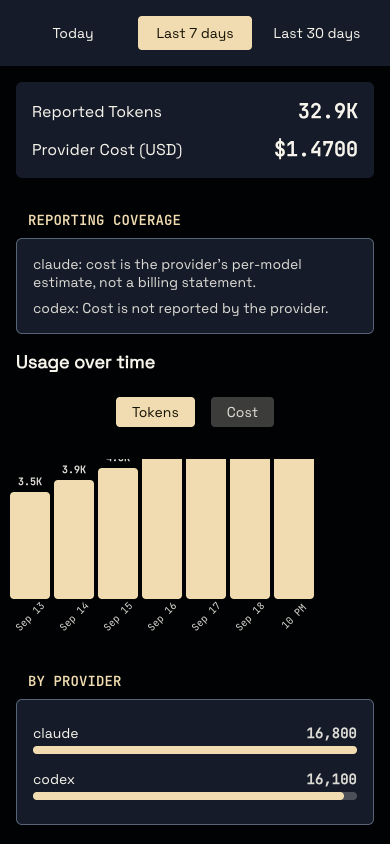</a>

