# Workspace panel screenshots

Production source revision: `a38fae51c2f99d34bc4d81b24ccfd4c7aa611b05`. These are after-change screenshots for [PR #289](https://github.com/NickGuAI/HappyHerd/pull/289).

**Evidence boundary:** production-export means the actual exported Web UI on an isolated local host with its backend offline. Component-fixture means real production components with synthetic service/state boundaries and documented Web platform adapters. Neither proves authenticated live journeys, physical iPhone behavior, or installed native clients.

## Desktop navigation and project/session groups

**Changed presentation:** Sidebar actions and session rows use KILV surfaces, compact geometry and Space Grotesk typography.

**Evidence:** `component-fixture`. States: representative.

**Production owners:** `components/SidebarView.tsx`, `components/SidebarNavigationButton.tsx`, `components/FlatSessionRow.tsx`.

- Synthetic service/state boundaries; React Native Web adapter; not authenticated live or installed native evidence.
- The surrounding avatar/provider identities and service state are synthetic; navigation, grouping and session rows are production components.
- Surrounding visual renderer replacements supplied by the fixture: Avatar, AvatarBrutalist, AvatarSkia, AvatarGradient, CommanderSessionAvatar, ProviderIcon, HarnessBadgeIcon, StatusDot. These renderers are outside the claimed source owners and are not visual evidence for their production appearance; target owners, Typography and Expo vector icon glyphs remain real.

Fixture environment: [source graph and adapters](sidebar-projects/environment-workspace-sidebar-projects.json).

| State | Theme | Viewport | Screenshot |
|---|---|---|---|
| representative | light | 1440×900 | [Open full screenshot](sidebar-projects/sidebar-projects-representative-light-1440.png) |
| representative | light | 390×844 | [Open full screenshot](sidebar-projects/sidebar-projects-representative-light-390.png) |
| representative | dark | 1440×900 | [Open full screenshot](sidebar-projects/sidebar-projects-representative-dark-1440.png) |
| representative | dark | 390×844 | [Open full screenshot](sidebar-projects/sidebar-projects-representative-dark-390.png) |

Show every screenshot for this panel

**representative · light · 1440×900**

<a href="sidebar-projects/sidebar-projects-representative-light-1440.png">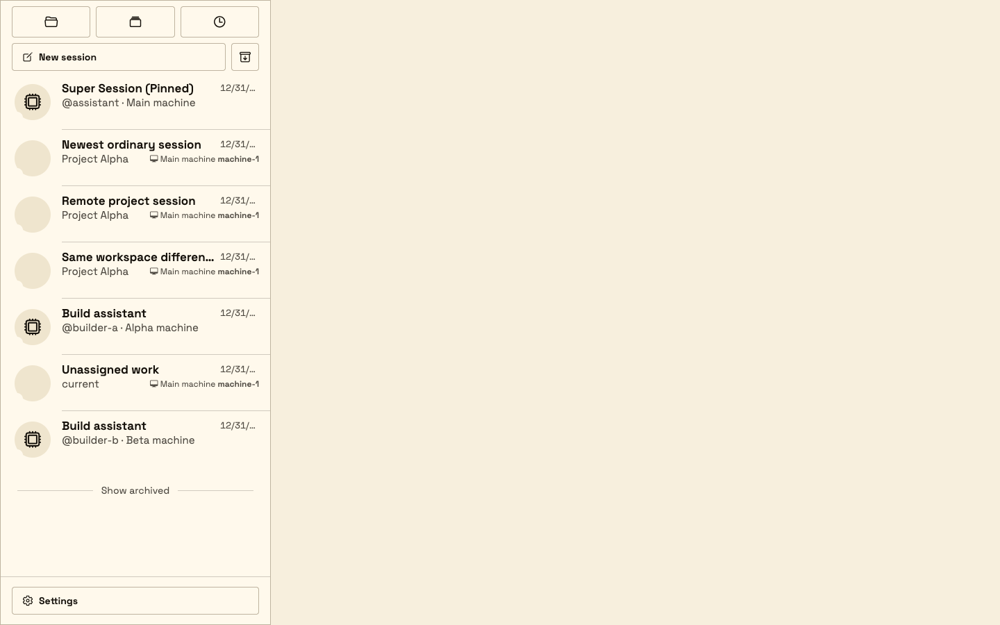</a>

**representative · light · 390×844**

<a href="sidebar-projects/sidebar-projects-representative-light-390.png">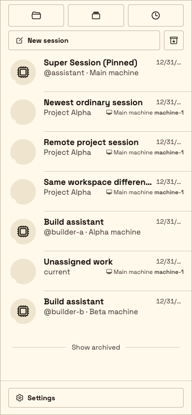</a>

**representative · dark · 1440×900**

<a href="sidebar-projects/sidebar-projects-representative-dark-1440.png">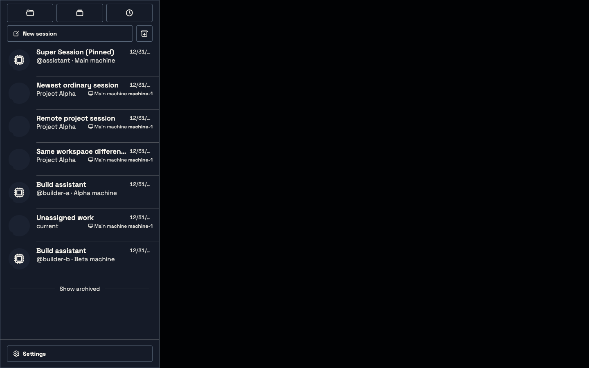</a>

**representative · dark · 390×844**

<a href="sidebar-projects/sidebar-projects-representative-dark-390.png">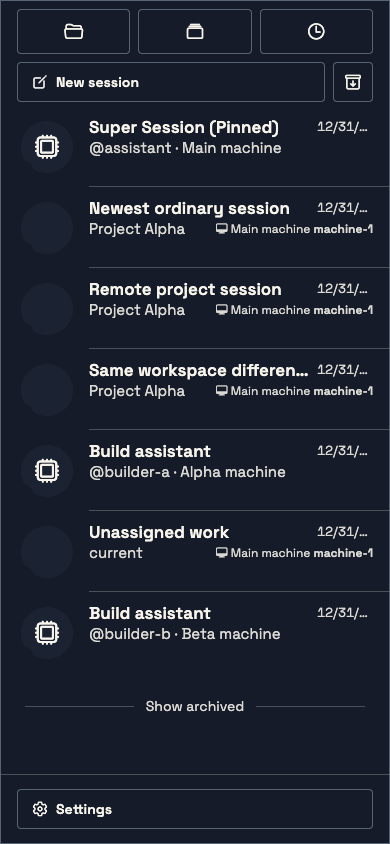</a>

## Active session workspace groups

**Changed presentation:** Workspace and project groups use semantic borders, status tones and compact session row spacing.

**Evidence:** `component-fixture`. States: representative.

**Production owners:** `components/ActiveSessionsGroupCompact.tsx`, `components/ProjectGroup.tsx`.

- Synthetic service/state boundaries; React Native Web adapter; not authenticated live or installed native evidence.
- Avatar/provider identities and account state are synthetic.
- Surrounding visual renderer replacements supplied by the fixture: Avatar, AvatarBrutalist, AvatarSkia, AvatarGradient, CommanderSessionAvatar, ProviderIcon, HarnessBadgeIcon, StatusDot. These renderers are outside the claimed source owners and are not visual evidence for their production appearance; target owners, Typography and Expo vector icon glyphs remain real.

Fixture environment: [source graph and adapters](session-workspace-groups/environment-workspace-session-workspace-groups.json).

| State | Theme | Viewport | Screenshot |
|---|---|---|---|
| representative | light | 1440×900 | [Open full screenshot](session-workspace-groups/session-workspace-groups-representative-light-1440.png) |
| representative | light | 390×844 | [Open full screenshot](session-workspace-groups/session-workspace-groups-representative-light-390.png) |
| representative | dark | 1440×900 | [Open full screenshot](session-workspace-groups/session-workspace-groups-representative-dark-1440.png) |
| representative | dark | 390×844 | [Open full screenshot](session-workspace-groups/session-workspace-groups-representative-dark-390.png) |

Show every screenshot for this panel

**representative · light · 1440×900**

<a href="session-workspace-groups/session-workspace-groups-representative-light-1440.png">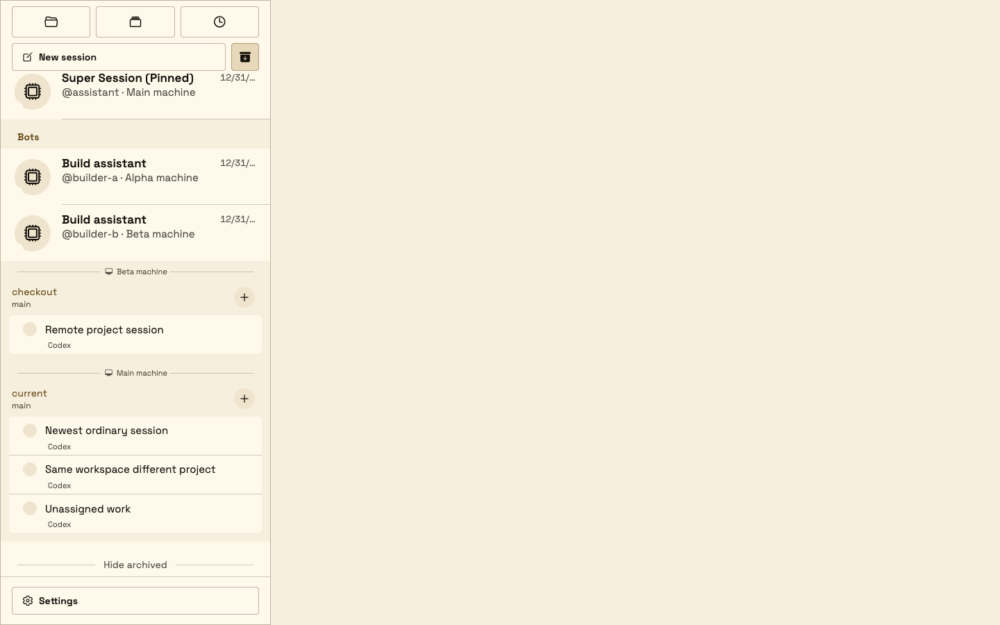</a>

**representative · light · 390×844**

<a href="session-workspace-groups/session-workspace-groups-representative-light-390.png">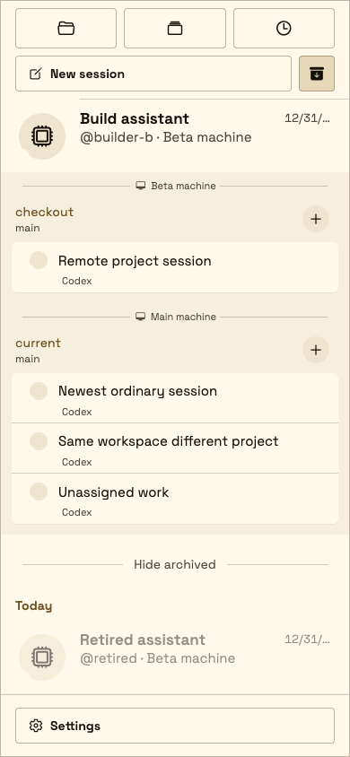</a>

**representative · dark · 1440×900**

<a href="session-workspace-groups/session-workspace-groups-representative-dark-1440.png">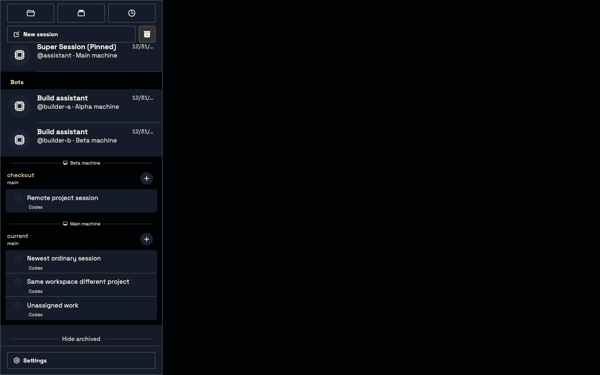</a>

**representative · dark · 390×844**

<a href="session-workspace-groups/session-workspace-groups-representative-dark-390.png">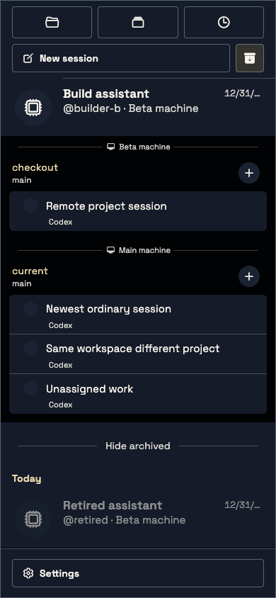</a>

## Project detail and assigned sessions

**Changed presentation:** Project detail actions, grouped session cards and mono workspace metadata inherit KILV tokens.

**Evidence:** `component-fixture`. States: representative.

**Production owners:** `app/(app)/projects/[id].tsx`, `components/FlatSessionRow.tsx`.

- Synthetic service/state boundaries; React Native Web adapter; not authenticated live or installed native evidence.
- Surrounding visual renderer replacements supplied by the fixture: Avatar, AvatarBrutalist, AvatarSkia, AvatarGradient, CommanderSessionAvatar, ProviderIcon, HarnessBadgeIcon, StatusDot. These renderers are outside the claimed source owners and are not visual evidence for their production appearance; target owners, Typography and Expo vector icon glyphs remain real.

Fixture environment: [source graph and adapters](project-detail/environment-workspace-project-detail.json).

| State | Theme | Viewport | Screenshot |
|---|---|---|---|
| representative | light | 1440×900 | [Open full screenshot](project-detail/project-detail-representative-light-1440.png) |
| representative | light | 390×844 | [Open full screenshot](project-detail/project-detail-representative-light-390.png) |
| representative | dark | 1440×900 | [Open full screenshot](project-detail/project-detail-representative-dark-1440.png) |
| representative | dark | 390×844 | [Open full screenshot](project-detail/project-detail-representative-dark-390.png) |

Show every screenshot for this panel

**representative · light · 1440×900**

<a href="project-detail/project-detail-representative-light-1440.png">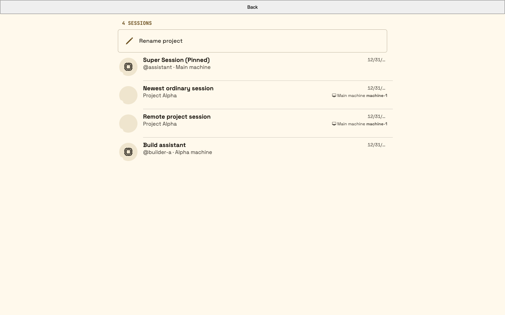</a>

**representative · light · 390×844**

<a href="project-detail/project-detail-representative-light-390.png">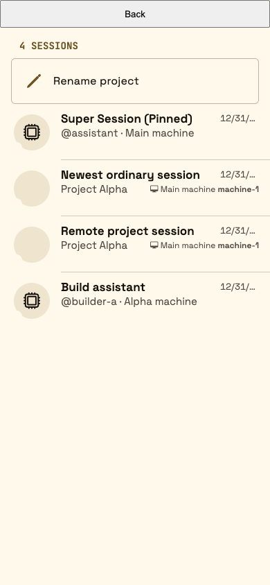</a>

**representative · dark · 1440×900**

<a href="project-detail/project-detail-representative-dark-1440.png">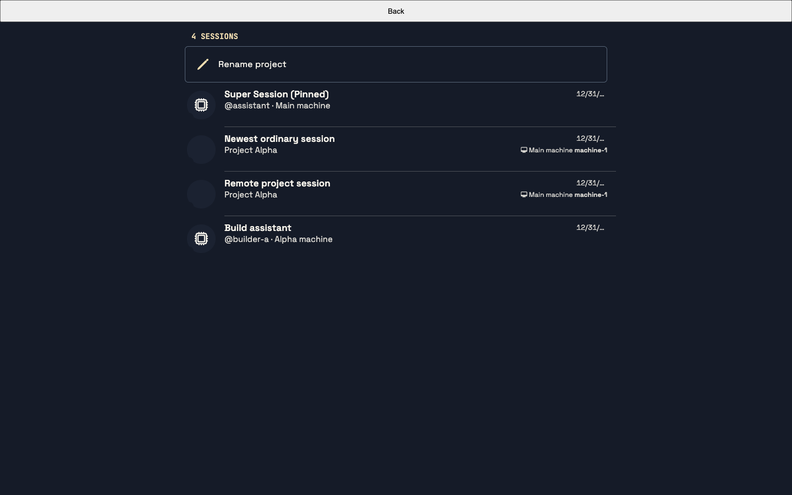</a>

**representative · dark · 390×844**

<a href="project-detail/project-detail-representative-dark-390.png">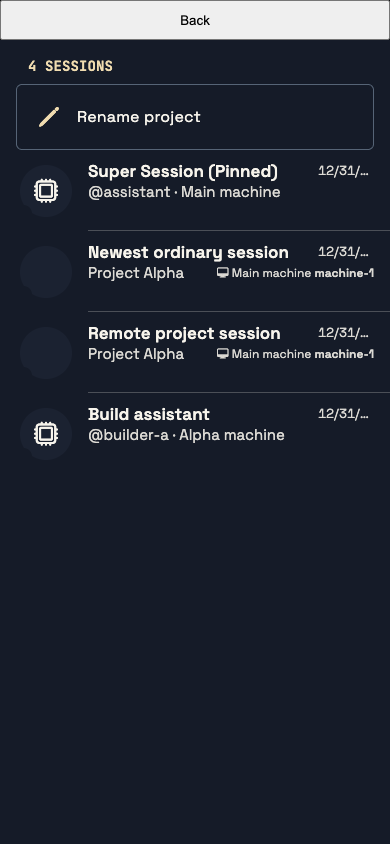</a>

## File workspace · Markdown preview

**Changed presentation:** File tabs, review toolbar and Markdown source-line controls share KILV surfaces and mono labels.

**Evidence:** `component-fixture`. States: representative.

**Production owners:** `components/DesktopFileWorkspace.tsx`, `components/FileViewPanel.tsx`, `components/markdown/MarkdownView.web.tsx`.

- Synthetic service/state boundaries; React Native Web adapter; not authenticated live or installed native evidence.
- File contents and machine RPC results are synthetic. Capture shows the production file viewer; it is not a live workspace.

Fixture environment: [source graph and adapters](workspace-markdown/environment-workspace-workspace-markdown.json).

| State | Theme | Viewport | Screenshot |
|---|---|---|---|
| representative | light | 1440×900 | [Open full screenshot](workspace-markdown/workspace-markdown-representative-light-1440.png) |
| representative | light | 390×844 | [Open full screenshot](workspace-markdown/workspace-markdown-representative-light-390.png) |
| representative | dark | 1440×900 | [Open full screenshot](workspace-markdown/workspace-markdown-representative-dark-1440.png) |
| representative | dark | 390×844 | [Open full screenshot](workspace-markdown/workspace-markdown-representative-dark-390.png) |

Show every screenshot for this panel

**representative · light · 1440×900**

<a href="workspace-markdown/workspace-markdown-representative-light-1440.png">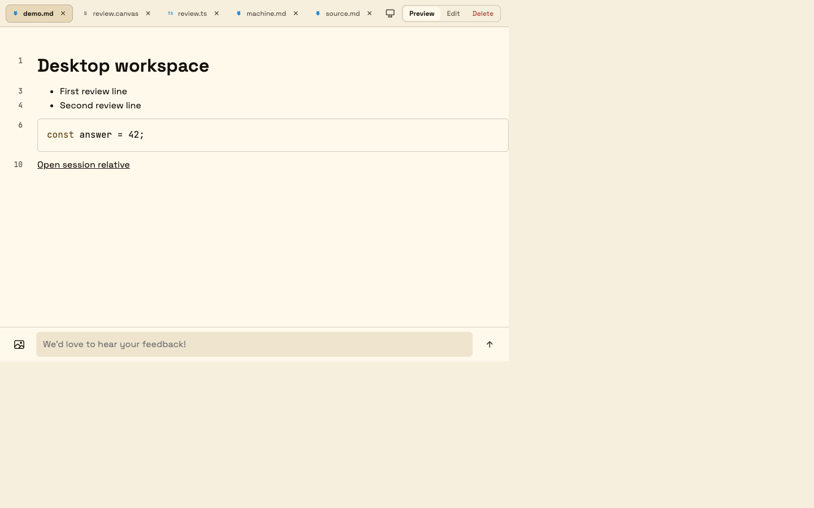</a>

**representative · light · 390×844**

<a href="workspace-markdown/workspace-markdown-representative-light-390.png">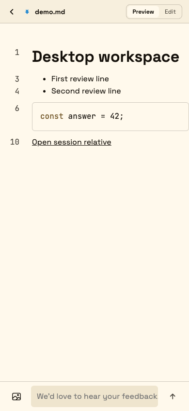</a>

**representative · dark · 1440×900**

<a href="workspace-markdown/workspace-markdown-representative-dark-1440.png">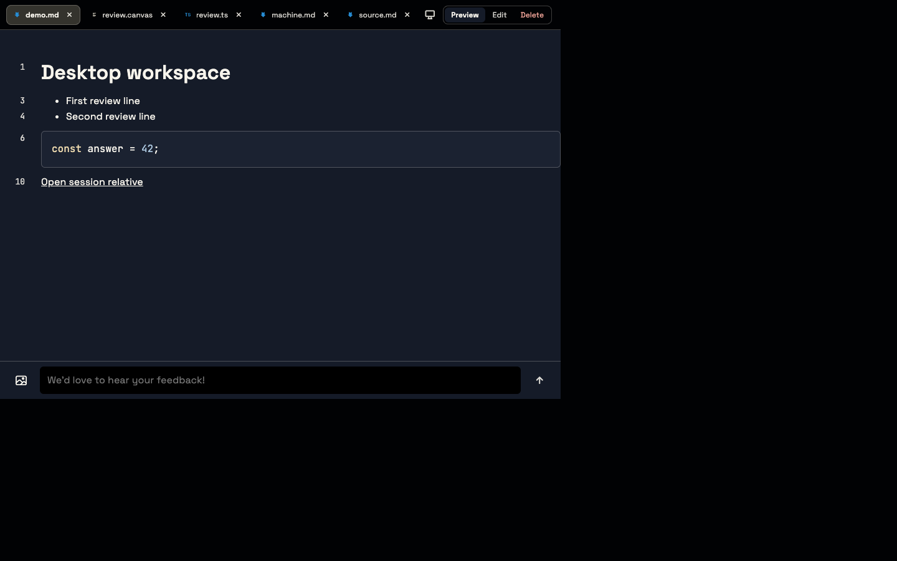</a>

**representative · dark · 390×844**

<a href="workspace-markdown/workspace-markdown-representative-dark-390.png">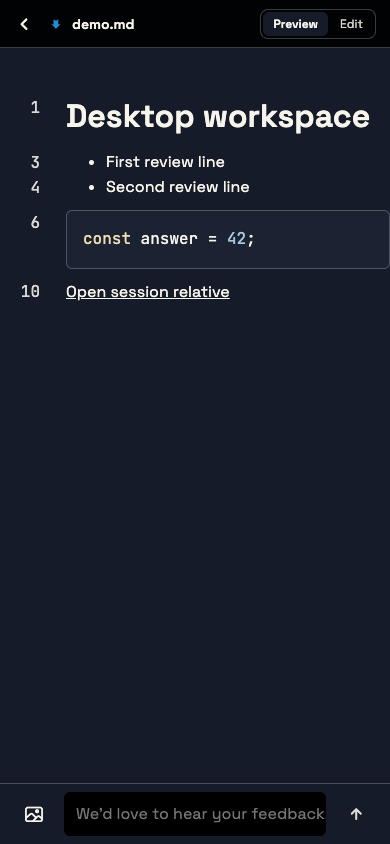</a>

## File workspace · source and diff controls

**Changed presentation:** Source review uses the KILV surrounding toolbar and tokenized syntax/line-review surfaces.

**Evidence:** `component-fixture`. States: representative.

**Production owners:** `components/DesktopFileWorkspace.tsx`, `components/FileViewPanel.tsx`, `components/diff/PierreDiffView.tsx`.

- Synthetic service/state boundaries; React Native Web adapter; not authenticated live or installed native evidence.
- File contents and machine RPC results are synthetic. Capture shows the production file viewer; it is not a live workspace.

Fixture environment: [source graph and adapters](workspace-source/environment-workspace-workspace-source.json).

| State | Theme | Viewport | Screenshot |
|---|---|---|---|
| representative | light | 1440×900 | [Open full screenshot](workspace-source/workspace-source-representative-light-1440.png) |
| representative | light | 390×844 | [Open full screenshot](workspace-source/workspace-source-representative-light-390.png) |
| representative | dark | 1440×900 | [Open full screenshot](workspace-source/workspace-source-representative-dark-1440.png) |
| representative | dark | 390×844 | [Open full screenshot](workspace-source/workspace-source-representative-dark-390.png) |

Show every screenshot for this panel

**representative · light · 1440×900**

<a href="workspace-source/workspace-source-representative-light-1440.png">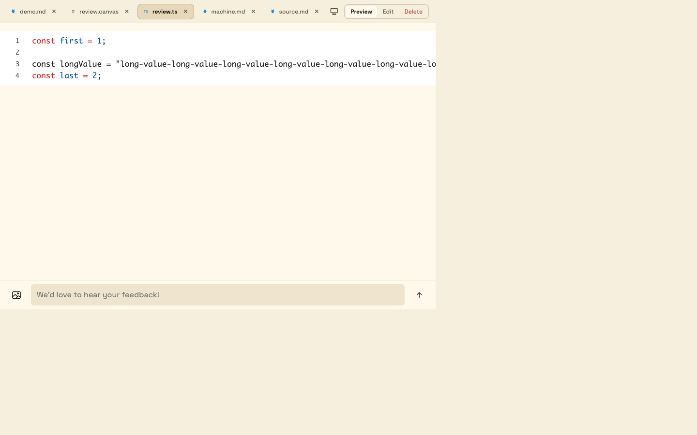</a>

**representative · light · 390×844**

<a href="workspace-source/workspace-source-representative-light-390.png">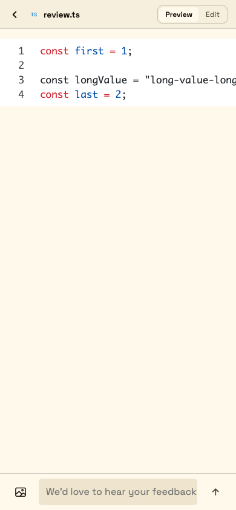</a>

**representative · dark · 1440×900**

<a href="workspace-source/workspace-source-representative-dark-1440.png">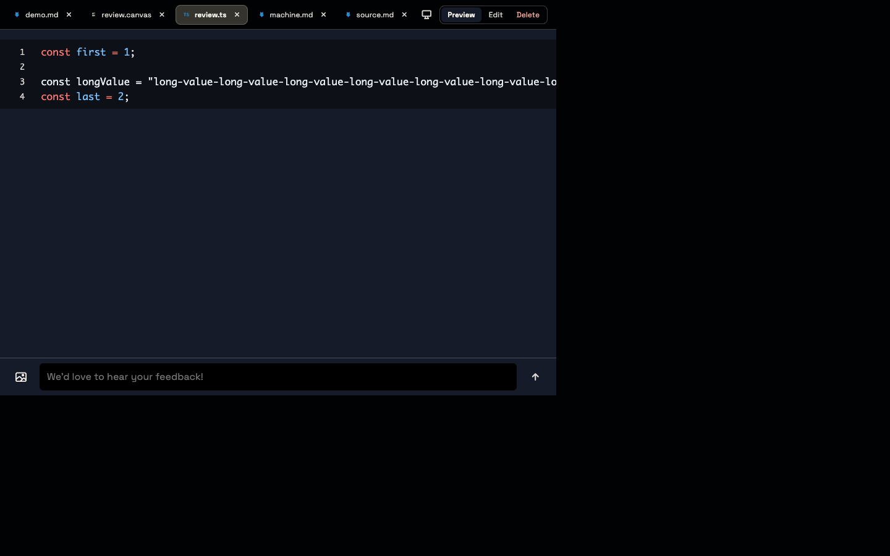</a>

**representative · dark · 390×844**

<a href="workspace-source/workspace-source-representative-dark-390.png">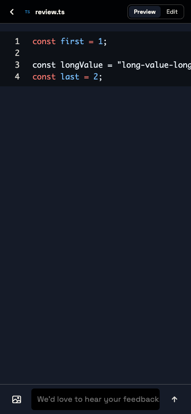</a>

## Localhost live preview workspace

**Changed presentation:** Live preview controls inherit the workspace material and typography while retaining real iframe behavior.

**Evidence:** `component-fixture`. States: representative.

**Production owners:** `components/DesktopFileWorkspace.tsx`, `components/LocalhostLiveView.web.tsx`.

- Synthetic service/state boundaries; React Native Web adapter; not authenticated live or installed native evidence.
- Live transport returns a synthetic local page; preview controls are production.

Fixture environment: [source graph and adapters](workspace-live/environment-workspace-workspace-live.json).

| State | Theme | Viewport | Screenshot |
|---|---|---|---|
| representative | light | 1440×900 | [Open full screenshot](workspace-live/workspace-live-representative-light-1440.png) |
| representative | light | 390×844 | [Open full screenshot](workspace-live/workspace-live-representative-light-390.png) |
| representative | dark | 1440×900 | [Open full screenshot](workspace-live/workspace-live-representative-dark-1440.png) |
| representative | dark | 390×844 | [Open full screenshot](workspace-live/workspace-live-representative-dark-390.png) |

Show every screenshot for this panel

**representative · light · 1440×900**

<a href="workspace-live/workspace-live-representative-light-1440.png">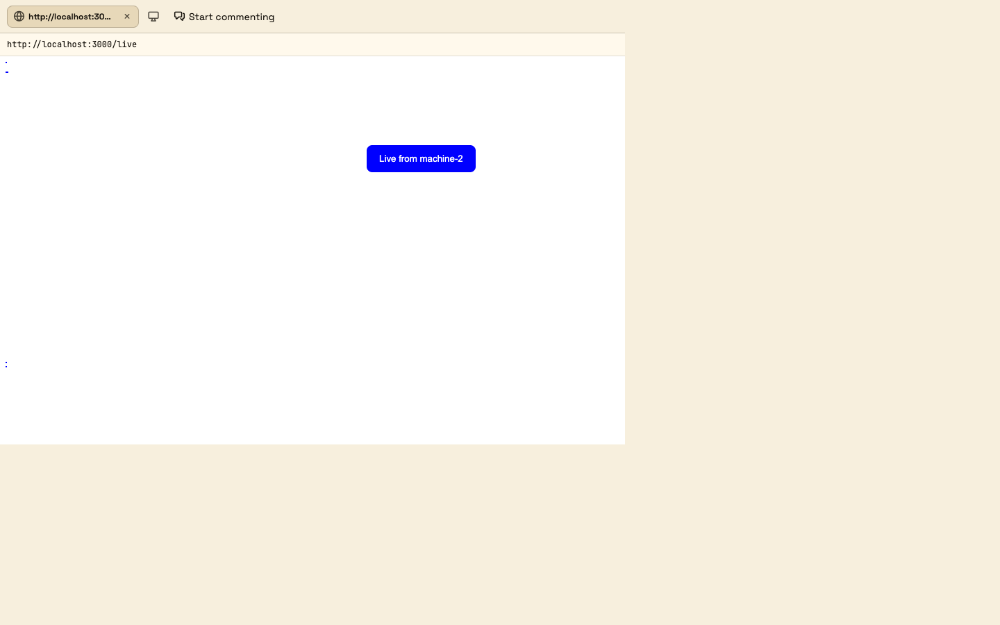</a>

**representative · light · 390×844**

<a href="workspace-live/workspace-live-representative-light-390.png">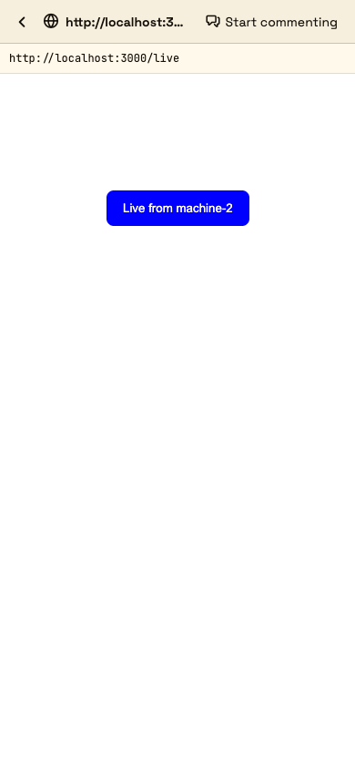</a>

**representative · dark · 1440×900**

<a href="workspace-live/workspace-live-representative-dark-1440.png">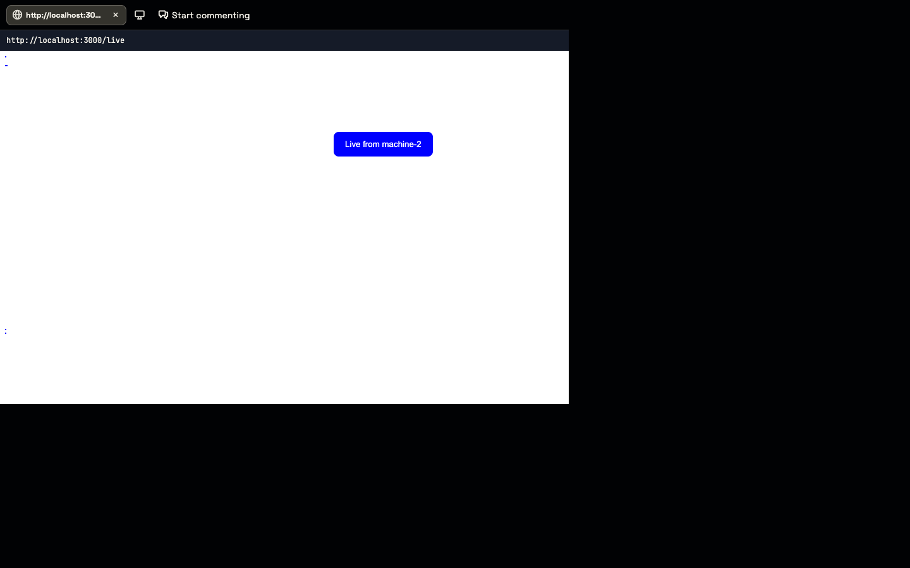</a>

**representative · dark · 390×844**

<a href="workspace-live/workspace-live-representative-dark-390.png">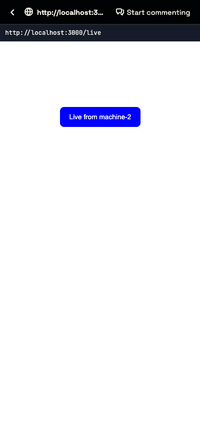</a>

## Workspace file link and feedback composer

**Changed presentation:** Linked-file chrome and feedback composer use KILV input, action and border tokens.

**Evidence:** `component-fixture`. States: representative.

**Production owners:** `components/WorkspaceLinkViewer.tsx`, `components/WorkspaceFeedbackComposer.tsx`, `components/FileViewPanel.tsx`, `components/markdown/MarkdownView.web.tsx`.

- Synthetic service/state boundaries; React Native Web adapter; not authenticated live or installed native evidence.
- Linked machine, Markdown file and feedback transport are synthetic; no feedback is sent.

Fixture environment: [source graph and adapters](workspace-link/environment-workspace-workspace-link.json).

| State | Theme | Viewport | Screenshot |
|---|---|---|---|
| representative | light | 1440×900 | [Open full screenshot](workspace-link/workspace-link-representative-light-1440.png) |
| representative | light | 390×844 | [Open full screenshot](workspace-link/workspace-link-representative-light-390.png) |
| representative | dark | 1440×900 | [Open full screenshot](workspace-link/workspace-link-representative-dark-1440.png) |
| representative | dark | 390×844 | [Open full screenshot](workspace-link/workspace-link-representative-dark-390.png) |

Show every screenshot for this panel

**representative · light · 1440×900**

<a href="workspace-link/workspace-link-representative-light-1440.png">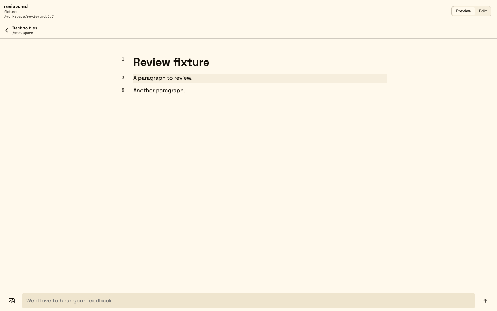</a>

**representative · light · 390×844**

<a href="workspace-link/workspace-link-representative-light-390.png">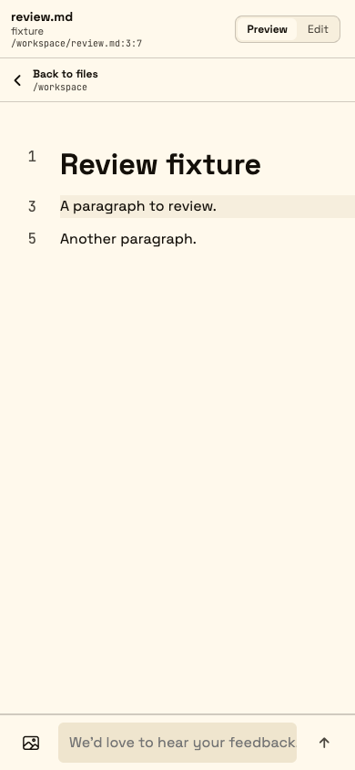</a>

**representative · dark · 1440×900**

<a href="workspace-link/workspace-link-representative-dark-1440.png">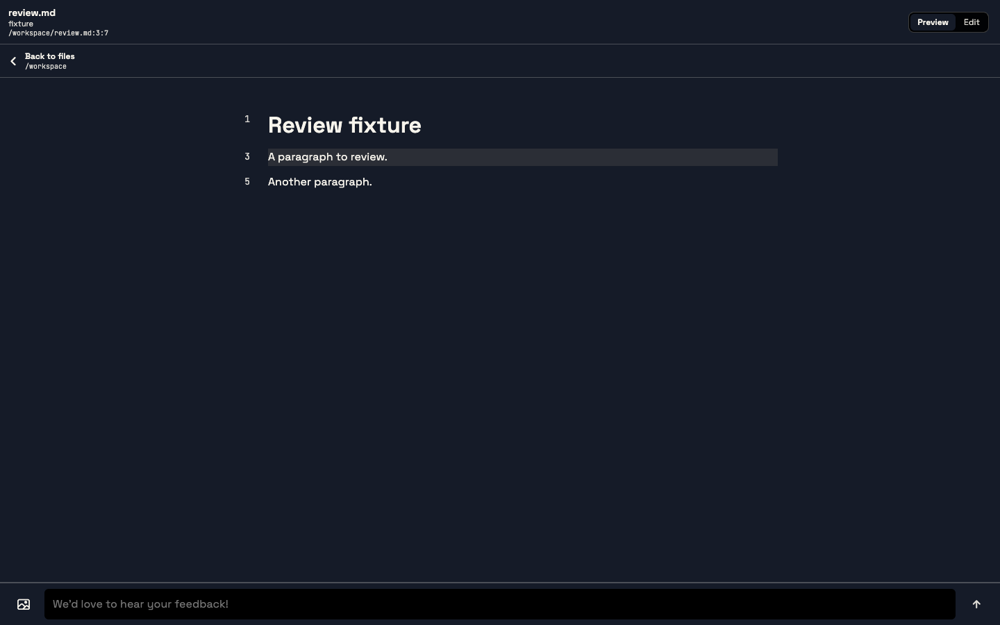</a>

**representative · dark · 390×844**

<a href="workspace-link/workspace-link-representative-dark-390.png">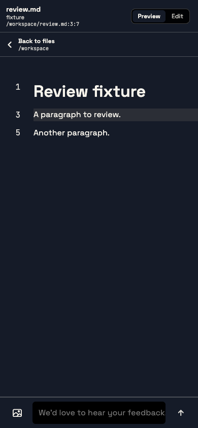</a>

## New session · model, machine, workspace and prompt

**Changed presentation:** New-session machine, provider and prompt controls adopt the KILV palette and compact spacing.

**Evidence:** `component-fixture`. States: representative.

**Production owners:** `app/(app)/new/index.tsx`.

- Synthetic service/state boundaries; React Native Web adapter; not authenticated live or installed native evidence.
- Synthetic model/machine capability state. No session is launched.
- Surrounding visual renderer replacements supplied by the fixture: Avatar, SessionStatusAvatar, ProviderIcon. These renderers are outside the claimed source owners and are not visual evidence for their production appearance; target owners, Typography and Expo vector icon glyphs remain real.

Fixture environment: [source graph and adapters](new-session/environment-workspace-new-session.json).

| State | Theme | Viewport | Screenshot |
|---|---|---|---|
| representative | light | 1440×900 | [Open full screenshot](new-session/new-session-representative-light-1440.png) |
| representative | light | 390×844 | [Open full screenshot](new-session/new-session-representative-light-390.png) |
| representative | dark | 1440×900 | [Open full screenshot](new-session/new-session-representative-dark-1440.png) |
| representative | dark | 390×844 | [Open full screenshot](new-session/new-session-representative-dark-390.png) |

Show every screenshot for this panel

**representative · light · 1440×900**

<a href="new-session/new-session-representative-light-1440.png">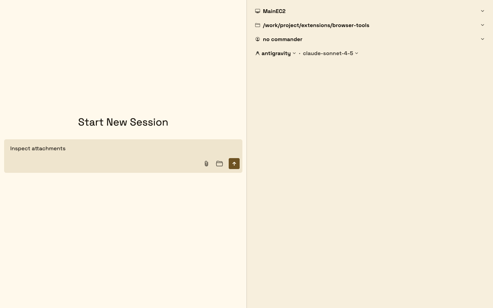</a>

**representative · light · 390×844**

<a href="new-session/new-session-representative-light-390.png">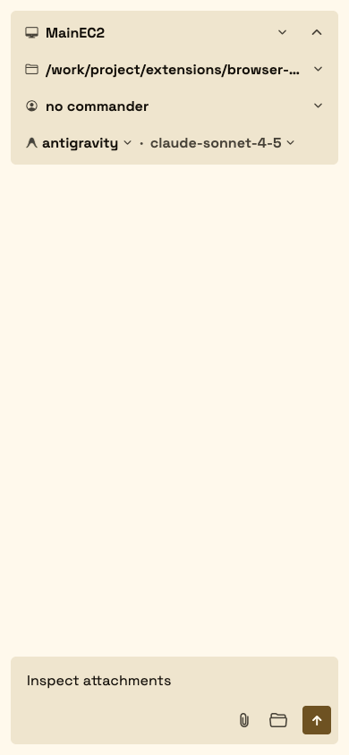</a>

**representative · dark · 1440×900**

<a href="new-session/new-session-representative-dark-1440.png">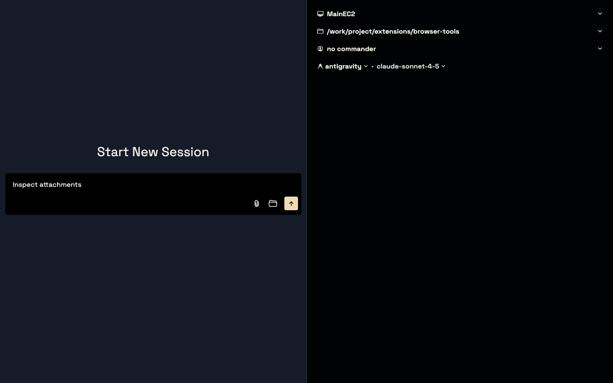</a>

**representative · dark · 390×844**

<a href="new-session/new-session-representative-dark-390.png">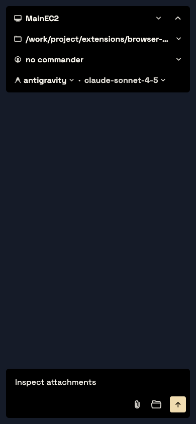</a>

## New session · machine folder picker

**Changed presentation:** Machine path browser uses semantic selection surfaces, compact folder rows and mono paths.

**Evidence:** `component-fixture`. States: representative.

**Production owners:** `app/(app)/new/index.tsx`, `components/MachinePathBrowser.tsx`.

- Synthetic service/state boundaries; React Native Web adapter; not authenticated live or installed native evidence.
- Directory listings and recent paths are synthetic.
- Surrounding visual renderer replacements supplied by the fixture: Avatar, SessionStatusAvatar, ProviderIcon. These renderers are outside the claimed source owners and are not visual evidence for their production appearance; target owners, Typography and Expo vector icon glyphs remain real.

Fixture environment: [source graph and adapters](new-session-path/environment-workspace-new-session-path.json).

| State | Theme | Viewport | Screenshot |
|---|---|---|---|
| representative | light | 1440×900 | [Open full screenshot](new-session-path/new-session-path-representative-light-1440.png) |
| representative | light | 390×844 | [Open full screenshot](new-session-path/new-session-path-representative-light-390.png) |
| representative | dark | 1440×900 | [Open full screenshot](new-session-path/new-session-path-representative-dark-1440.png) |
| representative | dark | 390×844 | [Open full screenshot](new-session-path/new-session-path-representative-dark-390.png) |

Show every screenshot for this panel

**representative · light · 1440×900**

<a href="new-session-path/new-session-path-representative-light-1440.png">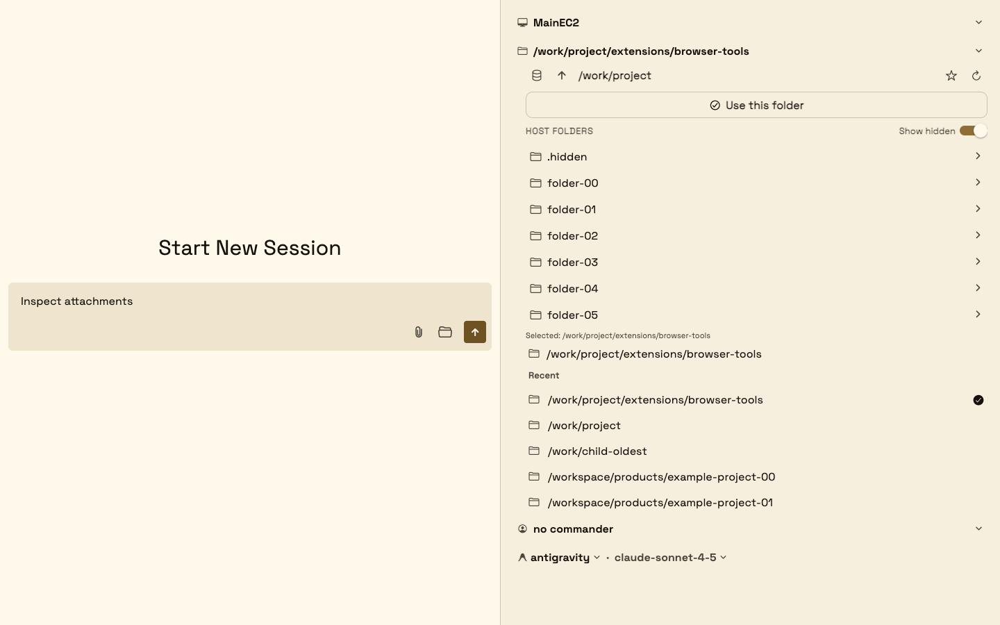</a>

**representative · light · 390×844**

<a href="new-session-path/new-session-path-representative-light-390.png">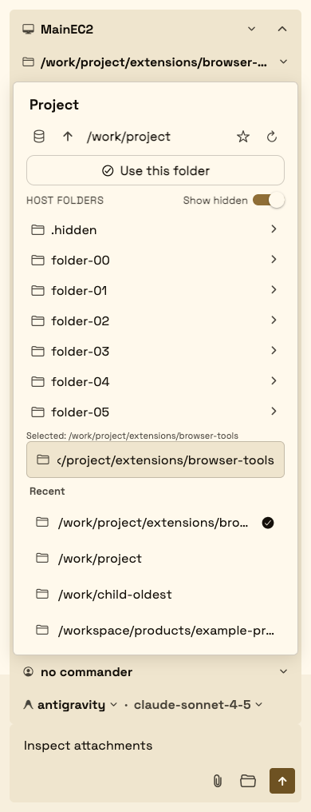</a>

**representative · dark · 1440×900**

<a href="new-session-path/new-session-path-representative-dark-1440.png">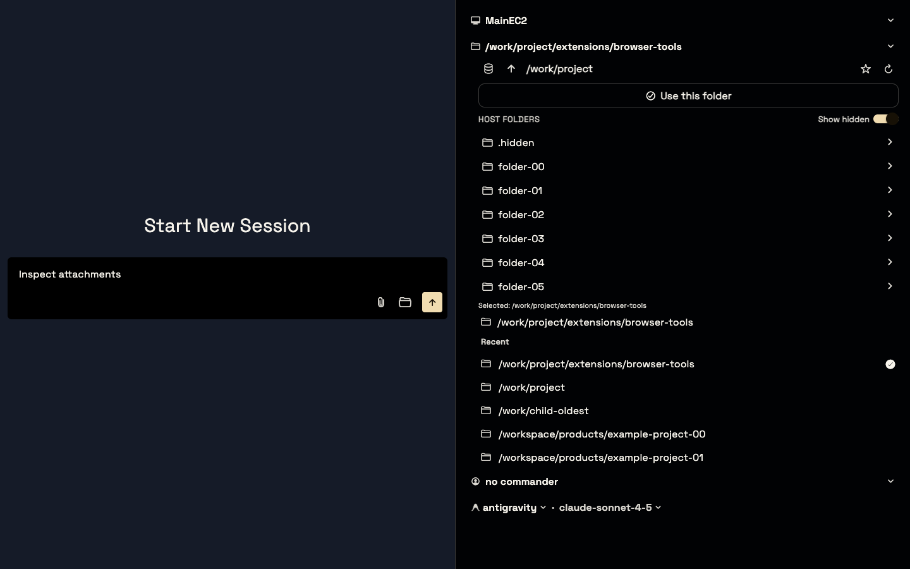</a>

**representative · dark · 390×844**

<a href="new-session-path/new-session-path-representative-dark-390.png">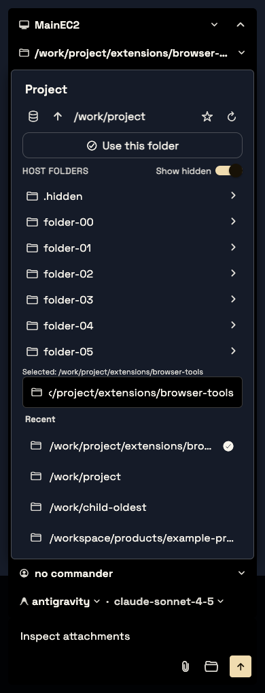</a>

## Home dock · start a session

**Changed presentation:** Home composer and machine/model pickers adopt the KILV palette, mono metadata and flatter geometry.

**Evidence:** `component-fixture`. States: representative.

**Production owners:** `components/HomeDock.tsx`.

- Synthetic service/state boundaries; React Native Web adapter; not authenticated live or installed native evidence.
- Surrounding visual renderer replacements supplied by the fixture: Avatar, SessionStatusAvatar, ProviderIcon. These renderers are outside the claimed source owners and are not visual evidence for their production appearance; target owners, Typography and Expo vector icon glyphs remain real.

Fixture environment: [source graph and adapters](home-dock/environment-workspace-home-dock.json).

| State | Theme | Viewport | Screenshot |
|---|---|---|---|
| representative | light | 1440×900 | [Open full screenshot](home-dock/home-dock-representative-light-1440.png) |
| representative | light | 390×844 | [Open full screenshot](home-dock/home-dock-representative-light-390.png) |
| representative | dark | 1440×900 | [Open full screenshot](home-dock/home-dock-representative-dark-1440.png) |
| representative | dark | 390×844 | [Open full screenshot](home-dock/home-dock-representative-dark-390.png) |

Show every screenshot for this panel

**representative · light · 1440×900**

<a href="home-dock/home-dock-representative-light-1440.png">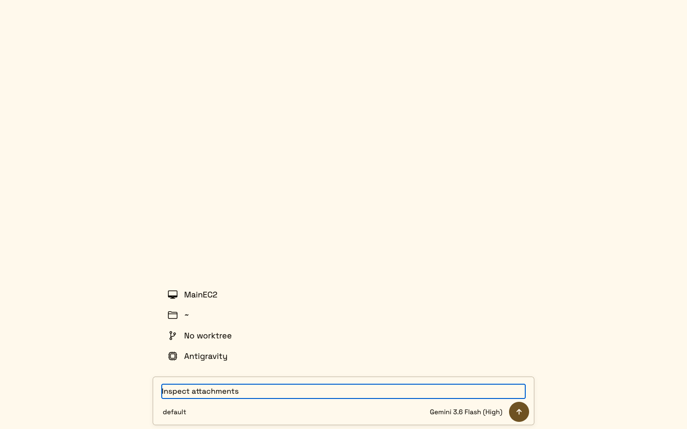</a>

**representative · light · 390×844**

<a href="home-dock/home-dock-representative-light-390.png">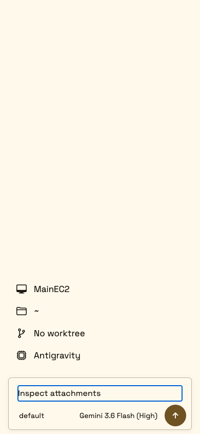</a>

**representative · dark · 1440×900**

<a href="home-dock/home-dock-representative-dark-1440.png">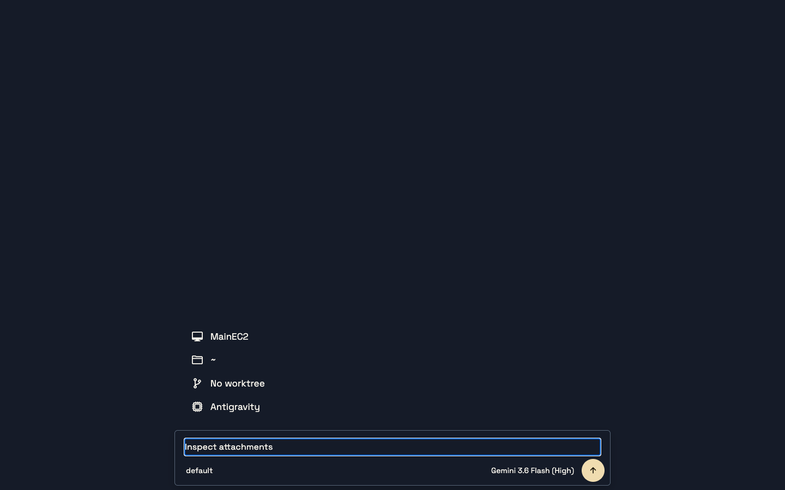</a>

**representative · dark · 390×844**

<a href="home-dock/home-dock-representative-dark-390.png">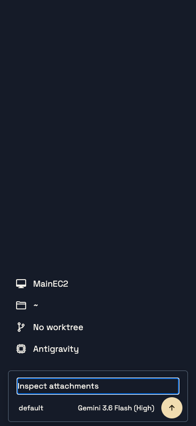</a>

## Empty sessions · terminal connection onboarding

**Changed presentation:** Empty-session onboarding uses the KILV artwork, typography and terminal command surface.

**Evidence:** `component-fixture`. States: representative.

**Production owners:** `components/SessionsListWrapper.tsx`, `components/EmptyMainScreen.tsx`.

- Synthetic service/state boundaries; React Native Web adapter; not authenticated live or installed native evidence.

Fixture environment: [source graph and adapters](empty-onboarding/environment-workspace-empty-onboarding.json).

| State | Theme | Viewport | Screenshot |
|---|---|---|---|
| representative | light | 1440×900 | [Open full screenshot](empty-onboarding/empty-onboarding-representative-light-1440.png) |
| representative | light | 390×844 | [Open full screenshot](empty-onboarding/empty-onboarding-representative-light-390.png) |
| representative | dark | 1440×900 | [Open full screenshot](empty-onboarding/empty-onboarding-representative-dark-1440.png) |
| representative | dark | 390×844 | [Open full screenshot](empty-onboarding/empty-onboarding-representative-dark-390.png) |

Show every screenshot for this panel

**representative · light · 1440×900**

<a href="empty-onboarding/empty-onboarding-representative-light-1440.png">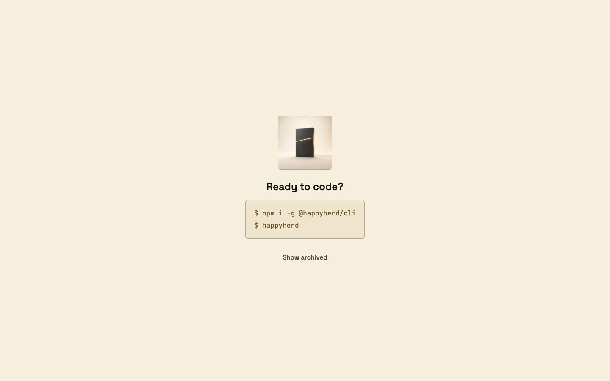</a>

**representative · light · 390×844**

<a href="empty-onboarding/empty-onboarding-representative-light-390.png">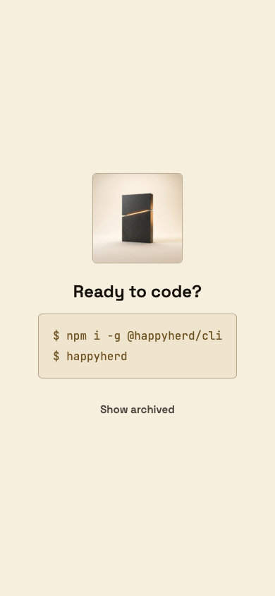</a>

**representative · dark · 1440×900**

<a href="empty-onboarding/empty-onboarding-representative-dark-1440.png">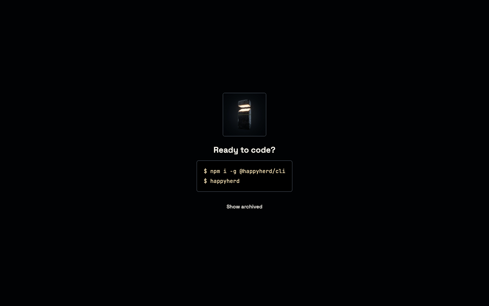</a>

**representative · dark · 390×844**

<a href="empty-onboarding/empty-onboarding-representative-dark-390.png">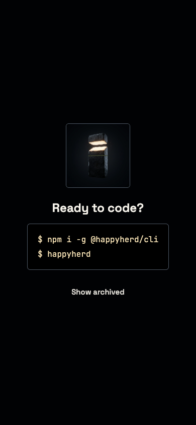</a>

## No active sessions · connected machine

**Changed presentation:** Empty connected-machine state uses the KILV icon, action contrast and typography.

**Evidence:** `component-fixture`. States: representative.

**Production owners:** `components/EmptySessionsTablet.tsx`.

- Synthetic service/state boundaries; React Native Web adapter; not authenticated live or installed native evidence.

Fixture environment: [source graph and adapters](empty-tablet/environment-workspace-empty-tablet.json).

| State | Theme | Viewport | Screenshot |
|---|---|---|---|
| representative | light | 1440×900 | [Open full screenshot](empty-tablet/empty-tablet-representative-light-1440.png) |
| representative | light | 390×844 | [Open full screenshot](empty-tablet/empty-tablet-representative-light-390.png) |
| representative | dark | 1440×900 | [Open full screenshot](empty-tablet/empty-tablet-representative-dark-1440.png) |
| representative | dark | 390×844 | [Open full screenshot](empty-tablet/empty-tablet-representative-dark-390.png) |

Show every screenshot for this panel

**representative · light · 1440×900**

<a href="empty-tablet/empty-tablet-representative-light-1440.png">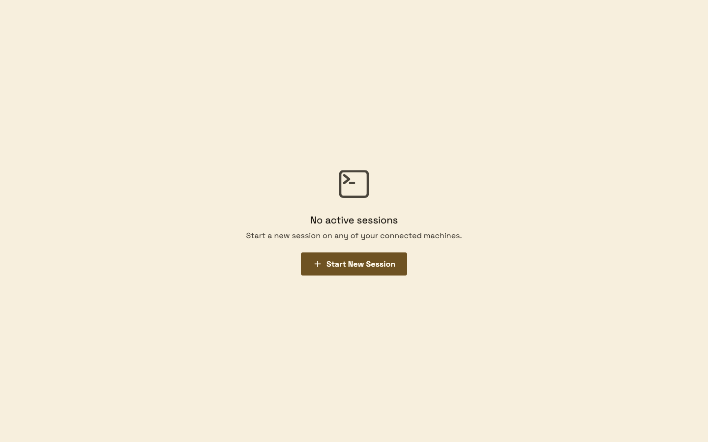</a>

**representative · light · 390×844**

<a href="empty-tablet/empty-tablet-representative-light-390.png">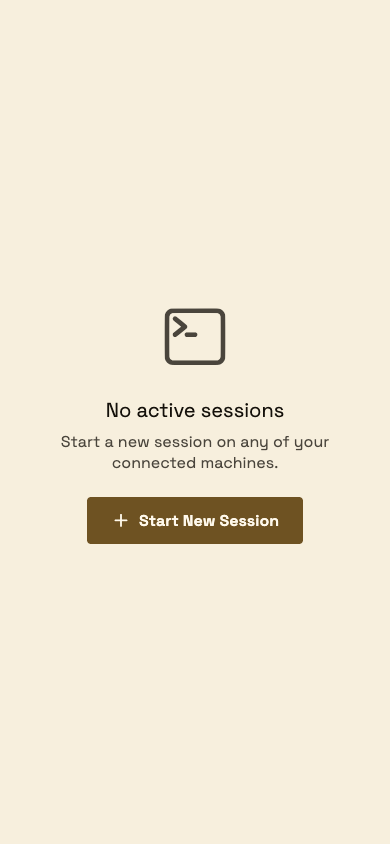</a>

**representative · dark · 1440×900**

<a href="empty-tablet/empty-tablet-representative-dark-1440.png">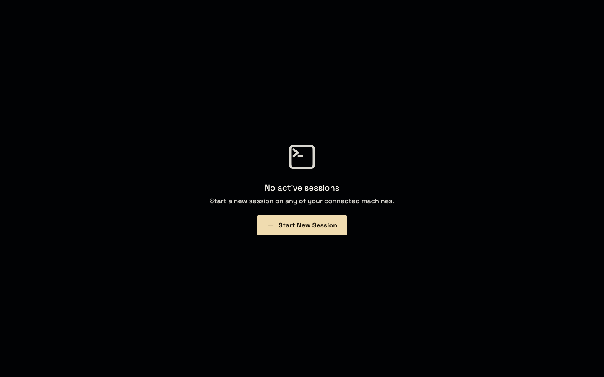</a>

**representative · dark · 390×844**

<a href="empty-tablet/empty-tablet-representative-dark-390.png">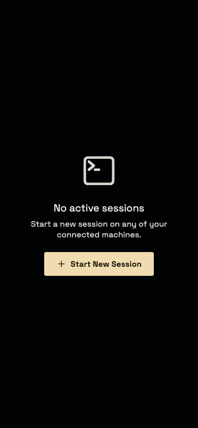</a>

## Signed-out welcome and connect

**Changed presentation:** Welcome artwork, headline and connect/restore controls use the KILV visual system.

**Evidence:** `component-fixture`. States: representative.

**Production owners:** `app/(app)/index.tsx`.

- Synthetic service/state boundaries; React Native Web adapter; not authenticated live or installed native evidence.
- Surrounding visual renderer replacements supplied by the fixture: StatusDot. These renderers are outside the claimed source owners and are not visual evidence for their production appearance; target owners, Typography and Expo vector icon glyphs remain real.

Fixture environment: [source graph and adapters](signed-out/environment-workspace-signed-out.json).

| State | Theme | Viewport | Screenshot |
|---|---|---|---|
| representative | light | 1440×900 | [Open full screenshot](signed-out/signed-out-representative-light-1440.png) |
| representative | light | 390×844 | [Open full screenshot](signed-out/signed-out-representative-light-390.png) |
| representative | dark | 1440×900 | [Open full screenshot](signed-out/signed-out-representative-dark-1440.png) |
| representative | dark | 390×844 | [Open full screenshot](signed-out/signed-out-representative-dark-390.png) |

Show every screenshot for this panel

**representative · light · 1440×900**

<a href="signed-out/signed-out-representative-light-1440.png">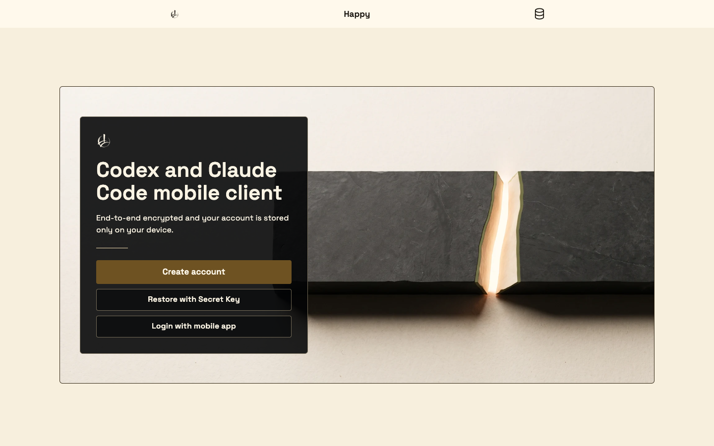</a>

**representative · light · 390×844**

<a href="signed-out/signed-out-representative-light-390.png">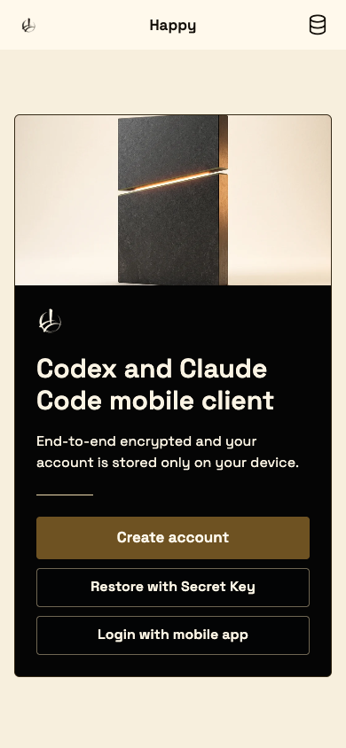</a>

**representative · dark · 1440×900**

<a href="signed-out/signed-out-representative-dark-1440.png">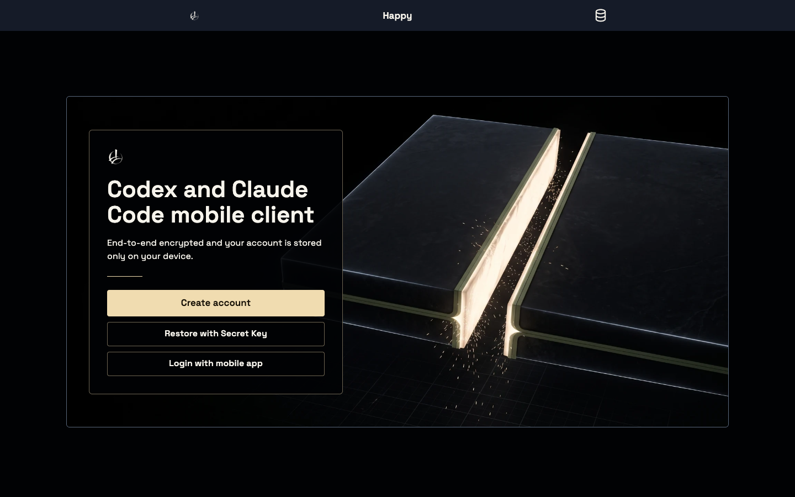</a>

**representative · dark · 390×844**

<a href="signed-out/signed-out-representative-dark-390.png">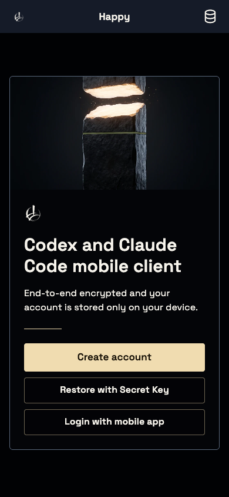</a>

## Source code editor

**Changed presentation:** Source editor uses KILV foreground/background tokens and JetBrains Mono.

**Evidence:** `component-fixture`. States: representative.

**Production owners:** `components/CodeEditor.web.tsx`.

- Synthetic service/state boundaries; React Native Web adapter; not authenticated live or installed native evidence.

Fixture environment: [source graph and adapters](code-editor/environment-workspace-code-editor.json).

| State | Theme | Viewport | Screenshot |
|---|---|---|---|
| representative | light | 1440×900 | [Open full screenshot](code-editor/code-editor-representative-light-1440.png) |
| representative | light | 390×844 | [Open full screenshot](code-editor/code-editor-representative-light-390.png) |
| representative | dark | 1440×900 | [Open full screenshot](code-editor/code-editor-representative-dark-1440.png) |
| representative | dark | 390×844 | [Open full screenshot](code-editor/code-editor-representative-dark-390.png) |

Show every screenshot for this panel

**representative · light · 1440×900**

<a href="code-editor/code-editor-representative-light-1440.png">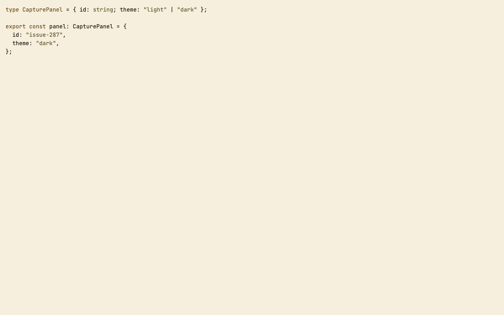</a>

**representative · light · 390×844**

<a href="code-editor/code-editor-representative-light-390.png">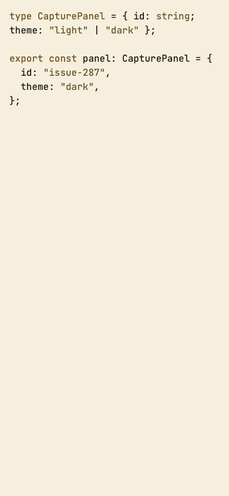</a>

**representative · dark · 1440×900**

<a href="code-editor/code-editor-representative-dark-1440.png">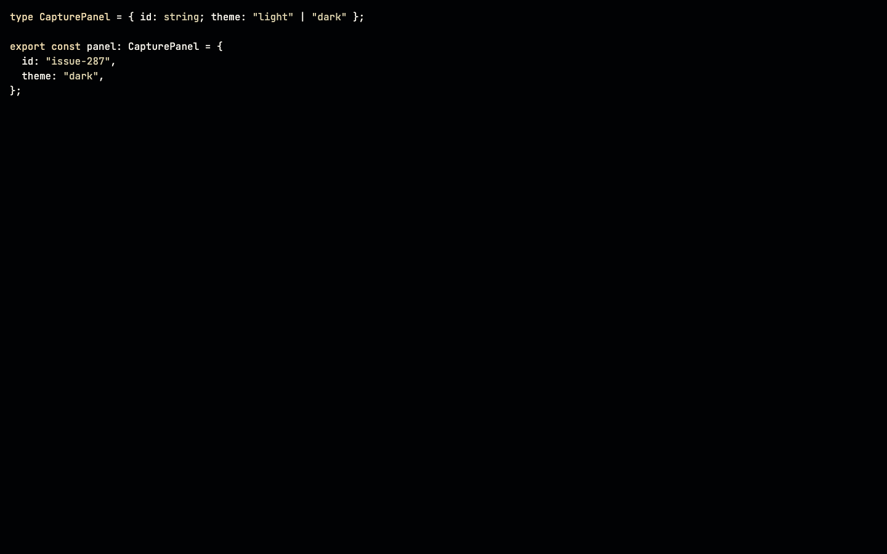</a>

**representative · dark · 390×844**

<a href="code-editor/code-editor-representative-dark-390.png">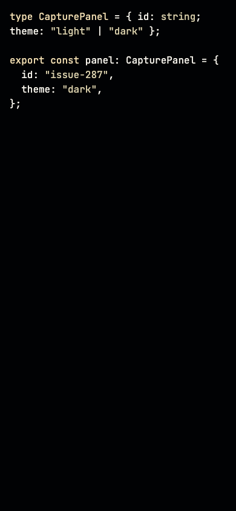</a>

## Automations · scheduled and paused tasks

**Changed presentation:** Automation navigation, filters and list items use semantic KILV surfaces and dense rows.

**Evidence:** `component-fixture`. States: representative.

**Production owners:** `app/(app)/automations/index.tsx`.

- Synthetic service/state boundaries; React Native Web adapter; not authenticated live or installed native evidence.

Fixture environment: [source graph and adapters](automations-list/environment-workspace-automations-list.json).

| State | Theme | Viewport | Screenshot |
|---|---|---|---|
| representative | light | 1440×900 | [Open full screenshot](automations-list/automations-list-representative-light-1440.png) |
| representative | light | 390×844 | [Open full screenshot](automations-list/automations-list-representative-light-390.png) |
| representative | dark | 1440×900 | [Open full screenshot](automations-list/automations-list-representative-dark-1440.png) |
| representative | dark | 390×844 | [Open full screenshot](automations-list/automations-list-representative-dark-390.png) |

Show every screenshot for this panel

**representative · light · 1440×900**

<a href="automations-list/automations-list-representative-light-1440.png">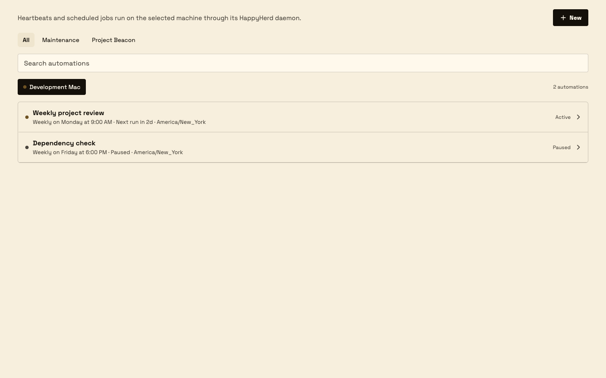</a>

**representative · light · 390×844**

<a href="automations-list/automations-list-representative-light-390.png">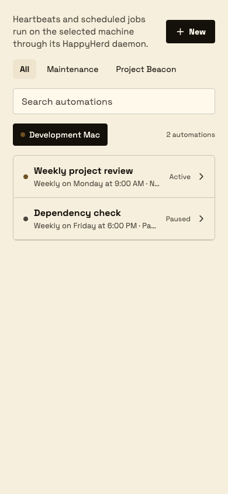</a>

**representative · dark · 1440×900**

<a href="automations-list/automations-list-representative-dark-1440.png">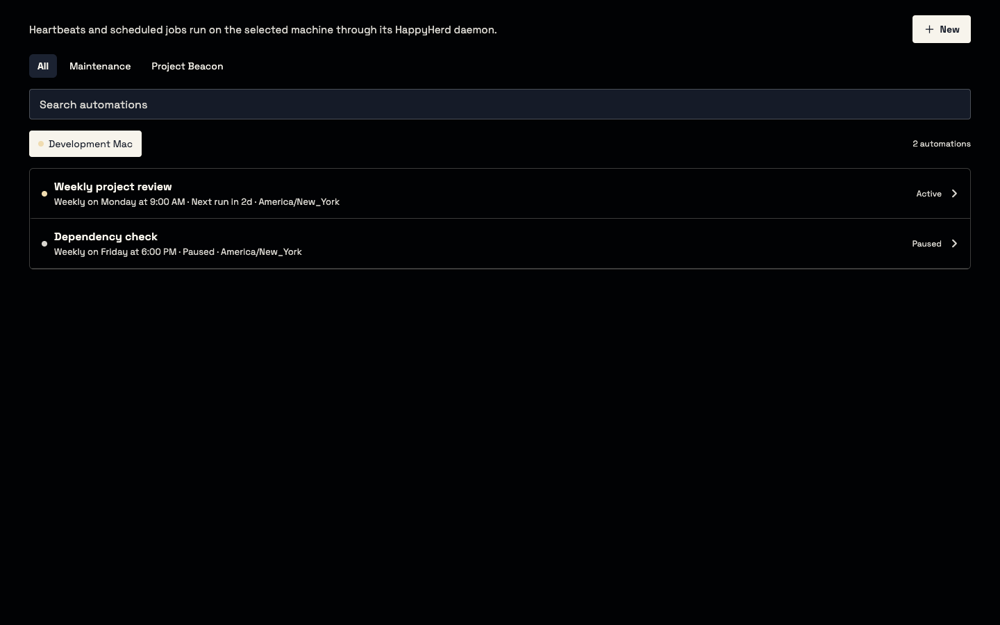</a>

**representative · dark · 390×844**

<a href="automations-list/automations-list-representative-dark-390.png">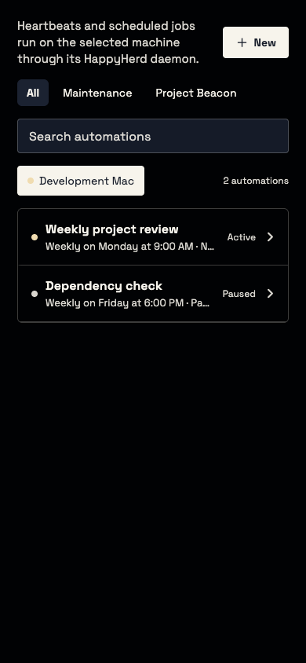</a>

## Automation · create a scheduled job

**Changed presentation:** Automation form fields, scheduling controls and footer actions adopt KILV surfaces and typography.

**Evidence:** `component-fixture`. States: representative, scrolled-bottom.

**Production owners:** `app/(app)/automations/index.tsx`.

- Synthetic service/state boundaries; React Native Web adapter; not authenticated live or installed native evidence.
- Synthetic machine capabilities; the create form is displayed without saving a definition.
- First viewport of the form; Project tags and Save automation may continue below the fold. See automation-create-bottom for the scrolled footer.
- Synthetic machine capabilities; the actual form is scrolled to the Save automation control. No definition is submitted.
- Complements the retained automation-create first viewport; this is visual reachability evidence, not a persisted creation journey.

Fixture environment: [source graph and adapters](automation-create-bottom/environment-workspace-automation-create-bottom.json), [source graph and adapters](automation-create/environment-workspace-automation-create.json).

| State | Theme | Viewport | Screenshot |
|---|---|---|---|
| representative | light | 1440×900 | [Open full screenshot](automation-create/automation-create-representative-light-1440.png) |
| representative | light | 390×844 | [Open full screenshot](automation-create/automation-create-representative-light-390.png) |
| representative | dark | 1440×900 | [Open full screenshot](automation-create/automation-create-representative-dark-1440.png) |
| representative | dark | 390×844 | [Open full screenshot](automation-create/automation-create-representative-dark-390.png) |
| scrolled-bottom | light | 1440×900 | [Open full screenshot](automation-create-bottom/automation-create-scrolled-bottom-light-1440.png) |
| scrolled-bottom | light | 390×844 | [Open full screenshot](automation-create-bottom/automation-create-scrolled-bottom-light-390.png) |
| scrolled-bottom | dark | 1440×900 | [Open full screenshot](automation-create-bottom/automation-create-scrolled-bottom-dark-1440.png) |
| scrolled-bottom | dark | 390×844 | [Open full screenshot](automation-create-bottom/automation-create-scrolled-bottom-dark-390.png) |

Show every screenshot for this panel

**representative · light · 1440×900**

<a href="automation-create/automation-create-representative-light-1440.png">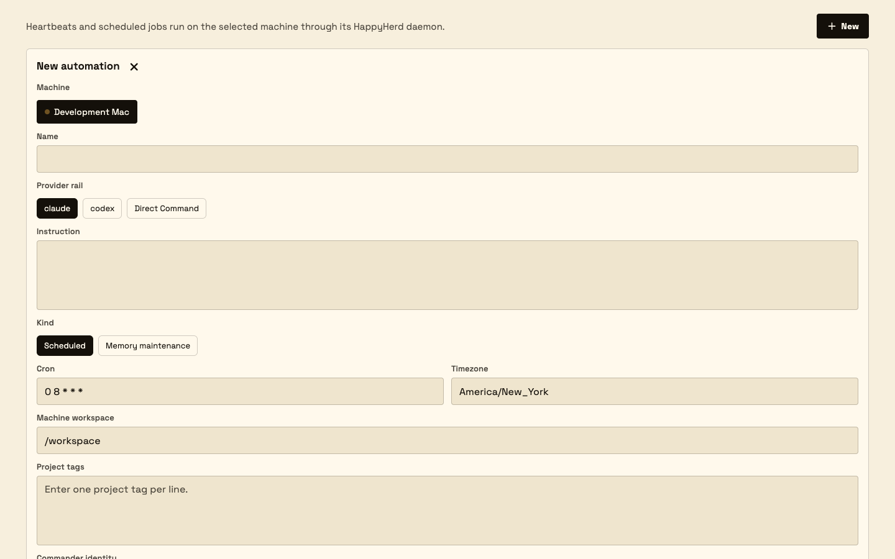</a>

**representative · light · 390×844**

<a href="automation-create/automation-create-representative-light-390.png">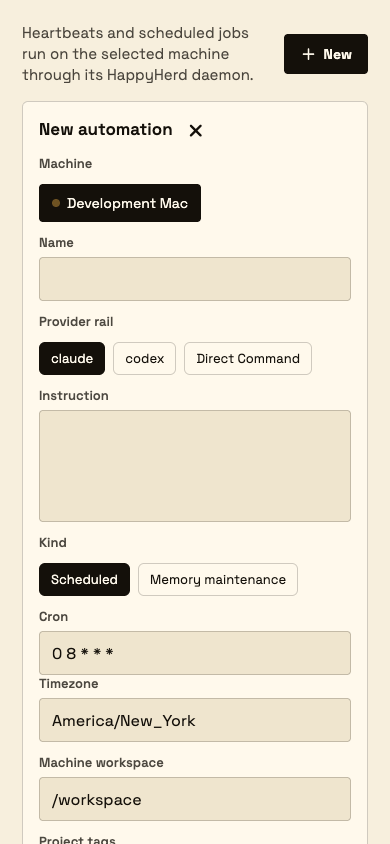</a>

**representative · dark · 1440×900**

<a href="automation-create/automation-create-representative-dark-1440.png">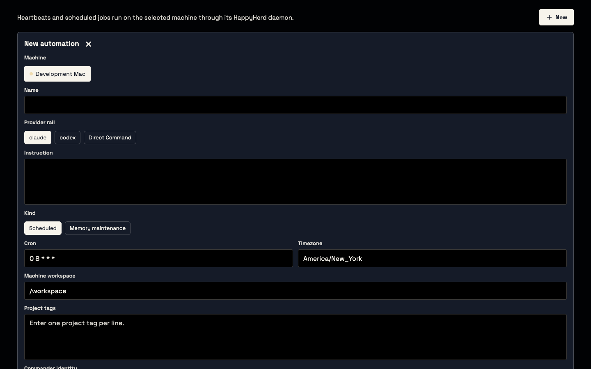</a>

**representative · dark · 390×844**

<a href="automation-create/automation-create-representative-dark-390.png">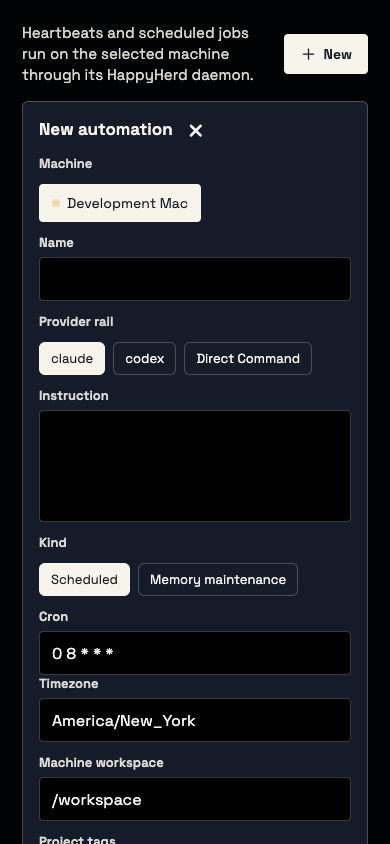</a>

**scrolled-bottom · light · 1440×900**

<a href="automation-create-bottom/automation-create-scrolled-bottom-light-1440.png">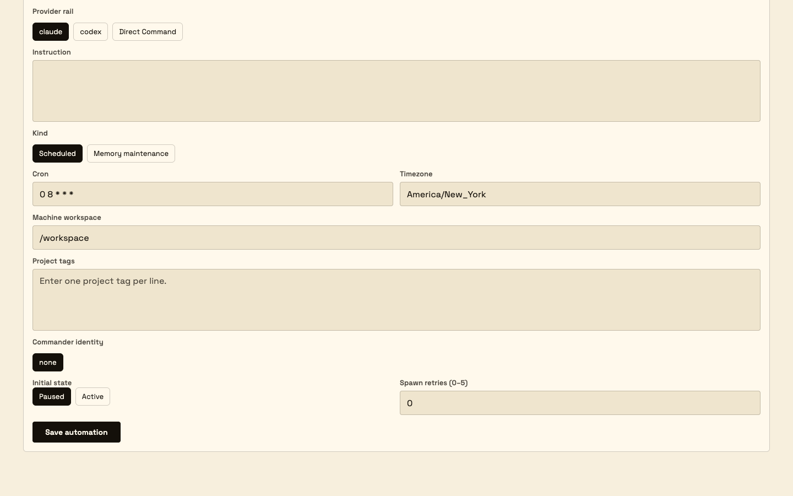</a>

**scrolled-bottom · light · 390×844**

<a href="automation-create-bottom/automation-create-scrolled-bottom-light-390.png">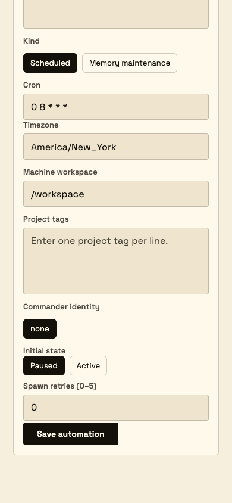</a>

**scrolled-bottom · dark · 1440×900**

<a href="automation-create-bottom/automation-create-scrolled-bottom-dark-1440.png">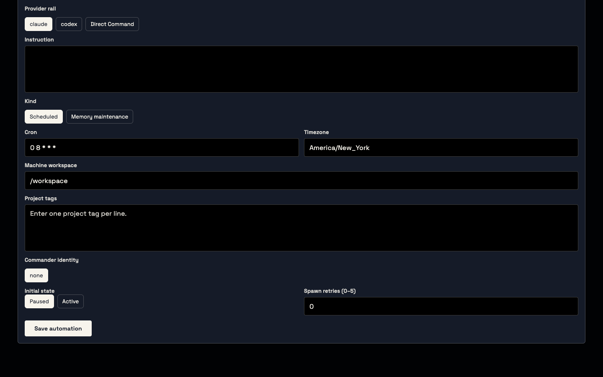</a>

**scrolled-bottom · dark · 390×844**

<a href="automation-create-bottom/automation-create-scrolled-bottom-dark-390.png">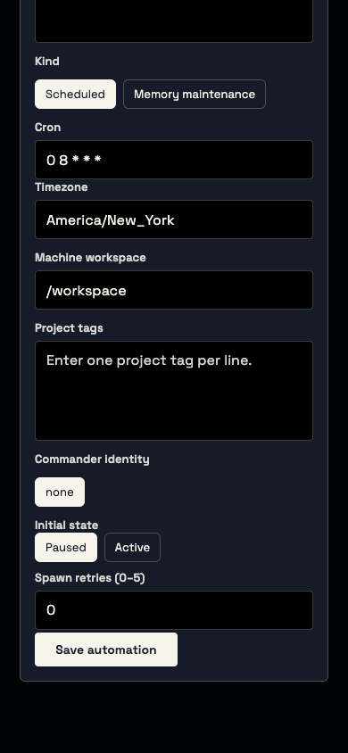</a>

## Automation · instruction, schedule and history

**Changed presentation:** Automation details, instruction preview and schedule sections use KILV borders and typography.

**Evidence:** `component-fixture`. States: representative.

**Production owners:** `components/HappyHerdAutomationDetail.tsx`.

- Synthetic service/state boundaries; React Native Web adapter; not authenticated live or installed native evidence.

Fixture environment: [source graph and adapters](automation-detail/environment-workspace-automation-detail.json).

| State | Theme | Viewport | Screenshot |
|---|---|---|---|
| representative | light | 1440×900 | [Open full screenshot](automation-detail/automation-detail-representative-light-1440.png) |
| representative | light | 390×844 | [Open full screenshot](automation-detail/automation-detail-representative-light-390.png) |
| representative | dark | 1440×900 | [Open full screenshot](automation-detail/automation-detail-representative-dark-1440.png) |
| representative | dark | 390×844 | [Open full screenshot](automation-detail/automation-detail-representative-dark-390.png) |

Show every screenshot for this panel

**representative · light · 1440×900**

<a href="automation-detail/automation-detail-representative-light-1440.png">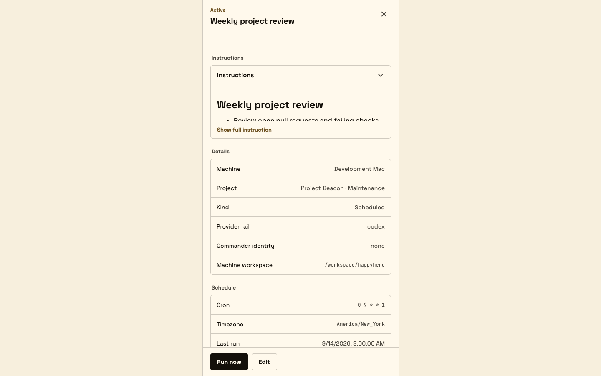</a>

**representative · light · 390×844**

<a href="automation-detail/automation-detail-representative-light-390.png">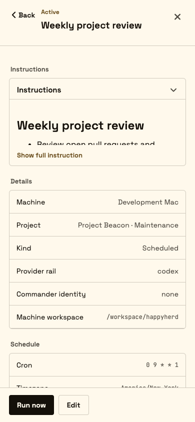</a>

**representative · dark · 1440×900**

<a href="automation-detail/automation-detail-representative-dark-1440.png">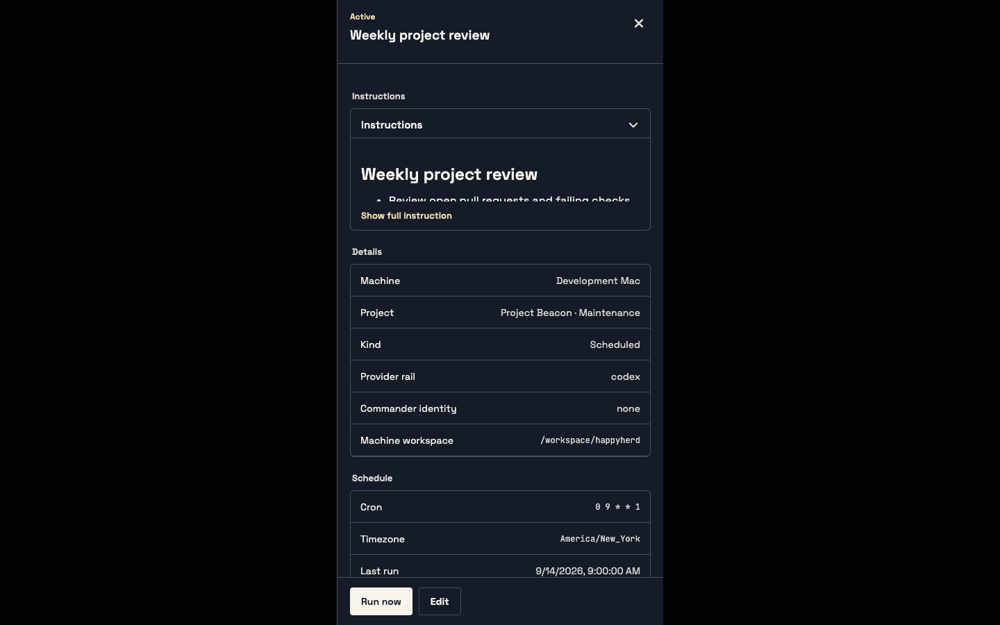</a>

**representative · dark · 390×844**

<a href="automation-detail/automation-detail-representative-dark-390.png">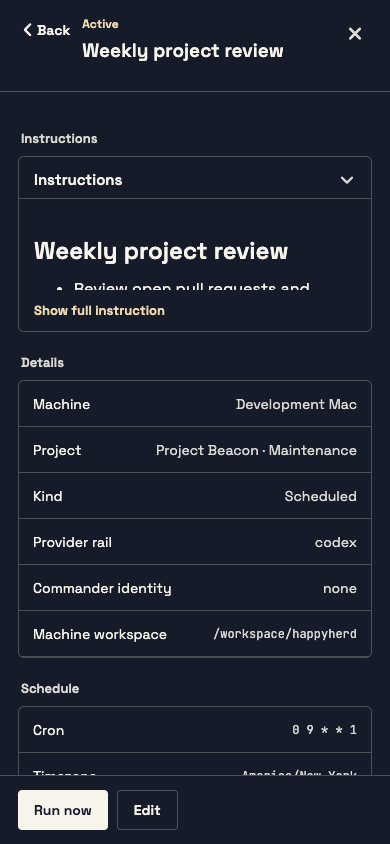</a>

## Automation card · expanded actions and history

**Changed presentation:** Expanded automation cards use KILV surfaces, status dots, tags and action colors.

**Evidence:** `component-fixture`. States: representative.

**Production owners:** `components/HappyHerdAutomationCard.tsx`.

- Synthetic service/state boundaries; React Native Web adapter; not authenticated live or installed native evidence.

Fixture environment: [source graph and adapters](automation-card/environment-workspace-automation-card.json).

| State | Theme | Viewport | Screenshot |
|---|---|---|---|
| representative | light | 1440×900 | [Open full screenshot](automation-card/automation-card-representative-light-1440.png) |
| representative | light | 390×844 | [Open full screenshot](automation-card/automation-card-representative-light-390.png) |
| representative | dark | 1440×900 | [Open full screenshot](automation-card/automation-card-representative-dark-1440.png) |
| representative | dark | 390×844 | [Open full screenshot](automation-card/automation-card-representative-dark-390.png) |

Show every screenshot for this panel

**representative · light · 1440×900**

<a href="automation-card/automation-card-representative-light-1440.png">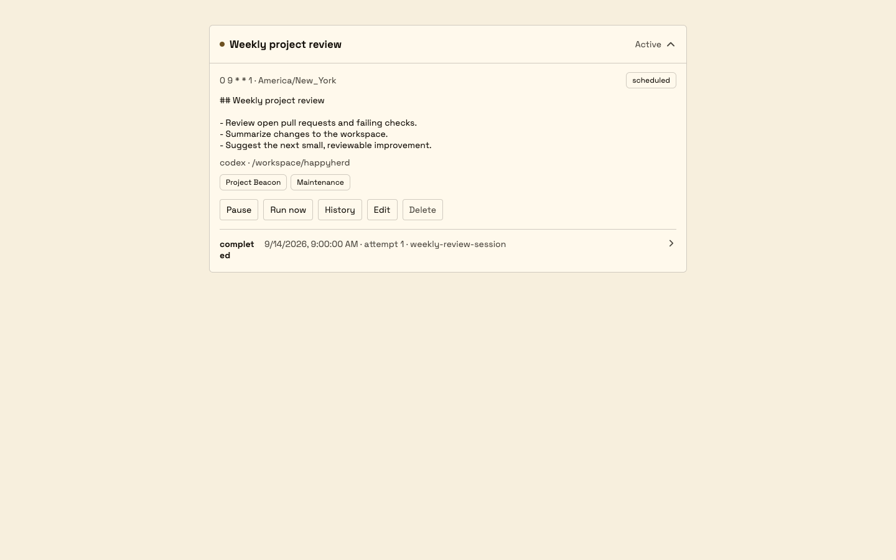</a>

**representative · light · 390×844**

<a href="automation-card/automation-card-representative-light-390.png">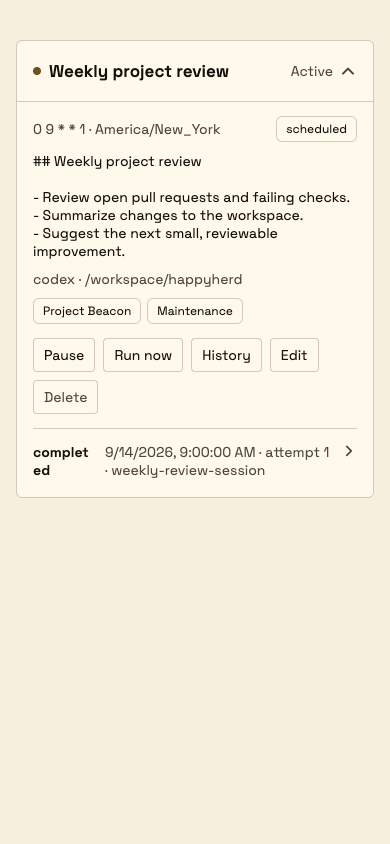</a>

**representative · dark · 1440×900**

<a href="automation-card/automation-card-representative-dark-1440.png">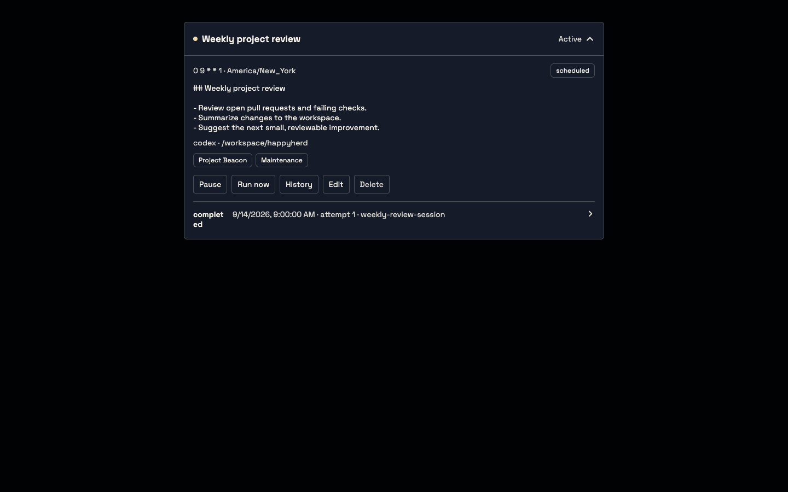</a>

**representative · dark · 390×844**

<a href="automation-card/automation-card-representative-dark-390.png">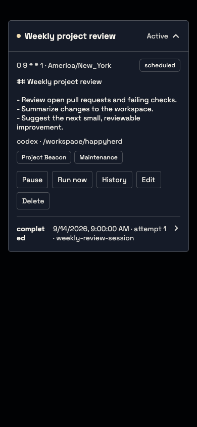</a>

## Command palette · navigation and session actions

**Changed presentation:** Command search, selected rows and shortcut hints use KILV palette, corners and type.

**Evidence:** `component-fixture`. States: representative.

**Production owners:** `components/CommandPalette/CommandPalette.tsx`, `components/CommandPalette/CommandPaletteInput.tsx`, `components/CommandPalette/CommandPaletteItem.tsx`, `components/CommandPalette/CommandPaletteResults.tsx`, `components/CommandPalette/CommandPaletteModal.tsx`.

- Synthetic service/state boundaries; React Native Web adapter; not authenticated live or installed native evidence.
- Surrounding visual renderer replacements supplied by the fixture: Avatar, SessionStatusAvatar, ProviderIcon. These renderers are outside the claimed source owners and are not visual evidence for their production appearance; target owners, Typography and Expo vector icon glyphs remain real.

Fixture environment: [source graph and adapters](command-palette/environment-workspace-command-palette.json).

| State | Theme | Viewport | Screenshot |
|---|---|---|---|
| representative | light | 1440×900 | [Open full screenshot](command-palette/command-palette-representative-light-1440.png) |
| representative | light | 390×844 | [Open full screenshot](command-palette/command-palette-representative-light-390.png) |
| representative | dark | 1440×900 | [Open full screenshot](command-palette/command-palette-representative-dark-1440.png) |
| representative | dark | 390×844 | [Open full screenshot](command-palette/command-palette-representative-dark-390.png) |

Show every screenshot for this panel

**representative · light · 1440×900**

<a href="command-palette/command-palette-representative-light-1440.png">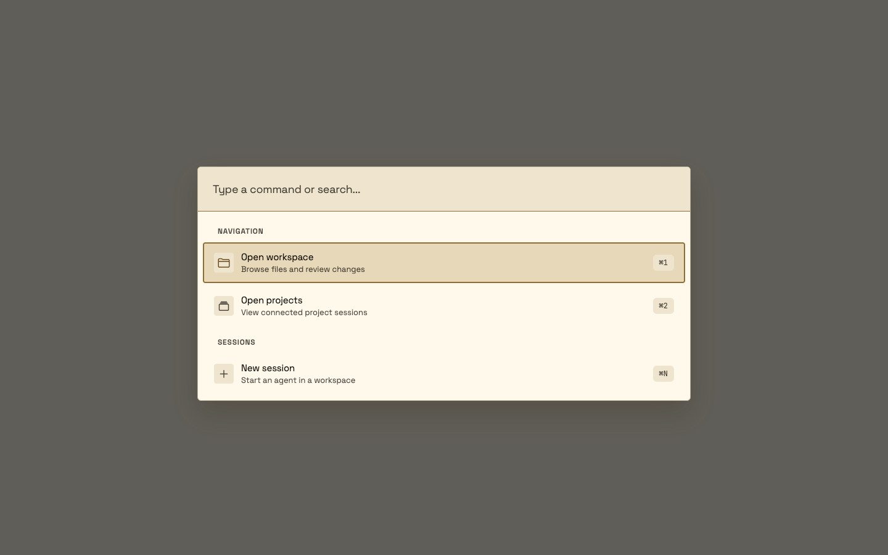</a>

**representative · light · 390×844**

<a href="command-palette/command-palette-representative-light-390.png">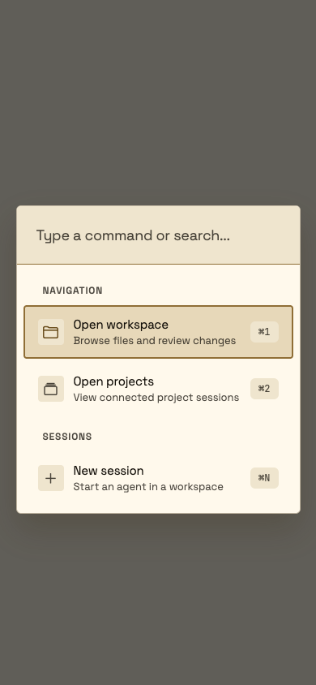</a>

**representative · dark · 1440×900**

<a href="command-palette/command-palette-representative-dark-1440.png">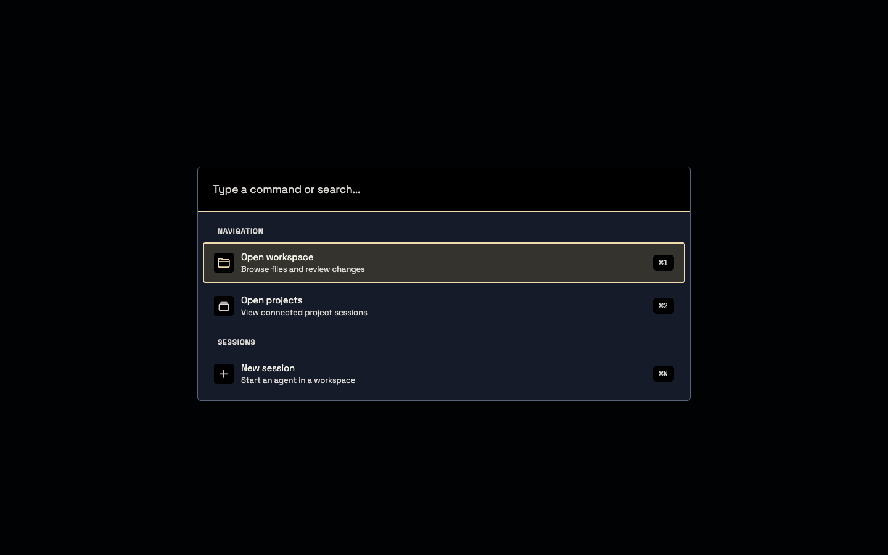</a>

**representative · dark · 390×844**

<a href="command-palette/command-palette-representative-dark-390.png">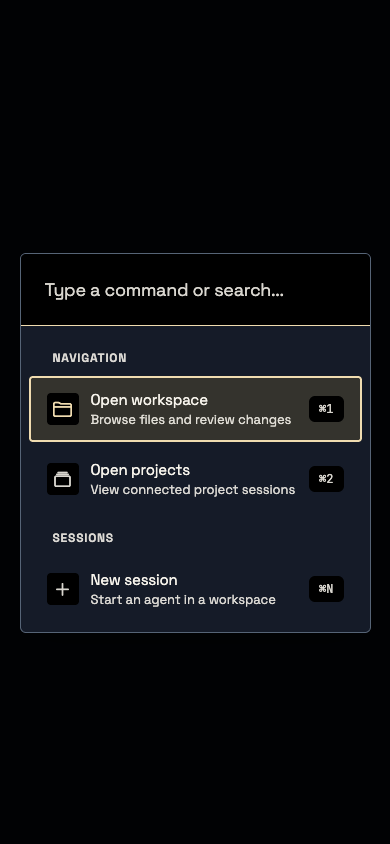</a>

## Duplicate session · choose a rewind point

**Changed presentation:** Rewind selection sheet uses semantic KILV surfaces, selected rows and action colors.

**Evidence:** `component-fixture`. States: representative.

**Production owners:** `components/DuplicateSheet.tsx`.

- Synthetic service/state boundaries; React Native Web adapter; not authenticated live or installed native evidence.
- Surrounding visual renderer replacements supplied by the fixture: Avatar, SessionStatusAvatar, ProviderIcon. These renderers are outside the claimed source owners and are not visual evidence for their production appearance; target owners, Typography and Expo vector icon glyphs remain real.

Fixture environment: [source graph and adapters](duplicate-session/environment-workspace-duplicate-session.json).

| State | Theme | Viewport | Screenshot |
|---|---|---|---|
| representative | light | 1440×900 | [Open full screenshot](duplicate-session/duplicate-session-representative-light-1440.png) |
| representative | light | 390×844 | [Open full screenshot](duplicate-session/duplicate-session-representative-light-390.png) |
| representative | dark | 1440×900 | [Open full screenshot](duplicate-session/duplicate-session-representative-dark-1440.png) |
| representative | dark | 390×844 | [Open full screenshot](duplicate-session/duplicate-session-representative-dark-390.png) |

Show every screenshot for this panel

**representative · light · 1440×900**

<a href="duplicate-session/duplicate-session-representative-light-1440.png">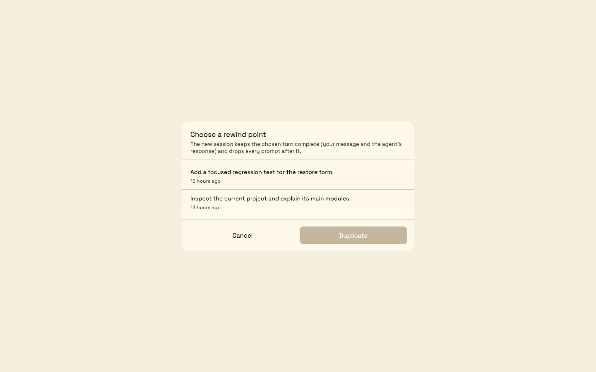</a>

**representative · light · 390×844**

<a href="duplicate-session/duplicate-session-representative-light-390.png">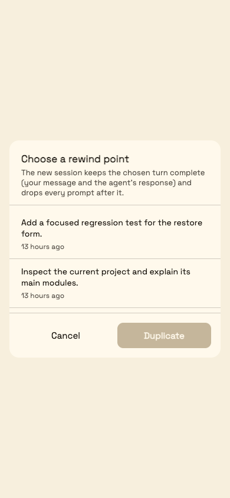</a>

**representative · dark · 1440×900**

<a href="duplicate-session/duplicate-session-representative-dark-1440.png">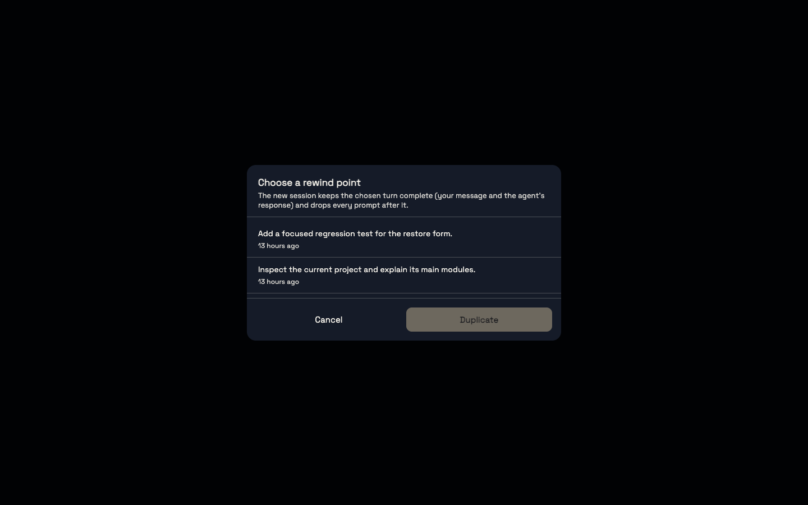</a>

**representative · dark · 390×844**

<a href="duplicate-session/duplicate-session-representative-dark-390.png">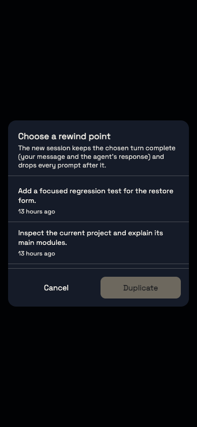</a>

## Project and session Git status indicators

**Changed presentation:** Git indicators preserve added/removed meaning while adopting KILV palette and mono counts.

**Evidence:** `component-fixture`. States: representative.

**Production owners:** `components/ProjectGitStatus.tsx`, `components/CompactGitStatus.tsx`, `components/GitStatusBadge.tsx`.

- Synthetic service/state boundaries; React Native Web adapter; not authenticated live or installed native evidence.
- The section headings are capture-only labels; all three Git indicators are production components with synthetic counts.

Fixture environment: [source graph and adapters](git-status/environment-workspace-git-status.json).

| State | Theme | Viewport | Screenshot |
|---|---|---|---|
| representative | light | 1440×900 | [Open full screenshot](git-status/git-status-representative-light-1440.png) |
| representative | light | 390×844 | [Open full screenshot](git-status/git-status-representative-light-390.png) |
| representative | dark | 1440×900 | [Open full screenshot](git-status/git-status-representative-dark-1440.png) |
| representative | dark | 390×844 | [Open full screenshot](git-status/git-status-representative-dark-390.png) |

Show every screenshot for this panel

**representative · light · 1440×900**

<a href="git-status/git-status-representative-light-1440.png">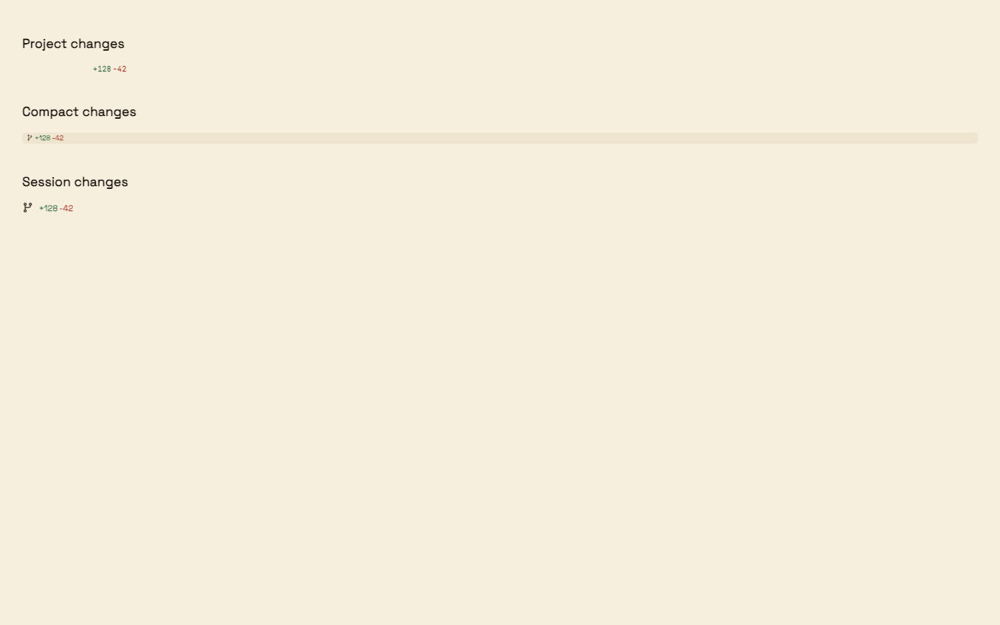</a>

**representative · light · 390×844**

<a href="git-status/git-status-representative-light-390.png">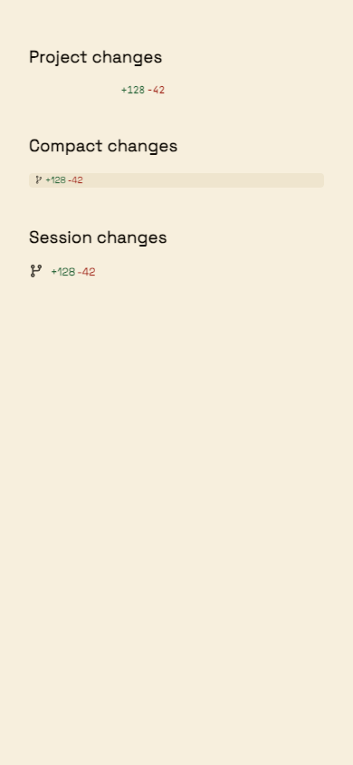</a>

**representative · dark · 1440×900**

<a href="git-status/git-status-representative-dark-1440.png">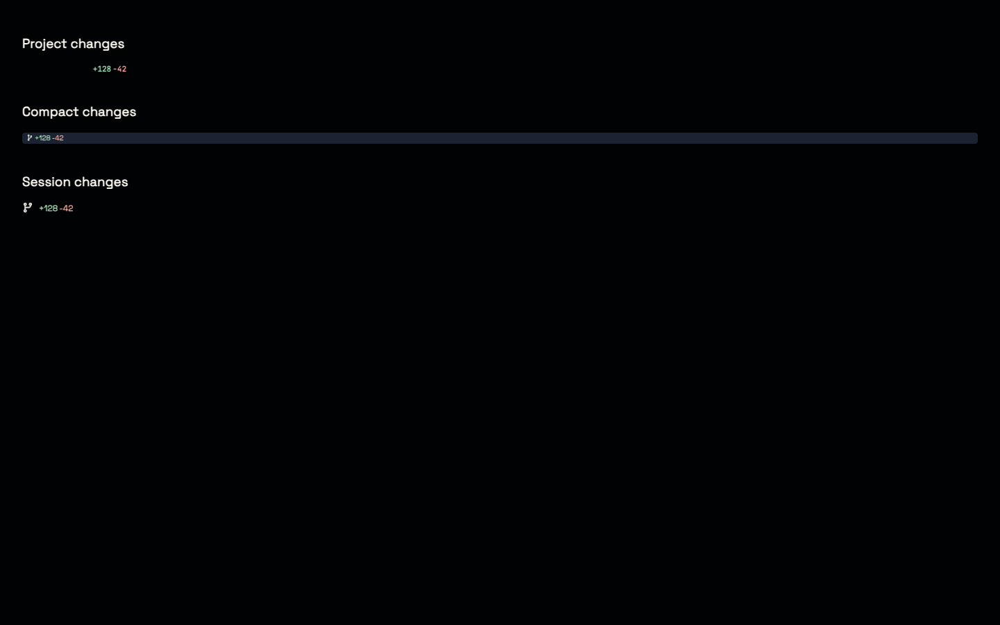</a>

**representative · dark · 390×844**

<a href="git-status/git-status-representative-dark-390.png">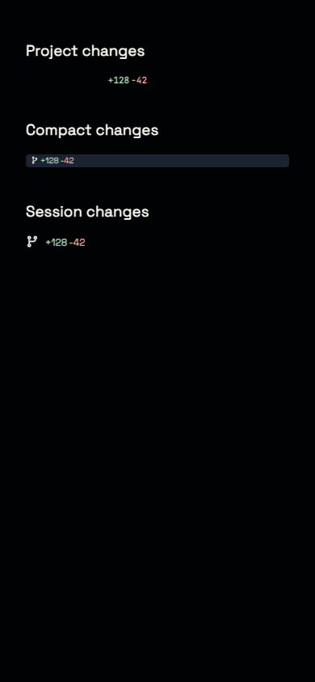</a>

## Inline file review · pinned comment and draft

**Changed presentation:** Pinned comment cards use KILV seams, border glow, mono labels and input/action tones.

**Evidence:** `component-fixture`. States: representative.

**Production owners:** `components/InlineCommentReview.web.tsx`.

- Synthetic service/state boundaries; React Native Web adapter; not authenticated live or installed native evidence.

Fixture environment: [source graph and adapters](inline-comment-review/environment-workspace-inline-comment-review.json).

| State | Theme | Viewport | Screenshot |
|---|---|---|---|
| representative | light | 1440×900 | [Open full screenshot](inline-comment-review/inline-comment-review-representative-light-1440.png) |
| representative | light | 390×844 | [Open full screenshot](inline-comment-review/inline-comment-review-representative-light-390.png) |
| representative | dark | 1440×900 | [Open full screenshot](inline-comment-review/inline-comment-review-representative-dark-1440.png) |
| representative | dark | 390×844 | [Open full screenshot](inline-comment-review/inline-comment-review-representative-dark-390.png) |

Show every screenshot for this panel

**representative · light · 1440×900**

<a href="inline-comment-review/inline-comment-review-representative-light-1440.png">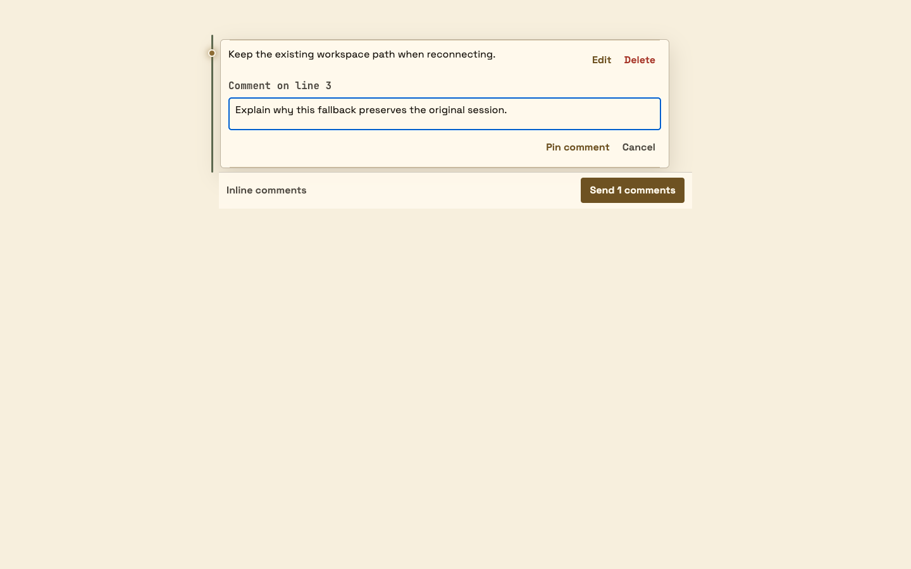</a>

**representative · light · 390×844**

<a href="inline-comment-review/inline-comment-review-representative-light-390.png">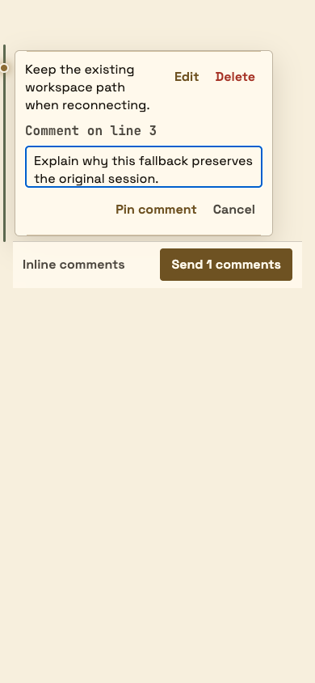</a>

**representative · dark · 1440×900**

<a href="inline-comment-review/inline-comment-review-representative-dark-1440.png">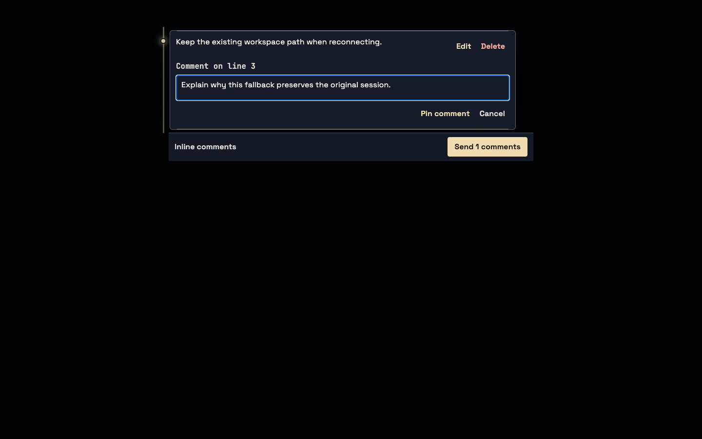</a>

**representative · dark · 390×844**

<a href="inline-comment-review/inline-comment-review-representative-dark-390.png">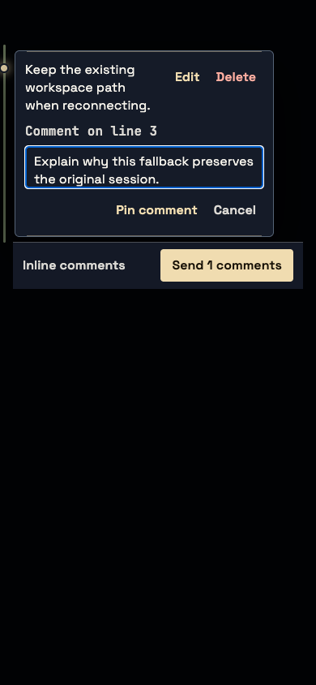</a>

## Files sidebar · changes, workspace and side-chat actions

**Changed presentation:** Files sidebar sections and file actions use KILV borders, typography and compact geometry.

**Evidence:** `component-fixture`. States: representative.

**Production owners:** `components/FilesSidebar.tsx`.

- Synthetic service/state boundaries; React Native Web adapter; not authenticated live or installed native evidence.
- The isolated sidebar is 280 px wide at both browser sizes, matching its production desktop slot.

Fixture environment: [source graph and adapters](files-sidebar/environment-workspace-files-sidebar.json).

| State | Theme | Viewport | Screenshot |
|---|---|---|---|
| representative | light | 1440×900 | [Open full screenshot](files-sidebar/files-sidebar-representative-light-1440.png) |
| representative | light | 390×844 | [Open full screenshot](files-sidebar/files-sidebar-representative-light-390.png) |
| representative | dark | 1440×900 | [Open full screenshot](files-sidebar/files-sidebar-representative-dark-1440.png) |
| representative | dark | 390×844 | [Open full screenshot](files-sidebar/files-sidebar-representative-dark-390.png) |

Show every screenshot for this panel

**representative · light · 1440×900**

<a href="files-sidebar/files-sidebar-representative-light-1440.png">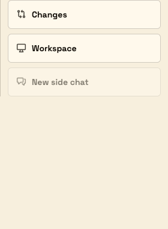</a>

**representative · light · 390×844**

**representative · dark · 1440×900**

**representative · dark · 390×844**

<a href="files-sidebar/files-sidebar-representative-dark-390.png">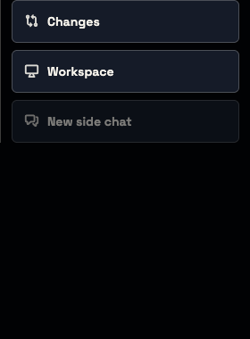</a>

## Navigation · header, tab bar and new-session action

**Changed presentation:** Header, tab selection and new-session action use the shared KILV surfaces and typography.

**Evidence:** `component-fixture`. States: representative.

**Production owners:** `components/navigation/Header.tsx`, `components/TabBar.tsx`, `components/FABWide.tsx`.

- Synthetic service/state boundaries; React Native Web adapter; not authenticated live or installed native evidence.
- The panel arranges production navigation components in an isolated browser frame; native gesture animation and glass effects are not exercised.
- Surrounding visual renderer replacements supplied by the fixture: Avatar, AvatarBrutalist, AvatarSkia, AvatarGradient, CommanderSessionAvatar, ProviderIcon, HarnessBadgeIcon, StatusDot. These renderers are outside the claimed source owners and are not visual evidence for their production appearance; target owners, Typography and Expo vector icon glyphs remain real.

Fixture environment: [source graph and adapters](navigation-bars/environment-workspace-navigation-bars.json).

| State | Theme | Viewport | Screenshot |
|---|---|---|---|
| representative | light | 1440×900 | [Open full screenshot](navigation-bars/navigation-bars-representative-light-1440.png) |
| representative | light | 390×844 | [Open full screenshot](navigation-bars/navigation-bars-representative-light-390.png) |
| representative | dark | 1440×900 | [Open full screenshot](navigation-bars/navigation-bars-representative-dark-1440.png) |
| representative | dark | 390×844 | [Open full screenshot](navigation-bars/navigation-bars-representative-dark-390.png) |

Show every screenshot for this panel

**representative · light · 1440×900**

<a href="navigation-bars/navigation-bars-representative-light-1440.png">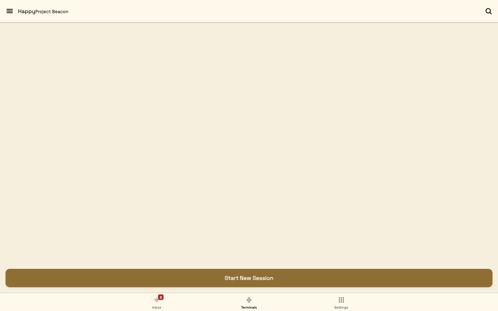</a>

**representative · light · 390×844**

<a href="navigation-bars/navigation-bars-representative-light-390.png">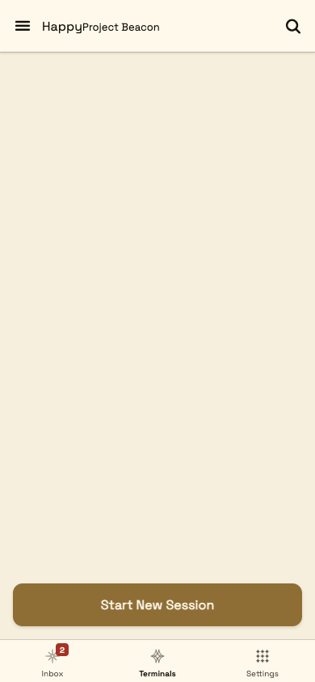</a>

**representative · dark · 1440×900**

<a href="navigation-bars/navigation-bars-representative-dark-1440.png">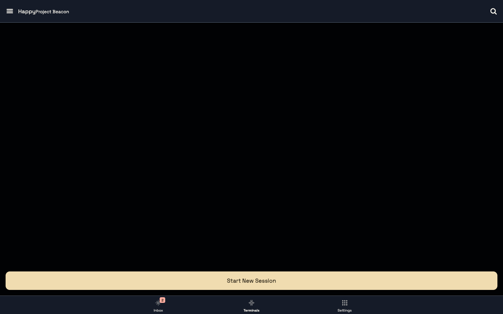</a>

**representative · dark · 390×844**

<a href="navigation-bars/navigation-bars-representative-dark-390.png">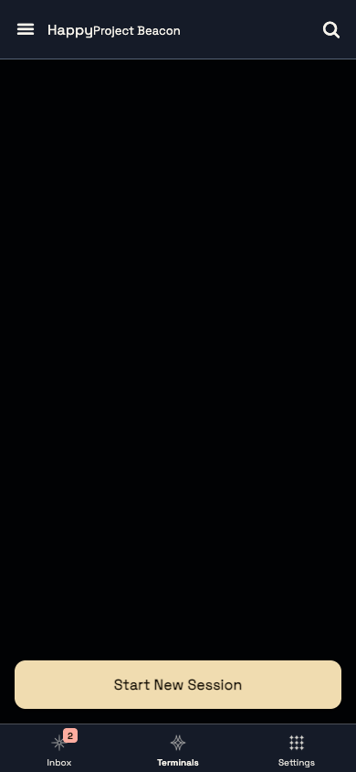</a>

## Home main view · sessions and navigation

**Changed presentation:** Main view chrome and session layout inherit the KILV background and navigation tokens.

**Evidence:** `component-fixture`. States: representative.

**Production owners:** `components/MainView.tsx`.

- Synthetic service/state boundaries; React Native Web adapter; not authenticated live or installed native evidence.
- Desktop uses the production sidebar variant and 390 px uses the phone variant. Synthetic sessions; HomeDock and inactive settings/inbox destinations are outside this fixture, each captured separately.
- Surrounding visual renderer replacements supplied by the fixture: Avatar, AvatarBrutalist, AvatarSkia, AvatarGradient, CommanderSessionAvatar, ProviderIcon, HarnessBadgeIcon, StatusDot. These renderers are outside the claimed source owners and are not visual evidence for their production appearance; target owners, Typography and Expo vector icon glyphs remain real.

Fixture environment: [source graph and adapters](main-view/environment-workspace-main-view.json).

| State | Theme | Viewport | Screenshot |
|---|---|---|---|
| representative | light | 1440×900 | [Open full screenshot](main-view/main-view-representative-light-1440.png) |
| representative | light | 390×844 | [Open full screenshot](main-view/main-view-representative-light-390.png) |
| representative | dark | 1440×900 | [Open full screenshot](main-view/main-view-representative-dark-1440.png) |
| representative | dark | 390×844 | [Open full screenshot](main-view/main-view-representative-dark-390.png) |

Show every screenshot for this panel

**representative · light · 1440×900**

<a href="main-view/main-view-representative-light-1440.png">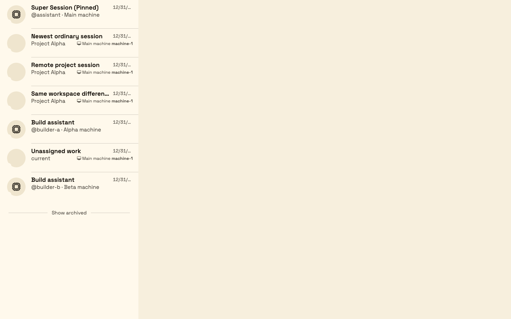</a>

**representative · light · 390×844**

<a href="main-view/main-view-representative-light-390.png">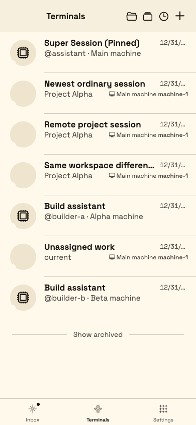</a>

**representative · dark · 1440×900**

<a href="main-view/main-view-representative-dark-1440.png">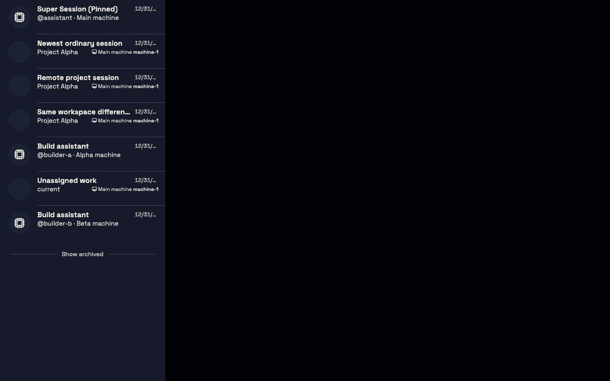</a>

**representative · dark · 390×844**

<a href="main-view/main-view-representative-dark-390.png">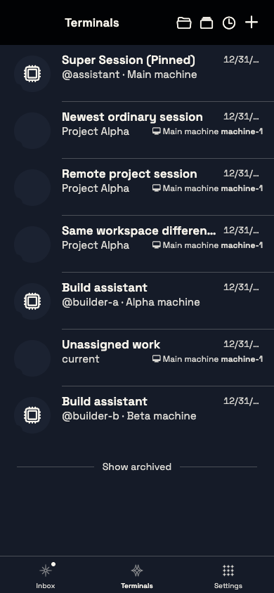</a>

## Side chat panel · start a delegated conversation

**Changed presentation:** Side chat empty state uses KILV typography and correctly contrasted primary actions.

**Evidence:** `component-fixture`. States: empty.

**Production owners:** `components/SideChatPanel.tsx`.

- Synthetic service/state boundaries; React Native Web adapter; not authenticated live or installed native evidence.
- Empty side chat state; this capture does not contain an active delegated session.
- Surrounding visual renderer replacements supplied by the fixture: Avatar, SessionStatusAvatar, ProviderIcon. These renderers are outside the claimed source owners and are not visual evidence for their production appearance; target owners, Typography and Expo vector icon glyphs remain real.

Fixture environment: [source graph and adapters](side-chat-panel/environment-workspace-side-chat-panel.json).

| State | Theme | Viewport | Screenshot |
|---|---|---|---|
| empty | light | 1440×900 | [Open full screenshot](side-chat-panel/side-chat-panel-empty-light-1440.png) |
| empty | light | 390×844 | [Open full screenshot](side-chat-panel/side-chat-panel-empty-light-390.png) |
| empty | dark | 1440×900 | [Open full screenshot](side-chat-panel/side-chat-panel-empty-dark-1440.png) |
| empty | dark | 390×844 | [Open full screenshot](side-chat-panel/side-chat-panel-empty-dark-390.png) |

Show every screenshot for this panel

**empty · light · 1440×900**

<a href="side-chat-panel/side-chat-panel-empty-light-1440.png">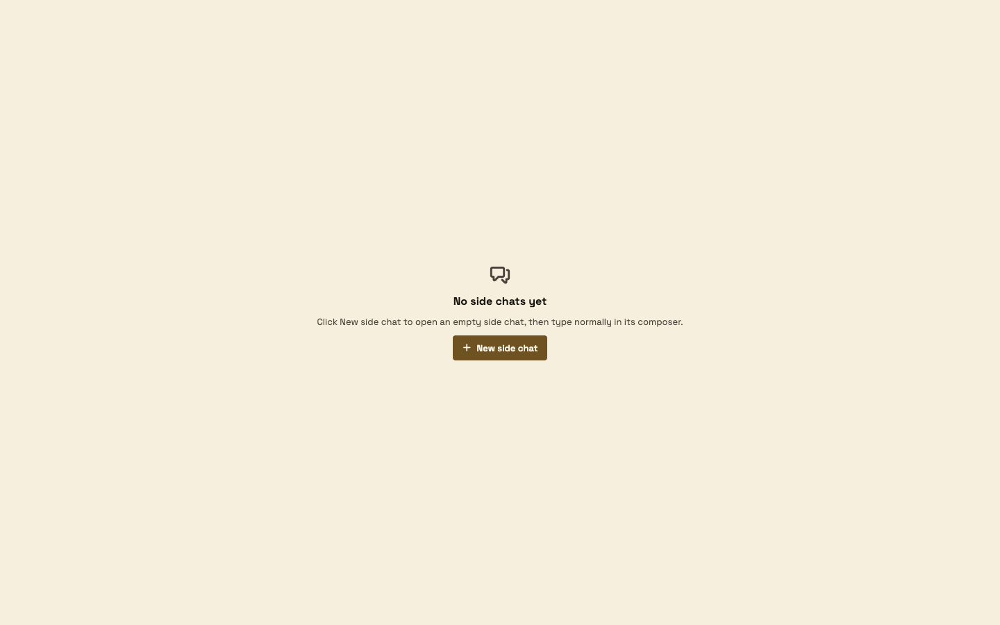</a>

**empty · light · 390×844**

<a href="side-chat-panel/side-chat-panel-empty-light-390.png">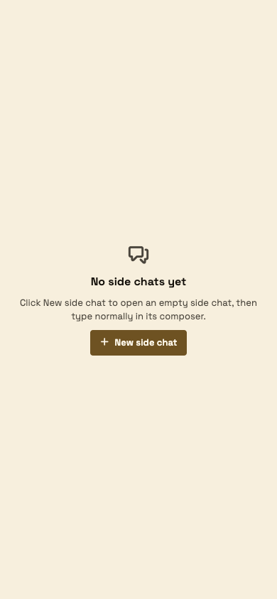</a>

**empty · dark · 1440×900**

<a href="side-chat-panel/side-chat-panel-empty-dark-1440.png">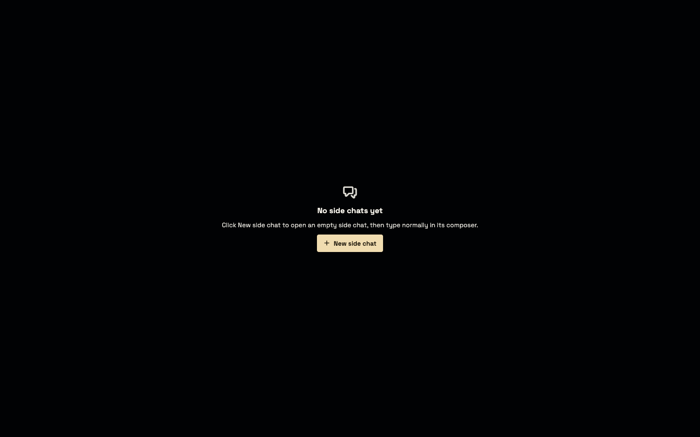</a>

**empty · dark · 390×844**

<a href="side-chat-panel/side-chat-panel-empty-dark-390.png">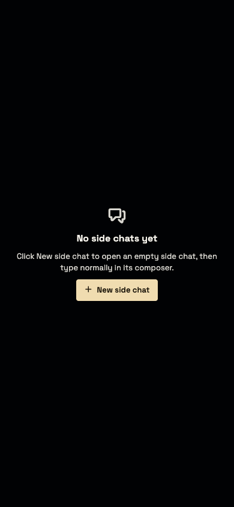</a>

## Connect terminal · paste authentication URL

**Changed presentation:** Terminal connect actions and URL input adopt KILV surfaces, borders and typography.

**Evidence:** `component-fixture`. States: representative.

**Production owners:** `components/ConnectButton.tsx`.

- Synthetic service/state boundaries; React Native Web adapter; not authenticated live or installed native evidence.
- The Authenticate Terminal title remains ellipsized in its fixed 210 px container; a rendered comparison against baseline 189c504b confirmed that title truncation predates this redesign. The manual URL input overflow introduced by the 16 px mono typography is fixed with minWidth:0. Each capture asserts the input and confirmation control remain within the card while retaining 16 px JetBrains Mono.

Fixture environment: [source graph and adapters](connect-terminal/environment-workspace-connect-terminal.json).

| State | Theme | Viewport | Screenshot |
|---|---|---|---|
| representative | light | 1440×900 | [Open full screenshot](connect-terminal/connect-terminal-representative-light-1440.png) |
| representative | light | 390×844 | [Open full screenshot](connect-terminal/connect-terminal-representative-light-390.png) |
| representative | dark | 1440×900 | [Open full screenshot](connect-terminal/connect-terminal-representative-dark-1440.png) |
| representative | dark | 390×844 | [Open full screenshot](connect-terminal/connect-terminal-representative-dark-390.png) |

Show every screenshot for this panel

**representative · light · 1440×900**

<a href="connect-terminal/connect-terminal-representative-light-1440.png">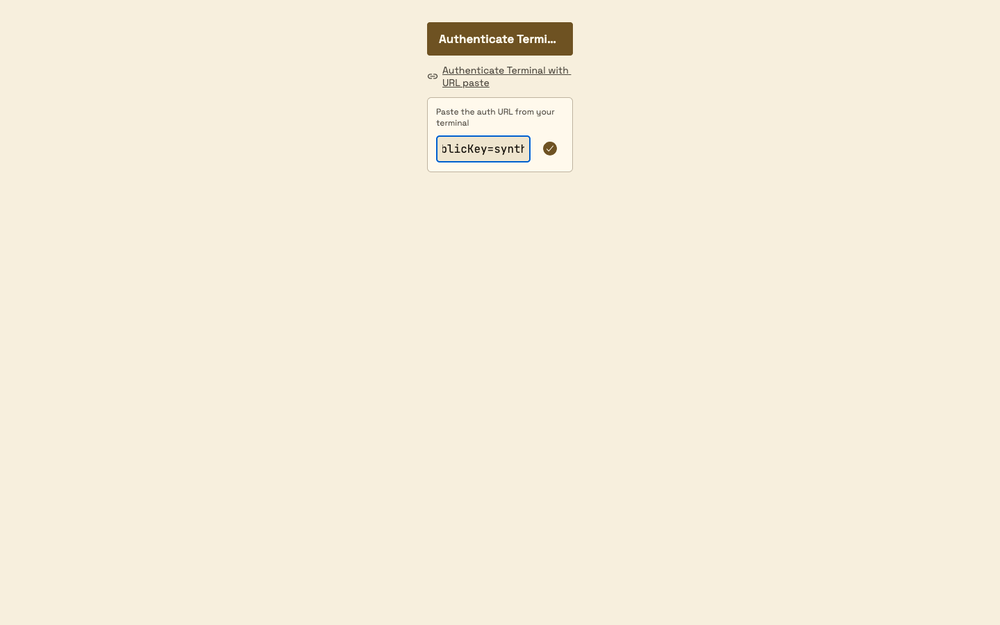</a>

**representative · light · 390×844**

<a href="connect-terminal/connect-terminal-representative-light-390.png">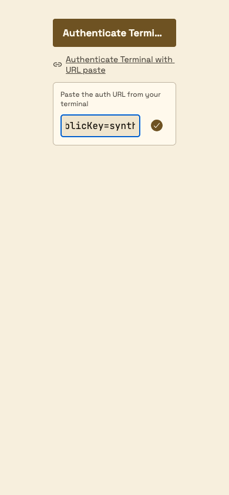</a>

**representative · dark · 1440×900**

<a href="connect-terminal/connect-terminal-representative-dark-1440.png">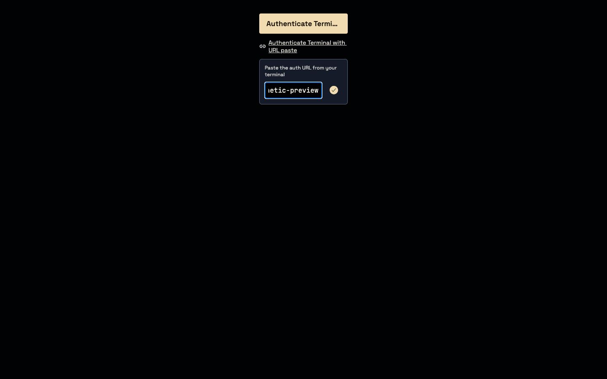</a>

**representative · dark · 390×844**

<a href="connect-terminal/connect-terminal-representative-dark-390.png">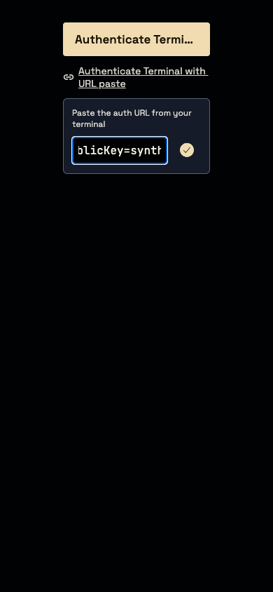</a>

